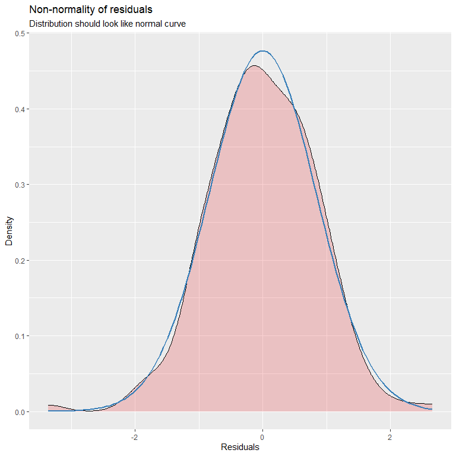
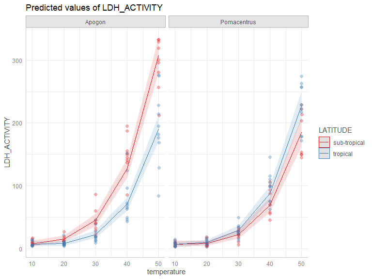
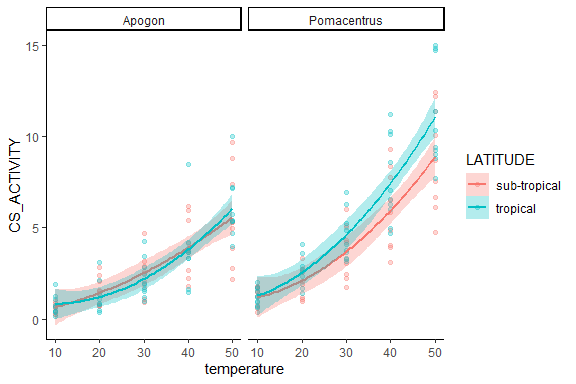
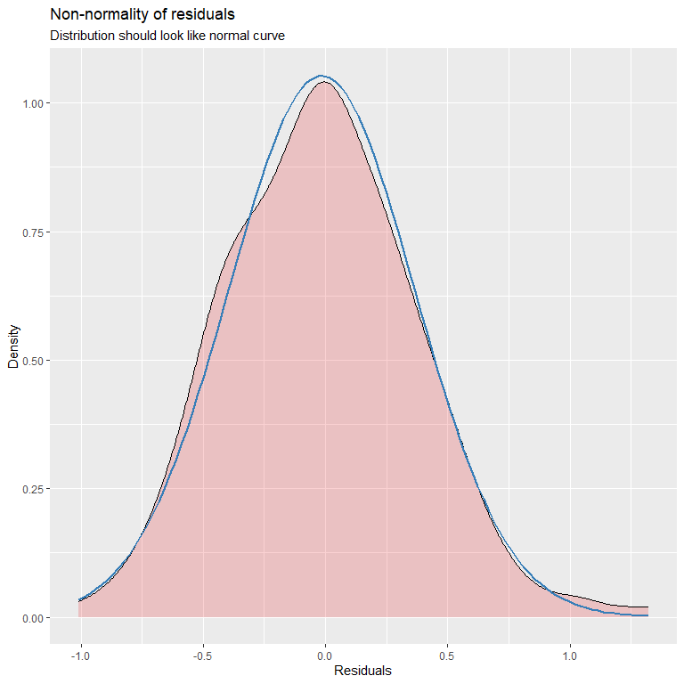

# Scenario 

Understanding thermal perfomance curves of anaerobic and aerobic enzymes for species can help identify differences in thermal tolerance among difference species. In this study four different species including, _Apogon rubrimacula_, _Apogon doederlein_, _Pomeacentrus australia_, and _Pomacentrus moluccensis_ had white muscle tissue samples collected, and used to determine thermal performance curves of two enzymes - lactate dehydrogenase (LDH) and citrate synthase (CS). Each enzyme was tested over five different temperatures including, 10$^\circ$C, 20$^\circ$C, 30$^\circ$C, 40$^\circ$C, and 50$^\circ$C, to create a thermal performance curve. Specie in this study consisted for two cardinal fish species and two damselfish species, with different levels of reliance on coral reef structures. Results from this study will help determine thermal tolerance levels of nultiple reef species to help understand how different species may respond differently to changing environmental conditions. 

# Load packages 


```r
library(plyr) # data manipulation
library(tidyverse) # data manipulation
library(janitor) # data manipulation
library(dplyr) # data manipulation
library(chron) # data manipulation - time data
library(lubridate) # data manipulation - specifically time data
library(ggplot2) # plotting figures
library(glmmTMB) # running models
library(performance) # model validation
library(car) # dependent
library(DHARMa) # model validation
library(MuMIn) # model validation
library(kableExtra) # creating tables
library(broom) # dependent
library(emmeans) # post-hoc analysis
library(ggeffects) # plotting models/model validation
library(vtable) # creating tables
library(modelr) # model validation
library(kableExtra) # formatting output tables
library(sjPlot) # plotting models
```

# Lactate dehydrogenase (LDH)

## Read in the data


```r
knitr::opts_knit$set(root.dir=working.dir)
```

## Load data 


```r
ldh <- import.data
tissue.mass <- import.data2
```

## Data manipulation 


```r
#--- data preparation/manipulation ---# 
ldh2 <- ldh |>
  clean_names() |>
  separate(sample, into=c('tissue_type','species','replicate','temperature'), sep = "_", remove = FALSE) |> 
  mutate(creation_time = dmy_hm(creation_time)) |>
  separate(creation_time, into=c('DATE','TIME'), sep = " ", remove = FALSE) |>
  arrange(sample_id_1, DATE, TIME) 

ldh3 <- ldh2 |> 
  mutate(TIME = hms(ldh2$TIME)) |>
  mutate(TIME = chron(times=ldh2$TIME)) |>
  arrange(TIME) |>
  dplyr::group_by(sample, sample_id_1) |> 
  dplyr::mutate(TIME_DIFF = TIME - first(TIME)) |> 
  dplyr::filter(TIME != first(TIME)) |>
  dplyr::ungroup() |> 
  mutate(TIME_DIFF_SECS = period_to_seconds(hms(TIME_DIFF))) |> 
  mutate(MINUTES = TIME_DIFF_SECS/60) |> 
  mutate(MINUTES = round(MINUTES, digits = 2)) |> 
  dplyr::rename(CUVETTE = sample_id_1) |> 
  mutate(LATIN_NAME = case_when( species =="Adoed"~ "Apogon doederlein", 
                             species == "Arub" ~ "Apogon rubrimacula", 
                             species == "Paus" ~ "Pomacentrus australis",
                             species == "Pmol" ~ "Pomacentrus moluccensis",
                             TRUE ~ "na")) |> 
  unite("UNIQUE_SAMPLE_ID", c(species, replicate, temperature, sample_index), sep="_", remove = FALSE)
```

### Data cleaning 

Next select data points will be removed. Data points have been checked using previously written app script that allows the user to look at the plotted points of samples that were run. Because we are interested in the slope, points that plateaued were removed from the analysis, as it signifies that the reaction ran out of 'fuel' to use.

* **grp1**: removed last data point which was causing a plateau
* **grp2**: removed last 2 data points which was causing a plateau
* **grp3**: removed last 3 data points which was causing a plateau
* **grp4**: removed last 4 data points which was causing a plateau
* **grp5**: removed last 5 data points which was causing a plateau


```r
grp1 <- c() 
grp2 <- c("Paus_07_50_1","Paus_07_50_2","Paus_07_50_3","Paus_08_50_1","Paus_08_50_2","Paus_08_50_3", 
          "Pmol_06_50_1","Pmol_06_50_2","Pmol_06_50_3", "Pmol_08_50_1","Pmol_08_50_2","Pmol_08_50_3", 
          "Pmol_09_50_1","Pmol_09_50_2","Pmol_09_50_3")
grp3 <- c() 
grp4 <- c("Adoed_05_50_1","Adoed_05_50_2","Adoed_05_50_3", "Adoed_09_50_1","Adoed_09_50_2","Adoed_09_50_3") 
grp5 <- c("Arub_08_50_1","Arub_08_50_2","Arub_08_50_3", "Arub_07_50_1","Arub_07_50_2","Arub_07_50_3", 
          "Adoed_04_50_1","Adoed_04_50_2","Adoed_04_50_3", "Adoed_06_50_1","Adoed_06_50_2","Adoed_06_50_3", 
          "Adoed_07_50_1","Adoed_07_50_2","Adoed_07_50_3", "Adoed_08_50_1","Adoed_08_50_2","Adoed_08_50_3", 
          "Adoed_10_50_1","Adoed_10_50_2","Adoed_10_50_3", "Pmol_01_50_1","Pmol_01_50_2","Pmol_01_50_3")  
grp6 <- c() 
grp7 <- c() 
grp8 <- c("Adoed_02_50_1","Adoed_02_50_2","Adoed_02_50_3") 
```


```r
ldh3.filtered <- ldh3 |> 
  filter(!(UNIQUE_SAMPLE_ID %in% c("Arub_08_30_2", "Arub_06_40_2", "Arub_04_10_1", "Arub_02_40_2", 
                                   "Adoed_03_30_2", "Adoed_04_40_1", "Adoed_08_30_2", 
                                   "Paus_10_20_2", 
                                   "Pmol_03_40_3", "Pmol_04_50_3", "Pmol_05_30_2"))) |>
  dplyr::group_by(UNIQUE_SAMPLE_ID) |> 
  arrange(UNIQUE_SAMPLE_ID, TIME) |>
  dplyr::filter(!(UNIQUE_SAMPLE_ID %in% grp2 & row_number() > (n() - 2))) |> 
  dplyr::filter(!(UNIQUE_SAMPLE_ID %in% grp4 & row_number() > (n() - 4))) |> 
  dplyr::filter(!(UNIQUE_SAMPLE_ID %in% grp5 & row_number() > (n() - 5))) |> 
  dplyr::filter(!(UNIQUE_SAMPLE_ID %in% grp8 & row_number() > (n() - 8))) |> 
  dplyr::ungroup() |> 
  mutate(UNIQUE_SAMPLE_ID = str_sub(UNIQUE_SAMPLE_ID, end = -3))
```


```r
write.table(ldh3.filtered, file = "./excel_files/LDH_Hunter_filtered.csv", col.names = TRUE, row.names = FALSE, sep=",")
write.table(ldh3.filtered, file = "./import_files/LDH_Hunter_filtered.txt", col.names = TRUE, row.names = FALSE, sep="\t")
write.table(ldh3, file = "./excel_files/LDH_Hunter_processed.csv", col.names = TRUE, row.names = FALSE, sep=",")
write.table(ldh3, file = "./import_files/LDH_Hunter_processed.txt", col.names = TRUE, row.names = FALSE, sep="\t")
```
Great! Now we have all the data points that we want to keep. However, the data needs to manipulated in a way that we can obtain and pull out slopes from the absorption readings, and the calculate enzyme activity based on these slopes. This will involve a number of steps.  

### Data calculations 

#### Step1: Extract slopes 

Step1 will produce a data frame that provides you with the slope that was obtained for cuvettes 1-3 for each sample run at each experimental temperature. Note that at the end of this step we are removing slopes that were positive in value, as LDH slopes should produce a negative slope, due to NADH being used up. 

```r
LDH_activity <- ldh3.filtered %>% 
  dplyr::group_by(UNIQUE_SAMPLE_ID, CUVETTE) %>% 
  do({
    mod = lm(result ~ MINUTES, data = .)
    data.frame(Intercept = coef(mod)[1],
               Slope = coef(mod)[2], 
               r2 = summary(mod)$adj.r.squared)
  }) %>%
  dplyr::ungroup() %>%
  filter(CUVETTE != ("6"))%>% 
  filter(CUVETTE != ("4"))%>% 
  filter(CUVETTE != ("5")) %>% 
  filter(Slope <= 0)
```

#### Step2: Slope means

Step2 will calculate the mean slope for cuvette 1-3. 

```r
LDH_activity_means <- LDH_activity %>% 
  dplyr::group_by(UNIQUE_SAMPLE_ID) %>% 
  dplyr::mutate(Mean = mean(Slope)) %>% 
  ungroup()
```

#### Step3: Background activity level

Step3 will calculate background activity level by measuring the slope from cuvette 5 (postive control)

```r
LDH_background <- ldh3 %>% 
  group_by(UNIQUE_SAMPLE_ID, CUVETTE) %>% 
  do({
    mod = lm(result ~ MINUTES, data = .)
    data.frame(Intercept = coef(mod)[1],
               Slope = coef(mod)[2])
  }) %>%
  ungroup() %>%
  filter(CUVETTE == ("5")) %>% 
  dplyr::rename(Background = Slope) %>% 
  mutate(UNIQUE_SAMPLE_ID = str_sub(UNIQUE_SAMPLE_ID, end = -3)) 
```

#### Step4: Merging dataframes

Step4 will merge the data frames that you created with the mean slopes and the background slopes.

```r
final_table <- LDH_activity %>% 
  full_join(distinct(LDH_activity_means[,c(1,6)]), by = "UNIQUE_SAMPLE_ID") %>% 
  full_join(LDH_background[,c(1,4)], by = "UNIQUE_SAMPLE_ID") 
final_table$Mean[duplicated(final_table$Mean)] <- ""
final_table$Background[duplicated(final_table$Background)] <- ""
final_table <- final_table %>% 
  mutate(Mean = as.numeric(Mean), 
         Background = as.numeric(Background), 
         Background_perc = Background/Mean) 
```

#### Step5: Enzyme activity levels 

Step5 is where enzyme activity levels are calculated. See further details in manuscript (doi: xxx). Within this step background activity level is taken into account and subtracted from slopes where background activity was >5% or more of the sample slope. 

```r
ldh.data <- final_table %>% 
  select(c(UNIQUE_SAMPLE_ID, Mean, Background, Background_perc)) %>% 
  mutate(Mean = as.numeric(Mean), 
         Background = as.numeric(Background), 
         Background_perc = as.numeric(Background_perc)) %>% 
  mutate(Background2 = case_when(Background_perc <= 0.05 ~ 0, 
                                    TRUE ~ Background), 
         LDH_ABSORBANCE = Mean - Background2) %>%
  drop_na() %>% 
  inner_join(select(ldh3.filtered, c(UNIQUE_SAMPLE_ID, species, replicate, temperature, LATIN_NAME)), by ="UNIQUE_SAMPLE_ID") %>% 
  unite("fish_id", c(species,replicate), sep = "_", remove = FALSE) %>%
  inner_join(tissue.mass, by = "fish_id") %>% 
  mutate(TISSUE_MASS_CENTERED = scale(tissue_mass, center = TRUE, scale = FALSE)) %>%
  distinct(UNIQUE_SAMPLE_ID, .keep_all = TRUE) %>% 
  mutate(PATH_LENGTH = 1, 
         EXTINCTION_COEFFICIENT = 6.22, 
         TISSUE_CONCENTRATION = 0.005, 
         ASSAY_VOL = 0.975, 
         SAMPLE_VOL = 0.025, 
         LDH_ACTIVITY = ((LDH_ABSORBANCE/(PATH_LENGTH*EXTINCTION_COEFFICIENT*TISSUE_CONCENTRATION))*(ASSAY_VOL/SAMPLE_VOL))*-1) %>% 
  mutate(species = factor(species), 
         replicate = factor(replicate), 
         temperature = as.numeric(temperature), 
         fish_id = factor(fish_id)) %>% 
  separate(LATIN_NAME, c("LATIN_GENUS","LATIN_SPECIES"), sep = " ", remove = FALSE) %>% 
  mutate(LATIN_GENUS = factor(LATIN_GENUS), 
         LATIN_SPECIES = factor(LATIN_SPECIES)) %>% 
  mutate(LATITUDE = factor(case_when(species =="Adoed"~ "sub-tropical", 
                             species == "Arub" ~ "tropical", 
                             species == "Paus" ~ "sub-tropical",
                             species == "Pmol" ~ "tropical",
                             TRUE ~ "na")))
```


All done! Ready for data analysis 

## Initial plot {.tabset}

### LDH v TEMPERATURE [SPECIES]


```r
ggplot(ldh.data, aes(x =temperature, y= LDH_ACTIVITY, color = species)) + 
  geom_point() + geom_smooth(method = "lm", se=FALSE) + theme_classic() 
```

<!-- -->

### LDH [distribution]

```r
ggplot(ldh.data, aes(x = LDH_ACTIVITY, fill = temperature, color = temperature)) + 
  geom_density(alpha =0.5, position = "identity") 
```

<!-- -->

```r
ggplot(ldh.data, aes(x=LDH_ACTIVITY)) + geom_histogram()
```

<!-- -->

### LDH v TEMPERATURE [LATITUDE]

```r
ggplot(ldh.data, aes(x =temperature, y= LDH_ACTIVITY, colour = LATITUDE, fill=LATITUDE)) +   geom_point(alpha=0.3) + stat_smooth(method = "lm", se=TRUE,  formula=y ~ poly(x, 3, raw=TRUE), alpha=0.3) + facet_grid(~LATIN_GENUS) + theme_classic()
```

<!-- -->

### LDH v TEMPERATURE [GENUS]

```r
ggplot(ldh.data, aes(x =temperature, y= LDH_ACTIVITY, colour = LATIN_GENUS, fill=LATIN_GENUS)) +   geom_point(alpha=0.3) + stat_smooth(method = "lm", se=TRUE,  formula=y ~ poly(x, 3, raw=TRUE), alpha=0.3) + facet_grid(~LATITUDE) + theme_classic()
```

<!-- -->

### LDH v TEMPERATURE [SPECIES]

```r
ggplot(ldh.data, aes(x =temperature, y= LDH_ACTIVITY, colour = species, fill= species)) +   geom_point(alpha=0.3) + stat_smooth(method = "lm", se=TRUE,  formula=y ~ poly(x, 3, raw=TRUE), alpha=0.3) + theme_classic()
```

<!-- -->

### {-}

## Fit the model 

The model was fit using the **glm** and later **glmmTMB** package in R. A number of different models were tested to determine which hypothesis and associated variables best predicted resting oxygen consumption. Model fit was examined using AICc, BIC, and r-squared values. Additional model were examined via the validation diagnostics provided by the **performance** and **dHARMA** packages in R.

From out initial plots we can see that our data is heavily skewed to the right. From our initial plots we can all see that the relationship between enzyme activity and temperature is no linear, but rather may represent either a quadratic or cubic relationship. Let's start out model selection process by comparing different polynomial models.  

### polynomial models

```r
#--- model 1 ---# 
ldh.model.1 <- glm(LDH_ACTIVITY ~ temperature * LATITUDE * LATIN_GENUS, 
               family = gaussian(),
               data = ldh.data) 

ldh.model.1.p2 <- glm(LDH_ACTIVITY ~ poly(temperature, 2) * LATITUDE * LATIN_GENUS, 
               family = gaussian(),
               data = ldh.data)  

ldh.model.1.p3 <- glm(LDH_ACTIVITY ~ poly(temperature, 3) * LATITUDE * LATIN_GENUS, 
               family = gaussian(),
               data = ldh.data) 
```

#### model comparisons - polynomial models 

```r
aic.c=AICc(ldh.model.1, ldh.model.1.p2, ldh.model.1.p3, k=2) 
bic=BIC(ldh.model.1, ldh.model.1.p2, ldh.model.1.p3)

model.fit.table <- as.data.frame(aic.c) %>% 
  tibble::rownames_to_column("model") %>%
  mutate(BIC = bic$BIC, 
         r2 = c(r.squaredLR(ldh.model.1)[1], r.squaredLR(ldh.model.1.p2)[1], r.squaredLR(ldh.model.1.p3)[1]))
model.fit.table %>% knitr::kable(format = "html")  %>%
  kable_paper(full_width = TRUE) 
```

<table class=" lightable-paper" style='font-family: "Arial Narrow", arial, helvetica, sans-serif; margin-left: auto; margin-right: auto;'>
 <thead>
  <tr>
   <th style="text-align:left;"> model </th>
   <th style="text-align:right;"> df </th>
   <th style="text-align:right;"> AICc </th>
   <th style="text-align:right;"> BIC </th>
   <th style="text-align:right;"> r2 </th>
  </tr>
 </thead>
<tbody>
  <tr>
   <td style="text-align:left;"> ldh.model.1 </td>
   <td style="text-align:right;"> 9 </td>
   <td style="text-align:right;"> 1942.290 </td>
   <td style="text-align:right;"> 1970.245 </td>
   <td style="text-align:right;"> 0.7590979 </td>
  </tr>
  <tr>
   <td style="text-align:left;"> ldh.model.1.p2 </td>
   <td style="text-align:right;"> 13 </td>
   <td style="text-align:right;"> 1738.624 </td>
   <td style="text-align:right;"> 1778.360 </td>
   <td style="text-align:right;"> 0.9237283 </td>
  </tr>
  <tr>
   <td style="text-align:left;"> ldh.model.1.p3 </td>
   <td style="text-align:right;"> 17 </td>
   <td style="text-align:right;"> 1738.277 </td>
   <td style="text-align:right;"> 1789.358 </td>
   <td style="text-align:right;"> 0.9276960 </td>
  </tr>
</tbody>
</table>

```r
anova(ldh.model.1, ldh.model.1.p2, ldh.model.1.p3, test = "Chisq")
```

<div data-pagedtable="false">
  <script data-pagedtable-source type="application/json">
{"columns":[{"label":[""],"name":["_rn_"],"type":[""],"align":["left"]},{"label":["Resid. Df"],"name":[1],"type":["dbl"],"align":["right"]},{"label":["Resid. Dev"],"name":[2],"type":["dbl"],"align":["right"]},{"label":["Df"],"name":[3],"type":["dbl"],"align":["right"]},{"label":["Deviance"],"name":[4],"type":["dbl"],"align":["right"]},{"label":["Pr(>Chi)"],"name":[5],"type":["dbl"],"align":["right"]}],"data":[{"1":"177","2":"354508.4","3":"NA","4":"NA","5":"NA","_rn_":"1"},{"1":"173","2":"112240.4","3":"4","4":"242267.989","5":"5.349303e-82","_rn_":"2"},{"1":"169","2":"106401.6","3":"4","4":"5838.815","5":"5.460587e-02","_rn_":"3"}],"options":{"columns":{"min":{},"max":[10]},"rows":{"min":[10],"max":[10]},"pages":{}}}
  </script>
</div>

Looks like the model where temperature is treated as a second order polynomial (quadratic) is better than the linear and third order polynomial model. Lets see if adding the variable **tissue.mass** improves the model. 

### fixed factor comparisons

```r
#--- model 1 ---# 
ldh.model.1.p2 <- glm(LDH_ACTIVITY ~ poly(temperature, 2) * LATITUDE * LATIN_GENUS, 
               family = gaussian(),
               data = ldh.data)  

ldh.model.1.p2b <- ldh.model.1.p2 %>% update(. ~ poly(temperature, 2) * LATITUDE * LATIN_GENUS + TISSUE_MASS_CENTERED) 
```

#### model comparisons - fixed factor comparisons 

```r
aic.c=AICc(ldh.model.1.p2, ldh.model.1.p2b, k=2) 
bic=BIC(ldh.model.1.p2, ldh.model.1.p2b)

model.fit.table <- as.data.frame(aic.c) %>% 
  tibble::rownames_to_column("model") %>%
  mutate(BIC = bic$BIC, 
         r2 = c(r.squaredLR(ldh.model.1.p2)[1], r.squaredLR(ldh.model.1.p2b)[1]))
model.fit.table %>% knitr::kable(format = "html")  %>%
  kable_paper(full_width = TRUE) 
```

<table class=" lightable-paper" style='font-family: "Arial Narrow", arial, helvetica, sans-serif; margin-left: auto; margin-right: auto;'>
 <thead>
  <tr>
   <th style="text-align:left;"> model </th>
   <th style="text-align:right;"> df </th>
   <th style="text-align:right;"> AICc </th>
   <th style="text-align:right;"> BIC </th>
   <th style="text-align:right;"> r2 </th>
  </tr>
 </thead>
<tbody>
  <tr>
   <td style="text-align:left;"> ldh.model.1.p2 </td>
   <td style="text-align:right;"> 13 </td>
   <td style="text-align:right;"> 1738.624 </td>
   <td style="text-align:right;"> 1778.36 </td>
   <td style="text-align:right;"> 0.9237283 </td>
  </tr>
  <tr>
   <td style="text-align:left;"> ldh.model.1.p2b </td>
   <td style="text-align:right;"> 14 </td>
   <td style="text-align:right;"> 1740.716 </td>
   <td style="text-align:right;"> 1783.33 </td>
   <td style="text-align:right;"> 0.9238314 </td>
  </tr>
</tbody>
</table>

```r
anova(ldh.model.1.p2, ldh.model.1.p2b, test = "Chisq")
```

<div data-pagedtable="false">
  <script data-pagedtable-source type="application/json">
{"columns":[{"label":[""],"name":["_rn_"],"type":[""],"align":["left"]},{"label":["Resid. Df"],"name":[1],"type":["dbl"],"align":["right"]},{"label":["Resid. Dev"],"name":[2],"type":["dbl"],"align":["right"]},{"label":["Df"],"name":[3],"type":["dbl"],"align":["right"]},{"label":["Deviance"],"name":[4],"type":["dbl"],"align":["right"]},{"label":["Pr(>Chi)"],"name":[5],"type":["dbl"],"align":["right"]}],"data":[{"1":"173","2":"112240.4","3":"NA","4":"NA","5":"NA","_rn_":"1"},{"1":"172","2":"112088.8","3":"1","4":"151.6728","5":"0.6294983","_rn_":"2"}],"options":{"columns":{"min":{},"max":[10]},"rows":{"min":[10],"max":[10]},"pages":{}}}
  </script>
</div>

The variable **TISSUE_MASS_CENTERED does not** improve the model, therefore it will be left out of the model moving forward. 

Lastly, because tissue samples from the same fish were tested at multiple temperatures we need to include **fish_id** as a random factor. 

### Generalised linear mixed model (GLMM)

```r
ldh.glmm.1.p2 <- glmmTMB(LDH_ACTIVITY ~ poly(temperature, 2) * LATITUDE * LATIN_GENUS + (1|fish_id), 
               family = gaussian(),
               REML = TRUE,
               data = ldh.data) 
```

Great! Now lets check our model validations to see how the model is performing. 

## Model validation {.tabset}

### ldh.glmm.1.p2 [performance]


```r
ldh.glmm.1.p2 %>% check_model()
```

<!-- -->

### ldh.glmm.1.p2 [DHARMa]


```r
ldh.glmm.1.p2 %>% simulateResiduals(plot=TRUE)
```

<!-- -->

```
## Object of Class DHARMa with simulated residuals based on 250 simulations with refit = FALSE . See ?DHARMa::simulateResiduals for help. 
##  
## Scaled residual values: 0.472 0.828 0.952 0.944 0.944 0.472 0.584 0.248 0.008 0 0.416 0.496 0.164 0.6 0.928 0.456 0.568 0.436 0.376 0.068 ...
```

```r
ldh.glmm.1.p2 %>% DHARMa::testResiduals(plot=TRUE)
```

<!-- -->

```
## $uniformity
## 
## 	Asymptotic one-sample Kolmogorov-Smirnov test
## 
## data:  simulationOutput$scaledResiduals
## D = 0.12638, p-value = 0.005427
## alternative hypothesis: two-sided
## 
## 
## $dispersion
## 
## 	DHARMa nonparametric dispersion test via sd of residuals fitted vs.
## 	simulated
## 
## data:  simulationOutput
## dispersion = 0.93484, p-value = 0.632
## alternative hypothesis: two.sided
## 
## 
## $outliers
## 
## 	DHARMa outlier test based on exact binomial test with approximate
## 	expectations
## 
## data:  simulationOutput
## outliers at both margin(s) = 4, observations = 185, p-value = 0.06169
## alternative hypothesis: true probability of success is not equal to 0.007968127
## 95 percent confidence interval:
##  0.005921851 0.054432015
## sample estimates:
## frequency of outliers (expected: 0.00796812749003984 ) 
##                                             0.02162162
```

```
## $uniformity
## 
## 	Asymptotic one-sample Kolmogorov-Smirnov test
## 
## data:  simulationOutput$scaledResiduals
## D = 0.12638, p-value = 0.005427
## alternative hypothesis: two-sided
## 
## 
## $dispersion
## 
## 	DHARMa nonparametric dispersion test via sd of residuals fitted vs.
## 	simulated
## 
## data:  simulationOutput
## dispersion = 0.93484, p-value = 0.632
## alternative hypothesis: two.sided
## 
## 
## $outliers
## 
## 	DHARMa outlier test based on exact binomial test with approximate
## 	expectations
## 
## data:  simulationOutput
## outliers at both margin(s) = 4, observations = 185, p-value = 0.06169
## alternative hypothesis: true probability of success is not equal to 0.007968127
## 95 percent confidence interval:
##  0.005921851 0.054432015
## sample estimates:
## frequency of outliers (expected: 0.00796812749003984 ) 
##                                             0.02162162
```

There are a number of issues with this model. Lets see if we can solve some of the issues by exploring link functions that we have available.  

### {-}

## Re-fitting model 

Turn **REML** off when comparing models

### re-fitting models [link functions]


```r
ldh.glmm.1.p2.log <- ldh.glmm.1.p2 %>% update(family=gaussian(link="log")) 
ldh.glmm.1.p2.sqrt <- ldh.glmm.1.p2 %>% update(family=gaussian(link="sqrt")) 
```

### re-fit model comparisons [link function]


```r
aic.c=AICc(ldh.model.1.p2, ldh.glmm.1.p2.log,ldh.glmm.1.p2.sqrt,  k=2) 
bic=BIC(ldh.model.1.p2, ldh.glmm.1.p2.log, ldh.glmm.1.p2.sqrt)

model.fit.table <- as.data.frame(aic.c) %>% 
  tibble::rownames_to_column("model") %>%
  mutate(BIC = bic$BIC, 
         r2 = c(r.squaredGLMM(ldh.model.1.p2)[1], r.squaredGLMM(ldh.glmm.1.p2.log)[1], r.squaredGLMM(ldh.glmm.1.p2.sqrt)[1]))
model.fit.table %>% knitr::kable(format = "html")  %>%
  kable_paper(full_width = TRUE) 
```

<table class=" lightable-paper" style='font-family: "Arial Narrow", arial, helvetica, sans-serif; margin-left: auto; margin-right: auto;'>
 <thead>
  <tr>
   <th style="text-align:left;"> model </th>
   <th style="text-align:right;"> df </th>
   <th style="text-align:right;"> AICc </th>
   <th style="text-align:right;"> BIC </th>
   <th style="text-align:right;"> r2 </th>
  </tr>
 </thead>
<tbody>
  <tr>
   <td style="text-align:left;"> ldh.model.1.p2 </td>
   <td style="text-align:right;"> 13 </td>
   <td style="text-align:right;"> 1738.624 </td>
   <td style="text-align:right;"> 1778.360 </td>
   <td style="text-align:right;"> 0.9192702 </td>
  </tr>
  <tr>
   <td style="text-align:left;"> ldh.glmm.1.p2.log </td>
   <td style="text-align:right;"> 14 </td>
   <td style="text-align:right;"> 1547.552 </td>
   <td style="text-align:right;"> 1590.166 </td>
   <td style="text-align:right;"> 0.0272562 </td>
  </tr>
  <tr>
   <td style="text-align:left;"> ldh.glmm.1.p2.sqrt </td>
   <td style="text-align:right;"> 14 </td>
   <td style="text-align:right;"> 1514.892 </td>
   <td style="text-align:right;"> 1557.506 </td>
   <td style="text-align:right;"> 0.2011419 </td>
  </tr>
</tbody>
</table>

From this model comparison it looks like the model that uses the **square root** link function does the best job modelling the data. Lets see how the model validation looks. We will run the model one more time with **REML=TRUE** before looking at model validation outputs. 


```r
ldh.glmm.1.p2.sqrt <- ldh.glmm.1.p2.sqrt %>% update(REML = TRUE)
```

## Model re-validation {.tabset}

### ldh.glmm.1.p2 [performance]


```r
ldh.glmm.1.p2.sqrt %>% check_model()
```

<!-- -->

### ldh.glmm.1.p2 [DHARMa]


```r
ldh.glmm.1.p2.sqrt %>% simulateResiduals(plot=TRUE)
```

<!-- -->

```
## Object of Class DHARMa with simulated residuals based on 250 simulations with refit = FALSE . See ?DHARMa::simulateResiduals for help. 
##  
## Scaled residual values: 0.544 0.948 0.936 0.86 0.764 0.58 0.632 0.188 0.044 0.044 0.412 0.484 0.108 0.636 0.792 0.54 0.564 0.4 0.42 0.208 ...
```

```r
ldh.glmm.1.p2.sqrt %>% DHARMa::testResiduals(plot=TRUE)
```

<!-- -->

```
## $uniformity
## 
## 	Asymptotic one-sample Kolmogorov-Smirnov test
## 
## data:  simulationOutput$scaledResiduals
## D = 0.14757, p-value = 0.0006336
## alternative hypothesis: two-sided
## 
## 
## $dispersion
## 
## 	DHARMa nonparametric dispersion test via sd of residuals fitted vs.
## 	simulated
## 
## data:  simulationOutput
## dispersion = 0.80962, p-value = 0.432
## alternative hypothesis: two.sided
## 
## 
## $outliers
## 
## 	DHARMa outlier test based on exact binomial test with approximate
## 	expectations
## 
## data:  simulationOutput
## outliers at both margin(s) = 0, observations = 185, p-value = 0.4118
## alternative hypothesis: true probability of success is not equal to 0.007968127
## 95 percent confidence interval:
##  0.0000000 0.0197424
## sample estimates:
## frequency of outliers (expected: 0.00796812749003984 ) 
##                                                      0
```

```
## $uniformity
## 
## 	Asymptotic one-sample Kolmogorov-Smirnov test
## 
## data:  simulationOutput$scaledResiduals
## D = 0.14757, p-value = 0.0006336
## alternative hypothesis: two-sided
## 
## 
## $dispersion
## 
## 	DHARMa nonparametric dispersion test via sd of residuals fitted vs.
## 	simulated
## 
## data:  simulationOutput
## dispersion = 0.80962, p-value = 0.432
## alternative hypothesis: two.sided
## 
## 
## $outliers
## 
## 	DHARMa outlier test based on exact binomial test with approximate
## 	expectations
## 
## data:  simulationOutput
## outliers at both margin(s) = 0, observations = 185, p-value = 0.4118
## alternative hypothesis: true probability of success is not equal to 0.007968127
## 95 percent confidence interval:
##  0.0000000 0.0197424
## sample estimates:
## frequency of outliers (expected: 0.00796812749003984 ) 
##                                                      0
```

### {-}

Model looks better but there are still some issues with it. Because our data is all positive and has no zeros or negatives we can try to fit a Gamma model to see if that improves the model. 

## Model re-re-fit 

### Gamma models

```r
ldh.glmm.1.p2.sqrt <- ldh.glmm.1.p2.sqrt %>% update(REML = FALSE)
ldh.glmm.1.p2.gamma <- ldh.glmm.1.p2.sqrt %>% update(family = Gamma(link="log"), 
                                                     REML = FALSE)  
ldh.glmm.1.p2.gamma.sqrt <- ldh.glmm.1.p2.sqrt %>% update(family = Gamma(link="sqrt"), 
                                                     REML = FALSE)  
```

### model comparisons - Gamma models 

```r
aic.c=AICc(ldh.glmm.1.p2.sqrt, ldh.glmm.1.p2.gamma,ldh.glmm.1.p2.gamma.sqrt,  k=2) 
bic=BIC(ldh.glmm.1.p2.sqrt, ldh.glmm.1.p2.gamma, ldh.glmm.1.p2.gamma.sqrt)

model.fit.table <- as.data.frame(aic.c) %>% 
  tibble::rownames_to_column("model") %>%
  mutate(BIC = bic$BIC, 
         r2 = c(r.squaredGLMM(ldh.glmm.1.p2.sqrt)[1], r.squaredGLMM(ldh.glmm.1.p2.gamma)[1], "NA"))
model.fit.table %>% knitr::kable(format = "html")  %>%
  kable_paper(full_width = TRUE) 
```

<table class=" lightable-paper" style='font-family: "Arial Narrow", arial, helvetica, sans-serif; margin-left: auto; margin-right: auto;'>
 <thead>
  <tr>
   <th style="text-align:left;"> model </th>
   <th style="text-align:right;"> df </th>
   <th style="text-align:right;"> AICc </th>
   <th style="text-align:right;"> BIC </th>
   <th style="text-align:left;"> r2 </th>
  </tr>
 </thead>
<tbody>
  <tr>
   <td style="text-align:left;"> ldh.glmm.1.p2.sqrt </td>
   <td style="text-align:right;"> 14 </td>
   <td style="text-align:right;"> 1544.302 </td>
   <td style="text-align:right;"> 1586.917 </td>
   <td style="text-align:left;"> 0.210566344011275 </td>
  </tr>
  <tr>
   <td style="text-align:left;"> ldh.glmm.1.p2.gamma </td>
   <td style="text-align:right;"> 14 </td>
   <td style="text-align:right;"> 1511.563 </td>
   <td style="text-align:right;"> 1554.178 </td>
   <td style="text-align:left;"> 0.900476497015189 </td>
  </tr>
  <tr>
   <td style="text-align:left;"> ldh.glmm.1.p2.gamma.sqrt </td>
   <td style="text-align:right;"> 14 </td>
   <td style="text-align:right;"> 1462.780 </td>
   <td style="text-align:right;"> 1505.394 </td>
   <td style="text-align:left;"> NA </td>
  </tr>
</tbody>
</table>

## Model re-re-validation {.tabset}

### ldh.glmm.1.p2.gamma [performance]


```r
ldh.glmm.1.p2.gamma.sqrt %>% check_model()
```

<!-- -->

### ldh.glmm.1.p2 [DHARMa]


```r
ldh.glmm.1.p2.gamma.sqrt %>% simulateResiduals(plot=TRUE)
```

<!-- -->

```
## Object of Class DHARMa with simulated residuals based on 250 simulations with refit = FALSE . See ?DHARMa::simulateResiduals for help. 
##  
## Scaled residual values: 0.48 0.972 0.996 0.904 0.532 0.5 0.388 0.256 0.128 0.08 0.18 0.064 0.048 0.748 0.456 0.476 0.096 0.688 0.644 0.24 ...
```

```r
ldh.glmm.1.p2.gamma.sqrt %>% DHARMa::testResiduals(plot=TRUE)
```

<!-- -->

```
## $uniformity
## 
## 	Asymptotic one-sample Kolmogorov-Smirnov test
## 
## data:  simulationOutput$scaledResiduals
## D = 0.035568, p-value = 0.9734
## alternative hypothesis: two-sided
## 
## 
## $dispersion
## 
## 	DHARMa nonparametric dispersion test via sd of residuals fitted vs.
## 	simulated
## 
## data:  simulationOutput
## dispersion = 0.49322, p-value = 0.008
## alternative hypothesis: two.sided
## 
## 
## $outliers
## 
## 	DHARMa outlier test based on exact binomial test with approximate
## 	expectations
## 
## data:  simulationOutput
## outliers at both margin(s) = 2, observations = 185, p-value = 0.6617
## alternative hypothesis: true probability of success is not equal to 0.007968127
## 95 percent confidence interval:
##  0.001311931 0.038504786
## sample estimates:
## frequency of outliers (expected: 0.00796812749003984 ) 
##                                             0.01081081
```

```
## $uniformity
## 
## 	Asymptotic one-sample Kolmogorov-Smirnov test
## 
## data:  simulationOutput$scaledResiduals
## D = 0.035568, p-value = 0.9734
## alternative hypothesis: two-sided
## 
## 
## $dispersion
## 
## 	DHARMa nonparametric dispersion test via sd of residuals fitted vs.
## 	simulated
## 
## data:  simulationOutput
## dispersion = 0.49322, p-value = 0.008
## alternative hypothesis: two.sided
## 
## 
## $outliers
## 
## 	DHARMa outlier test based on exact binomial test with approximate
## 	expectations
## 
## data:  simulationOutput
## outliers at both margin(s) = 2, observations = 185, p-value = 0.6617
## alternative hypothesis: true probability of success is not equal to 0.007968127
## 95 percent confidence interval:
##  0.001311931 0.038504786
## sample estimates:
## frequency of outliers (expected: 0.00796812749003984 ) 
##                                             0.01081081
```

### {-}

The Model still doesn't pass all the validation assumptions. We have tried a number of different links and distributions, and by doing so we have improved the model, but, it is still performing rather poorly. The best looking models were those that contained square-root links, so lets take a different approach and transform our data via a square root function, and then going through the model selection process with our newly transformed data. 

## Fit model [Transformed data]

### polynomial models [Transformed data]

```r
#--- model 1 ---# 
ldh.sqrt.model.1 <- glm(sqrt(LDH_ACTIVITY) ~ temperature * LATITUDE * LATIN_GENUS, 
               family = gaussian(),
               data = ldh.data) 

ldh.sqrt.model.1.p2 <- glm(sqrt(LDH_ACTIVITY) ~ poly(temperature, 2) * LATITUDE * LATIN_GENUS, 
               family = gaussian(),
               data = ldh.data)  

ldh.sqrt.model.1.p3 <- glm(sqrt(LDH_ACTIVITY) ~ poly(temperature, 3) * LATITUDE * LATIN_GENUS, 
               family = gaussian(),
               data = ldh.data) 
```

#### model comparisons - polynomial models 

```r
aic.c=AICc(ldh.sqrt.model.1, ldh.sqrt.model.1.p2, ldh.sqrt.model.1.p3, k=2) 
bic=BIC(ldh.sqrt.model.1, ldh.sqrt.model.1.p2, ldh.sqrt.model.1.p3)

model.fit.table <- as.data.frame(aic.c) %>% 
  tibble::rownames_to_column("model") %>%
  mutate(BIC = bic$BIC, 
         r2 = c(r.squaredLR(ldh.sqrt.model.1)[1], r.squaredLR(ldh.sqrt.model.1.p2)[1], r.squaredLR(ldh.sqrt.model.1.p3)[1]))
model.fit.table %>% knitr::kable(format = "html")  %>%
  kable_paper(full_width = TRUE) 
```

<table class=" lightable-paper" style='font-family: "Arial Narrow", arial, helvetica, sans-serif; margin-left: auto; margin-right: auto;'>
 <thead>
  <tr>
   <th style="text-align:left;"> model </th>
   <th style="text-align:right;"> df </th>
   <th style="text-align:right;"> AICc </th>
   <th style="text-align:right;"> BIC </th>
   <th style="text-align:right;"> r2 </th>
  </tr>
 </thead>
<tbody>
  <tr>
   <td style="text-align:left;"> ldh.sqrt.model.1 </td>
   <td style="text-align:right;"> 9 </td>
   <td style="text-align:right;"> 776.4917 </td>
   <td style="text-align:right;"> 804.4463 </td>
   <td style="text-align:right;"> 0.8506872 </td>
  </tr>
  <tr>
   <td style="text-align:left;"> ldh.sqrt.model.1.p2 </td>
   <td style="text-align:right;"> 13 </td>
   <td style="text-align:right;"> 621.6082 </td>
   <td style="text-align:right;"> 661.3442 </td>
   <td style="text-align:right;"> 0.9384626 </td>
  </tr>
  <tr>
   <td style="text-align:left;"> ldh.sqrt.model.1.p3 </td>
   <td style="text-align:right;"> 17 </td>
   <td style="text-align:right;"> 623.9578 </td>
   <td style="text-align:right;"> 675.0392 </td>
   <td style="text-align:right;"> 0.9408072 </td>
  </tr>
</tbody>
</table>

```r
anova(ldh.sqrt.model.1, ldh.sqrt.model.1.p2, ldh.sqrt.model.1.p3, test = "Chisq")
```

<div data-pagedtable="false">
  <script data-pagedtable-source type="application/json">
{"columns":[{"label":[""],"name":["_rn_"],"type":[""],"align":["left"]},{"label":["Resid. Df"],"name":[1],"type":["dbl"],"align":["right"]},{"label":["Resid. Dev"],"name":[2],"type":["dbl"],"align":["right"]},{"label":["Df"],"name":[3],"type":["dbl"],"align":["right"]},{"label":["Deviance"],"name":[4],"type":["dbl"],"align":["right"]},{"label":["Pr(>Chi)"],"name":[5],"type":["dbl"],"align":["right"]}],"data":[{"1":"177","2":"649.9361","3":"NA","4":"NA","5":"NA","_rn_":"1"},{"1":"173","2":"267.8631","3":"4","4":"382.07297","5":"4.821005e-53","_rn_":"2"},{"1":"169","2":"257.6574","3":"4","4":"10.20578","5":"1.529659e-01","_rn_":"3"}],"options":{"columns":{"min":{},"max":[10]},"rows":{"min":[10],"max":[10]},"pages":{}}}
  </script>
</div>

Once again the model that fits temperature as a second order polynomial seems to be the best fit. lets continue. 


```r
ldh.sqrt.model.1.p2 <- glmmTMB(sqrt(LDH_ACTIVITY) ~ poly(temperature, 2) * LATITUDE * LATIN_GENUS + (1|fish_id), 
               family = gaussian(),
               REML=TRUE,
               data = ldh.data)  
```

## Model validation [Transformed data] {.tabset}

### ldh.sqrt.model.1.p2 [performance]


```r
ldh.sqrt.model.1.p2 %>% check_model()
```

<!-- -->

```r
ldh.sqrt.model.1.p2 %>% check_collinearity()
```

<div data-pagedtable="false">
  <script data-pagedtable-source type="application/json">
{"columns":[{"label":["Term"],"name":[1],"type":["chr"],"align":["left"]},{"label":["VIF"],"name":[2],"type":["dbl"],"align":["right"]},{"label":["VIF_CI_low"],"name":[3],"type":["dbl"],"align":["right"]},{"label":["VIF_CI_high"],"name":[4],"type":["dbl"],"align":["right"]},{"label":["SE_factor"],"name":[5],"type":["dbl"],"align":["right"]},{"label":["Tolerance"],"name":[6],"type":["dbl"],"align":["right"]},{"label":["Tolerance_CI_low"],"name":[7],"type":["dbl"],"align":["right"]},{"label":["Tolerance_CI_high"],"name":[8],"type":["dbl"],"align":["right"]}],"data":[{"1":"poly(temperature, 2)","2":"16.901235","3":"13.107539","4":"21.883622","5":"4.111111","6":"0.05916728","7":"0.04569628","8":"0.07629197"},{"1":"LATITUDE","2":"1.939940","3":"1.627024","4":"2.409017","5":"1.392817","6":"0.51547988","7":"0.41510713","8":"0.61461913"},{"1":"LATIN_GENUS","2":"2.182432","3":"1.811859","4":"2.722155","5":"1.477306","6":"0.45820433","7":"0.36735597","8":"0.55191947"},{"1":"poly(temperature, 2):LATITUDE","2":"17.827160","3":"13.818418","4":"23.089569","5":"4.222222","6":"0.05609418","7":"0.04330960","8":"0.07236718"},{"1":"poly(temperature, 2):LATIN_GENUS","2":"18.062500","3":"13.999100","4":"23.396081","5":"4.250000","6":"0.05536332","7":"0.04274220","8":"0.07143316"},{"1":"LATITUDE:LATIN_GENUS","2":"3.182432","3":"2.577180","4":"4.019954","5":"1.783937","6":"0.31422505","7":"0.24875910","8":"0.38802096"},{"1":"poly(temperature, 2):LATITUDE:LATIN_GENUS","2":"19.019290","3":"14.733679","4":"24.642232","5":"4.361111","6":"0.05257820","7":"0.04058074","8":"0.06787171"}],"options":{"columns":{"min":{},"max":[10]},"rows":{"min":[10],"max":[10]},"pages":{}}}
  </script>
</div>

### ldh.sqrt.model.1.p2 [DHARMa]


```r
ldh.sqrt.model.1.p2 %>% simulateResiduals(plot=TRUE)
```

<!-- -->

```
## Object of Class DHARMa with simulated residuals based on 250 simulations with refit = FALSE . See ?DHARMa::simulateResiduals for help. 
##  
## Scaled residual values: 0.644 0.872 0.984 0.976 0.744 0.612 0.292 0.184 0.048 0.016 0.424 0.14 0.064 0.84 0.752 0.548 0.168 0.504 0.664 0.12 ...
```

```r
ldh.sqrt.model.1.p2 %>% DHARMa::testResiduals(plot=TRUE)
```

<!-- -->

```
## $uniformity
## 
## 	Asymptotic one-sample Kolmogorov-Smirnov test
## 
## data:  simulationOutput$scaledResiduals
## D = 0.051892, p-value = 0.7015
## alternative hypothesis: two-sided
## 
## 
## $dispersion
## 
## 	DHARMa nonparametric dispersion test via sd of residuals fitted vs.
## 	simulated
## 
## data:  simulationOutput
## dispersion = 0.9332, p-value = 0.704
## alternative hypothesis: two.sided
## 
## 
## $outliers
## 
## 	DHARMa outlier test based on exact binomial test with approximate
## 	expectations
## 
## data:  simulationOutput
## outliers at both margin(s) = 2, observations = 185, p-value = 0.6617
## alternative hypothesis: true probability of success is not equal to 0.007968127
## 95 percent confidence interval:
##  0.001311931 0.038504786
## sample estimates:
## frequency of outliers (expected: 0.00796812749003984 ) 
##                                             0.01081081
```

```
## $uniformity
## 
## 	Asymptotic one-sample Kolmogorov-Smirnov test
## 
## data:  simulationOutput$scaledResiduals
## D = 0.051892, p-value = 0.7015
## alternative hypothesis: two-sided
## 
## 
## $dispersion
## 
## 	DHARMa nonparametric dispersion test via sd of residuals fitted vs.
## 	simulated
## 
## data:  simulationOutput
## dispersion = 0.9332, p-value = 0.704
## alternative hypothesis: two.sided
## 
## 
## $outliers
## 
## 	DHARMa outlier test based on exact binomial test with approximate
## 	expectations
## 
## data:  simulationOutput
## outliers at both margin(s) = 2, observations = 185, p-value = 0.6617
## alternative hypothesis: true probability of success is not equal to 0.007968127
## 95 percent confidence interval:
##  0.001311931 0.038504786
## sample estimates:
## frequency of outliers (expected: 0.00796812749003984 ) 
##                                             0.01081081
```

### plot_model 

```r
plot_model(ldh.sqrt.model.1.p2, type = "diag")[-2] 
```

```
## [[1]]
```

<!-- -->

```
## 
## [[2]]
```

<!-- -->

```
## 
## [[3]]
```

<!-- -->

The data looks much better and passes all the validations. 

## Partial plots {.tabset} 

### ggemmeans {.tabset} 

#### TEMPERATURE V LATITUDE

<!-- -->

#### TEMPERATURE V GENUS

<!-- -->

#### TEMPERATURE V GENUS V LATITUDE

<!-- -->

### plot_model 


```
## Formula contains log- or sqrt-terms.
##   See help("standardize") for how such terms are standardized.
```

<!-- -->

#### {-}

### {-}

## Model investigation {.tabset .tabset-pills}

### summary 
<table class=" lightable-paper" style='font-family: "Arial Narrow", arial, helvetica, sans-serif; margin-left: auto; margin-right: auto;'>
 <thead>
  <tr>
   <th style="text-align:left;">   </th>
   <th style="text-align:right;"> Estimate </th>
   <th style="text-align:right;"> StdError </th>
   <th style="text-align:right;"> Zvalue </th>
   <th style="text-align:right;"> Pvalue </th>
  </tr>
 </thead>
<tbody>
  <tr>
   <td style="text-align:left;"> (Intercept) </td>
   <td style="text-align:right;"> 8.4346789 </td>
   <td style="text-align:right;"> 0.3125588 </td>
   <td style="text-align:right;"> 26.9858962 </td>
   <td style="text-align:right;"> 0.0000000 </td>
  </tr>
  <tr>
   <td style="text-align:left;"> poly(temperature, 2)1 </td>
   <td style="text-align:right;"> 70.9630451 </td>
   <td style="text-align:right;"> 1.8988707 </td>
   <td style="text-align:right;"> 37.3711827 </td>
   <td style="text-align:right;"> 0.0000000 </td>
  </tr>
  <tr>
   <td style="text-align:left;"> poly(temperature, 2)2 </td>
   <td style="text-align:right;"> 19.5368497 </td>
   <td style="text-align:right;"> 1.8988707 </td>
   <td style="text-align:right;"> 10.2886676 </td>
   <td style="text-align:right;"> 0.0000000 </td>
  </tr>
  <tr>
   <td style="text-align:left;"> LATITUDEtropical </td>
   <td style="text-align:right;"> -1.9610952 </td>
   <td style="text-align:right;"> 0.4308326 </td>
   <td style="text-align:right;"> -4.5518734 </td>
   <td style="text-align:right;"> 0.0000053 </td>
  </tr>
  <tr>
   <td style="text-align:left;"> LATIN_GENUSPomacentrus </td>
   <td style="text-align:right;"> -1.7148514 </td>
   <td style="text-align:right;"> 0.4556288 </td>
   <td style="text-align:right;"> -3.7637028 </td>
   <td style="text-align:right;"> 0.0001674 </td>
  </tr>
  <tr>
   <td style="text-align:left;"> poly(temperature, 2)1:LATITUDEtropical </td>
   <td style="text-align:right;"> -17.2430040 </td>
   <td style="text-align:right;"> 2.6174127 </td>
   <td style="text-align:right;"> -6.5878049 </td>
   <td style="text-align:right;"> 0.0000000 </td>
  </tr>
  <tr>
   <td style="text-align:left;"> poly(temperature, 2)2:LATITUDEtropical </td>
   <td style="text-align:right;"> 0.3540222 </td>
   <td style="text-align:right;"> 2.6174127 </td>
   <td style="text-align:right;"> 0.1352565 </td>
   <td style="text-align:right;"> 0.8924091 </td>
  </tr>
  <tr>
   <td style="text-align:left;"> poly(temperature, 2)1:LATIN_GENUSPomacentrus </td>
   <td style="text-align:right;"> -17.7649093 </td>
   <td style="text-align:right;"> 2.7680560 </td>
   <td style="text-align:right;"> -6.4178288 </td>
   <td style="text-align:right;"> 0.0000000 </td>
  </tr>
  <tr>
   <td style="text-align:left;"> poly(temperature, 2)2:LATIN_GENUSPomacentrus </td>
   <td style="text-align:right;"> -0.3381223 </td>
   <td style="text-align:right;"> 2.7680560 </td>
   <td style="text-align:right;"> -0.1221515 </td>
   <td style="text-align:right;"> 0.9027790 </td>
  </tr>
  <tr>
   <td style="text-align:left;"> LATITUDEtropical:LATIN_GENUSPomacentrus </td>
   <td style="text-align:right;"> 2.3307482 </td>
   <td style="text-align:right;"> 0.6192294 </td>
   <td style="text-align:right;"> 3.7639497 </td>
   <td style="text-align:right;"> 0.0001673 </td>
  </tr>
  <tr>
   <td style="text-align:left;"> poly(temperature, 2)1:LATITUDEtropical:LATIN_GENUSPomacentrus </td>
   <td style="text-align:right;"> 24.3068156 </td>
   <td style="text-align:right;"> 3.7619692 </td>
   <td style="text-align:right;"> 6.4611948 </td>
   <td style="text-align:right;"> 0.0000000 </td>
  </tr>
  <tr>
   <td style="text-align:left;"> poly(temperature, 2)2:LATITUDEtropical:LATIN_GENUSPomacentrus </td>
   <td style="text-align:right;"> -0.0686367 </td>
   <td style="text-align:right;"> 3.7619692 </td>
   <td style="text-align:right;"> -0.0182449 </td>
   <td style="text-align:right;"> 0.9854435 </td>
  </tr>
</tbody>
</table>

### anova 
<table class=" lightable-paper" style='font-family: "Arial Narrow", arial, helvetica, sans-serif; margin-left: auto; margin-right: auto;'>
 <thead>
  <tr>
   <th style="text-align:left;">   </th>
   <th style="text-align:right;"> Chisq </th>
   <th style="text-align:right;"> Df </th>
   <th style="text-align:right;"> Pr(&gt;Chisq) </th>
  </tr>
 </thead>
<tbody>
  <tr>
   <td style="text-align:left;"> poly(temperature, 2) </td>
   <td style="text-align:right;"> 4481.473557 </td>
   <td style="text-align:right;"> 2 </td>
   <td style="text-align:right;"> 0.0000000 </td>
  </tr>
  <tr>
   <td style="text-align:left;"> LATITUDE </td>
   <td style="text-align:right;"> 7.242951 </td>
   <td style="text-align:right;"> 1 </td>
   <td style="text-align:right;"> 0.0071180 </td>
  </tr>
  <tr>
   <td style="text-align:left;"> LATIN_GENUS </td>
   <td style="text-align:right;"> 2.155289 </td>
   <td style="text-align:right;"> 1 </td>
   <td style="text-align:right;"> 0.1420797 </td>
  </tr>
  <tr>
   <td style="text-align:left;"> poly(temperature, 2):LATITUDE </td>
   <td style="text-align:right;"> 8.515053 </td>
   <td style="text-align:right;"> 2 </td>
   <td style="text-align:right;"> 0.0141573 </td>
  </tr>
  <tr>
   <td style="text-align:left;"> poly(temperature, 2):LATIN_GENUS </td>
   <td style="text-align:right;"> 6.075514 </td>
   <td style="text-align:right;"> 2 </td>
   <td style="text-align:right;"> 0.0479423 </td>
  </tr>
  <tr>
   <td style="text-align:left;"> LATITUDE:LATIN_GENUS </td>
   <td style="text-align:right;"> 14.167318 </td>
   <td style="text-align:right;"> 1 </td>
   <td style="text-align:right;"> 0.0001673 </td>
  </tr>
  <tr>
   <td style="text-align:left;"> poly(temperature, 2):LATITUDE:LATIN_GENUS </td>
   <td style="text-align:right;"> 41.747371 </td>
   <td style="text-align:right;"> 2 </td>
   <td style="text-align:right;"> 0.0000000 </td>
  </tr>
</tbody>
</table>

### confint 
<table class=" lightable-paper" style='font-family: "Arial Narrow", arial, helvetica, sans-serif; margin-left: auto; margin-right: auto;'>
 <thead>
  <tr>
   <th style="text-align:left;">   </th>
   <th style="text-align:right;"> 2.5 % </th>
   <th style="text-align:right;"> 97.5 % </th>
   <th style="text-align:right;"> Estimate </th>
  </tr>
 </thead>
<tbody>
  <tr>
   <td style="text-align:left;"> (Intercept) </td>
   <td style="text-align:right;"> 7.8220749 </td>
   <td style="text-align:right;"> 9.0472829 </td>
   <td style="text-align:right;"> 8.4346789 </td>
  </tr>
  <tr>
   <td style="text-align:left;"> poly(temperature, 2)1 </td>
   <td style="text-align:right;"> 67.2413269 </td>
   <td style="text-align:right;"> 74.6847633 </td>
   <td style="text-align:right;"> 70.9630451 </td>
  </tr>
  <tr>
   <td style="text-align:left;"> poly(temperature, 2)2 </td>
   <td style="text-align:right;"> 15.8151315 </td>
   <td style="text-align:right;"> 23.2585680 </td>
   <td style="text-align:right;"> 19.5368497 </td>
  </tr>
  <tr>
   <td style="text-align:left;"> LATITUDEtropical </td>
   <td style="text-align:right;"> -2.8055115 </td>
   <td style="text-align:right;"> -1.1166790 </td>
   <td style="text-align:right;"> -1.9610952 </td>
  </tr>
  <tr>
   <td style="text-align:left;"> LATIN_GENUSPomacentrus </td>
   <td style="text-align:right;"> -2.6078675 </td>
   <td style="text-align:right;"> -0.8218354 </td>
   <td style="text-align:right;"> -1.7148514 </td>
  </tr>
  <tr>
   <td style="text-align:left;"> poly(temperature, 2)1:LATITUDEtropical </td>
   <td style="text-align:right;"> -22.3730385 </td>
   <td style="text-align:right;"> -12.1129694 </td>
   <td style="text-align:right;"> -17.2430040 </td>
  </tr>
  <tr>
   <td style="text-align:left;"> poly(temperature, 2)2:LATITUDEtropical </td>
   <td style="text-align:right;"> -4.7760124 </td>
   <td style="text-align:right;"> 5.4840567 </td>
   <td style="text-align:right;"> 0.3540222 </td>
  </tr>
  <tr>
   <td style="text-align:left;"> poly(temperature, 2)1:LATIN_GENUSPomacentrus </td>
   <td style="text-align:right;"> -23.1901993 </td>
   <td style="text-align:right;"> -12.3396193 </td>
   <td style="text-align:right;"> -17.7649093 </td>
  </tr>
  <tr>
   <td style="text-align:left;"> poly(temperature, 2)2:LATIN_GENUSPomacentrus </td>
   <td style="text-align:right;"> -5.7634123 </td>
   <td style="text-align:right;"> 5.0871677 </td>
   <td style="text-align:right;"> -0.3381223 </td>
  </tr>
  <tr>
   <td style="text-align:left;"> LATITUDEtropical:LATIN_GENUSPomacentrus </td>
   <td style="text-align:right;"> 1.1170809 </td>
   <td style="text-align:right;"> 3.5444154 </td>
   <td style="text-align:right;"> 2.3307482 </td>
  </tr>
  <tr>
   <td style="text-align:left;"> poly(temperature, 2)1:LATITUDEtropical:LATIN_GENUSPomacentrus </td>
   <td style="text-align:right;"> 16.9334915 </td>
   <td style="text-align:right;"> 31.6801397 </td>
   <td style="text-align:right;"> 24.3068156 </td>
  </tr>
  <tr>
   <td style="text-align:left;"> poly(temperature, 2)2:LATITUDEtropical:LATIN_GENUSPomacentrus </td>
   <td style="text-align:right;"> -7.4419608 </td>
   <td style="text-align:right;"> 7.3046873 </td>
   <td style="text-align:right;"> -0.0686367 </td>
  </tr>
  <tr>
   <td style="text-align:left;"> Std.Dev.(Intercept)|fish_id </td>
   <td style="text-align:right;"> 0.6197702 </td>
   <td style="text-align:right;"> 1.1356209 </td>
   <td style="text-align:right;"> 0.8389422 </td>
  </tr>
</tbody>
</table>

### r-squared
<table class=" lightable-paper" style='font-family: "Arial Narrow", arial, helvetica, sans-serif; margin-left: auto; margin-right: auto;'>
 <thead>
  <tr>
   <th style="text-align:right;"> R2_conditional </th>
   <th style="text-align:right;"> R2_marginal </th>
   <th style="text-align:left;"> optional </th>
  </tr>
 </thead>
<tbody>
  <tr>
   <td style="text-align:right;"> 0.9631205 </td>
   <td style="text-align:right;"> 0.9335255 </td>
   <td style="text-align:left;"> FALSE </td>
  </tr>
</tbody>
</table>

### {-} 

## Pairwise comparisons {.tabset .tabset-faded} 

##### emtrends 


```r
ldh.sqrt.model.1.p2 %>% emtrends(var = "temperature", type = "response") %>% pairs(by = "temperature") %>% summary(by = NULL, adjust = "sidak", infer=TRUE)
```

<div data-pagedtable="false">
  <script data-pagedtable-source type="application/json">
{"columns":[{"label":[""],"name":["_rn_"],"type":[""],"align":["left"]},{"label":["contrast"],"name":[1],"type":["fct"],"align":["left"]},{"label":["temperature"],"name":[2],"type":["dbl"],"align":["right"]},{"label":["estimate"],"name":[3],"type":["dbl"],"align":["right"]},{"label":["SE"],"name":[4],"type":["dbl"],"align":["right"]},{"label":["df"],"name":[5],"type":["dbl"],"align":["right"]},{"label":["lower.CL"],"name":[6],"type":["dbl"],"align":["right"]},{"label":["upper.CL"],"name":[7],"type":["dbl"],"align":["right"]},{"label":["t.ratio"],"name":[8],"type":["dbl"],"align":["right"]},{"label":["p.value"],"name":[9],"type":["dbl"],"align":["right"]}],"data":[{"1":"(sub-tropical Apogon) - tropical Apogon","2":"30","3":"0.089635887","4":"0.01360736","5":"183","6":"0.05344296","7":"0.1258288092","8":"6.587310","9":"2.766755e-09","_rn_":"1"},{"1":"(sub-tropical Apogon) - (sub-tropical Pomacentrus)","2":"30","3":"0.092361308","4":"0.01439052","5":"183","6":"0.05408533","7":"0.1306372881","8":"6.418205","9":"6.895915e-09","_rn_":"2"},{"1":"(sub-tropical Apogon) - tropical Pomacentrus","2":"30","3":"0.055633285","4":"0.01360736","5":"183","6":"0.01944036","7":"0.0918262068","8":"4.088471","9":"3.896756e-04","_rn_":"3"},{"1":"tropical Apogon - (sub-tropical Pomacentrus)","2":"30","3":"0.002725421","4":"0.01404784","5":"183","6":"-0.03463909","7":"0.0400899374","8":"0.194010","9":"9.999869e-01","_rn_":"4"},{"1":"tropical Apogon - tropical Pomacentrus","2":"30","3":"-0.034002602","4":"0.01324443","5":"183","6":"-0.06923021","7":"0.0012250012","8":"-2.567313","9":"6.448450e-02","_rn_":"5"},{"1":"(sub-tropical Pomacentrus) - tropical Pomacentrus","2":"30","3":"-0.036728024","4":"0.01404784","5":"183","6":"-0.07409254","7":"0.0006364924","8":"-2.614496","9":"5.669534e-02","_rn_":"6"}],"options":{"columns":{"min":{},"max":[10]},"rows":{"min":[10],"max":[10]},"pages":{}}}
  </script>
</div>
SCROLL TO THE RIGHT -->

The numbers in the left most column in the table just mention that the slopes are assuming mean **MASS_CENTERED** and **RESTING_TIME_SEONDS** values when looking at differences between latitudinal slopes.

##### emmeans 

```r
ldh.sqrt.model.1.p2 %>% emmeans(pairwise ~ temperature*LATITUDE*LATIN_GENUS, type = "response") %>% pairs(by = "temperature") %>% summary(by = NULL, adjust = "sidak", infer=TRUE)
```

<div data-pagedtable="false">
  <script data-pagedtable-source type="application/json">
{"columns":[{"label":[""],"name":["_rn_"],"type":[""],"align":["left"]},{"label":["contrast"],"name":[1],"type":["fct"],"align":["left"]},{"label":["temperature"],"name":[2],"type":["dbl"],"align":["right"]},{"label":["estimate"],"name":[3],"type":["dbl"],"align":["right"]},{"label":["SE"],"name":[4],"type":["dbl"],"align":["right"]},{"label":["df"],"name":[5],"type":["dbl"],"align":["right"]},{"label":["lower.CL"],"name":[6],"type":["dbl"],"align":["right"]},{"label":["upper.CL"],"name":[7],"type":["dbl"],"align":["right"]},{"label":["t.ratio"],"name":[8],"type":["dbl"],"align":["right"]},{"label":["p.value"],"name":[9],"type":["dbl"],"align":["right"]}],"data":[{"1":"(sub-tropical Apogon) - tropical Apogon","2":"30","3":"1.9922049","4":"0.4883841","5":"183","6":"0.69319845","7":"3.2912114","8":"4.0791767","9":"0.0004042225","_rn_":"1"},{"1":"(sub-tropical Apogon) - (sub-tropical Pomacentrus)","2":"30","3":"1.6851389","4":"0.5164927","5":"183","6":"0.31136907","7":"3.0589088","8":"3.2626580","9":"0.0078751952","_rn_":"2"},{"1":"(sub-tropical Apogon) - tropical Pomacentrus","2":"30","3":"1.3405642","4":"0.4883841","5":"183","6":"0.04155774","7":"2.6395707","8":"2.7448975","9":"0.0392799012","_rn_":"3"},{"1":"tropical Apogon - (sub-tropical Pomacentrus)","2":"30","3":"-0.3070660","4":"0.5041935","5":"183","6":"-1.64812235","7":"1.0339904","8":"-0.6090242","9":"0.9909219393","_rn_":"4"},{"1":"tropical Apogon - tropical Pomacentrus","2":"30","3":"-0.6516407","4":"0.4753581","5":"183","6":"-1.91600077","7":"0.6127193","8":"-1.3708416","9":"0.6779991704","_rn_":"5"},{"1":"(sub-tropical Pomacentrus) - tropical Pomacentrus","2":"30","3":"-0.3445747","4":"0.5041935","5":"183","6":"-1.68563106","7":"0.9964816","8":"-0.6834177","9":"0.9834545632","_rn_":"6"}],"options":{"columns":{"min":{},"max":[10]},"rows":{"min":[10],"max":[10]},"pages":{}}}
  </script>
</div>

##### temperature 

```r
ldh.sqrt.model.1.p2 %>% emmeans(~ temperature*LATITUDE*LATIN_GENUS, type = "response")  %>% summary(infer=TRUE)
```

<div data-pagedtable="false">
  <script data-pagedtable-source type="application/json">
{"columns":[{"label":[""],"name":["_rn_"],"type":[""],"align":["left"]},{"label":["temperature"],"name":[1],"type":["dbl"],"align":["right"]},{"label":["LATITUDE"],"name":[2],"type":["fct"],"align":["left"]},{"label":["LATIN_GENUS"],"name":[3],"type":["fct"],"align":["left"]},{"label":["response"],"name":[4],"type":["dbl"],"align":["right"]},{"label":["SE"],"name":[5],"type":["dbl"],"align":["right"]},{"label":["df"],"name":[6],"type":["dbl"],"align":["right"]},{"label":["lower.CL"],"name":[7],"type":["dbl"],"align":["right"]},{"label":["upper.CL"],"name":[8],"type":["dbl"],"align":["right"]},{"label":["t.ratio"],"name":[9],"type":["dbl"],"align":["right"]},{"label":["p.value"],"name":[10],"type":["dbl"],"align":["right"]}],"data":[{"1":"30","2":"sub-tropical","3":"Apogon","4":"45.12990","5":"4.760437","6":"183","7":"36.22618","8":"55.01098","9":"18.96040","10":"4.733911e-45","_rn_":"1"},{"1":"30","2":"tropical","3":"Apogon","4":"22.33200","5":"3.176872","6":"183","7":"16.50381","8":"29.03982","9":"14.05911","10":"6.390713e-31","_rn_":"2"},{"1":"30","2":"sub-tropical","3":"Pomacentrus","4":"25.32847","5":"3.782644","6":"183","7":"18.41504","8":"33.34145","9":"13.39194","10":"5.958799e-29","_rn_":"3"},{"1":"30","2":"tropical","3":"Pomacentrus","4":"28.91552","5":"3.614943","6":"183","7":"22.22301","8":"36.48766","9":"15.99777","10":"1.320742e-36","_rn_":"4"}],"options":{"columns":{"min":{},"max":[10]},"rows":{"min":[10],"max":[10]},"pages":{}}}
  </script>
</div>


##### Means - f(temperature)

```r
ldh.means <- ldh.sqrt.model.1.p2 %>% update(sqrt(LDH_ACTIVITY) ~ factor(temperature) * LATITUDE * LATIN_GENUS + (1|fish_id)) %>% emmeans(pairwise ~ temperature*LATIN_GENUS*LATITUDE, type = "response"); ldh.means$emmeans
```

```
##  temperature LATIN_GENUS LATITUDE     response    SE  df lower.CL upper.CL
##           10 Apogon      sub-tropical     9.08  2.48 183     4.85     14.6
##           20 Apogon      sub-tropical    12.57  2.92 183     7.47     19.0
##           30 Apogon      sub-tropical    39.67  5.18 183    30.10     50.6
##           40 Apogon      sub-tropical   148.02 10.01 183   128.92    168.4
##           50 Apogon      sub-tropical   294.10 14.12 183   266.90    322.6
##           10 Pomacentrus sub-tropical     8.49  2.54 183     4.21     14.3
##           20 Pomacentrus sub-tropical     9.71  2.72 183     5.09     15.8
##           30 Pomacentrus sub-tropical    22.90  4.18 183    15.40     31.9
##           40 Pomacentrus sub-tropical    80.38  7.83 183    65.68     96.6
##           50 Pomacentrus sub-tropical   190.93 12.06 183   167.87    215.5
##           10 Apogon      tropical         7.01  2.07 183     3.53     11.7
##           20 Apogon      tropical         8.19  2.23 183     4.37     13.2
##           30 Apogon      tropical        20.15  3.51 183    13.83     27.7
##           40 Apogon      tropical        74.89  6.76 183    62.15     88.8
##           50 Apogon      tropical       188.12 10.71 183   167.58    209.8
##           10 Pomacentrus tropical         6.68  2.02 183     3.29     11.2
##           20 Pomacentrus tropical         9.49  2.41 183     5.34     14.8
##           30 Pomacentrus tropical        26.50  4.02 183    19.17     35.0
##           40 Pomacentrus tropical        93.92  7.57 183    79.58    109.4
##           50 Pomacentrus tropical       223.30 11.67 183   200.87    246.9
## 
## Confidence level used: 0.95 
## Intervals are back-transformed from the sqrt scale
```

##### Abs. diff - f(temperature)

```r
ldh.sqrt.model.1.p2 %>% update(sqrt(LDH_ACTIVITY) ~ factor(temperature) * LATITUDE * LATIN_GENUS + (1|fish_id)) %>% emmeans(pairwise ~ temperature*LATIN_GENUS*LATITUDE, type = "response") %>% regrid() %>% pairs(by =c("LATIN_GENUS","LATITUDE")) %>% summary(infer=TRUE, type = "response")
```

<div data-pagedtable="false">
  <script data-pagedtable-source type="application/json">
{"columns":[{"label":[""],"name":["_rn_"],"type":[""],"align":["left"]},{"label":["contrast"],"name":[1],"type":["fct"],"align":["left"]},{"label":["LATIN_GENUS"],"name":[2],"type":["fct"],"align":["left"]},{"label":["LATITUDE"],"name":[3],"type":["fct"],"align":["left"]},{"label":["estimate"],"name":[4],"type":["dbl"],"align":["right"]},{"label":["SE"],"name":[5],"type":["dbl"],"align":["right"]},{"label":["df"],"name":[6],"type":["dbl"],"align":["right"]},{"label":["lower.CL"],"name":[7],"type":["dbl"],"align":["right"]},{"label":["upper.CL"],"name":[8],"type":["dbl"],"align":["right"]},{"label":["t.ratio"],"name":[9],"type":["dbl"],"align":["right"]},{"label":["p.value"],"name":[10],"type":["dbl"],"align":["right"]}],"data":[{"1":"temperature10 - temperature20","2":"Apogon","3":"sub-tropical","4":"-3.482019","5":"2.801737","6":"183","7":"-11.201273","8":"4.237235","9":"-1.2428074","10":"7.262821e-01","_rn_":"1"},{"1":"temperature10 - temperature30","2":"Apogon","3":"sub-tropical","4":"-30.589652","5":"4.573631","6":"183","7":"-43.190771","8":"-17.988533","9":"-6.6882643","10":"2.651938e-09","_rn_":"2"},{"1":"temperature10 - temperature40","2":"Apogon","3":"sub-tropical","4":"-138.939349","5":"9.112522","6":"183","7":"-164.045872","8":"-113.832826","9":"-15.2470799","10":"3.508305e-14","_rn_":"3"},{"1":"temperature10 - temperature50","2":"Apogon","3":"sub-tropical","4":"-285.010909","5":"13.130761","6":"183","7":"-321.188353","8":"-248.833465","9":"-21.7055899","10":"3.508305e-14","_rn_":"4"},{"1":"temperature20 - temperature30","2":"Apogon","3":"sub-tropical","4":"-27.107633","5":"4.598169","6":"183","7":"-39.776358","8":"-14.438908","9":"-5.8953102","10":"1.758772e-07","_rn_":"5"},{"1":"temperature20 - temperature40","2":"Apogon","3":"sub-tropical","4":"-135.457330","5":"9.015272","6":"183","7":"-160.295913","8":"-110.618747","9":"-15.0253185","10":"3.508305e-14","_rn_":"6"},{"1":"temperature20 - temperature50","2":"Apogon","3":"sub-tropical","4":"-281.528890","5":"12.998685","6":"183","7":"-317.342444","8":"-245.715336","9":"-21.6582588","10":"3.508305e-14","_rn_":"7"},{"1":"temperature30 - temperature40","2":"Apogon","3":"sub-tropical","4":"-108.349697","5":"8.846390","6":"183","7":"-132.722983","8":"-83.976411","9":"-12.2478993","10":"3.697043e-14","_rn_":"8"},{"1":"temperature30 - temperature50","2":"Apogon","3":"sub-tropical","4":"-254.421257","5":"12.537644","6":"183","7":"-288.964566","8":"-219.877948","9":"-20.2925884","10":"3.508305e-14","_rn_":"9"},{"1":"temperature40 - temperature50","2":"Apogon","3":"sub-tropical","4":"-146.071560","5":"12.898857","6":"183","7":"-181.610070","8":"-110.533050","9":"-11.3243802","10":"5.317968e-14","_rn_":"10"},{"1":"temperature10 - temperature20","2":"Pomacentrus","3":"sub-tropical","4":"-1.224372","5":"2.712003","6":"183","7":"-8.696395","8":"6.247650","9":"-0.4514642","10":"9.913596e-01","_rn_":"11"},{"1":"temperature10 - temperature30","2":"Pomacentrus","3":"sub-tropical","4":"-14.411052","5":"3.730251","6":"183","7":"-24.688519","8":"-4.133585","9":"-3.8632926","10":"1.444891e-03","_rn_":"12"},{"1":"temperature10 - temperature40","2":"Pomacentrus","3":"sub-tropical","4":"-71.888653","5":"6.998510","6":"183","7":"-91.170719","8":"-52.606587","9":"-10.2719945","10":"7.960299e-14","_rn_":"13"},{"1":"temperature10 - temperature50","2":"Pomacentrus","3":"sub-tropical","4":"-182.437484","5":"11.094462","6":"183","7":"-213.004584","8":"-151.870385","9":"-16.4440139","10":"3.508305e-14","_rn_":"14"},{"1":"temperature20 - temperature30","2":"Pomacentrus","3":"sub-tropical","4":"-13.186680","5":"3.761704","6":"183","7":"-23.550803","8":"-2.822557","9":"-3.5055075","10":"5.136260e-03","_rn_":"15"},{"1":"temperature20 - temperature40","2":"Pomacentrus","3":"sub-tropical","4":"-70.664281","5":"6.971764","6":"183","7":"-89.872658","8":"-51.455904","9":"-10.1357820","10":"8.049117e-14","_rn_":"16"},{"1":"temperature20 - temperature50","2":"Pomacentrus","3":"sub-tropical","4":"-181.213112","5":"11.045640","6":"183","7":"-211.645698","8":"-150.780526","9":"-16.4058505","10":"3.508305e-14","_rn_":"17"},{"1":"temperature30 - temperature40","2":"Pomacentrus","3":"sub-tropical","4":"-57.477601","5":"6.922071","6":"183","7":"-76.549066","8":"-38.406136","9":"-8.3035263","10":"3.038680e-13","_rn_":"18"},{"1":"temperature30 - temperature50","2":"Pomacentrus","3":"sub-tropical","4":"-168.026432","5":"10.747207","6":"183","7":"-197.636787","8":"-138.416078","9":"-15.6344276","10":"3.508305e-14","_rn_":"19"},{"1":"temperature40 - temperature50","2":"Pomacentrus","3":"sub-tropical","4":"-110.548831","5":"10.855619","6":"183","7":"-140.457878","8":"-80.639784","9":"-10.1835587","10":"8.004708e-14","_rn_":"20"},{"1":"temperature10 - temperature20","2":"Apogon","3":"tropical","4":"-1.171794","5":"2.217137","6":"183","7":"-7.280376","8":"4.936789","9":"-0.5285166","10":"9.843346e-01","_rn_":"21"},{"1":"temperature10 - temperature30","2":"Apogon","3":"tropical","4":"-13.136662","5":"3.120105","6":"183","7":"-21.733074","8":"-4.540249","9":"-4.2103264","10":"3.814304e-04","_rn_":"22"},{"1":"temperature10 - temperature40","2":"Apogon","3":"tropical","4":"-67.876763","5":"6.064427","6":"183","7":"-84.585275","8":"-51.168251","9":"-11.1926089","10":"5.606626e-14","_rn_":"23"},{"1":"temperature10 - temperature50","2":"Apogon","3":"tropical","4":"-181.107775","5":"9.905557","6":"183","7":"-208.399243","8":"-153.816307","9":"-18.2834516","10":"3.508305e-14","_rn_":"24"},{"1":"temperature20 - temperature30","2":"Apogon","3":"tropical","4":"-11.964868","5":"3.146614","6":"183","7":"-20.634316","8":"-3.295420","9":"-3.8024582","10":"1.806530e-03","_rn_":"25"},{"1":"temperature20 - temperature40","2":"Apogon","3":"tropical","4":"-66.704969","5":"6.036107","6":"183","7":"-83.335456","8":"-50.074483","9":"-11.0509912","10":"6.183942e-14","_rn_":"26"},{"1":"temperature20 - temperature50","2":"Apogon","3":"tropical","4":"-179.935981","5":"9.856927","6":"183","7":"-207.093466","8":"-152.778497","9":"-18.2547743","10":"3.508305e-14","_rn_":"27"},{"1":"temperature30 - temperature40","2":"Apogon","3":"tropical","4":"-54.740101","5":"5.969818","6":"183","7":"-71.187949","8":"-38.292254","9":"-9.1694760","10":"8.215650e-14","_rn_":"28"},{"1":"temperature30 - temperature50","2":"Apogon","3":"tropical","4":"-167.971113","5":"9.572375","6":"183","7":"-194.344607","8":"-141.597619","9":"-17.5474865","10":"3.508305e-14","_rn_":"29"},{"1":"temperature40 - temperature50","2":"Apogon","3":"tropical","4":"-113.231012","5":"9.601915","6":"183","7":"-139.685895","8":"-86.776129","9":"-11.7925446","10":"4.229950e-14","_rn_":"30"},{"1":"temperature10 - temperature20","2":"Pomacentrus","3":"tropical","4":"-2.818730","5":"2.299343","6":"183","7":"-9.153806","8":"3.516345","9":"-1.2258849","10":"7.363074e-01","_rn_":"31"},{"1":"temperature10 - temperature30","2":"Pomacentrus","3":"tropical","4":"-19.827667","5":"3.548373","6":"183","7":"-29.604028","8":"-10.051306","9":"-5.5878197","10":"8.170264e-07","_rn_":"32"},{"1":"temperature10 - temperature40","2":"Pomacentrus","3":"tropical","4":"-87.241380","5":"6.852341","6":"183","7":"-106.120727","8":"-68.362033","9":"-12.7316164","10":"3.552714e-14","_rn_":"33"},{"1":"temperature10 - temperature50","2":"Pomacentrus","3":"tropical","4":"-216.622886","5":"10.865106","6":"183","7":"-246.558072","8":"-186.687699","9":"-19.9374844","10":"3.508305e-14","_rn_":"34"},{"1":"temperature20 - temperature30","2":"Pomacentrus","3":"tropical","4":"-17.008937","5":"3.583072","6":"183","7":"-26.880899","8":"-7.136974","9":"-4.7470265","10":"4.057237e-05","_rn_":"35"},{"1":"temperature20 - temperature40","2":"Pomacentrus","3":"tropical","4":"-84.422650","5":"6.775229","6":"183","7":"-103.089540","8":"-65.755759","9":"-12.4604863","10":"3.630429e-14","_rn_":"36"},{"1":"temperature20 - temperature50","2":"Pomacentrus","3":"tropical","4":"-213.804156","5":"10.747033","6":"183","7":"-243.414030","8":"-184.194281","9":"-19.8942499","10":"3.508305e-14","_rn_":"37"},{"1":"temperature30 - temperature40","2":"Pomacentrus","3":"tropical","4":"-67.413713","5":"6.691070","6":"183","7":"-85.848731","8":"-48.978694","9":"-10.0751764","10":"8.049117e-14","_rn_":"38"},{"1":"temperature30 - temperature50","2":"Pomacentrus","3":"tropical","4":"-196.795219","5":"10.398584","6":"183","7":"-225.445057","8":"-168.145381","9":"-18.9251948","10":"3.508305e-14","_rn_":"39"},{"1":"temperature40 - temperature50","2":"Pomacentrus","3":"tropical","4":"-129.381506","5":"10.499745","6":"183","7":"-158.310062","8":"-100.452951","9":"-12.3223473","10":"3.663736e-14","_rn_":"40"}],"options":{"columns":{"min":{},"max":[10]},"rows":{"min":[10],"max":[10]},"pages":{}}}
  </script>
</div>

##### effect size

```r
ldh.emm <- ldh.sqrt.model.1.p2 %>% emmeans(~temperature*LATITUDE*LATIN_GENUS)
eff_size(ldh.emm, sigma = sigma(ldh.sqrt.model.1.p2), edf=df.residual(ldh.sqrt.model.1.p2))
```

```
##  contrast                                                                      
##  (temperature30 sub-tropical Apogon) - temperature30 tropical Apogon           
##  (temperature30 sub-tropical Apogon) - (temperature30 sub-tropical Pomacentrus)
##  (temperature30 sub-tropical Apogon) - temperature30 tropical Pomacentrus      
##  temperature30 tropical Apogon - (temperature30 sub-tropical Pomacentrus)      
##  temperature30 tropical Apogon - temperature30 tropical Pomacentrus            
##  (temperature30 sub-tropical Pomacentrus) - temperature30 tropical Pomacentrus 
##  effect.size    SE  df lower.CL upper.CL
##        2.127 0.533 183    1.075    3.179
##        1.799 0.559 183    0.696    2.903
##        1.431 0.527 183    0.392    2.471
##       -0.328 0.539 183   -1.391    0.735
##       -0.696 0.509 183   -1.700    0.308
##       -0.368 0.539 183   -1.431    0.695
## 
## sigma used for effect sizes: 0.9365 
## Confidence level used: 0.95
```

##### {-}

## Summary figure 


<!-- -->

# Citrate synthase (CS)

## Load data 


```r
cs <- cs.import.data
```

## Data manipulation

```r
#--- data preparation/manipulation ---# 
cs2 <- cs |>
  clean_names() |>
  separate(sample, into=c('tissue_type','species','replicate','temperature'), sep = "_", remove = FALSE) |>  
  separate(creation_time, into=c('DATE','TIME'), sep = " ", remove = FALSE) |>
  arrange(sample_id_1, DATE, TIME) 

cs3 <- cs2 |> 
  mutate(TIME = hms(cs2$TIME)) |>
  mutate(TIME = chron(times=cs2$TIME)) |>
  arrange(TIME) |>
  dplyr::group_by(sample, sample_id_1) |> 
  dplyr::mutate(TIME_DIFF = TIME - first(TIME)) |> 
  dplyr::filter(TIME != first(TIME)) |>
  dplyr::ungroup() |> 
  mutate(TIME_DIFF_SECS = period_to_seconds(hms(TIME_DIFF))) |> 
  mutate(MINUTES = TIME_DIFF_SECS/60) |> 
  mutate(MINUTES = round(MINUTES, digits = 2)) |> 
  dplyr::rename(CUVETTE = sample_id_1) |> 
  mutate(LATIN_NAME = case_when( species =="Adoed"~ "Apogon doederlein", 
                             species == "Arub" ~ "Apogon rubrimacula", 
                             species == "Paus" ~ "Pomacentrus australis",
                             species == "Pmol" ~ "Pomacentrus moluccensis",
                             TRUE ~ "na")) |> 
  unite("UNIQUE_SAMPLE_ID", c(species, replicate, temperature, sample_index), sep="_", remove = FALSE)
```

### Data cleaning 

Next select data points will be removed. Data points have been checked using previously written app script that allows the user to look at the plotted points of samples that were run. Because we are interested in the slope, points that plateaued were removed from the analysis, as it signifies that the reaction ran out of 'fuel' to use.

Note that later on the first data point will be removed from all samples. For example, if a run requires that the first 4 data points be removed, 3 will be removed below and then one will be removed at a later step. 


* **grp2**: removed first 2 data points which was causing a plateau
* **grp3**: removed first 3 data points which was causing a plateau
* **grp4**: removed first 4 data points which was causing a plateau
* **grp5**: removed first 5 data points which was causing a plateau


```r
grp1 <- c("Arub_06_30_3","Arub_04_30_3","Paus_02_30_2","Pmol_01_20_3","Pmol_03_30_1","Pmol_03_30_3") 
grp2 <- c("Arub_04_30_3","Paus_02_30_1")
grp3 <- c("Adoed_03_20_3","Pmol_03_30_2","Pmol_03_10_3") 
grp4 <- c("Arub_04_30_2","Arub_06_30_1","Adoed_05_20_2","Pmol_02_30_3","Pmol_03_10_1") 
grp5 <- c("Pmol_01_20_2")  
grp6 <- c("Arub_06_30_2","Pmol_02_30_1") 
grp7 <- c("Arub_04_30_1","Pmol_03_10_2") 
grp8 <- c("Pmol_02_30_2") 
grp9 <- c("Adoed_03_20_2") 
grp10 <- c() 
grp11 <- c("Pmol_04_20_1","Pmol_04_20_3","Pmol_04_20_5") 
data.grp1 <- c("Pmol_01_10_2") 
data.grp2 <- c("Pmol_05_20_3")
```


```r
cs3.filtered <- cs3 |> 
  filter(!(UNIQUE_SAMPLE_ID %in% c(
                                   #--- Apogon rubrimacula ---#
                                   "Arub_02_10_1", "Arub_02_10_2", "Arub_02_10_3", # control slope steep 
                                   "Arub_02_20_1", "Arub_02_20_2", "Arub_02_20_3", # slopes messy
                                   "Arub_03_50_1", "Arub_03_50_2", "Arub_03_50_3", # control slope steep 
                                   "Arub_04_10_1", "Arub_04_10_2", "Arub_04_10_3", # slopes messy
                                   "Arub_04_20_1", "Arub_04_20_2", "Arub_04_20_3", # slopes are all negative
                                   "Arub_05_30_1", "Arub_05_30_2", "Arub_05_30_3", # control slope steep 
                                   "Arub_06_20_1", "Arub_06_20_2", "Arub_06_20_3", # slopes all negative
                                   
                                   #--- Apogon doederlein ---# 
                                   
                                   #--- Pomacentrus australia ---#
                                   "Paus_02_10_2",  
                                   "Paus_02_20_1", "Paus_02_20_2", "Paus_02_20_3", 
                                   
                                   #--- Pomacentrus moluccensis  
                                   "Pmol_02_20_1", "Pmol_02_20_2", "Pmol_02_20_3", 
                                   "Pmol_03_20_1", "Pmol_03_20_2", "Pmol_03_20_3",
                                   "Pmol_03_40_1", "Pmol_03_40_2", "Pmol_03_40_3",
                                   "Pmol_04_20_2", 
                                   "Pmol_04_10_1", "Pmol_04_10_2", "Pmol_04_10_3"
                                   ))) |>
  dplyr::group_by(UNIQUE_SAMPLE_ID) |> 
  dplyr::arrange(UNIQUE_SAMPLE_ID, TIME) |>
  dplyr::filter(!(UNIQUE_SAMPLE_ID %in% grp1 & row_number() <= 1)) |> 
  dplyr::filter(!(UNIQUE_SAMPLE_ID %in% grp2 & row_number() <= 2)) |> 
  dplyr::filter(!(UNIQUE_SAMPLE_ID %in% grp3 & row_number() <= 3)) |> 
  dplyr::filter(!(UNIQUE_SAMPLE_ID %in% grp4 & row_number() <= 4)) |> 
  dplyr::filter(!(UNIQUE_SAMPLE_ID %in% grp5 & row_number() <= 5)) |>
  dplyr::filter(!(UNIQUE_SAMPLE_ID %in% grp6 & row_number() <= 6)) |>
  dplyr::filter(!(UNIQUE_SAMPLE_ID %in% grp7 & row_number() <= 7)) |>
  dplyr::filter(!(UNIQUE_SAMPLE_ID %in% grp8 & row_number() <= 8)) |>
  dplyr::filter(!(UNIQUE_SAMPLE_ID %in% grp9 & row_number() <= 9)) |>
  dplyr::filter(!(UNIQUE_SAMPLE_ID %in% grp10 & row_number() <= 10)) |>
  dplyr::filter(!(UNIQUE_SAMPLE_ID %in% grp11 & row_number() <= 11)) |> 
  dplyr::filter(!(UNIQUE_SAMPLE_ID %in% data.grp1 & row_number() == 4)) |>
  dplyr::filter(!(UNIQUE_SAMPLE_ID %in% data.grp2 & between(row_number(), 7, 10))) |>
  dplyr::ungroup() |> 
  mutate(UNIQUE_SAMPLE_ID = str_sub(UNIQUE_SAMPLE_ID, end = -3))
```

Great! Now we have all the data points that we want to keep. However, the data needs to manipulated in a way that we can obtain and pull out slopes from the absorption readings, and the calculate enzyme activity based on these slopes. This will involve a number of steps.  

### Data calculations 

#### Step1: Extract slopes 

Step1 will produce a data frame that provides you with the slope that was obtained for cuvettes 1-3 for each sample run at each experimental temperature. Note that at the end of this step we are removing slopes that were positive in value, as LDH slopes should produce a negative slope, due to NADH being used up. 

```r
CS_activity <- cs3.filtered %>% 
  group_by(UNIQUE_SAMPLE_ID, CUVETTE) %>% 
  do({
    mod = lm(result ~ MINUTES, data = .)
    data.frame(Intercept = coef(mod)[1],
               Slope = coef(mod)[2], 
               r2 = summary(mod)$adj.r.squared)
  }) %>%
  ungroup() %>%
  filter(CUVETTE != ("6"))%>% 
  filter(CUVETTE != ("4"))%>% 
  filter(CUVETTE != ("5")) %>% 
  filter(Slope >= 0)
```

#### Step2: Slope means

Step2 will calculate the mean slope for cuvette 1-3. 

```r
CS_activity_means <- CS_activity %>% 
  group_by(UNIQUE_SAMPLE_ID) %>% 
  mutate(Mean = mean(Slope)) %>% 
  ungroup()
```

#### Step3: Background activity level

Step3 will calculate background activity level by measuring the slope from cuvette 5 (postive control)

```r
CS_background <- cs3.filtered %>% 
  group_by(UNIQUE_SAMPLE_ID, CUVETTE) %>% 
  do({
    mod = lm(result ~ MINUTES, data = .)
    data.frame(Intercept = coef(mod)[1],
               Slope = coef(mod)[2], 
               r2 = summary(mod)$adj.r.squared)
  }) %>%
  ungroup() %>%
  filter(CUVETTE == ("5")) %>% 
  dplyr::rename(Background = Slope)  
```

#### Step4: Merging dataframes

Step4 will merge the data frames that you created with the mean slopes and the background slopes.

```r
cs_final_table <- CS_activity %>% 
  full_join(distinct(CS_activity_means[,c(1,6)]), by = "UNIQUE_SAMPLE_ID") %>%
  full_join(CS_background[,c(1,4)], by = "UNIQUE_SAMPLE_ID") 
cs_final_table$Mean[duplicated(cs_final_table$Mean)] <- ""
cs_final_table$Background[duplicated(cs_final_table$Background)] <- ""
cs_final_table <- cs_final_table %>% 
  mutate(Mean = as.numeric(Mean), 
         Background = as.numeric(Background), 
         Background_perc = Background/Mean) 
```

#### Step5: Enzyme activity levels 

Step5 is where enzyme activity levels are calculated. See further details in manuscript (doi: xxx). Within this step background activity level is taken into account and subtracted from slopes where background activity was >5% or more of the sample slope. 

```r
CS.data <- cs_final_table %>% 
  select(c(UNIQUE_SAMPLE_ID, Mean, Background, Background_perc)) %>% 
  mutate(Mean = as.numeric(Mean), 
         Background = as.numeric(Background), 
         Background_perc = as.numeric(Background_perc)) %>% 
  mutate(Background2 = case_when(Background_perc <= 0.05 ~ 0, 
                                 TRUE ~ Background), 
         CS_ABSORBANCE = Mean - Background2) %>%
  inner_join(select(cs3.filtered, c(UNIQUE_SAMPLE_ID, species, replicate, temperature, LATIN_NAME)), by ="UNIQUE_SAMPLE_ID") %>% 
  unite("fish_id", c(species,replicate), sep = "_", remove = FALSE) %>%
  inner_join(tissue.mass, by = "fish_id") %>% 
  mutate(TISSUE_MASS_CENTERED = scale(tissue_mass, center = TRUE, scale = FALSE)) %>%
  distinct(UNIQUE_SAMPLE_ID, .keep_all = TRUE) %>% 
  mutate(PATH_LENGTH = 1, 
         EXTINCTION_COEFFICIENT = 13.6, 
         TISSUE_CONCENTRATION = 0.01, 
         ASSAY_VOL = 0.930, 
         SAMPLE_VOL = 0.020, 
         CS_ACTIVITY = ((CS_ABSORBANCE/(PATH_LENGTH*EXTINCTION_COEFFICIENT*TISSUE_CONCENTRATION))*(ASSAY_VOL/SAMPLE_VOL)))   %>% 
  separate(LATIN_NAME, c("LATIN_GENUS","LATIN_SPECIES"), sep = " ", remove = FALSE) %>% 
  mutate(LATIN_GENUS = factor(LATIN_GENUS), 
         LATIN_SPECIES = factor(LATIN_SPECIES)) %>% 
  mutate(LATITUDE = factor(case_when(species =="Adoed"~ "sub-tropical", 
                             species == "Arub" ~ "tropical", 
                             species == "Paus" ~ "sub-tropical",
                             species == "Pmol" ~ "tropical",
                             TRUE ~ "na")), 
         temperature = as.numeric(temperature)) %>% 
  drop_na() %>% filter(CS_ACTIVITY >=0)
```


## Initial plot {.tabset}

### CS v TEMPERATURE [SPECIES]


```r
ggplot(CS.data, aes(x =temperature, y= CS_ACTIVITY, color = species)) + 
  geom_point() + 
  stat_smooth(method = "lm", se=FALSE) + 
  theme_classic() 
```

<!-- -->

### CS [distribution]

```r
ggplot(CS.data, aes(x = CS_ACTIVITY, fill = temperature, color = temperature)) + 
  geom_density(alpha =0.5, position = "identity") 
```

<!-- -->

```r
ggplot(CS.data, aes(x=CS_ACTIVITY)) + geom_histogram()
```

<!-- -->

### CS v TEMPERATURE [LATITUDE]

```r
ggplot(CS.data, aes(x =temperature, y= CS_ACTIVITY, colour = LATITUDE, fill=LATITUDE)) +   geom_point(alpha=0.3) + stat_smooth(method = "lm", se=TRUE,  formula=y ~ poly(x, 2, raw=TRUE), alpha=0.3) + facet_grid(~LATIN_GENUS) + theme_classic()
```

<!-- -->

### CS v TEMPERATURE [GENUS]

```r
ggplot(CS.data, aes(x =temperature, y= CS_ACTIVITY, colour = LATIN_GENUS, fill=LATIN_GENUS)) +   geom_point(alpha=0.3) + stat_smooth(method = "lm", se=TRUE,  formula=y ~ poly(x, 2, raw=TRUE), alpha=0.3) + facet_grid(~LATITUDE) + theme_classic()
```

<!-- -->

### CS v TEMPERATURE [SPECIES]

```r
ggplot(CS.data, aes(x =temperature, y= CS_ACTIVITY, colour = species, fill= species)) +   geom_point(alpha=0.3) + stat_smooth(method = "lm", se=TRUE,  formula=y ~ poly(x, 2, raw=TRUE), alpha=0.3) + theme_classic()
```

<!-- -->

### {-} 

## Fit the model 

The model was fit using the **glm** and later **glmmTMB** package in R. A number of different models were tested to determine which hypothesis and associated variables best predicted resting oxygen consumption. Model fit was examined using AICc, BIC, and r-squared values. Additional model were examined via the validation diagnostics provided by the **performance** and **dHARMA** packages in R.

From out initial plots we can see that our data is heavily skewed to the right. From our initial plots we can all see that the relationship between enzyme activity and temperature is no linear, but rather may represent either a quadratic or cubic relationship. Let's start out model selection process by comparing different polynomial models.  

### polynomial models

```r
#--- model 1 ---# 
cs.model.1 <- glm(CS_ACTIVITY ~ temperature * LATITUDE * LATIN_GENUS, 
               family = gaussian(),
               data = CS.data) 

cs.model.1.p2 <- glm(CS_ACTIVITY ~ poly(temperature, 2) * LATITUDE * LATIN_GENUS, 
               family = gaussian(),
               data = CS.data)  

cs.model.1.p3 <- glm(CS_ACTIVITY ~ poly(temperature, 3) * LATITUDE * LATIN_GENUS, 
               family = gaussian(),
               data = CS.data) 
```

#### model comparisons - polynomial models 

```r
aic.c=AICc(cs.model.1, cs.model.1.p2, cs.model.1.p3, k=2) 
bic=BIC(cs.model.1, cs.model.1.p2, cs.model.1.p3)

model.fit.table <- as.data.frame(aic.c) %>% 
  tibble::rownames_to_column("model") %>%
  mutate(BIC = bic$BIC, 
         r2 = c(r.squaredLR(cs.model.1)[1], r.squaredLR(cs.model.1.p2)[1], r.squaredLR(cs.model.1.p3)[1]))
model.fit.table %>% knitr::kable(format = "html")  %>%
  kable_paper(full_width = TRUE) 
```

<table class=" lightable-paper" style='font-family: "Arial Narrow", arial, helvetica, sans-serif; margin-left: auto; margin-right: auto;'>
 <thead>
  <tr>
   <th style="text-align:left;"> model </th>
   <th style="text-align:right;"> df </th>
   <th style="text-align:right;"> AICc </th>
   <th style="text-align:right;"> BIC </th>
   <th style="text-align:right;"> r2 </th>
  </tr>
 </thead>
<tbody>
  <tr>
   <td style="text-align:left;"> cs.model.1 </td>
   <td style="text-align:right;"> 9 </td>
   <td style="text-align:right;"> 359.2528 </td>
   <td style="text-align:right;"> 379.3721 </td>
   <td style="text-align:right;"> 0.7293865 </td>
  </tr>
  <tr>
   <td style="text-align:left;"> cs.model.1.p2 </td>
   <td style="text-align:right;"> 13 </td>
   <td style="text-align:right;"> 360.4451 </td>
   <td style="text-align:right;"> 387.9440 </td>
   <td style="text-align:right;"> 0.7564629 </td>
  </tr>
  <tr>
   <td style="text-align:left;"> cs.model.1.p3 </td>
   <td style="text-align:right;"> 17 </td>
   <td style="text-align:right;"> 371.9303 </td>
   <td style="text-align:right;"> 405.6174 </td>
   <td style="text-align:right;"> 0.7572310 </td>
  </tr>
</tbody>
</table>

```r
anova(cs.model.1, cs.model.1.p2, cs.model.1.p3, test = "Chisq")
```

<div data-pagedtable="false">
  <script data-pagedtable-source type="application/json">
{"columns":[{"label":[""],"name":["_rn_"],"type":[""],"align":["left"]},{"label":["Resid. Df"],"name":[1],"type":["dbl"],"align":["right"]},{"label":["Resid. Dev"],"name":[2],"type":["dbl"],"align":["right"]},{"label":["Df"],"name":[3],"type":["dbl"],"align":["right"]},{"label":["Deviance"],"name":[4],"type":["dbl"],"align":["right"]},{"label":["Pr(>Chi)"],"name":[5],"type":["dbl"],"align":["right"]}],"data":[{"1":"81","2":"234.9704","3":"NA","4":"NA","5":"NA","_rn_":"1"},{"1":"77","2":"211.4603","3":"4","4":"23.5101498","5":"0.08651921","_rn_":"2"},{"1":"73","2":"210.7933","3":"4","4":"0.6669435","5":"0.99382346","_rn_":"3"}],"options":{"columns":{"min":{},"max":[10]},"rows":{"min":[10],"max":[10]},"pages":{}}}
  </script>
</div>

Looks like the model where temperature is treated as a first order polynomial (linear model) is better than the quadratic and third order polynomial model. Lets see if adding the variable **tissue.mass** improves the model. 

### fixed factor comparisons

```r
#--- model 1 ---# 
cs.model.1 <- glm(CS_ACTIVITY ~ temperature * LATITUDE * LATIN_GENUS, 
               family = gaussian(),
               data = CS.data)  

cs.model.1b <- cs.model.1 %>% update(. ~ temperature * LATITUDE * LATIN_GENUS + TISSUE_MASS_CENTERED) 
```

#### model comparisons - fixed factor comparisons 

```r
aic.c=AICc(cs.model.1, cs.model.1b, k=2) 
bic=BIC(cs.model.1, cs.model.1b)

model.fit.table <- as.data.frame(aic.c) %>% 
  tibble::rownames_to_column("model") %>%
  mutate(BIC = bic$BIC, 
         r2 = c(r.squaredLR(cs.model.1)[1], r.squaredLR(cs.model.1b)[1]))
model.fit.table %>% knitr::kable(format = "html")  %>%
  kable_paper(full_width = TRUE) 
```

<table class=" lightable-paper" style='font-family: "Arial Narrow", arial, helvetica, sans-serif; margin-left: auto; margin-right: auto;'>
 <thead>
  <tr>
   <th style="text-align:left;"> model </th>
   <th style="text-align:right;"> df </th>
   <th style="text-align:right;"> AICc </th>
   <th style="text-align:right;"> BIC </th>
   <th style="text-align:right;"> r2 </th>
  </tr>
 </thead>
<tbody>
  <tr>
   <td style="text-align:left;"> cs.model.1 </td>
   <td style="text-align:right;"> 9 </td>
   <td style="text-align:right;"> 359.2528 </td>
   <td style="text-align:right;"> 379.3721 </td>
   <td style="text-align:right;"> 0.7293865 </td>
  </tr>
  <tr>
   <td style="text-align:left;"> cs.model.1b </td>
   <td style="text-align:right;"> 10 </td>
   <td style="text-align:right;"> 360.4117 </td>
   <td style="text-align:right;"> 382.4775 </td>
   <td style="text-align:right;"> 0.7335596 </td>
  </tr>
</tbody>
</table>

```r
anova(cs.model.1, cs.model.1b, test = "Chisq")
```

<div data-pagedtable="false">
  <script data-pagedtable-source type="application/json">
{"columns":[{"label":[""],"name":["_rn_"],"type":[""],"align":["left"]},{"label":["Resid. Df"],"name":[1],"type":["dbl"],"align":["right"]},{"label":["Resid. Dev"],"name":[2],"type":["dbl"],"align":["right"]},{"label":["Df"],"name":[3],"type":["dbl"],"align":["right"]},{"label":["Deviance"],"name":[4],"type":["dbl"],"align":["right"]},{"label":["Pr(>Chi)"],"name":[5],"type":["dbl"],"align":["right"]}],"data":[{"1":"81","2":"234.9704","3":"NA","4":"NA","5":"NA","_rn_":"1"},{"1":"80","2":"231.3469","3":"1","4":"3.623508","5":"0.2629779","_rn_":"2"}],"options":{"columns":{"min":{},"max":[10]},"rows":{"min":[10],"max":[10]},"pages":{}}}
  </script>
</div>

The variable **TISSUE_MASS_CENTERED does not** improve the model, therefore it will be left out of the model moving forward. 

Lastly, because tissue samples from the same fish were tested at multiple temperatures we need to include **fish_id** as a random factor. 

### Generalised linear mixed model (GLMM)

```r
cs.model.1 <- glmmTMB(CS_ACTIVITY ~ temperature * LATITUDE * LATIN_GENUS + (1|fish_id), 
               family = gaussian(),
               REML = TRUE,
               data = CS.data) 
```

Great! Now lets check our model validations to see how the model is performing. 

## Model validation {.tabset}

### cs.model.1 [performance]


```r
cs.model.1 %>% check_model()
```

<!-- -->

### cs.model.1 [DHARMa]


```r
cs.model.1 %>% simulateResiduals(plot=TRUE)
```

<!-- -->

```
## Object of Class DHARMa with simulated residuals based on 250 simulations with refit = FALSE . See ?DHARMa::simulateResiduals for help. 
##  
## Scaled residual values: 0.592 0.464 0.712 0.812 0.42 0.304 0.232 0.072 0.096 0.384 0.336 0.368 0.332 0.484 0.72 0.672 0.956 0.148 0.08 0.192 ...
```

```r
cs.model.1 %>% DHARMa::testResiduals(plot=TRUE)
```

<!-- -->

```
## $uniformity
## 
## 	Asymptotic one-sample Kolmogorov-Smirnov test
## 
## data:  simulationOutput$scaledResiduals
## D = 0.082112, p-value = 0.5859
## alternative hypothesis: two-sided
## 
## 
## $dispersion
## 
## 	DHARMa nonparametric dispersion test via sd of residuals fitted vs.
## 	simulated
## 
## data:  simulationOutput
## dispersion = 0.86661, p-value = 0.568
## alternative hypothesis: two.sided
## 
## 
## $outliers
## 
## 	DHARMa outlier test based on exact binomial test with approximate
## 	expectations
## 
## data:  simulationOutput
## outliers at both margin(s) = 3, observations = 89, p-value = 0.03463
## alternative hypothesis: true probability of success is not equal to 0.007968127
## 95 percent confidence interval:
##  0.007006057 0.095361566
## sample estimates:
## frequency of outliers (expected: 0.00796812749003984 ) 
##                                             0.03370787
```

```
## $uniformity
## 
## 	Asymptotic one-sample Kolmogorov-Smirnov test
## 
## data:  simulationOutput$scaledResiduals
## D = 0.082112, p-value = 0.5859
## alternative hypothesis: two-sided
## 
## 
## $dispersion
## 
## 	DHARMa nonparametric dispersion test via sd of residuals fitted vs.
## 	simulated
## 
## data:  simulationOutput
## dispersion = 0.86661, p-value = 0.568
## alternative hypothesis: two.sided
## 
## 
## $outliers
## 
## 	DHARMa outlier test based on exact binomial test with approximate
## 	expectations
## 
## data:  simulationOutput
## outliers at both margin(s) = 3, observations = 89, p-value = 0.03463
## alternative hypothesis: true probability of success is not equal to 0.007968127
## 95 percent confidence interval:
##  0.007006057 0.095361566
## sample estimates:
## frequency of outliers (expected: 0.00796812749003984 ) 
##                                             0.03370787
```

### cs.model.1 [plot_model]

```r
par(mar=c(2,2,2,2))
cs.model.1 %>% plot_model(type = "diag")
```

```
## [[1]]
```

```
## 
## [[2]]
## [[2]]$fish_id
```

```
## 
## 
## [[3]]
```

```
## 
## [[4]]
```


There are a number of issues with this model. Lets see if we can solve some of the issues by exploring link functions that we have available.  

### {-}

## Re-fitting model 

Turn **REML** off when comparing models

### re-fitting models [link functions]


```r
cs.model.1.log <- cs.model.1 %>% update(family=gaussian(link="log")) 
cs.model.1.sqrt <- cs.model.1 %>% update(family=gaussian(link="sqrt")) 
```

### re-fit model comparisons [link function]


```r
aic.c=AICc(cs.model.1, cs.model.1.log, cs.model.1.sqrt,  k=2) 
bic=BIC(cs.model.1, cs.model.1.log, cs.model.1.sqrt)

model.fit.table <- as.data.frame(aic.c) %>% 
  tibble::rownames_to_column("model") %>%
  mutate(BIC = bic$BIC, 
         r2 = c(r.squaredGLMM(cs.model.1)[1], r.squaredGLMM(cs.model.1.log)[1], r.squaredGLMM(cs.model.1.sqrt)[1]))
model.fit.table %>% knitr::kable(format = "html")  %>%
  kable_paper(full_width = TRUE) 
```

<table class=" lightable-paper" style='font-family: "Arial Narrow", arial, helvetica, sans-serif; margin-left: auto; margin-right: auto;'>
 <thead>
  <tr>
   <th style="text-align:left;"> model </th>
   <th style="text-align:right;"> df </th>
   <th style="text-align:right;"> AICc </th>
   <th style="text-align:right;"> BIC </th>
   <th style="text-align:right;"> r2 </th>
  </tr>
 </thead>
<tbody>
  <tr>
   <td style="text-align:left;"> cs.model.1 </td>
   <td style="text-align:right;"> 10 </td>
   <td style="text-align:right;"> 350.7404 </td>
   <td style="text-align:right;"> 372.8063 </td>
   <td style="text-align:right;"> 0.7106936 </td>
  </tr>
  <tr>
   <td style="text-align:left;"> cs.model.1.log </td>
   <td style="text-align:right;"> 10 </td>
   <td style="text-align:right;"> 285.7248 </td>
   <td style="text-align:right;"> 307.7907 </td>
   <td style="text-align:right;"> 0.5171274 </td>
  </tr>
  <tr>
   <td style="text-align:left;"> cs.model.1.sqrt </td>
   <td style="text-align:right;"> 10 </td>
   <td style="text-align:right;"> 275.3724 </td>
   <td style="text-align:right;"> 297.4382 </td>
   <td style="text-align:right;"> 0.5595106 </td>
  </tr>
</tbody>
</table>

From this model comparison it looks like the model that uses the **square root** link function does the best job modelling the data. Lets see how the model validation looks. We will run the model one more time with **REML=TRUE** before looking at model validation outputs. 


```r
cs.model.1.sqrt <- cs.model.1.sqrt %>% update(REML = TRUE)
```

## Model re-validation {.tabset}

### cs.model.1.sqrt [performance]


```r
cs.model.1.sqrt %>% check_model()
```

<!-- -->

### cs.model.1.sqrt [DHARMa]


```r
cs.model.1.sqrt %>% simulateResiduals(plot=TRUE)
```

<!-- -->

```
## Object of Class DHARMa with simulated residuals based on 250 simulations with refit = FALSE . See ?DHARMa::simulateResiduals for help. 
##  
## Scaled residual values: 0.688 0.552 0.736 0.676 0.372 0.34 0.212 0.044 0.06 0.32 0.328 0.432 0.336 0.352 0.876 0.788 0.932 0.16 0.08 0.176 ...
```

```r
cs.model.1.sqrt %>% DHARMa::testResiduals(plot=TRUE)
```

<!-- -->

```
## $uniformity
## 
## 	Asymptotic one-sample Kolmogorov-Smirnov test
## 
## data:  simulationOutput$scaledResiduals
## D = 0.11946, p-value = 0.1576
## alternative hypothesis: two-sided
## 
## 
## $dispersion
## 
## 	DHARMa nonparametric dispersion test via sd of residuals fitted vs.
## 	simulated
## 
## data:  simulationOutput
## dispersion = 0.79431, p-value = 0.608
## alternative hypothesis: two.sided
## 
## 
## $outliers
## 
## 	DHARMa outlier test based on exact binomial test with approximate
## 	expectations
## 
## data:  simulationOutput
## outliers at both margin(s) = 0, observations = 89, p-value = 1
## alternative hypothesis: true probability of success is not equal to 0.007968127
## 95 percent confidence interval:
##  0.00000000 0.04060086
## sample estimates:
## frequency of outliers (expected: 0.00796812749003984 ) 
##                                                      0
```

```
## $uniformity
## 
## 	Asymptotic one-sample Kolmogorov-Smirnov test
## 
## data:  simulationOutput$scaledResiduals
## D = 0.11946, p-value = 0.1576
## alternative hypothesis: two-sided
## 
## 
## $dispersion
## 
## 	DHARMa nonparametric dispersion test via sd of residuals fitted vs.
## 	simulated
## 
## data:  simulationOutput
## dispersion = 0.79431, p-value = 0.608
## alternative hypothesis: two.sided
## 
## 
## $outliers
## 
## 	DHARMa outlier test based on exact binomial test with approximate
## 	expectations
## 
## data:  simulationOutput
## outliers at both margin(s) = 0, observations = 89, p-value = 1
## alternative hypothesis: true probability of success is not equal to 0.007968127
## 95 percent confidence interval:
##  0.00000000 0.04060086
## sample estimates:
## frequency of outliers (expected: 0.00796812749003984 ) 
##                                                      0
```

### cs.model.1.sqrt [plot_model]

```r
par(mar=c(2,2,2,2))
cs.model.1.sqrt %>% plot_model(type = "diag")
```

```
## [[1]]
```

```
## 
## [[2]]
## [[2]]$fish_id
```

```
## 
## 
## [[3]]
```

```
## 
## [[4]]
```



### {-}

Model looks better but there are still some issues with it. Lets see if these issues can be sorted via transforming the data via a square-root function rather than via the link function. 

