# Scenario 

Understanding thermal perfomance curves of anaerobic and aerobic enzymes for species can help identify differences in thermal tolerance among difference species. In this study four different species including, _Apogon rubrimacula_, _Apogon doederlein_, _Pomeacentrus australia_, and _Pomacentrus moluccensis_ had white muscle tissue samples collected, and used to determine thermal performance curves of two enzymes - lactate dehydrogenase (LDH) and citrate synthase (CS). Each enzyme was tested over five different temperatures including, 10$^\circ$C, 20$^\circ$C, 30$^\circ$C, 40$^\circ$C, and 50$^\circ$C, to create a thermal performance curve. Specie in this study consisted for two cardinal fish species and two damselfish species, with different levels of reliance on coral reef structures. Results from this study will help determine thermal tolerance levels of nultiple reef species to help understand how different species may respond differently to changing environmental conditions. 

# Load packages 


``` r
library(tidyverse) # data manipulation
library(janitor) # data manipulation
library(chron) # data manipulation - time data
library(lubridate) # data manipulation - specifically time data
library(ggplot2) # plotting figures
library(glmmTMB) # running models
library(performance) # model validation
library(car) # dependent
library(DHARMa) # model validation
library(MuMIn) # model validation
library(kableExtra) # creating tables
library(broom) # dependent
library(emmeans) # post-hoc analysis
library(ggeffects) # plotting models/model validation
library(vtable) # creating tables
library(modelr) # model validation
library(kableExtra) # formatting output tables
library(sjPlot) # plotting models & saving images as .svg
library(ggpmisc) # plotting linear equations on figures 
library(ggpubr) # combining multiple plots
```

# Lactate dehydrogenase (LDH)

## Read in the data


``` r
knitr::opts_knit$set(root.dir=working.dir)
```

## Load data 


``` r
ldh <- import.data
tissue.mass <- import.data2
fish_mass <- import.data3
```

## Data manipulation 


``` r
#--- data preparation/manipulation ---# 
ldh2 <- ldh |>
  clean_names() |>
  separate(sample, into=c('tissue_type','species','replicate','temperature'), sep = "_", remove = FALSE) |> 
  mutate(creation_time = dmy_hm(creation_time)) |>
  separate(creation_time, into=c('DATE','TIME'), sep = " ", remove = FALSE) |>
  arrange(sample_id_1, DATE, TIME) 

ldh3 <- ldh2 |> 
  mutate(TIME = hms(ldh2$TIME)) |>
  mutate(TIME = chron(times=ldh2$TIME)) |>
  arrange(TIME) |>
  dplyr::group_by(sample, sample_id_1) |> 
  dplyr::mutate(TIME_DIFF = TIME - first(TIME)) |> 
  dplyr::filter(TIME != first(TIME)) |>
  dplyr::ungroup() |> 
  mutate(TIME_DIFF_SECS = period_to_seconds(hms(TIME_DIFF))) |> 
  mutate(MINUTES = TIME_DIFF_SECS/60) |> 
  mutate(MINUTES = round(MINUTES, digits = 2)) |> 
  dplyr::rename(CUVETTE = sample_id_1) |> 
  mutate(LATIN_NAME = case_when( species =="Adoed"~ "Apogon doederlein", 
                             species == "Arub" ~ "Apogon rubrimacula", 
                             species == "Paus" ~ "Pomacentrus australis",
                             species == "Pmol" ~ "Pomacentrus moluccensis",
                             TRUE ~ "na")) |> 
  unite("UNIQUE_SAMPLE_ID", c(species, replicate, temperature, sample_index), sep="_", remove = FALSE)
```

### Data cleaning 

Next select data points will be removed. Data points have been checked using previously written app script that allows the user to look at the plotted points of samples that were run. Because we are interested in the slope, points that plateaued were removed from the analysis, as it signifies that the reaction ran out of 'fuel' to use.

* **grp1**: removed last data point which was causing a plateau
* **grp2**: removed last 2 data points which was causing a plateau
* **grp3**: removed last 3 data points which was causing a plateau
* **grp4**: removed last 4 data points which was causing a plateau
* **grp5**: removed last 5 data points which was causing a plateau


``` r
grp1 <- c() 
grp2 <- c("Paus_07_50_1","Paus_07_50_2","Paus_07_50_3","Paus_08_50_1","Paus_08_50_2","Paus_08_50_3", 
          "Pmol_06_50_1","Pmol_06_50_2","Pmol_06_50_3", "Pmol_08_50_1","Pmol_08_50_2","Pmol_08_50_3", 
          "Pmol_09_50_1","Pmol_09_50_2","Pmol_09_50_3")
grp3 <- c() 
grp4 <- c("Adoed_05_50_1","Adoed_05_50_2","Adoed_05_50_3", "Adoed_09_50_1","Adoed_09_50_2","Adoed_09_50_3") 
grp5 <- c("Arub_08_50_1","Arub_08_50_2","Arub_08_50_3", "Arub_07_50_1","Arub_07_50_2","Arub_07_50_3", 
          "Adoed_04_50_1","Adoed_04_50_2","Adoed_04_50_3", "Adoed_06_50_1","Adoed_06_50_2","Adoed_06_50_3", 
          "Adoed_07_50_1","Adoed_07_50_2","Adoed_07_50_3", "Adoed_08_50_1","Adoed_08_50_2","Adoed_08_50_3", 
          "Adoed_10_50_1","Adoed_10_50_2","Adoed_10_50_3", "Pmol_01_50_1","Pmol_01_50_2","Pmol_01_50_3")  
grp6 <- c() 
grp7 <- c() 
grp8 <- c("Adoed_02_50_1","Adoed_02_50_2","Adoed_02_50_3") 
```


``` r
ldh3.filtered <- ldh3 |> 
  filter(!(UNIQUE_SAMPLE_ID %in% c("Arub_08_30_2", "Arub_06_40_2", "Arub_04_10_1", "Arub_02_40_2", 
                                   "Adoed_03_30_2", "Adoed_04_40_1", "Adoed_08_30_2", 
                                   "Paus_10_20_1","Paus_10_20_2","Paus_10_20_3", 
                                   "Pmol_03_40_3", "Pmol_04_50_3", "Pmol_05_30_2"))) |>
  dplyr::group_by(UNIQUE_SAMPLE_ID) |> 
  arrange(UNIQUE_SAMPLE_ID, TIME) |>
  dplyr::filter(!(UNIQUE_SAMPLE_ID %in% grp2 & row_number() > (n() - 2))) |> 
  dplyr::filter(!(UNIQUE_SAMPLE_ID %in% grp4 & row_number() > (n() - 4))) |> 
  dplyr::filter(!(UNIQUE_SAMPLE_ID %in% grp5 & row_number() > (n() - 5))) |> 
  dplyr::filter(!(UNIQUE_SAMPLE_ID %in% grp8 & row_number() > (n() - 8))) |> 
  dplyr::ungroup() |> 
  mutate(UNIQUE_SAMPLE_ID = str_sub(UNIQUE_SAMPLE_ID, end = -3))
```


``` r
write.table(ldh3.filtered, file = "./excel_files/LDH_Hunter_filtered.csv", col.names = TRUE, row.names = FALSE, sep=",")
write.table(ldh3.filtered, file = "./import_files/LDH_Hunter_filtered.txt", col.names = TRUE, row.names = FALSE, sep="\t")
write.table(ldh3, file = "./excel_files/LDH_Hunter_processed.csv", col.names = TRUE, row.names = FALSE, sep=",")
write.table(ldh3, file = "./import_files/LDH_Hunter_processed.txt", col.names = TRUE, row.names = FALSE, sep="\t")
```
Great! Now we have all the data points that we want to keep. However, the data needs to manipulated in a way that we can obtain and pull out slopes from the absorption readings, and the calculate enzyme activity based on these slopes. This will involve a number of steps.  

### Data calculations 

#### Step1: Extract slopes 

Step1 will produce a data frame that provides you with the slope that was obtained for cuvettes 1-3 for each sample run at each experimental temperature. Note that at the end of this step we are removing slopes that were positive in value, as LDH slopes should produce a negative slope, due to NADH being used up. 

``` r
LDH_activity <- ldh3.filtered %>% 
  dplyr::group_by(UNIQUE_SAMPLE_ID, CUVETTE) %>% 
  do({
    mod = lm(result ~ MINUTES, data = .)
    data.frame(Intercept = coef(mod)[1],
               Slope = coef(mod)[2], 
               r2 = summary(mod)$adj.r.squared)
  }) %>%
  dplyr::ungroup() %>%
  filter(CUVETTE != ("6"))%>% 
  filter(CUVETTE != ("4"))%>% 
  filter(CUVETTE != ("5")) %>% 
  filter(Slope <= 0)
```

#### Step2: Slope means

Step2 will calculate the mean slope for cuvette 1-3. 

``` r
LDH_activity_means <- LDH_activity %>% 
  dplyr::group_by(UNIQUE_SAMPLE_ID) %>% 
  dplyr::mutate(Mean = mean(Slope)) %>% 
  ungroup()
```

#### Step3: Background activity level

Step3 will calculate background activity level by measuring the slope from cuvette 5 (postive control)

``` r
LDH_background <- ldh3 %>% 
  group_by(UNIQUE_SAMPLE_ID, CUVETTE) %>% 
  do({
    mod = lm(result ~ MINUTES, data = .)
    data.frame(Intercept = coef(mod)[1],
               Slope = coef(mod)[2])
  }) %>%
  ungroup() %>%
  filter(CUVETTE == ("5")) %>% 
  dplyr::rename(Background = Slope) %>% 
  mutate(UNIQUE_SAMPLE_ID = str_sub(UNIQUE_SAMPLE_ID, end = -3)) 
```

#### Step4: Merging dataframes

Step4 will merge the data frames that you created with the mean slopes and the background slopes.

``` r
final_table <- LDH_activity %>% 
  full_join(distinct(LDH_activity_means[,c(1,6)]), by = "UNIQUE_SAMPLE_ID") %>% 
  full_join(LDH_background[,c(1,4)], by = "UNIQUE_SAMPLE_ID") 
final_table$Mean[duplicated(final_table$Mean)] <- ""
final_table$Background[duplicated(final_table$Background)] <- ""
final_table <- final_table %>% 
  mutate(Mean = as.numeric(Mean), 
         Background = as.numeric(Background), 
         Background_perc = Background/Mean) 
```

#### Step5: Enzyme activity levels 

Step5 is where enzyme activity levels are calculated. See further details in manuscript (doi: xxx). Within this step background activity level is taken into account and subtracted from slopes where background activity was >5% or more of the sample slope. 

``` r
ldh.data <- final_table %>% 
  select(c(UNIQUE_SAMPLE_ID, Mean, Background, Background_perc)) %>% 
  mutate(Mean = as.numeric(Mean), 
         Background = as.numeric(Background), 
         Background_perc = as.numeric(Background_perc)) %>% 
  mutate(Background2 = case_when(Background_perc <= 0.05 ~ 0, 
                                    TRUE ~ Background), 
         LDH_ABSORBANCE = Mean - Background2) %>%
  drop_na() %>% 
  inner_join(select(ldh3.filtered, c(UNIQUE_SAMPLE_ID, species, replicate, temperature, LATIN_NAME)), by ="UNIQUE_SAMPLE_ID") %>% 
  unite("fish_id", c(species,replicate), sep = "_", remove = FALSE)%>% 
  filter(fish_id != "Paus_07") %>% # values appear to be outlier
  inner_join(tissue.mass, by = "fish_id") %>% 
  mutate(TISSUE_MASS_CENTERED = scale(tissue_mass, center = TRUE, scale = FALSE)) %>%
  distinct(UNIQUE_SAMPLE_ID, .keep_all = TRUE) %>% 
  mutate(PATH_LENGTH = 1, 
         EXTINCTION_COEFFICIENT = 6.22, 
         TISSUE_CONCENTRATION = 0.005, 
         ASSAY_VOL = 0.975, 
         SAMPLE_VOL = 0.025, 
         LDH_ACTIVITY = ((LDH_ABSORBANCE/(PATH_LENGTH*EXTINCTION_COEFFICIENT*TISSUE_CONCENTRATION))*(ASSAY_VOL/SAMPLE_VOL))*-1) %>% 
  mutate(species = factor(species), 
         replicate = factor(replicate), 
         temperature = as.numeric(temperature), 
         fish_id = factor(fish_id)) %>% 
  separate(LATIN_NAME, c("LATIN_GENUS","LATIN_SPECIES"), sep = " ", remove = FALSE) %>% 
  mutate(LATIN_GENUS = factor(LATIN_GENUS), 
         LATIN_SPECIES = factor(LATIN_SPECIES)) %>% 
  mutate(LATITUDE = factor(case_when(species =="Adoed"~ "sub-tropical", 
                             species == "Arub" ~ "tropical", 
                             species == "Paus" ~ "sub-tropical",
                             species == "Pmol" ~ "tropical",
                             TRUE ~ "na"))) |> 
  left_join(select(fish_mass, c("fish_id","standard_length","mass")), by="fish_id") |> 
  dplyr::rename(MASS = mass)
```

All done! Ready for data analysis 

## Initial plot {.tabset}

### LDH v TEMPERATURE [SPECIES]


``` r
ggplot(ldh.data, aes(x =temperature, y= LDH_ACTIVITY, color = species)) + 
  geom_point() + geom_smooth(method = "lm", se=FALSE) + theme_classic() 
```

<!-- -->

### LDH [distribution]

``` r
ggplot(ldh.data, aes(x = LDH_ACTIVITY, fill = temperature, color = temperature)) + 
  geom_density(alpha =0.5, position = "identity") 
```

<!-- -->

``` r
ggplot(ldh.data, aes(x=LDH_ACTIVITY)) + geom_histogram()
```

<!-- -->

### LDH v TEMPERATURE [LATITUDE]

``` r
ggplot(ldh.data, aes(x =temperature, y= LDH_ACTIVITY, colour = LATITUDE, fill=LATITUDE)) +   geom_point(alpha=0.3) + stat_smooth(method = "lm", se=TRUE,  formula=y ~ poly(x, 3, raw=TRUE), alpha=0.3) + facet_grid(~LATIN_GENUS) + theme_classic()
```

<!-- -->

### LDH v TEMPERATURE [GENUS]

``` r
ggplot(ldh.data, aes(x =temperature, y= LDH_ACTIVITY, colour = LATIN_GENUS, fill=LATIN_GENUS)) +   geom_point(alpha=0.3) + stat_smooth(method = "lm", se=TRUE,  formula=y ~ poly(x, 3, raw=TRUE), alpha=0.3) + facet_grid(~LATITUDE) + theme_classic()
```

<!-- -->

### LDH v TEMPERATURE [SPECIES]

``` r
ggplot(ldh.data, aes(x =temperature, y= LDH_ACTIVITY, colour = species, fill= species)) +   geom_point(alpha=0.3) + stat_smooth(method = "lm", se=TRUE,  formula=y ~ poly(x, 3, raw=TRUE), alpha=0.3) + theme_classic()
```

<!-- -->

### LDH v MASS 

``` r
ggplot(ldh.data, aes(x =MASS, y= LDH_ACTIVITY, colour = species, fill= species)) +   geom_point(alpha=0.3) + stat_smooth(method = "lm", se=TRUE, alpha=0.3) + theme_classic()
```

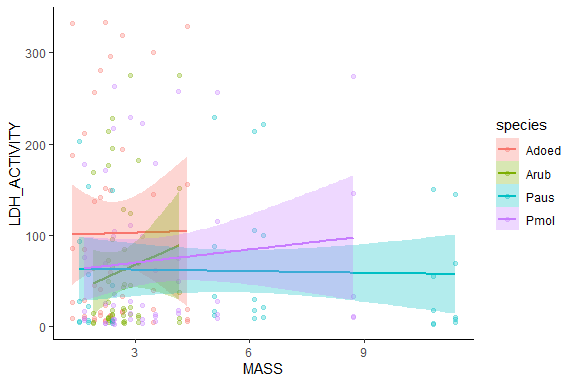<!-- -->

### {-}

## Fit the model 

The model was fit using the **glm** and later **glmmTMB** package in R. A number of different models were tested to determine which hypothesis and associated variables best predicted resting oxygen consumption. Model fit was examined using AICc, BIC, and r-squared values. Additional model were examined via the validation diagnostics provided by the **performance** and **dHARMA** packages in R. 

From out initial plots we can see that our data is heavily skewed to the right. From our initial plots we can all see that the relationship between enzyme activity and temperature is no linear, but rather may represent either a quadratic or cubic relationship. Let's start out model selection process by comparing different polynomial models.  

### polynomial models

``` r
#--- model 1 ---# 
ldh.model.1 <- glm(LDH_ACTIVITY ~ temperature * LATITUDE * LATIN_GENUS, 
               family = gaussian(),
               data = ldh.data) 

ldh.model.1.p2 <- glm(LDH_ACTIVITY ~ poly(temperature, 2) * LATITUDE * LATIN_GENUS, 
               family = gaussian(),
               data = ldh.data)  

ldh.model.1.p3 <- glm(LDH_ACTIVITY ~ poly(temperature, 3) * LATITUDE * LATIN_GENUS, 
               family = gaussian(),
               data = ldh.data) 
```

#### model comparisons - polynomial models 

``` r
aic.c=AICc(ldh.model.1, ldh.model.1.p2, ldh.model.1.p3, k=2) 
bic=BIC(ldh.model.1, ldh.model.1.p2, ldh.model.1.p3)

model.fit.table <- as.data.frame(aic.c) %>% 
  tibble::rownames_to_column("model") %>%
  mutate(BIC = bic$BIC, 
         r2 = c(r.squaredLR(ldh.model.1)[1], r.squaredLR(ldh.model.1.p2)[1], r.squaredLR(ldh.model.1.p3)[1]))
model.fit.table %>% knitr::kable(format = "html")  %>%
  kable_paper(full_width = TRUE) 
```

<table class=" lightable-paper" style='font-family: "Arial Narrow", arial, helvetica, sans-serif; margin-left: auto; margin-right: auto;'>
 <thead>
  <tr>
   <th style="text-align:left;"> model </th>
   <th style="text-align:right;"> df </th>
   <th style="text-align:right;"> AICc </th>
   <th style="text-align:right;"> BIC </th>
   <th style="text-align:right;"> r2 </th>
  </tr>
 </thead>
<tbody>
  <tr>
   <td style="text-align:left;"> ldh.model.1 </td>
   <td style="text-align:right;"> 9 </td>
   <td style="text-align:right;"> 1931.479 </td>
   <td style="text-align:right;"> 1959.379 </td>
   <td style="text-align:right;"> 0.7584731 </td>
  </tr>
  <tr>
   <td style="text-align:left;"> ldh.model.1.p2 </td>
   <td style="text-align:right;"> 13 </td>
   <td style="text-align:right;"> 1729.443 </td>
   <td style="text-align:right;"> 1769.096 </td>
   <td style="text-align:right;"> 0.9233337 </td>
  </tr>
  <tr>
   <td style="text-align:left;"> ldh.model.1.p3 </td>
   <td style="text-align:right;"> 17 </td>
   <td style="text-align:right;"> 1729.490 </td>
   <td style="text-align:right;"> 1780.458 </td>
   <td style="text-align:right;"> 0.9271906 </td>
  </tr>
</tbody>
</table>

``` r
anova(ldh.model.1, ldh.model.1.p2, ldh.model.1.p3, test = "Chisq")
```

<div data-pagedtable="false">
  <script data-pagedtable-source type="application/json">
{"columns":[{"label":[""],"name":["_rn_"],"type":[""],"align":["left"]},{"label":["Resid. Df"],"name":[1],"type":["dbl"],"align":["right"]},{"label":["Resid. Dev"],"name":[2],"type":["dbl"],"align":["right"]},{"label":["Df"],"name":[3],"type":["dbl"],"align":["right"]},{"label":["Deviance"],"name":[4],"type":["dbl"],"align":["right"]},{"label":["Pr(>Chi)"],"name":[5],"type":["dbl"],"align":["right"]}],"data":[{"1":"176","2":"351786.8","3":"NA","4":"NA","5":"NA","_rn_":"1"},{"1":"172","2":"111665.3","3":"4","4":"240121.421","5":"4.774844e-81","_rn_":"2"},{"1":"168","2":"106047.7","3":"4","4":"5617.667","5":"6.366198e-02","_rn_":"3"}],"options":{"columns":{"min":{},"max":[10]},"rows":{"min":[10],"max":[10]},"pages":{}}}
  </script>
</div>

Looks like the model where temperature is treated as a second order polynomial (quadratic) is better than the linear and third order polynomial model. Lets see if adding the variable **tissue.mass** improves the model. 

### fixed factor comparisons

``` r
#--- model 1 ---# 
ldh.model.1.p2 <- glm(LDH_ACTIVITY ~ poly(temperature, 2) * LATITUDE * LATIN_GENUS, 
               family = gaussian(),
               data = ldh.data)  

ldh.model.1.p2b <- ldh.model.1.p2 %>% update(. ~ poly(temperature, 2) * LATITUDE * LATIN_GENUS + scale(tissue_mass))  

ldh.model.1.p2c <- ldh.model.1.p2 %>% update(. ~ poly(temperature, 2) * LATITUDE * LATIN_GENUS + scale(MASS))

ldh.model.1.p2d <- ldh.model.1.p2 %>% update(. ~ poly(temperature, 2) * LATITUDE * LATIN_GENUS + scale(MASS)*scale(tissue_mass))
```

#### model comparisons - fixed factor comparisons 

``` r
aic.c=AICc(ldh.model.1.p2, ldh.model.1.p2b, ldh.model.1.p2c, ldh.model.1.p2d, k=5) 
bic=BIC(ldh.model.1.p2, ldh.model.1.p2b, ldh.model.1.p2c, ldh.model.1.p2d)

model.fit.table <- as.data.frame(aic.c) %>% 
  tibble::rownames_to_column("model") %>%
  mutate(BIC = bic$BIC, 
         r2 = c(r.squaredLR(ldh.model.1.p2)[1], r.squaredLR(ldh.model.1.p2b)[1],r.squaredLR(ldh.model.1.p2c)[1],r.squaredLR(ldh.model.1.p2d)[1]))
model.fit.table %>% knitr::kable(format = "html")  %>%
  kable_paper(full_width = TRUE) 
```

<table class=" lightable-paper" style='font-family: "Arial Narrow", arial, helvetica, sans-serif; margin-left: auto; margin-right: auto;'>
 <thead>
  <tr>
   <th style="text-align:left;"> model </th>
   <th style="text-align:right;"> df </th>
   <th style="text-align:right;"> AICc </th>
   <th style="text-align:right;"> BIC </th>
   <th style="text-align:right;"> r2 </th>
  </tr>
 </thead>
<tbody>
  <tr>
   <td style="text-align:left;"> ldh.model.1.p2 </td>
   <td style="text-align:right;"> 13 </td>
   <td style="text-align:right;"> 1771.654 </td>
   <td style="text-align:right;"> 1769.096 </td>
   <td style="text-align:right;"> 0.9233337 </td>
  </tr>
  <tr>
   <td style="text-align:left;"> ldh.model.1.p2b </td>
   <td style="text-align:right;"> 14 </td>
   <td style="text-align:right;"> 1777.335 </td>
   <td style="text-align:right;"> 1774.131 </td>
   <td style="text-align:right;"> 0.9234085 </td>
  </tr>
  <tr>
   <td style="text-align:left;"> ldh.model.1.p2c </td>
   <td style="text-align:right;"> 14 </td>
   <td style="text-align:right;"> 1775.595 </td>
   <td style="text-align:right;"> 1772.391 </td>
   <td style="text-align:right;"> 0.9241293 </td>
  </tr>
  <tr>
   <td style="text-align:left;"> ldh.model.1.p2d </td>
   <td style="text-align:right;"> 16 </td>
   <td style="text-align:right;"> 1775.460 </td>
   <td style="text-align:right;"> 1770.755 </td>
   <td style="text-align:right;"> 0.9289449 </td>
  </tr>
</tbody>
</table>

``` r
anova(ldh.model.1.p2, ldh.model.1.p2b, ldh.model.1.p2c, ldh.model.1.p2d, test = "Chisq")
```

<div data-pagedtable="false">
  <script data-pagedtable-source type="application/json">
{"columns":[{"label":[""],"name":["_rn_"],"type":[""],"align":["left"]},{"label":["Resid. Df"],"name":[1],"type":["dbl"],"align":["right"]},{"label":["Resid. Dev"],"name":[2],"type":["dbl"],"align":["right"]},{"label":["Df"],"name":[3],"type":["dbl"],"align":["right"]},{"label":["Deviance"],"name":[4],"type":["dbl"],"align":["right"]},{"label":["Pr(>Chi)"],"name":[5],"type":["dbl"],"align":["right"]}],"data":[{"1":"172","2":"111665.3","3":"NA","4":"NA","5":"NA","_rn_":"1"},{"1":"171","2":"111556.4","3":"1","4":"108.9214","5":"0.673214303","_rn_":"2"},{"1":"171","2":"110506.5","3":"0","4":"1049.8987","5":"NA","_rn_":"3"},{"1":"169","2":"103492.5","3":"2","4":"7013.9776","5":"0.003257485","_rn_":"4"}],"options":{"columns":{"min":{},"max":[10]},"rows":{"min":[10],"max":[10]},"pages":{}}}
  </script>
</div>

The variable **TISSUE_MASS_CENTERED does not** improve the model, therefore it will be left out of the model moving forward. 

Lastly, because tissue samples from the same fish were tested at multiple temperatures we need to include **fish_id** as a random factor. 

### Generalised linear mixed model (GLMM)

``` r
ldh.glmm.1.p2 <- glmmTMB(LDH_ACTIVITY ~ poly(temperature, 2) * LATITUDE * LATIN_GENUS + (1|fish_id), 
               family = gaussian(),
               REML = TRUE,
               data = ldh.data) 
```

Great! Now lets check our model validations to see how the model is performing. 

## Model validation {.tabset}

### ldh.glmm.1.p2 [performance]


``` r
ldh.glmm.1.p2 %>% check_model(detrend=FALSE)
```

<!-- -->

### ldh.glmm.1.p2 [DHARMa]


``` r
ldh.glmm.1.p2 %>% simulateResiduals(plot=TRUE)
```

<!-- -->

```
## Object of Class DHARMa with simulated residuals based on 250 simulations with refit = FALSE . See ?DHARMa::simulateResiduals for help. 
##  
## Scaled residual values: 0.468 0.776 0.908 0.956 0.928 0.428 0.58 0.232 0.012 0 0.392 0.552 0.128 0.516 0.932 0.428 0.504 0.424 0.328 0.084 ...
```

``` r
ldh.glmm.1.p2 %>% DHARMa::testResiduals(plot=TRUE)
```

<!-- -->

```
## $uniformity
## 
## 	Asymptotic one-sample Kolmogorov-Smirnov test
## 
## data:  simulationOutput$scaledResiduals
## D = 0.1223, p-value = 0.008135
## alternative hypothesis: two-sided
## 
## 
## $dispersion
## 
## 	DHARMa nonparametric dispersion test via sd of residuals fitted vs.
## 	simulated
## 
## data:  simulationOutput
## dispersion = 0.92059, p-value = 0.512
## alternative hypothesis: two.sided
## 
## 
## $outliers
## 
## 	DHARMa outlier test based on exact binomial test with approximate
## 	expectations
## 
## data:  simulationOutput
## outliers at both margin(s) = 4, observations = 184, p-value = 0.06072
## alternative hypothesis: true probability of success is not equal to 0.007968127
## 95 percent confidence interval:
##  0.005954205 0.054722803
## sample estimates:
## frequency of outliers (expected: 0.00796812749003984 ) 
##                                             0.02173913
```

```
## $uniformity
## 
## 	Asymptotic one-sample Kolmogorov-Smirnov test
## 
## data:  simulationOutput$scaledResiduals
## D = 0.1223, p-value = 0.008135
## alternative hypothesis: two-sided
## 
## 
## $dispersion
## 
## 	DHARMa nonparametric dispersion test via sd of residuals fitted vs.
## 	simulated
## 
## data:  simulationOutput
## dispersion = 0.92059, p-value = 0.512
## alternative hypothesis: two.sided
## 
## 
## $outliers
## 
## 	DHARMa outlier test based on exact binomial test with approximate
## 	expectations
## 
## data:  simulationOutput
## outliers at both margin(s) = 4, observations = 184, p-value = 0.06072
## alternative hypothesis: true probability of success is not equal to 0.007968127
## 95 percent confidence interval:
##  0.005954205 0.054722803
## sample estimates:
## frequency of outliers (expected: 0.00796812749003984 ) 
##                                             0.02173913
```

There are a number of issues with this model. Lets see if we can solve some of the issues by exploring link functions that we have available.  

### {-}

## Re-fitting model 

Turn **REML** off when comparing models

### re-fitting models [link functions]


``` r
ldh.glmm.1.p2 <- ldh.glmm.1.p2 %>% update(REML=FALSE)
ldh.glmm.1.p2.log <- ldh.glmm.1.p2 %>% update(family=gaussian(link="log"), 
                                              REML=FALSE) 
ldh.glmm.1.p2.sqrt <- ldh.glmm.1.p2 %>% update(family=gaussian(link="sqrt"), 
                                               REML=FALSE) 
```

### re-fit model comparisons [link function]


``` r
aic.c=AICc(ldh.model.1.p2, ldh.glmm.1.p2.log,ldh.glmm.1.p2.sqrt,  k=2) 
bic=BIC(ldh.model.1.p2, ldh.glmm.1.p2.log, ldh.glmm.1.p2.sqrt)

model.fit.table <- as.data.frame(aic.c) %>% 
  tibble::rownames_to_column("model") %>%
  mutate(BIC = bic$BIC, 
         r2 = c(r.squaredGLMM(ldh.model.1.p2)[1], r.squaredGLMM(ldh.glmm.1.p2.log)[1], r.squaredGLMM(ldh.glmm.1.p2.sqrt)[1]))
model.fit.table %>% knitr::kable(format = "html")  %>%
  kable_paper(full_width = TRUE) 
```

<table class=" lightable-paper" style='font-family: "Arial Narrow", arial, helvetica, sans-serif; margin-left: auto; margin-right: auto;'>
 <thead>
  <tr>
   <th style="text-align:left;"> model </th>
   <th style="text-align:right;"> df </th>
   <th style="text-align:right;"> AICc </th>
   <th style="text-align:right;"> BIC </th>
   <th style="text-align:right;"> r2 </th>
  </tr>
 </thead>
<tbody>
  <tr>
   <td style="text-align:left;"> ldh.model.1.p2 </td>
   <td style="text-align:right;"> 13 </td>
   <td style="text-align:right;"> 1729.443 </td>
   <td style="text-align:right;"> 1769.096 </td>
   <td style="text-align:right;"> 0.9188286 </td>
  </tr>
  <tr>
   <td style="text-align:left;"> ldh.glmm.1.p2.log </td>
   <td style="text-align:right;"> 14 </td>
   <td style="text-align:right;"> 1536.756 </td>
   <td style="text-align:right;"> 1579.280 </td>
   <td style="text-align:right;"> 0.0309935 </td>
  </tr>
  <tr>
   <td style="text-align:left;"> ldh.glmm.1.p2.sqrt </td>
   <td style="text-align:right;"> 14 </td>
   <td style="text-align:right;"> 1536.321 </td>
   <td style="text-align:right;"> 1578.845 </td>
   <td style="text-align:right;"> 0.2114794 </td>
  </tr>
</tbody>
</table>

From this model comparison it looks like the model that uses the **square root** link function does the best job modelling the data. Lets see how the model validation looks. We will run the model one more time with **REML=TRUE** before looking at model validation outputs. 


``` r
ldh.glmm.1.p2.sqrt <- ldh.glmm.1.p2.sqrt %>% update(REML = TRUE)
```

## Model re-validation {.tabset}

### ldh.glmm.1.p2 [performance]


``` r
ldh.glmm.1.p2.sqrt %>% check_model(detrend=FALSE)
```

<!-- -->

### ldh.glmm.1.p2 [DHARMa]


``` r
ldh.glmm.1.p2.sqrt %>% simulateResiduals(plot=TRUE)
```

<!-- -->

```
## Object of Class DHARMa with simulated residuals based on 250 simulations with refit = FALSE . See ?DHARMa::simulateResiduals for help. 
##  
## Scaled residual values: 0.544 0.932 0.92 0.856 0.728 0.48 0.648 0.2 0.044 0.056 0.424 0.54 0.084 0.544 0.736 0.46 0.5 0.44 0.428 0.24 ...
```

``` r
ldh.glmm.1.p2.sqrt %>% DHARMa::testResiduals(plot=TRUE)
```

<!-- -->

```
## $uniformity
## 
## 	Asymptotic one-sample Kolmogorov-Smirnov test
## 
## data:  simulationOutput$scaledResiduals
## D = 0.16291, p-value = 0.0001146
## alternative hypothesis: two-sided
## 
## 
## $dispersion
## 
## 	DHARMa nonparametric dispersion test via sd of residuals fitted vs.
## 	simulated
## 
## data:  simulationOutput
## dispersion = 0.79473, p-value = 0.272
## alternative hypothesis: two.sided
## 
## 
## $outliers
## 
## 	DHARMa outlier test based on exact binomial test with approximate
## 	expectations
## 
## data:  simulationOutput
## outliers at both margin(s) = 1, observations = 184, p-value = 1
## alternative hypothesis: true probability of success is not equal to 0.007968127
## 95 percent confidence interval:
##  0.0001375873 0.0299071606
## sample estimates:
## frequency of outliers (expected: 0.00796812749003984 ) 
##                                            0.005434783
```

```
## $uniformity
## 
## 	Asymptotic one-sample Kolmogorov-Smirnov test
## 
## data:  simulationOutput$scaledResiduals
## D = 0.16291, p-value = 0.0001146
## alternative hypothesis: two-sided
## 
## 
## $dispersion
## 
## 	DHARMa nonparametric dispersion test via sd of residuals fitted vs.
## 	simulated
## 
## data:  simulationOutput
## dispersion = 0.79473, p-value = 0.272
## alternative hypothesis: two.sided
## 
## 
## $outliers
## 
## 	DHARMa outlier test based on exact binomial test with approximate
## 	expectations
## 
## data:  simulationOutput
## outliers at both margin(s) = 1, observations = 184, p-value = 1
## alternative hypothesis: true probability of success is not equal to 0.007968127
## 95 percent confidence interval:
##  0.0001375873 0.0299071606
## sample estimates:
## frequency of outliers (expected: 0.00796812749003984 ) 
##                                            0.005434783
```

### {-}

## Important note

**NOTE:** The sqrt gaussian model actually performs pretty well. However, when we look at the model there are clear signs of heteroscadiscity within the data (i.e., increasing variation at higher dependent variable values). This seems to be feature of the enzyme data whereby at low temperatures there is very little activity, and therefore little variation within activity at 10, 20, and 30C. However as temperatures increase to 40 and 50C we start to see enzyme activities increase exponentially and begin to identify maximal enzyme activity. Here we would _expect_ to see more variation as we are beginning to see the difference different individuals have in maximum LDH activity. One could argue in continuing to use this more despite heteroscadiscity being seen within the data. However, there are a couple of options if one chooses to fix the issue. The first could be to try a different distribution, another could be to transform that data. Both options are explored below. While these options may help, I think it is important to think about whether or not we want increase variation at higher temperatures to be something that is included within our model as it may be a _feature_ of the model rather than an unwanted _artefact_ within the data.

## Model re-re-fit 

### Gamma models

``` r
ldh.glmm.1.p2.sqrt <- ldh.glmm.1.p2.sqrt %>% update(REML = FALSE)
ldh.glmm.1.p2.gamma.log <- ldh.glmm.1.p2.sqrt %>% update(family = Gamma(link="log"), 
                                                     REML = FALSE)  
ldh.glmm.1.p2.gamma.sqrt <- ldh.glmm.1.p2.sqrt %>% update(family = Gamma(link="sqrt"), 
                                                     REML = FALSE)  
```

### model comparisons - Gamma models 

``` r
aic.c=AICc(ldh.glmm.1.p2.sqrt, ldh.glmm.1.p2.gamma.log,ldh.glmm.1.p2.gamma.sqrt,  k=3) 
bic=BIC(ldh.glmm.1.p2.sqrt, ldh.glmm.1.p2.gamma.log, ldh.glmm.1.p2.gamma.sqrt)

model.fit.table <- as.data.frame(aic.c) %>% 
  tibble::rownames_to_column("model") %>%
  mutate(BIC = bic$BIC, 
         r2 = c(r.squaredGLMM(ldh.glmm.1.p2.sqrt)[1], r.squaredGLMM(ldh.glmm.1.p2.gamma.log)[1], "NA"))
model.fit.table %>% knitr::kable(format = "html")  %>%
  kable_paper(full_width = TRUE) 
```

<table class=" lightable-paper" style='font-family: "Arial Narrow", arial, helvetica, sans-serif; margin-left: auto; margin-right: auto;'>
 <thead>
  <tr>
   <th style="text-align:left;"> model </th>
   <th style="text-align:right;"> df </th>
   <th style="text-align:right;"> AICc </th>
   <th style="text-align:right;"> BIC </th>
   <th style="text-align:left;"> r2 </th>
  </tr>
 </thead>
<tbody>
  <tr>
   <td style="text-align:left;"> ldh.glmm.1.p2.sqrt </td>
   <td style="text-align:right;"> 14 </td>
   <td style="text-align:right;"> 1551.564 </td>
   <td style="text-align:right;"> 1578.845 </td>
   <td style="text-align:left;"> 0.211479401906785 </td>
  </tr>
  <tr>
   <td style="text-align:left;"> ldh.glmm.1.p2.gamma.log </td>
   <td style="text-align:right;"> 14 </td>
   <td style="text-align:right;"> 1514.559 </td>
   <td style="text-align:right;"> 1541.840 </td>
   <td style="text-align:left;"> 0.901511250037875 </td>
  </tr>
  <tr>
   <td style="text-align:left;"> ldh.glmm.1.p2.gamma.sqrt </td>
   <td style="text-align:right;"> 14 </td>
   <td style="text-align:right;"> 1463.034 </td>
   <td style="text-align:right;"> 1490.316 </td>
   <td style="text-align:left;"> NA </td>
  </tr>
</tbody>
</table>

## Model re-re-validation {.tabset}

### ldh.glmm.1.p2.gamma [performance]


``` r
#ldh.glmm.1.p2d.gamma.sqrt %>% check_model(detrend=FALSE)
```

### ldh.glmm.1.p2 [DHARMa]


``` r
ldh.glmm.1.p2.gamma.sqrt %>% simulateResiduals(plot=TRUE)
```

<!-- -->

```
## Object of Class DHARMa with simulated residuals based on 250 simulations with refit = FALSE . See ?DHARMa::simulateResiduals for help. 
##  
## Scaled residual values: 0.492 0.972 0.992 0.916 0.52 0.552 0.372 0.212 0.112 0.096 0.264 0.064 0.092 0.8 0.528 0.452 0.092 0.696 0.624 0.208 ...
```

``` r
ldh.glmm.1.p2.gamma.sqrt %>% DHARMa::testResiduals(plot=TRUE)
```

<!-- -->

```
## $uniformity
## 
## 	Asymptotic one-sample Kolmogorov-Smirnov test
## 
## data:  simulationOutput$scaledResiduals
## D = 0.038174, p-value = 0.9514
## alternative hypothesis: two-sided
## 
## 
## $dispersion
## 
## 	DHARMa nonparametric dispersion test via sd of residuals fitted vs.
## 	simulated
## 
## data:  simulationOutput
## dispersion = 0.49874, p-value = 0.016
## alternative hypothesis: two.sided
## 
## 
## $outliers
## 
## 	DHARMa outlier test based on exact binomial test with approximate
## 	expectations
## 
## data:  simulationOutput
## outliers at both margin(s) = 1, observations = 184, p-value = 1
## alternative hypothesis: true probability of success is not equal to 0.007968127
## 95 percent confidence interval:
##  0.0001375873 0.0299071606
## sample estimates:
## frequency of outliers (expected: 0.00796812749003984 ) 
##                                            0.005434783
```

```
## $uniformity
## 
## 	Asymptotic one-sample Kolmogorov-Smirnov test
## 
## data:  simulationOutput$scaledResiduals
## D = 0.038174, p-value = 0.9514
## alternative hypothesis: two-sided
## 
## 
## $dispersion
## 
## 	DHARMa nonparametric dispersion test via sd of residuals fitted vs.
## 	simulated
## 
## data:  simulationOutput
## dispersion = 0.49874, p-value = 0.016
## alternative hypothesis: two.sided
## 
## 
## $outliers
## 
## 	DHARMa outlier test based on exact binomial test with approximate
## 	expectations
## 
## data:  simulationOutput
## outliers at both margin(s) = 1, observations = 184, p-value = 1
## alternative hypothesis: true probability of success is not equal to 0.007968127
## 95 percent confidence interval:
##  0.0001375873 0.0299071606
## sample estimates:
## frequency of outliers (expected: 0.00796812749003984 ) 
##                                            0.005434783
```

### {-}

## Important note 2
The Gamma distribution does seem to improve the model, definitely helps solve the heteroscadisity problem, however, there are down sides. The gamma more with the square-root link doesn't seem to as good a job at handling data at the upper and lower ends of the spectrum as noted by the qq-plot in the performance package diagnostics. Also, the dispersion assumption within the DHARMa diagnositics is violated. Let's move on and see how the data transformation models perform. 

## Fit model [Transformed data]

### polynomial models [Transformed data]

``` r
#--- model 1 ---# 
ldh.sqrt.model.1 <- glm(sqrt(LDH_ACTIVITY) ~ temperature * LATITUDE * LATIN_GENUS, 
               family = gaussian(),
               data = ldh.data) 

ldh.sqrt.model.1.p2 <- glm(sqrt(LDH_ACTIVITY) ~ poly(temperature, 2) * LATITUDE * LATIN_GENUS, 
               family = gaussian(),
               data = ldh.data)  

ldh.sqrt.model.1.p3 <- glm(sqrt(LDH_ACTIVITY) ~ poly(temperature, 3) * LATITUDE * LATIN_GENUS, 
               family = gaussian(),
               data = ldh.data) 
```

#### model comparisons - polynomial models 

``` r
aic.c=AICc(ldh.sqrt.model.1, ldh.sqrt.model.1.p2, ldh.sqrt.model.1.p3, k=3) 
bic=BIC(ldh.sqrt.model.1, ldh.sqrt.model.1.p2, ldh.sqrt.model.1.p3)

model.fit.table <- as.data.frame(aic.c) %>% 
  tibble::rownames_to_column("model") %>%
  mutate(BIC = bic$BIC, 
         r2 = c(r.squaredLR(ldh.sqrt.model.1)[1], r.squaredLR(ldh.sqrt.model.1.p2)[1], r.squaredLR(ldh.sqrt.model.1.p3)[1]))
model.fit.table %>% knitr::kable(format = "html")  %>%
  kable_paper(full_width = TRUE) 
```

<table class=" lightable-paper" style='font-family: "Arial Narrow", arial, helvetica, sans-serif; margin-left: auto; margin-right: auto;'>
 <thead>
  <tr>
   <th style="text-align:left;"> model </th>
   <th style="text-align:right;"> df </th>
   <th style="text-align:right;"> AICc </th>
   <th style="text-align:right;"> BIC </th>
   <th style="text-align:right;"> r2 </th>
  </tr>
 </thead>
<tbody>
  <tr>
   <td style="text-align:left;"> ldh.sqrt.model.1 </td>
   <td style="text-align:right;"> 9 </td>
   <td style="text-align:right;"> 781.9093 </td>
   <td style="text-align:right;"> 800.2920 </td>
   <td style="text-align:right;"> 0.8512202 </td>
  </tr>
  <tr>
   <td style="text-align:left;"> ldh.sqrt.model.1.p2 </td>
   <td style="text-align:right;"> 13 </td>
   <td style="text-align:right;"> 630.5226 </td>
   <td style="text-align:right;"> 656.1050 </td>
   <td style="text-align:right;"> 0.9393285 </td>
  </tr>
  <tr>
   <td style="text-align:left;"> ldh.sqrt.model.1.p3 </td>
   <td style="text-align:right;"> 17 </td>
   <td style="text-align:right;"> 637.2778 </td>
   <td style="text-align:right;"> 669.4016 </td>
   <td style="text-align:right;"> 0.9417718 </td>
  </tr>
</tbody>
</table>

``` r
anova(ldh.sqrt.model.1, ldh.sqrt.model.1.p2, ldh.sqrt.model.1.p3, test = "Chisq")
```

<div data-pagedtable="false">
  <script data-pagedtable-source type="application/json">
{"columns":[{"label":[""],"name":["_rn_"],"type":[""],"align":["left"]},{"label":["Resid. Df"],"name":[1],"type":["dbl"],"align":["right"]},{"label":["Resid. Dev"],"name":[2],"type":["dbl"],"align":["right"]},{"label":["Df"],"name":[3],"type":["dbl"],"align":["right"]},{"label":["Deviance"],"name":[4],"type":["dbl"],"align":["right"]},{"label":["Pr(>Chi)"],"name":[5],"type":["dbl"],"align":["right"]}],"data":[{"1":"176","2":"646.3837","3":"NA","4":"NA","5":"NA","_rn_":"1"},{"1":"172","2":"263.5914","3":"4","4":"382.79222","5":"8.064784e-54","_rn_":"2"},{"1":"168","2":"252.9764","3":"4","4":"10.61507","5":"1.333006e-01","_rn_":"3"}],"options":{"columns":{"min":{},"max":[10]},"rows":{"min":[10],"max":[10]},"pages":{}}}
  </script>
</div>

Once again the model that fits temperature as a second order polynomial seems to be the best fit. lets continue. 


``` r
ldh.sqrt.model.1.p2 <- glmmTMB(sqrt(LDH_ACTIVITY) ~ poly(temperature, 2) * LATITUDE * LATIN_GENUS + (1|fish_id), 
               family = gaussian(),
               REML=TRUE,
               data = ldh.data)  
```

## Model validation [Transformed data] {.tabset}

### ldh.sqrt.model.1.p2 [performance]


``` r
ldh.sqrt.model.1.p2 %>% check_model(detrend=FALSE)
```

<!-- -->

### ldh.sqrt.model.1.p2 [DHARMa]


``` r
ldh.sqrt.model.1.p2 %>% simulateResiduals(plot=TRUE)
```

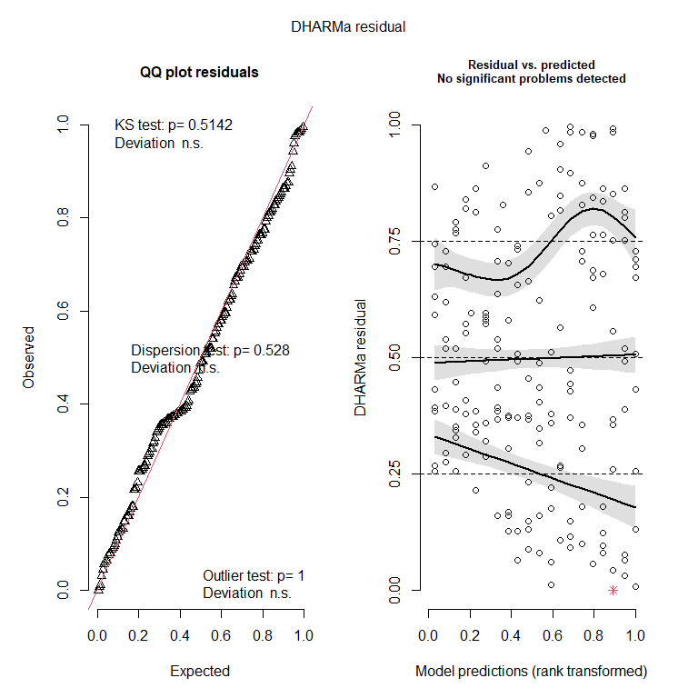<!-- -->

```
## Object of Class DHARMa with simulated residuals based on 250 simulations with refit = FALSE . See ?DHARMa::simulateResiduals for help. 
##  
## Scaled residual values: 0.596 0.828 0.988 0.976 0.728 0.572 0.304 0.176 0.056 0.008 0.38 0.128 0.06 0.764 0.712 0.552 0.168 0.512 0.608 0.132 ...
```

``` r
ldh.sqrt.model.1.p2 %>% DHARMa::testResiduals(plot=TRUE)
```

<!-- -->

```
## $uniformity
## 
## 	Asymptotic one-sample Kolmogorov-Smirnov test
## 
## data:  simulationOutput$scaledResiduals
## D = 0.060348, p-value = 0.5142
## alternative hypothesis: two-sided
## 
## 
## $dispersion
## 
## 	DHARMa nonparametric dispersion test via sd of residuals fitted vs.
## 	simulated
## 
## data:  simulationOutput
## dispersion = 0.91441, p-value = 0.528
## alternative hypothesis: two.sided
## 
## 
## $outliers
## 
## 	DHARMa outlier test based on exact binomial test with approximate
## 	expectations
## 
## data:  simulationOutput
## outliers at both margin(s) = 1, observations = 184, p-value = 1
## alternative hypothesis: true probability of success is not equal to 0.007968127
## 95 percent confidence interval:
##  0.0001375873 0.0299071606
## sample estimates:
## frequency of outliers (expected: 0.00796812749003984 ) 
##                                            0.005434783
```

```
## $uniformity
## 
## 	Asymptotic one-sample Kolmogorov-Smirnov test
## 
## data:  simulationOutput$scaledResiduals
## D = 0.060348, p-value = 0.5142
## alternative hypothesis: two-sided
## 
## 
## $dispersion
## 
## 	DHARMa nonparametric dispersion test via sd of residuals fitted vs.
## 	simulated
## 
## data:  simulationOutput
## dispersion = 0.91441, p-value = 0.528
## alternative hypothesis: two.sided
## 
## 
## $outliers
## 
## 	DHARMa outlier test based on exact binomial test with approximate
## 	expectations
## 
## data:  simulationOutput
## outliers at both margin(s) = 1, observations = 184, p-value = 1
## alternative hypothesis: true probability of success is not equal to 0.007968127
## 95 percent confidence interval:
##  0.0001375873 0.0299071606
## sample estimates:
## frequency of outliers (expected: 0.00796812749003984 ) 
##                                            0.005434783
```

### {-}

## Important note 3 

It looks like transforming the data via a square root transformation really helps model performance. No significant data violations occur and the diagnostic plots start to look a lot better. This is definitely a viable and justifiable option. 

## Partial plots {.tabset} 

### ggemmeans {.tabset} 

#### TEMPERATURE V LATITUDE

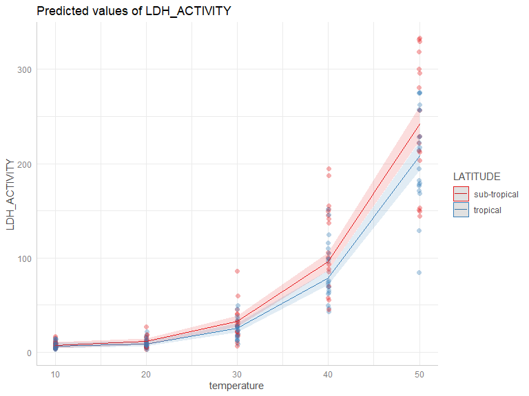<!-- -->

#### TEMPERATURE V GENUS

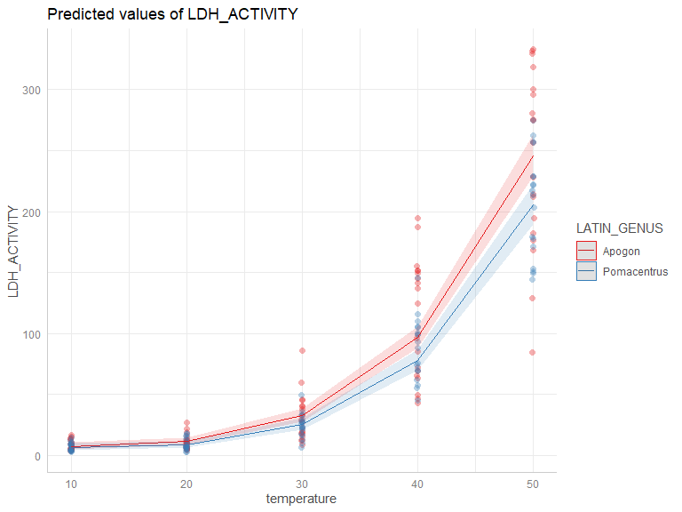<!-- -->

#### TEMPERATURE V GENUS V LATITUDE

<!-- -->

### plot_model 


```
## Formula contains log- or sqrt-terms.
##   See help("standardize") for how such terms are standardized.
```

<!-- -->

#### {-}

### {-}

## Model investigation {.tabset .tabset-pills}

### summary 
<table class=" lightable-paper" style='font-family: "Arial Narrow", arial, helvetica, sans-serif; margin-left: auto; margin-right: auto;'>
 <thead>
  <tr>
   <th style="text-align:left;">   </th>
   <th style="text-align:right;"> Estimate </th>
   <th style="text-align:right;"> StdError </th>
   <th style="text-align:right;"> Zvalue </th>
   <th style="text-align:right;"> Pvalue </th>
  </tr>
 </thead>
<tbody>
  <tr>
   <td style="text-align:left;"> (Intercept) </td>
   <td style="text-align:right;"> 8.4593941 </td>
   <td style="text-align:right;"> 0.3088299 </td>
   <td style="text-align:right;"> 27.3917563 </td>
   <td style="text-align:right;"> 0.0000000 </td>
  </tr>
  <tr>
   <td style="text-align:left;"> poly(temperature, 2)1 </td>
   <td style="text-align:right;"> 70.8216326 </td>
   <td style="text-align:right;"> 1.9012338 </td>
   <td style="text-align:right;"> 37.2503550 </td>
   <td style="text-align:right;"> 0.0000000 </td>
  </tr>
  <tr>
   <td style="text-align:left;"> poly(temperature, 2)2 </td>
   <td style="text-align:right;"> 19.5178284 </td>
   <td style="text-align:right;"> 1.9019636 </td>
   <td style="text-align:right;"> 10.2619358 </td>
   <td style="text-align:right;"> 0.0000000 </td>
  </tr>
  <tr>
   <td style="text-align:left;"> LATITUDEtropical </td>
   <td style="text-align:right;"> -1.9658826 </td>
   <td style="text-align:right;"> 0.4256927 </td>
   <td style="text-align:right;"> -4.6180794 </td>
   <td style="text-align:right;"> 0.0000039 </td>
  </tr>
  <tr>
   <td style="text-align:left;"> LATIN_GENUSPomacentrus </td>
   <td style="text-align:right;"> -2.0306798 </td>
   <td style="text-align:right;"> 0.4509390 </td>
   <td style="text-align:right;"> -4.5032247 </td>
   <td style="text-align:right;"> 0.0000067 </td>
  </tr>
  <tr>
   <td style="text-align:left;"> poly(temperature, 2)1:LATITUDEtropical </td>
   <td style="text-align:right;"> -17.2203742 </td>
   <td style="text-align:right;"> 2.6206699 </td>
   <td style="text-align:right;"> -6.5709818 </td>
   <td style="text-align:right;"> 0.0000000 </td>
  </tr>
  <tr>
   <td style="text-align:left;"> poly(temperature, 2)2:LATITUDEtropical </td>
   <td style="text-align:right;"> 0.3536775 </td>
   <td style="text-align:right;"> 2.6216759 </td>
   <td style="text-align:right;"> 0.1349051 </td>
   <td style="text-align:right;"> 0.8926869 </td>
  </tr>
  <tr>
   <td style="text-align:left;"> poly(temperature, 2)1:LATIN_GENUSPomacentrus </td>
   <td style="text-align:right;"> -17.9850384 </td>
   <td style="text-align:right;"> 2.7827256 </td>
   <td style="text-align:right;"> -6.4631018 </td>
   <td style="text-align:right;"> 0.0000000 </td>
  </tr>
  <tr>
   <td style="text-align:left;"> poly(temperature, 2)2:LATIN_GENUSPomacentrus </td>
   <td style="text-align:right;"> -0.2991186 </td>
   <td style="text-align:right;"> 2.7806214 </td>
   <td style="text-align:right;"> -0.1075726 </td>
   <td style="text-align:right;"> 0.9143347 </td>
  </tr>
  <tr>
   <td style="text-align:left;"> LATITUDEtropical:LATIN_GENUSPomacentrus </td>
   <td style="text-align:right;"> 2.6483278 </td>
   <td style="text-align:right;"> 0.6123909 </td>
   <td style="text-align:right;"> 4.3245704 </td>
   <td style="text-align:right;"> 0.0000153 </td>
  </tr>
  <tr>
   <td style="text-align:left;"> poly(temperature, 2)1:LATITUDEtropical:LATIN_GENUSPomacentrus </td>
   <td style="text-align:right;"> 24.5189856 </td>
   <td style="text-align:right;"> 3.7749176 </td>
   <td style="text-align:right;"> 6.4952372 </td>
   <td style="text-align:right;"> 0.0000000 </td>
  </tr>
  <tr>
   <td style="text-align:left;"> poly(temperature, 2)2:LATITUDEtropical:LATIN_GENUSPomacentrus </td>
   <td style="text-align:right;"> -0.1072444 </td>
   <td style="text-align:right;"> 3.7740288 </td>
   <td style="text-align:right;"> -0.0284164 </td>
   <td style="text-align:right;"> 0.9773300 </td>
  </tr>
</tbody>
</table>

### anova 
<table class=" lightable-paper" style='font-family: "Arial Narrow", arial, helvetica, sans-serif; margin-left: auto; margin-right: auto;'>
 <thead>
  <tr>
   <th style="text-align:left;">   </th>
   <th style="text-align:right;"> Chisq </th>
   <th style="text-align:right;"> Df </th>
   <th style="text-align:right;"> Pr(&gt;Chisq) </th>
  </tr>
 </thead>
<tbody>
  <tr>
   <td style="text-align:left;"> poly(temperature, 2) </td>
   <td style="text-align:right;"> 4433.979597 </td>
   <td style="text-align:right;"> 2 </td>
   <td style="text-align:right;"> 0.0000000 </td>
  </tr>
  <tr>
   <td style="text-align:left;"> LATITUDE </td>
   <td style="text-align:right;"> 4.960064 </td>
   <td style="text-align:right;"> 1 </td>
   <td style="text-align:right;"> 0.0259392 </td>
  </tr>
  <tr>
   <td style="text-align:left;"> LATIN_GENUS </td>
   <td style="text-align:right;"> 3.870975 </td>
   <td style="text-align:right;"> 1 </td>
   <td style="text-align:right;"> 0.0491280 </td>
  </tr>
  <tr>
   <td style="text-align:left;"> poly(temperature, 2):LATITUDE </td>
   <td style="text-align:right;"> 8.224737 </td>
   <td style="text-align:right;"> 2 </td>
   <td style="text-align:right;"> 0.0163690 </td>
  </tr>
  <tr>
   <td style="text-align:left;"> poly(temperature, 2):LATIN_GENUS </td>
   <td style="text-align:right;"> 6.173371 </td>
   <td style="text-align:right;"> 2 </td>
   <td style="text-align:right;"> 0.0456530 </td>
  </tr>
  <tr>
   <td style="text-align:left;"> LATITUDE:LATIN_GENUS </td>
   <td style="text-align:right;"> 18.761660 </td>
   <td style="text-align:right;"> 1 </td>
   <td style="text-align:right;"> 0.0000148 </td>
  </tr>
  <tr>
   <td style="text-align:left;"> poly(temperature, 2):LATITUDE:LATIN_GENUS </td>
   <td style="text-align:right;"> 42.189520 </td>
   <td style="text-align:right;"> 2 </td>
   <td style="text-align:right;"> 0.0000000 </td>
  </tr>
</tbody>
</table>

### confint 
<table class=" lightable-paper" style='font-family: "Arial Narrow", arial, helvetica, sans-serif; margin-left: auto; margin-right: auto;'>
 <thead>
  <tr>
   <th style="text-align:left;">   </th>
   <th style="text-align:right;"> 2.5 % </th>
   <th style="text-align:right;"> 97.5 % </th>
   <th style="text-align:right;"> Estimate </th>
  </tr>
 </thead>
<tbody>
  <tr>
   <td style="text-align:left;"> (Intercept) </td>
   <td style="text-align:right;"> 7.8540985 </td>
   <td style="text-align:right;"> 9.064690 </td>
   <td style="text-align:right;"> 8.4593941 </td>
  </tr>
  <tr>
   <td style="text-align:left;"> poly(temperature, 2)1 </td>
   <td style="text-align:right;"> 67.0952829 </td>
   <td style="text-align:right;"> 74.547982 </td>
   <td style="text-align:right;"> 70.8216326 </td>
  </tr>
  <tr>
   <td style="text-align:left;"> poly(temperature, 2)2 </td>
   <td style="text-align:right;"> 15.7900482 </td>
   <td style="text-align:right;"> 23.245608 </td>
   <td style="text-align:right;"> 19.5178284 </td>
  </tr>
  <tr>
   <td style="text-align:left;"> LATITUDEtropical </td>
   <td style="text-align:right;"> -2.8002249 </td>
   <td style="text-align:right;"> -1.131540 </td>
   <td style="text-align:right;"> -1.9658826 </td>
  </tr>
  <tr>
   <td style="text-align:left;"> LATIN_GENUSPomacentrus </td>
   <td style="text-align:right;"> -2.9145041 </td>
   <td style="text-align:right;"> -1.146856 </td>
   <td style="text-align:right;"> -2.0306798 </td>
  </tr>
  <tr>
   <td style="text-align:left;"> poly(temperature, 2)1:LATITUDEtropical </td>
   <td style="text-align:right;"> -22.3567928 </td>
   <td style="text-align:right;"> -12.083956 </td>
   <td style="text-align:right;"> -17.2203742 </td>
  </tr>
  <tr>
   <td style="text-align:left;"> poly(temperature, 2)2:LATITUDEtropical </td>
   <td style="text-align:right;"> -4.7847129 </td>
   <td style="text-align:right;"> 5.492068 </td>
   <td style="text-align:right;"> 0.3536775 </td>
  </tr>
  <tr>
   <td style="text-align:left;"> poly(temperature, 2)1:LATIN_GENUSPomacentrus </td>
   <td style="text-align:right;"> -23.4390803 </td>
   <td style="text-align:right;"> -12.530997 </td>
   <td style="text-align:right;"> -17.9850384 </td>
  </tr>
  <tr>
   <td style="text-align:left;"> poly(temperature, 2)2:LATIN_GENUSPomacentrus </td>
   <td style="text-align:right;"> -5.7490364 </td>
   <td style="text-align:right;"> 5.150799 </td>
   <td style="text-align:right;"> -0.2991186 </td>
  </tr>
  <tr>
   <td style="text-align:left;"> LATITUDEtropical:LATIN_GENUSPomacentrus </td>
   <td style="text-align:right;"> 1.4480636 </td>
   <td style="text-align:right;"> 3.848592 </td>
   <td style="text-align:right;"> 2.6483278 </td>
  </tr>
  <tr>
   <td style="text-align:left;"> poly(temperature, 2)1:LATITUDEtropical:LATIN_GENUSPomacentrus </td>
   <td style="text-align:right;"> 17.1202830 </td>
   <td style="text-align:right;"> 31.917688 </td>
   <td style="text-align:right;"> 24.5189856 </td>
  </tr>
  <tr>
   <td style="text-align:left;"> poly(temperature, 2)2:LATITUDEtropical:LATIN_GENUSPomacentrus </td>
   <td style="text-align:right;"> -7.5042049 </td>
   <td style="text-align:right;"> 7.289716 </td>
   <td style="text-align:right;"> -0.1072444 </td>
  </tr>
  <tr>
   <td style="text-align:left;"> Std.Dev.(Intercept)|fish_id </td>
   <td style="text-align:right;"> 0.6084442 </td>
   <td style="text-align:right;"> 1.120975 </td>
   <td style="text-align:right;"> 0.8258637 </td>
  </tr>
</tbody>
</table>

### r-squared
<table class=" lightable-paper" style='font-family: "Arial Narrow", arial, helvetica, sans-serif; margin-left: auto; margin-right: auto;'>
 <thead>
  <tr>
   <th style="text-align:right;"> R2_conditional </th>
   <th style="text-align:right;"> R2_marginal </th>
   <th style="text-align:left;"> optional </th>
  </tr>
 </thead>
<tbody>
  <tr>
   <td style="text-align:right;"> 0.9630084 </td>
   <td style="text-align:right;"> 0.9343911 </td>
   <td style="text-align:left;"> FALSE </td>
  </tr>
</tbody>
</table>

### {-} 

## Pairwise comparisons {.tabset .tabset-faded} 

### emtrends 


``` r
ldh.sqrt.model.1.p2 %>% emtrends(var = "temperature", type = "response") %>% pairs(by = "temperature") %>% summary(by = NULL, adjust = "sidak", infer=TRUE)
```

<div data-pagedtable="false">
  <script data-pagedtable-source type="application/json">
{"columns":[{"label":[""],"name":["_rn_"],"type":[""],"align":["left"]},{"label":["contrast"],"name":[1],"type":["fct"],"align":["left"]},{"label":["temperature"],"name":[2],"type":["dbl"],"align":["right"]},{"label":["estimate"],"name":[3],"type":["dbl"],"align":["right"]},{"label":["SE"],"name":[4],"type":["dbl"],"align":["right"]},{"label":["df"],"name":[5],"type":["dbl"],"align":["right"]},{"label":["lower.CL"],"name":[6],"type":["dbl"],"align":["right"]},{"label":["upper.CL"],"name":[7],"type":["dbl"],"align":["right"]},{"label":["t.ratio"],"name":[8],"type":["dbl"],"align":["right"]},{"label":["p.value"],"name":[9],"type":["dbl"],"align":["right"]}],"data":[{"1":"(sub-tropical Apogon) - tropical Apogon","2":"30.05435","3":"0.089618980","4":"0.01364380","5":"182","6":"0.05332694","7":"0.1259110191","8":"6.5684745","9":"3.099058e-09","_rn_":"1"},{"1":"(sub-tropical Apogon) - (sub-tropical Pomacentrus)","2":"30.05435","3":"0.093650206","4":"0.01448897","5":"182","6":"0.05511005","7":"0.1321903611","8":"6.4635509","9":"5.462094e-09","_rn_":"2"},{"1":"(sub-tropical Apogon) - tropical Pomacentrus","2":"30.05435","3":"0.055635803","4":"0.01364380","5":"182","6":"0.01934376","7":"0.0919278428","8":"4.0777340","9":"4.073691e-04","_rn_":"3"},{"1":"tropical Apogon - (sub-tropical Pomacentrus)","2":"30.05435","3":"0.004031226","4":"0.01414683","5":"182","6":"-0.03359884","7":"0.0416612923","8":"0.2849562","9":"9.998737e-01","_rn_":"4"},{"1":"tropical Apogon - tropical Pomacentrus","2":"30.05435","3":"-0.033983176","4":"0.01327990","5":"182","6":"-0.06930725","7":"0.0013409009","8":"-2.5589927","9":"6.597563e-02","_rn_":"5"},{"1":"(sub-tropical Pomacentrus) - tropical Pomacentrus","2":"30.05435","3":"-0.038014403","4":"0.01414683","5":"182","6":"-0.07564447","7":"-0.0003843363","8":"-2.6871325","9":"4.632752e-02","_rn_":"6"}],"options":{"columns":{"min":{},"max":[10]},"rows":{"min":[10],"max":[10]},"pages":{}}}
  </script>
</div>
SCROLL TO THE RIGHT -->

The numbers in the left most column in the table just mention that the slopes are assuming mean **MASS_CENTERED** and **RESTING_TIME_SEONDS** values when looking at differences between latitudinal slopes.

### emmeans [response]

``` r
ldh.sqrt.model.1.p2 %>% emmeans(pairwise ~ temperature*LATITUDE*LATIN_GENUS, type = "response") %>% pairs(by = "temperature") %>% summary(by = NULL, adjust = "sidak", infer=TRUE)
```

<div data-pagedtable="false">
  <script data-pagedtable-source type="application/json">
{"columns":[{"label":[""],"name":["_rn_"],"type":[""],"align":["left"]},{"label":["contrast"],"name":[1],"type":["fct"],"align":["left"]},{"label":["temperature"],"name":[2],"type":["dbl"],"align":["right"]},{"label":["estimate"],"name":[3],"type":["dbl"],"align":["right"]},{"label":["SE"],"name":[4],"type":["dbl"],"align":["right"]},{"label":["df"],"name":[5],"type":["dbl"],"align":["right"]},{"label":["lower.CL"],"name":[6],"type":["dbl"],"align":["right"]},{"label":["upper.CL"],"name":[7],"type":["dbl"],"align":["right"]},{"label":["t.ratio"],"name":[8],"type":["dbl"],"align":["right"]},{"label":["p.value"],"name":[9],"type":["dbl"],"align":["right"]}],"data":[{"1":"(sub-tropical Apogon) - tropical Apogon","2":"30.05435","3":"1.997076318","4":"0.4841390","5":"182","6":"0.70928358","7":"3.2848691","8":"4.12500604","9":"0.0003379149","_rn_":"1"},{"1":"(sub-tropical Apogon) - (sub-tropical Pomacentrus)","2":"30.05435","3":"2.004298024","4":"0.5139406","5":"182","6":"0.63723414","7":"3.3713619","8":"3.89986334","9":"0.0008113107","_rn_":"2"},{"1":"(sub-tropical Apogon) - tropical Pomacentrus","2":"30.05435","3":"1.343587779","4":"0.4841390","5":"182","6":"0.05579504","7":"2.6313805","8":"2.77521077","9":"0.0360041196","_rn_":"3"},{"1":"tropical Apogon - (sub-tropical Pomacentrus)","2":"30.05435","3":"0.007221705","4":"0.5017953","5":"182","6":"-1.32753629","7":"1.3419797","8":"0.01439173","9":"1.0000000000","_rn_":"4"},{"1":"tropical Apogon - tropical Pomacentrus","2":"30.05435","3":"-0.653488539","4":"0.4712263","5":"182","6":"-1.90693395","7":"0.5999569","8":"-1.38678281","9":"0.6663960501","_rn_":"5"},{"1":"(sub-tropical Pomacentrus) - tropical Pomacentrus","2":"30.05435","3":"-0.660710244","4":"0.5017953","5":"182","6":"-1.99546824","7":"0.6740478","8":"-1.31669264","9":"0.7167268745","_rn_":"6"}],"options":{"columns":{"min":{},"max":[10]},"rows":{"min":[10],"max":[10]},"pages":{}}}
  </script>
</div>
### emmeans [ratios]

``` r
ldh.sqrt.model.1.p2 %>% emmeans(pairwise ~ temperature*LATITUDE*LATIN_GENUS, type = "response") %>% regrid(transform = "log")  %>% pairs(by = "temperature") %>% summary(by = NULL, adjust = "sidak", infer=FALSE)
```

<div data-pagedtable="false">
  <script data-pagedtable-source type="application/json">
{"columns":[{"label":[""],"name":["_rn_"],"type":[""],"align":["left"]},{"label":["contrast"],"name":[1],"type":["fct"],"align":["left"]},{"label":["temperature"],"name":[2],"type":["fct"],"align":["left"]},{"label":["ratio"],"name":[3],"type":["dbl"],"align":["right"]},{"label":["SE"],"name":[4],"type":["dbl"],"align":["right"]},{"label":["df"],"name":[5],"type":["dbl"],"align":["right"]}],"data":[{"1":"(sub-tropical Apogon) / tropical Apogon","2":"30.054347826087","3":"2.0199404","4":"0.3535087","5":"182","_rn_":"1"},{"1":"(sub-tropical Apogon) / (sub-tropical Pomacentrus)","2":"30.054347826087","3":"2.0261084","4":"0.3844183","5":"182","_rn_":"2"},{"1":"(sub-tropical Apogon) / tropical Pomacentrus","2":"30.054347826087","3":"1.5601818","4":"0.2522043","5":"182","_rn_":"3"},{"1":"tropical Apogon / (sub-tropical Pomacentrus)","2":"30.054347826087","3":"1.0030535","4":"0.2125163","5":"182","_rn_":"4"},{"1":"tropical Apogon / tropical Pomacentrus","2":"30.054347826087","3":"0.7723900","4":"0.1445447","5":"182","_rn_":"5"},{"1":"(sub-tropical Pomacentrus) / tropical Pomacentrus","2":"30.054347826087","3":"0.7700387","4":"0.1547591","5":"182","_rn_":"6"}],"options":{"columns":{"min":{},"max":[10]},"rows":{"min":[10],"max":[10]},"pages":{}}}
  </script>
</div>


### temperature 

``` r
ldh.sqrt.model.1.p2 %>% emmeans(~ temperature*LATITUDE*LATIN_GENUS, type = "response") %>% regrid(transform = "log")  %>% summary(infer=TRUE)
```

<div data-pagedtable="false">
  <script data-pagedtable-source type="application/json">
{"columns":[{"label":[""],"name":["_rn_"],"type":[""],"align":["left"]},{"label":["temperature"],"name":[1],"type":["dbl"],"align":["right"]},{"label":["LATITUDE"],"name":[2],"type":["fct"],"align":["left"]},{"label":["LATIN_GENUS"],"name":[3],"type":["fct"],"align":["left"]},{"label":["response"],"name":[4],"type":["dbl"],"align":["right"]},{"label":["SE"],"name":[5],"type":["dbl"],"align":["right"]},{"label":["df"],"name":[6],"type":["dbl"],"align":["right"]},{"label":["lower.CL"],"name":[7],"type":["dbl"],"align":["right"]},{"label":["upper.CL"],"name":[8],"type":["dbl"],"align":["right"]},{"label":["null"],"name":[9],"type":["dbl"],"align":["right"]},{"label":["t.ratio"],"name":[10],"type":["dbl"],"align":["right"]},{"label":["p.value"],"name":[11],"type":["dbl"],"align":["right"]}],"data":[{"1":"30.05435","2":"sub-tropical","3":"Apogon","4":"45.40003","5":"4.733162","6":"182","7":"36.95902","8":"55.76887","9":"1","10":"36.59803","11":"7.596069e-86","_rn_":"1"},{"1":"30.05435","2":"tropical","3":"Apogon","4":"22.47593","5":"3.159391","6":"182","7":"17.03198","8":"29.65992","9":"1","10":"22.14195","11":"1.582117e-53","_rn_":"2"},{"1":"30.05435","2":"sub-tropical","3":"Pomacentrus","4":"22.40750","5":"3.552091","6":"182","7":"16.38912","8":"30.63594","9":"1","10":"19.61487","11":"9.175955e-47","_rn_":"3"},{"1":"30.05435","2":"tropical","3":"Pomacentrus","4":"29.09919","5":"3.594885","6":"182","7":"22.80449","8":"37.13141","9":"1","10":"27.28459","11":"3.191379e-66","_rn_":"4"}],"options":{"columns":{"min":{},"max":[10]},"rows":{"min":[10],"max":[10]},"pages":{}}}
  </script>
</div>

### temperture [combined]

``` r
ldh.means.temp <- ldh.sqrt.model.1.p2 %>% update(sqrt(LDH_ACTIVITY) ~ factor(temperature) * LATITUDE * LATIN_GENUS + scale(MASS)*scale(tissue_mass) + (1|fish_id)) %>% emmeans(pairwise ~ temperature, type = "response"); ldh.means.temp$emmeans
```

```
## NOTE: Results may be misleading due to involvement in interactions
```

```
##  temperature response   SE  df lower.CL upper.CL
##           10     8.24 1.14 182     6.14     10.6
##           20    10.45 1.30 182     8.04     13.2
##           30    27.52 2.08 182    23.56     31.8
##           40    98.93 3.95 182    91.28    106.9
##           50   224.12 5.95 182   212.54    236.0
## 
## Results are averaged over the levels of: LATITUDE, LATIN_GENUS 
## Confidence level used: 0.95 
## Intervals are back-transformed from the sqrt scale
```

``` r
ldh.means.temp.df <- ldh.means.temp$emmeans %>% as.data.frame() %>% 
  mutate("\u394 change"=response - lag(response, n=1, default = first(response)), 
         "\u394 %change" = response/lag(response, n=1, default = first(response))*100) 
ldh.means.temp.df[1,8] = 0.0000 

ldh.means.temp.df %>% knitr::kable(format = "html")  %>%
  kable_paper(full_width = TRUE) 
```

<table class=" lightable-paper" style='font-family: "Arial Narrow", arial, helvetica, sans-serif; margin-left: auto; margin-right: auto;'>
 <thead>
  <tr>
   <th style="text-align:right;"> temperature </th>
   <th style="text-align:right;"> response </th>
   <th style="text-align:right;"> SE </th>
   <th style="text-align:right;"> df </th>
   <th style="text-align:right;"> lower.CL </th>
   <th style="text-align:right;"> upper.CL </th>
   <th style="text-align:right;">  change </th>
   <th style="text-align:right;">  %change </th>
  </tr>
 </thead>
<tbody>
  <tr>
   <td style="text-align:right;"> 10 </td>
   <td style="text-align:right;"> 8.241303 </td>
   <td style="text-align:right;"> 1.140413 </td>
   <td style="text-align:right;"> 182 </td>
   <td style="text-align:right;"> 6.144761 </td>
   <td style="text-align:right;"> 10.64502 </td>
   <td style="text-align:right;"> 0.000000 </td>
   <td style="text-align:right;"> 0.0000 </td>
  </tr>
  <tr>
   <td style="text-align:right;"> 20 </td>
   <td style="text-align:right;"> 10.452535 </td>
   <td style="text-align:right;"> 1.304972 </td>
   <td style="text-align:right;"> 182 </td>
   <td style="text-align:right;"> 8.036283 </td>
   <td style="text-align:right;"> 13.18592 </td>
   <td style="text-align:right;"> 2.211233 </td>
   <td style="text-align:right;"> 126.8311 </td>
  </tr>
  <tr>
   <td style="text-align:right;"> 30 </td>
   <td style="text-align:right;"> 27.520771 </td>
   <td style="text-align:right;"> 2.083985 </td>
   <td style="text-align:right;"> 182 </td>
   <td style="text-align:right;"> 23.562482 </td>
   <td style="text-align:right;"> 31.78624 </td>
   <td style="text-align:right;"> 17.068236 </td>
   <td style="text-align:right;"> 263.2928 </td>
  </tr>
  <tr>
   <td style="text-align:right;"> 40 </td>
   <td style="text-align:right;"> 98.927242 </td>
   <td style="text-align:right;"> 3.951138 </td>
   <td style="text-align:right;"> 182 </td>
   <td style="text-align:right;"> 91.284902 </td>
   <td style="text-align:right;"> 106.87676 </td>
   <td style="text-align:right;"> 71.406471 </td>
   <td style="text-align:right;"> 359.4639 </td>
  </tr>
  <tr>
   <td style="text-align:right;"> 50 </td>
   <td style="text-align:right;"> 224.120305 </td>
   <td style="text-align:right;"> 5.947095 </td>
   <td style="text-align:right;"> 182 </td>
   <td style="text-align:right;"> 212.539775 </td>
   <td style="text-align:right;"> 236.00801 </td>
   <td style="text-align:right;"> 125.193063 </td>
   <td style="text-align:right;"> 226.5506 </td>
  </tr>
</tbody>
</table>


### Means - f(temperature)

``` r
ldh.means <- ldh.sqrt.model.1.p2 %>% update(sqrt(LDH_ACTIVITY) ~ factor(temperature) * LATITUDE * LATIN_GENUS + scale(MASS)*scale(tissue_mass) + (1|fish_id)) %>% emmeans(pairwise ~ temperature*LATIN_GENUS*LATITUDE, type = "response")

ldh.means.df <- ldh.means$emmeans %>% as.data.frame() %>% 
  mutate("change"=response - lag(response, n=1, default = first(response)), 
         "%change" = response/lag(response, n=1, default = first(response))*100) %>% 
  mutate("%change" = case_when(temperature == 10 ~ 0, 
                                     TRUE ~ `%change`), 
         "change" = case_when(temperature == 10 ~ 0, 
                                     TRUE ~ `change`)) #%>% 
  #rename("\u394 %change" = "%change", 
         #"\u394 change" = "change")

ldh.means.df %>% knitr::kable(format = "html")  %>%
  kable_paper(full_width = TRUE) 
```

<table class=" lightable-paper" style='font-family: "Arial Narrow", arial, helvetica, sans-serif; margin-left: auto; margin-right: auto;'>
 <thead>
  <tr>
   <th style="text-align:right;"> temperature </th>
   <th style="text-align:left;"> LATIN_GENUS </th>
   <th style="text-align:left;"> LATITUDE </th>
   <th style="text-align:right;"> response </th>
   <th style="text-align:right;"> SE </th>
   <th style="text-align:right;"> df </th>
   <th style="text-align:right;"> lower.CL </th>
   <th style="text-align:right;"> upper.CL </th>
   <th style="text-align:right;"> change </th>
   <th style="text-align:right;"> %change </th>
  </tr>
 </thead>
<tbody>
  <tr>
   <td style="text-align:right;"> 10 </td>
   <td style="text-align:left;"> Apogon </td>
   <td style="text-align:left;"> sub-tropical </td>
   <td style="text-align:right;"> 11.487506 </td>
   <td style="text-align:right;"> 2.774895 </td>
   <td style="text-align:right;"> 182 </td>
   <td style="text-align:right;"> 6.664782 </td>
   <td style="text-align:right;"> 17.61498 </td>
   <td style="text-align:right;"> 0.000000 </td>
   <td style="text-align:right;"> 0.0000 </td>
  </tr>
  <tr>
   <td style="text-align:right;"> 20 </td>
   <td style="text-align:left;"> Apogon </td>
   <td style="text-align:left;"> sub-tropical </td>
   <td style="text-align:right;"> 15.367991 </td>
   <td style="text-align:right;"> 3.209535 </td>
   <td style="text-align:right;"> 182 </td>
   <td style="text-align:right;"> 9.687684 </td>
   <td style="text-align:right;"> 22.35305 </td>
   <td style="text-align:right;"> 3.880485 </td>
   <td style="text-align:right;"> 133.7800 </td>
  </tr>
  <tr>
   <td style="text-align:right;"> 30 </td>
   <td style="text-align:left;"> Apogon </td>
   <td style="text-align:left;"> sub-tropical </td>
   <td style="text-align:right;"> 44.542570 </td>
   <td style="text-align:right;"> 5.464133 </td>
   <td style="text-align:right;"> 182 </td>
   <td style="text-align:right;"> 34.413753 </td>
   <td style="text-align:right;"> 55.97614 </td>
   <td style="text-align:right;"> 29.174579 </td>
   <td style="text-align:right;"> 289.8399 </td>
  </tr>
  <tr>
   <td style="text-align:right;"> 40 </td>
   <td style="text-align:left;"> Apogon </td>
   <td style="text-align:left;"> sub-tropical </td>
   <td style="text-align:right;"> 157.296463 </td>
   <td style="text-align:right;"> 10.268171 </td>
   <td style="text-align:right;"> 182 </td>
   <td style="text-align:right;"> 137.688874 </td>
   <td style="text-align:right;"> 178.20881 </td>
   <td style="text-align:right;"> 112.753893 </td>
   <td style="text-align:right;"> 353.1374 </td>
  </tr>
  <tr>
   <td style="text-align:right;"> 50 </td>
   <td style="text-align:left;"> Apogon </td>
   <td style="text-align:left;"> sub-tropical </td>
   <td style="text-align:right;"> 307.107915 </td>
   <td style="text-align:right;"> 14.347596 </td>
   <td style="text-align:right;"> 182 </td>
   <td style="text-align:right;"> 279.451278 </td>
   <td style="text-align:right;"> 336.06930 </td>
   <td style="text-align:right;"> 149.811452 </td>
   <td style="text-align:right;"> 195.2415 </td>
  </tr>
  <tr>
   <td style="text-align:right;"> 10 </td>
   <td style="text-align:left;"> Pomacentrus </td>
   <td style="text-align:left;"> sub-tropical </td>
   <td style="text-align:right;"> 5.993289 </td>
   <td style="text-align:right;"> 2.142619 </td>
   <td style="text-align:right;"> 182 </td>
   <td style="text-align:right;"> 2.511235 </td>
   <td style="text-align:right;"> 10.96637 </td>
   <td style="text-align:right;"> 0.000000 </td>
   <td style="text-align:right;"> 0.0000 </td>
  </tr>
  <tr>
   <td style="text-align:right;"> 20 </td>
   <td style="text-align:left;"> Pomacentrus </td>
   <td style="text-align:left;"> sub-tropical </td>
   <td style="text-align:right;"> 7.054674 </td>
   <td style="text-align:right;"> 2.421076 </td>
   <td style="text-align:right;"> 182 </td>
   <td style="text-align:right;"> 3.086357 </td>
   <td style="text-align:right;"> 12.64033 </td>
   <td style="text-align:right;"> 1.061385 </td>
   <td style="text-align:right;"> 117.7096 </td>
  </tr>
  <tr>
   <td style="text-align:right;"> 30 </td>
   <td style="text-align:left;"> Pomacentrus </td>
   <td style="text-align:left;"> sub-tropical </td>
   <td style="text-align:right;"> 18.142970 </td>
   <td style="text-align:right;"> 3.727920 </td>
   <td style="text-align:right;"> 182 </td>
   <td style="text-align:right;"> 11.532985 </td>
   <td style="text-align:right;"> 26.24398 </td>
   <td style="text-align:right;"> 11.088296 </td>
   <td style="text-align:right;"> 257.1766 </td>
  </tr>
  <tr>
   <td style="text-align:right;"> 40 </td>
   <td style="text-align:left;"> Pomacentrus </td>
   <td style="text-align:left;"> sub-tropical </td>
   <td style="text-align:right;"> 71.986798 </td>
   <td style="text-align:right;"> 7.425724 </td>
   <td style="text-align:right;"> 182 </td>
   <td style="text-align:right;"> 58.080734 </td>
   <td style="text-align:right;"> 87.38389 </td>
   <td style="text-align:right;"> 53.843828 </td>
   <td style="text-align:right;"> 396.7752 </td>
  </tr>
  <tr>
   <td style="text-align:right;"> 50 </td>
   <td style="text-align:left;"> Pomacentrus </td>
   <td style="text-align:left;"> sub-tropical </td>
   <td style="text-align:right;"> 176.507449 </td>
   <td style="text-align:right;"> 11.627702 </td>
   <td style="text-align:right;"> 182 </td>
   <td style="text-align:right;"> 154.310529 </td>
   <td style="text-align:right;"> 200.19540 </td>
   <td style="text-align:right;"> 104.520651 </td>
   <td style="text-align:right;"> 245.1942 </td>
  </tr>
  <tr>
   <td style="text-align:right;"> 10 </td>
   <td style="text-align:left;"> Apogon </td>
   <td style="text-align:left;"> tropical </td>
   <td style="text-align:right;"> 9.182352 </td>
   <td style="text-align:right;"> 2.356255 </td>
   <td style="text-align:right;"> 182 </td>
   <td style="text-align:right;"> 5.121729 </td>
   <td style="text-align:right;"> 14.41991 </td>
   <td style="text-align:right;"> 0.000000 </td>
   <td style="text-align:right;"> 0.0000 </td>
  </tr>
  <tr>
   <td style="text-align:right;"> 20 </td>
   <td style="text-align:left;"> Apogon </td>
   <td style="text-align:left;"> tropical </td>
   <td style="text-align:right;"> 10.516604 </td>
   <td style="text-align:right;"> 2.521640 </td>
   <td style="text-align:right;"> 182 </td>
   <td style="text-align:right;"> 6.129663 </td>
   <td style="text-align:right;"> 16.08048 </td>
   <td style="text-align:right;"> 1.334252 </td>
   <td style="text-align:right;"> 114.5306 </td>
  </tr>
  <tr>
   <td style="text-align:right;"> 30 </td>
   <td style="text-align:left;"> Apogon </td>
   <td style="text-align:left;"> tropical </td>
   <td style="text-align:right;"> 23.724890 </td>
   <td style="text-align:right;"> 3.787455 </td>
   <td style="text-align:right;"> 182 </td>
   <td style="text-align:right;"> 16.840391 </td>
   <td style="text-align:right;"> 31.78632 </td>
   <td style="text-align:right;"> 13.208286 </td>
   <td style="text-align:right;"> 225.5946 </td>
  </tr>
  <tr>
   <td style="text-align:right;"> 40 </td>
   <td style="text-align:left;"> Apogon </td>
   <td style="text-align:left;"> tropical </td>
   <td style="text-align:right;"> 81.646323 </td>
   <td style="text-align:right;"> 7.026089 </td>
   <td style="text-align:right;"> 182 </td>
   <td style="text-align:right;"> 68.371725 </td>
   <td style="text-align:right;"> 96.09785 </td>
   <td style="text-align:right;"> 57.921433 </td>
   <td style="text-align:right;"> 344.1378 </td>
  </tr>
  <tr>
   <td style="text-align:right;"> 50 </td>
   <td style="text-align:left;"> Apogon </td>
   <td style="text-align:left;"> tropical </td>
   <td style="text-align:right;"> 198.743660 </td>
   <td style="text-align:right;"> 10.962055 </td>
   <td style="text-align:right;"> 182 </td>
   <td style="text-align:right;"> 177.703070 </td>
   <td style="text-align:right;"> 220.96118 </td>
   <td style="text-align:right;"> 117.097337 </td>
   <td style="text-align:right;"> 243.4202 </td>
  </tr>
  <tr>
   <td style="text-align:right;"> 10 </td>
   <td style="text-align:left;"> Pomacentrus </td>
   <td style="text-align:left;"> tropical </td>
   <td style="text-align:right;"> 6.840246 </td>
   <td style="text-align:right;"> 1.925639 </td>
   <td style="text-align:right;"> 182 </td>
   <td style="text-align:right;"> 3.568403 </td>
   <td style="text-align:right;"> 11.16730 </td>
   <td style="text-align:right;"> 0.000000 </td>
   <td style="text-align:right;"> 0.0000 </td>
  </tr>
  <tr>
   <td style="text-align:right;"> 20 </td>
   <td style="text-align:left;"> Pomacentrus </td>
   <td style="text-align:left;"> tropical </td>
   <td style="text-align:right;"> 9.690486 </td>
   <td style="text-align:right;"> 2.291986 </td>
   <td style="text-align:right;"> 182 </td>
   <td style="text-align:right;"> 5.695811 </td>
   <td style="text-align:right;"> 14.74037 </td>
   <td style="text-align:right;"> 2.850240 </td>
   <td style="text-align:right;"> 141.6687 </td>
  </tr>
  <tr>
   <td style="text-align:right;"> 30 </td>
   <td style="text-align:left;"> Pomacentrus </td>
   <td style="text-align:left;"> tropical </td>
   <td style="text-align:right;"> 26.830311 </td>
   <td style="text-align:right;"> 3.813748 </td>
   <td style="text-align:right;"> 182 </td>
   <td style="text-align:right;"> 19.833072 </td>
   <td style="text-align:right;"> 34.88276 </td>
   <td style="text-align:right;"> 17.139825 </td>
   <td style="text-align:right;"> 276.8727 </td>
  </tr>
  <tr>
   <td style="text-align:right;"> 40 </td>
   <td style="text-align:left;"> Pomacentrus </td>
   <td style="text-align:left;"> tropical </td>
   <td style="text-align:right;"> 94.531718 </td>
   <td style="text-align:right;"> 7.158596 </td>
   <td style="text-align:right;"> 182 </td>
   <td style="text-align:right;"> 80.934811 </td>
   <td style="text-align:right;"> 109.18384 </td>
   <td style="text-align:right;"> 67.701407 </td>
   <td style="text-align:right;"> 352.3318 </td>
  </tr>
  <tr>
   <td style="text-align:right;"> 50 </td>
   <td style="text-align:left;"> Pomacentrus </td>
   <td style="text-align:left;"> tropical </td>
   <td style="text-align:right;"> 224.245827 </td>
   <td style="text-align:right;"> 11.025576 </td>
   <td style="text-align:right;"> 182 </td>
   <td style="text-align:right;"> 203.019044 </td>
   <td style="text-align:right;"> 246.52782 </td>
   <td style="text-align:right;"> 129.714109 </td>
   <td style="text-align:right;"> 237.2176 </td>
  </tr>
</tbody>
</table>

### Means - f(temperature) [ratios]

``` r
ldh.sqrt.model.1.p2 %>% update(sqrt(LDH_ACTIVITY) ~ factor(temperature) * LATITUDE * LATIN_GENUS + scale(MASS)*scale(tissue_mass) + (1|fish_id)) %>% emmeans(pairwise ~ temperature*LATIN_GENUS*LATITUDE, type = "response")  %>% regrid(transform = "log") %>% pairs(by =c("temperature")) %>% summary(infer=FALSE)
```


### Abs. diff - f(temperature)

``` r
ldh.sqrt.model.1.p2 %>% update(sqrt(LDH_ACTIVITY) ~ factor(temperature) * LATITUDE * LATIN_GENUS + scale(MASS)*scale(tissue_mass) + (1|fish_id)) %>% emmeans(pairwise ~ temperature*LATIN_GENUS*LATITUDE, type = "response") %>% regrid() %>% pairs(by =c("LATIN_GENUS","LATITUDE")) %>% summary(infer=TRUE, type = "response")
```

### Genus comparisons

``` r
ldh.sqrt.model.1.p2 %>% update(sqrt(LDH_ACTIVITY) ~ factor(temperature) * LATITUDE * LATIN_GENUS + scale(MASS)*scale(tissue_mass) + (1|fish_id)) %>% emmeans(pairwise ~ temperature*LATIN_GENUS*LATITUDE, type = "response") %>% regrid() %>% pairs(by =c("LATIN_GENUS")) %>% summary(infer=TRUE, type = "response")
```

### Genus [combined]

``` r
ldh.means.genus <- ldh.sqrt.model.1.p2 %>% update(LDH_ACTIVITY ~ factor(temperature) * LATITUDE * LATIN_GENUS + scale(MASS)*scale(tissue_mass) + (1|fish_id)) %>% emmeans(pairwise ~ LATIN_GENUS, type = "response") %>% summary(infer=TRUE); ldh.means.genus
```

### effect size [emmeans]

``` r
ldh.emm <- ldh.sqrt.model.1.p2 %>% emmeans(~temperature*LATITUDE*LATIN_GENUS) %>% regrid()
eff_size(ldh.emm, sigma = sigma(ldh.sqrt.model.1.p2), edf=df.residual(ldh.sqrt.model.1.p2))
```

### effect size [emtrends]

``` r
ldh.emm <- ldh.sqrt.model.1.p2 %>% emtrends(var = "temperature")
eff_size(ldh.emm, sigma = sigma(ldh.sqrt.model.1.p2), edf=df.residual(ldh.sqrt.model.1.p2))
```

### {-}

## Summary figure 


``` r
ldh.emm <- emmeans(ldh.sqrt.model.1.p2, ~temperature|LATITUDE|LATIN_GENUS, 
                   at = list(temperature = seq(from =10, to =50, by =.1)), 
                   type = "response") 

ldh.emm.df <- ldh.emm %>% as.data.frame() %>%
  unite("species", c("LATIN_GENUS","LATITUDE"), sep = "-", remove = FALSE) 

ldh.obs <-  ldh.data %>% 
  mutate(Pred=predict(ldh.sqrt.model.1.p2, re.form=NA, type="response"),
         Resid = residuals(ldh.sqrt.model.1.p2),
         Fit = Pred + Resid) %>%
   unite("species", c("LATIN_GENUS","LATITUDE"), sep = "-", remove = FALSE) 

ldh.plot <- ggplot(ldh.emm.df, aes(y=response, x=temperature, linetype=species, color = species, fill=species))+
  geom_jitter(data=ldh.obs, 
              aes(y=Fit^2, color = species), 
              width=0.05, 
              alpha = 0.3, 
              size = 2) +
  geom_line(linewidth =1) + 
  geom_ribbon(aes(x=temperature, 
              ymin= lower.CL, ymax= upper.CL),
              alpha = 0.2, 
              color=NA)+ 
  scale_x_continuous(limits = c(9, 52), 
                     breaks = seq(10, 52, by = 10))+ 
  scale_y_continuous(limits = c(0,350), breaks = seq(0, 350, by = 50)) +
  theme_classic() + 
  ylab(expression("LDH ACTIVITY (U mg "^{-1} * "tissue)")) + 
  xlab("")+
  scale_linetype_manual(values = c("solid", "dashed","solid", "dashed"), 
                        labels = c("Apogon doederlein","Apogon rubrimacula","Pomacentrus australis", "Pomacentrus moluccensis"))+
  scale_color_manual(values=c("#3F3525","#C65C1B",  "#07AFF2", "#EAAE00"), 
                        labels = c("Apogon doederlein","Apogon rubrimacula","Pomacentrus australis", "Pomacentrus moluccensis")) +
  scale_fill_manual(values=c("#3F3525","#C65C1B",  "#07AFF2", "#EAAE00"), 
                        labels = c("Apogon doederlein","Apogon rubrimacula","Pomacentrus australis", "Pomacentrus moluccensis")) + 
  theme(legend.position = "top", 
        legend.text = element_text(size = 10), 
        legend.title = element_blank(), 
        axis.title = element_text(size =12), 
        axis.text = element_text(size=10)); ldh.plot
```

<!-- -->

## Q10 analysis 

Q10 analysis analysis the data using the following formula Q10 = (k2/k2)^10/(T2-T1) 

``` r
ldh.means.temp <- ldh.sqrt.model.1.p2 %>% update(sqrt(LDH_ACTIVITY) ~ factor(temperature) * LATITUDE * LATIN_GENUS + (1|fish_id)) %>% emmeans(pairwise ~ LATIN_GENUS*LATITUDE*temperature, type = "response")

ldh.means.temp.df <- ldh.means.temp$emmeans %>% as.data.frame() %>% 
  group_by(LATIN_GENUS,LATITUDE) %>%
  mutate("\u394 change"=response - lag(response, n=1, default = first(response)), 
         "\u394 %change" = response/lag(response, n=1, default = first(response))*100, 
         "Q10" =response/lag(response, n=1, default = first(response))) %>% 
  filter(temperature !="10") %>% 
  unite("species", c("LATIN_GENUS","LATITUDE"), remove=FALSE) %>% 
  ungroup()
ldh.means.temp.df
```

<div data-pagedtable="false">
  <script data-pagedtable-source type="application/json">
{"columns":[{"label":["species"],"name":[1],"type":["chr"],"align":["left"]},{"label":["LATIN_GENUS"],"name":[2],"type":["fct"],"align":["left"]},{"label":["LATITUDE"],"name":[3],"type":["fct"],"align":["left"]},{"label":["temperature"],"name":[4],"type":["dbl"],"align":["right"]},{"label":["response"],"name":[5],"type":["dbl"],"align":["right"]},{"label":["SE"],"name":[6],"type":["dbl"],"align":["right"]},{"label":["df"],"name":[7],"type":["dbl"],"align":["right"]},{"label":["lower.CL"],"name":[8],"type":["dbl"],"align":["right"]},{"label":["upper.CL"],"name":[9],"type":["dbl"],"align":["right"]},{"label":[" change"],"name":[10],"type":["dbl"],"align":["right"]},{"label":[" %change"],"name":[11],"type":["dbl"],"align":["right"]},{"label":["Q10"],"name":[12],"type":["dbl"],"align":["right"]}],"data":[{"1":"Apogon_sub-tropical","2":"Apogon","3":"sub-tropical","4":"20","5":"12.566427","6":"2.899611","7":"182","8":"7.496427","9":"18.93878","10":"3.482019","11":"138.3296","12":"1.383296"},{"1":"Pomacentrus_sub-tropical","2":"Pomacentrus","3":"sub-tropical","4":"20","5":"7.962014","6":"2.558027","7":"182","8":"3.714680","9":"13.80909","10":"1.015538","11":"114.6195","12":"1.146195"},{"1":"Apogon_tropical","2":"Apogon","3":"tropical","4":"20","5":"8.185437","6":"2.220118","7":"182","8":"4.391016","9":"13.15198","10":"1.171794","11":"116.7073","12":"1.167073"},{"1":"Pomacentrus_tropical","2":"Pomacentrus","3":"tropical","4":"20","5":"9.494352","6":"2.391045","7":"182","8":"5.362678","9":"14.79815","10":"2.818730","11":"142.2242","12":"1.422242"},{"1":"Apogon_sub-tropical","2":"Apogon","3":"sub-tropical","4":"30","5":"39.674060","6":"5.152135","7":"182","8":"30.159642","9":"50.49083","10":"27.107633","11":"315.7147","12":"3.157147"},{"1":"Pomacentrus_sub-tropical","2":"Pomacentrus","3":"sub-tropical","4":"30","5":"19.775398","6":"3.858094","7":"182","8":"12.895629","9":"28.12032","10":"11.813384","11":"248.3718","12":"2.483718"},{"1":"Apogon_tropical","2":"Apogon","3":"tropical","4":"30","5":"20.150305","6":"3.483341","7":"182","8":"13.863440","9":"27.60929","10":"11.964868","11":"246.1726","12":"2.461726"},{"1":"Pomacentrus_tropical","2":"Pomacentrus","3":"tropical","4":"30","5":"26.503289","6":"3.994892","7":"182","8":"19.207090","9":"34.97161","10":"17.008937","11":"279.1479","12":"2.791479"},{"1":"Apogon_sub-tropical","2":"Apogon","3":"sub-tropical","4":"40","5":"148.023757","6":"9.951754","7":"182","8":"129.039287","9":"168.31058","10":"108.349697","11":"373.0996","12":"3.730996"},{"1":"Pomacentrus_sub-tropical","2":"Pomacentrus","3":"sub-tropical","4":"40","5":"75.203596","6":"7.523665","7":"182","8":"61.091346","9":"90.78099","10":"55.428198","11":"380.2887","12":"3.802887"},{"1":"Apogon_tropical","2":"Apogon","3":"tropical","4":"40","5":"74.890406","6":"6.715344","7":"182","8":"62.226528","9":"88.72640","10":"54.740101","11":"371.6589","12":"3.716589"},{"1":"Pomacentrus_tropical","2":"Pomacentrus","3":"tropical","4":"40","5":"93.917002","6":"7.520163","7":"182","8":"79.665147","9":"109.34098","10":"67.413713","11":"354.3598","12":"3.543598"},{"1":"Apogon_sub-tropical","2":"Apogon","3":"sub-tropical","4":"50","5":"294.095317","6":"14.027425","7":"182","8":"267.069205","9":"322.42378","10":"146.071560","11":"198.6812","12":"1.986812"},{"1":"Pomacentrus_sub-tropical","2":"Pomacentrus","3":"sub-tropical","4":"50","5":"181.524636","6":"11.689016","7":"182","8":"159.193799","9":"205.32062","10":"106.321040","11":"241.3776","12":"2.413776"},{"1":"Apogon_tropical","2":"Apogon","3":"tropical","4":"50","5":"188.121418","6":"10.643250","7":"182","8":"167.707449","9":"209.70751","10":"113.231012","11":"251.1956","12":"2.511956"},{"1":"Pomacentrus_tropical","2":"Pomacentrus","3":"tropical","4":"50","5":"223.298508","6":"11.595729","7":"182","8":"201.005218","9":"246.76392","10":"129.381506","11":"237.7615","12":"2.377615"}],"options":{"columns":{"min":{},"max":[10]},"rows":{"min":[10],"max":[10]},"pages":{}}}
  </script>
</div>


```
## Warning: Using `size` aesthetic for lines was deprecated in ggplot2 3.4.0.
##  Please use `linewidth` instead.
## This warning is displayed once every 8 hours.
## Call `lifecycle::last_lifecycle_warnings()` to see where this warning was
## generated.
```

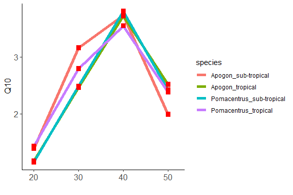<!-- -->


``` r
ldh.emm <- emmeans(ldh.sqrt.model.1.p2 %>% update(sqrt(LDH_ACTIVITY) ~ factor(temperature) * LATITUDE * LATIN_GENUS + (1|fish_id)), ~temperature|LATITUDE|LATIN_GENUS, 
                   at = list(temperature = seq(from =10, to =50, by =.1)), 
                   type = "response") 

ldh.emm.df <- ldh.emm %>% as.data.frame() %>%
  unite("species", c("LATIN_GENUS","LATITUDE"), sep = "-", remove = FALSE) %>% 
  group_by(species) %>%
  mutate("\u394 change"=response - lag(response, n=1, default = first(response)), 
         "\u394 %change" = response/lag(response, n=1, default = first(response))*100, 
         "Q10" =response/lag(response, n=1, default = first(response)), 
         test = as.numeric(temperature)*10) %>% 
  filter(temperature !="10") %>% 
  ungroup() 

ldh.obs <-  ldh.data %>% 
  mutate(Pred=predict(ldh.sqrt.model.1.p2, re.form=NA, type="response"),
         Resid = residuals(ldh.sqrt.model.1.p2),
         Fit = Pred + Resid, 
         Fit = Fit^2) %>%
   unite("species", c("LATIN_GENUS","LATITUDE"), sep = "-", remove = FALSE) %>% 
  group_by(fish_id) %>%
  mutate("\u394 change"=Fit - lag(Fit, n=1, default = first(Fit)), 
         "\u394 %change" = Fit/lag(Fit, n=1, default = first(Fit))*100, 
         "Q10" =Fit/lag(Fit, n=1, default = first(Fit))) %>% 
  filter(temperature !="10") %>% 
  ungroup() 

ggplot(ldh.emm.df, aes(y=Q10, x=temperature, linetype=species, color = species, fill=species))+
  geom_jitter(data=ldh.obs, 
              aes(y=Q10, color = species), 
              width=0.05, 
              alpha = 0.2, 
              size = 2) +
  stat_smooth(data=ldh.obs, 
              aes(y=Q10,x=temperature, color=species), 
              method="lm", 
              formula =y~poly(x,2))+
  scale_x_continuous(limits = c(19, 52), 
                     breaks = seq(20, 52, by = 10))+ 
  scale_y_continuous(limits = c(0,10), breaks = seq(0, 10, by = 1)) +
  theme_classic() + 
  ylab(expression("Q10 values")) + 
  xlab("Temperature")+
  scale_linetype_manual(values = c("solid", "dashed","solid", "dashed"), 
                        labels = c("Apogon doederlein","Apogon rubrimacula","Pomacentrus australis", "Pomacentrus moluccensis"))+
  scale_color_manual(values=c("#3F3525","#C65C1B",  "#07AFF2", "#EAAE00"), 
                        labels = c("Apogon doederlein","Apogon rubrimacula","Pomacentrus australis", "Pomacentrus moluccensis")) +
  scale_fill_manual(values=c("#3F3525","#C65C1B",  "#07AFF2", "#EAAE00"), 
                        labels = c("Apogon doederlein","Apogon rubrimacula","Pomacentrus australis", "Pomacentrus moluccensis")) + 
  theme(legend.position = "bottom", 
        legend.text = element_text(size = 10), 
        legend.title = element_blank(), 
        axis.title = element_text(size =12), 
        axis.text = element_text(size=10))
```

<!-- -->


## Arrhenius plot 

``` r
ldh.arrhenius.plot <- ggplot(ldh.emm.df, aes(y=log(response), x=1/(temperature+273.15), linetype=species, color = species, fill=species))+
  geom_jitter(data=ldh.obs, 
              aes(y=log(Fit^2), color = species), 
              #width=0.005, 
              alpha = 0.3, 
              size = 2) +
  stat_poly_line(method="lm", se = TRUE) + 
  stat_poly_eq(use_label(c("eq", "R2")), hjust = -1.6)+
  #geom_ribbon(aes(x=1/(temperature+273.15), 
              #ymin= log(asymp.LCL), ymax= log(asymp.UCL)),
              #alpha = 0.2, 
              #color=NA)+ 
  #scale_x_continuous(limits = c(9, 52), 
                     #breaks = seq(10, 52, by = 10))+ 
  #scale_y_continuous(limits = c(0,120), breaks = seq(0, 120, by = 20)) +
  theme_classic() + 
  ylab(expression("log(LDH (U mg "^{-1} * "tissue))")) + 
  xlab("")+
  scale_linetype_manual(values = c("solid", "dashed","solid", "dashed"), 
                        labels = c("Apogon doederlein","Apogon rubrimacula","Pomacentrus australis", "Pomacentrus moluccensis"))+
  scale_color_manual(values=c("#3F3525","#C65C1B",  "#07AFF2", "#EAAE00"), 
                        labels = c("Apogon doederlein","Apogon rubrimacula","Pomacentrus australis", "Pomacentrus moluccensis")) +
  scale_fill_manual(values=c("#3F3525","#C65C1B",  "#07AFF2", "#EAAE00"), 
                        labels = c("Apogon doederlein","Apogon rubrimacula","Pomacentrus australis", "Pomacentrus moluccensis")) + 
  theme(legend.position = "top", 
        legend.text = element_text(size = 10), 
        legend.title = element_blank(), 
        axis.title = element_text(size =12), 
        axis.text = element_text(size=10)); ldh.arrhenius.plot
```

```
## Warning in Ops.factor(temperature, 273.15): '+' not meaningful for factors
## Warning in Ops.factor(temperature, 273.15): '+' not meaningful for factors
```

```
## Warning: Removed 16 rows containing non-finite outside the scale range
## (`stat_poly_line()`).
```

```
## Warning: Removed 16 rows containing non-finite outside the scale range
## (`stat_poly_eq()`).
```

<!-- -->

# Citrate synthase (CS)

## Load data 


``` r
cs <- cs.import.data
```

## Data manipulation

``` r
#--- data preparation/manipulation ---# 
cs2 <- cs |>
  clean_names() |>
  separate(sample, into=c('tissue_type','species','replicate','temperature'), sep = "_", remove = FALSE) |>  
  separate(creation_time, into=c('DATE','TIME'), sep = " ", remove = FALSE) |>
  arrange(sample_id_1, DATE, TIME) 

cs3 <- cs2 |> 
  mutate(TIME = hms(cs2$TIME)) |>
  mutate(TIME = chron(times=cs2$TIME)) |>
  arrange(TIME) |>
  dplyr::group_by(sample, sample_id_1) |> 
  dplyr::mutate(TIME_DIFF = TIME - first(TIME)) |> 
  dplyr::filter(TIME != first(TIME)) |>
  dplyr::ungroup() |> 
  mutate(TIME_DIFF_SECS = period_to_seconds(hms(TIME_DIFF))) |> 
  mutate(MINUTES = TIME_DIFF_SECS/60) |> 
  mutate(MINUTES = round(MINUTES, digits = 2)) |> 
  dplyr::rename(CUVETTE = sample_id_1) |> 
  mutate(LATIN_NAME = case_when( species =="Adoed"~ "Apogon doederlein", 
                             species == "Arub" ~ "Apogon rubrimacula", 
                             species == "Paus" ~ "Pomacentrus australis",
                             species == "Pmol" ~ "Pomacentrus moluccensis",
                             TRUE ~ "na")) |> 
  unite("UNIQUE_SAMPLE_ID", c(species, replicate, temperature, sample_index), sep="_", remove = FALSE)
```

### Data cleaning 

Next select data points will be removed. Data points have been checked using previously written app script that allows the user to look at the plotted points of samples that were run. Because we are interested in the slope, points that plateaued were removed from the analysis, as it signifies that the reaction ran out of 'fuel' to use.

Note that later on the first data point will be removed from all samples. For example, if a run requires that the first 4 data points be removed, 3 will be removed below and then one will be removed at a later step. 


* **grp2**: removed first 2 data points which was causing a plateau
* **grp3**: removed first 3 data points which was causing a plateau
* **grp4**: removed first 4 data points which was causing a plateau
* **grp5**: removed first 5 data points which was causing a plateau


``` r
grp1 <- c("Arub_04_30_3","Paus_02_30_2","Pmol_01_20_3","Pmol_03_30_1","Pmol_03_30_3", 
          "Paus_08_10_2", "Paus_10_40_1", "Pmol_07_20_2","Pmol_09_10_1","Arub_06_30_3",
          "Pmol_10_20_1") 
grp2 <- c("Arub_04_30_3","Paus_02_30_1","Pmol_06_30_1","Pmol_10_10_1","Pmol_10_10_2", 
          "Pmol_03_20_2","Pmol_05_30_3","Adoed_09_20_3","Pmol_09_30_3")
grp3 <- c("Adoed_03_20_3","Pmol_03_30_2","Pmol_03_10_3","Pmol_03_10_1","Pmol_03_30_2") 
grp4 <- c("Arub_04_30_2","Arub_06_30_1","Adoed_05_20_2","Pmol_02_30_3","Pmol_03_10_1", 
          "Arub_06_30_1", "Adoed_05_20_2","Arub_02_20_1","Adoed_02_20_1") 
grp5 <- c("Pmol_01_20_2","Arub_02_20_3")  
grp6 <- c("Arub_06_30_2","Pmol_02_30_1","Pmol_09_20_1","Arub_06_30_2","Adoed_02_20_3") 
grp7 <- c("Arub_04_30_1","Pmol_03_10_2","Pmol04_20_1","Adoed_02_20_5") 
grp8 <- c("Pmol_02_30_2","Pmol_09_20_3","Pmol_06_20_2") 
grp9 <- c("Adoed_03_20_2","Pmol_03_40_3","Pmol_04_20_3") 
grp10 <- c() 
grp11 <- c("Pmol_04_20_1","Pmol_09_20_2","Pmol_04_20_5","Arub_02_20_2") 
data.grp1 <- c("Pmol_01_10_2") 
data.grp2 <- c("Pmol_05_20_3")
data.grp3 <- c("Pmol_07_20_3","Pmol_10_10_1")
data.grp4 <- c("Pmol_07_10_1") 
data.grp7 <- c("Pmol_05_30_3")
data.grp8 <- c("Adoed_05_50_5")
```


``` r
cs3.filtered <- cs3 |> 
  filter(!(UNIQUE_SAMPLE_ID %in% c(
                                   #--- Apogon rubrimacula ---#
                                   #"Arub_02_10_1", "Arub_02_10_2", "Arub_02_10_3", # control slope steep - fixed
                                   #"Arub_02_20_1", "Arub_02_20_2", "Arub_02_20_3", # slopes messy - fixed
                                   #"Arub_03_50_1", "Arub_03_50_2", "Arub_03_50_3", # control slope steep - fixed
                                   "Arub_04_10_1", "Arub_04_10_2", "Arub_04_10_3", # slopes messy - fixed
                                   "Arub_04_20_1", "Arub_04_20_2", "Arub_04_20_3", # slopes are all negative
                                   #"Arub_05_30_1", "Arub_05_30_2", "Arub_05_30_3", # control slope steep - fixed
                                   "Arub_06_20_1", "Arub_06_20_2", "Arub_06_20_3", # slopes all negative
                                   "Arub_10_30_3", 
                                   "Arub_01_50_1", "Arub_01_50_2", "Arub_01_50_3", # slopes look fine but are much shallower 
                                                                                   # than all other samples
                                   
                                   #--- Apogon doederlein ---# 
                                   "Adoed_09_10_1", 
                                   "Adoed_08_10_1", 
                                   "Adoed_08_20_3", 
                                   "Adoed_08_30_1", 
                                   "Adoed_06_10_1",
                                   "Adoed_02_20_2",
                                   
                                   #--- Pomacentrus australia ---#
                                   "Paus_02_10_2",  
                                   "Paus_02_20_1", "Paus_02_20_2", "Paus_02_20_3", 
                                   
                                   #--- Pomacentrus moluccensis  
                                   "Pmol_02_20_1", "Pmol_02_20_2", "Pmol_02_20_3", 
                                   "Pmol_03_20_1", "Pmol_03_20_3", "Pmol_03_20_2",
                                   "Pmol_04_20_2", 
                                   "Pmol_05_20_1", "Pmol_05_20_2",
                                   "Pmol_06_50_3",
                                   "Pmol_06_20_2", 
                                   "Pmol_04_10_2"
                                   ))) |>
  dplyr::group_by(UNIQUE_SAMPLE_ID) |> 
  dplyr::arrange(UNIQUE_SAMPLE_ID, TIME) |>
  dplyr::filter(!(UNIQUE_SAMPLE_ID %in% grp1 & row_number() <= 1)) |> 
  dplyr::filter(!(UNIQUE_SAMPLE_ID %in% grp2 & row_number() <= 2)) |> 
  dplyr::filter(!(UNIQUE_SAMPLE_ID %in% grp3 & row_number() <= 3)) |> 
  dplyr::filter(!(UNIQUE_SAMPLE_ID %in% grp4 & row_number() <= 4)) |> 
  dplyr::filter(!(UNIQUE_SAMPLE_ID %in% grp5 & row_number() <= 5)) |>
  dplyr::filter(!(UNIQUE_SAMPLE_ID %in% grp6 & row_number() <= 6)) |>
  dplyr::filter(!(UNIQUE_SAMPLE_ID %in% grp7 & row_number() <= 7)) |>
  dplyr::filter(!(UNIQUE_SAMPLE_ID %in% grp8 & row_number() <= 8)) |>
  dplyr::filter(!(UNIQUE_SAMPLE_ID %in% grp9 & row_number() <= 9)) |>
  dplyr::filter(!(UNIQUE_SAMPLE_ID %in% grp10 & row_number() <= 10)) |>
  dplyr::filter(!(UNIQUE_SAMPLE_ID %in% grp11 & row_number() <= 11)) |> 
  dplyr::filter(!(UNIQUE_SAMPLE_ID %in% data.grp1 & row_number() == 4)) |>
  dplyr::filter(!(UNIQUE_SAMPLE_ID %in% data.grp2 & between(row_number(), 7, 10))) |>
  dplyr::filter(!(UNIQUE_SAMPLE_ID %in% data.grp3 & row_number() == 4 )) |>
  dplyr::filter(!(UNIQUE_SAMPLE_ID %in% data.grp4 & row_number() == 10 )) |>
  dplyr::filter(!(UNIQUE_SAMPLE_ID %in% data.grp7 & between(row_number(), 9, 13))) |>
  dplyr::filter(!(UNIQUE_SAMPLE_ID %in% data.grp8 & between(row_number(), 15, 20))) |>
  dplyr::ungroup() |> 
  mutate(UNIQUE_SAMPLE_ID = str_sub(UNIQUE_SAMPLE_ID, end = -3))
```

Great! Now we have all the data points that we want to keep. However, the data needs to manipulated in a way that we can obtain and pull out slopes from the absorption readings, and the calculate enzyme activity based on these slopes. This will involve a number of steps.  

### Data calculations 

#### Step1: Extract slopes 

Step1 will produce a data frame that provides you with the slope that was obtained for cuvettes 1-3 for each sample run at each experimental temperature. Note that at the end of this step we are removing slopes that were positive in value, as LDH slopes should produce a negative slope, due to NADH being used up. 

``` r
CS_activity <- cs3.filtered %>% 
  group_by(UNIQUE_SAMPLE_ID, CUVETTE) %>% 
  do({
    mod = lm(result ~ MINUTES, data = .)
    data.frame(Intercept = coef(mod)[1],
               Slope = coef(mod)[2], 
               r2 = summary(mod)$adj.r.squared)
  }) %>%
  ungroup() %>%
  filter(CUVETTE != ("6"))%>% 
  filter(CUVETTE != ("4"))%>% 
  filter(CUVETTE != ("5")) %>% 
  filter(Slope >= 0)
```

#### Step2: Slope means

Step2 will calculate the mean slope for cuvette 1-3. 

``` r
CS_activity_means <- CS_activity %>% 
  dplyr::group_by(UNIQUE_SAMPLE_ID) %>% 
  mutate(Mean = mean(Slope)) %>% 
  dplyr::ungroup()
```

#### Step3: Background activity level

Step3 will calculate background activity level by measuring the slope from cuvette 5 (postive control)

``` r
CS_background <- cs3.filtered %>% 
  group_by(UNIQUE_SAMPLE_ID, CUVETTE) %>% 
  do({
    mod = lm(result ~ MINUTES, data = .)
    data.frame(Intercept = coef(mod)[1],
               Slope = coef(mod)[2], 
               r2 = summary(mod)$adj.r.squared)
  }) %>%
  ungroup() %>%
  filter(CUVETTE == ("5")) %>% 
  dplyr::rename(Background = Slope)  
```

#### Step4: Merging dataframes

Step4 will merge the data frames that you created with the mean slopes and the background slopes.

``` r
cs_final_table <- CS_activity %>% 
  full_join(distinct(CS_activity_means[,c(1,6)]), by = "UNIQUE_SAMPLE_ID") %>%
  full_join(CS_background[,c(1,4)], by = "UNIQUE_SAMPLE_ID") 
cs_final_table$Mean[duplicated(cs_final_table$Mean)] <- ""
cs_final_table$Background[duplicated(cs_final_table$Background)] <- ""
cs_final_table <- cs_final_table %>% 
  mutate(Mean = as.numeric(Mean), 
         Background = as.numeric(Background), 
         Background_perc = Background/Mean) %>% 
  drop_na(Mean) %>% 
  mutate(Background_perc = case_when(UNIQUE_SAMPLE_ID == "Adoed_03_40" ~ 0.0000, # ignore blank - QC
                                     UNIQUE_SAMPLE_ID == "Pmol_07_30" ~ 0.0000, 
                                     UNIQUE_SAMPLE_ID == "Arub_03_50" ~ 0.0000, 
                                     UNIQUE_SAMPLE_ID == "Paus_07_10" ~ 0.0000,
                                     UNIQUE_SAMPLE_ID == "Paus_02_10" ~ 0.0000,
                                     UNIQUE_SAMPLE_ID == "Adoed_06_10" ~ 0.0000,
                                     UNIQUE_SAMPLE_ID == "Arub_02_10" ~ 0.0000,
                                     TRUE ~ Background_perc))
```

#### Step5: Enzyme activity levels 

Step5 is where enzyme activity levels are calculated. See further details in manuscript (doi: xxx). Within this step background activity level is taken into account and subtracted from slopes where background activity was >5% or more of the sample slope. 

``` r
CS.data <- cs_final_table %>% 
  select(c(UNIQUE_SAMPLE_ID, Mean, Background, Background_perc)) %>% 
  mutate(Mean = as.numeric(Mean), 
         Background = as.numeric(Background), 
         Background_perc = as.numeric(Background_perc)) %>% 
  mutate(Background2 = case_when(Background_perc <= 0.05 ~ 0, 
                                 TRUE ~ Background), 
         CS_ABSORBANCE = Mean - Background2) %>%
  inner_join(select(cs3.filtered, c(UNIQUE_SAMPLE_ID, species, replicate, temperature, LATIN_NAME)), by ="UNIQUE_SAMPLE_ID") %>% 
  unite("fish_id", c(species,replicate), sep = "_", remove = FALSE) %>%
  inner_join(tissue.mass, by = "fish_id") %>% 
  mutate(TISSUE_MASS_CENTERED = scale(tissue_mass, center = TRUE, scale = FALSE)) %>%
  distinct(UNIQUE_SAMPLE_ID, .keep_all = TRUE) %>% 
  mutate(PATH_LENGTH = 1, 
         EXTINCTION_COEFFICIENT = 13.6, 
         TISSUE_CONCENTRATION = 0.01, 
         ASSAY_VOL = 0.930, 
         SAMPLE_VOL = 0.020, 
         CS_ACTIVITY = ((CS_ABSORBANCE/(PATH_LENGTH*EXTINCTION_COEFFICIENT*TISSUE_CONCENTRATION))*(ASSAY_VOL/SAMPLE_VOL)))   %>% 
  separate(LATIN_NAME, c("LATIN_GENUS","LATIN_SPECIES"), sep = " ", remove = FALSE) %>% 
  mutate(LATIN_GENUS = factor(LATIN_GENUS), 
         LATIN_SPECIES = factor(LATIN_SPECIES)) %>% 
  mutate(LATITUDE = factor(case_when(species =="Adoed"~ "sub-tropical", 
                             species == "Arub" ~ "tropical", 
                             species == "Paus" ~ "sub-tropical",
                             species == "Pmol" ~ "tropical",
                             TRUE ~ "na")), 
         temperature = as.numeric(temperature)) %>% 
  drop_na() %>% filter(CS_ACTIVITY >=0) |> 
  left_join(select(fish_mass, c("fish_id","standard_length","mass")), by="fish_id") |> 
  dplyr::rename(MASS = mass)
```


## Initial plot {.tabset}

### CS v TEMPERATURE [SPECIES]


``` r
ggplot(CS.data, aes(x =temperature, y= CS_ACTIVITY, color = species)) + 
  geom_point() + 
  stat_smooth(method = "lm", se=FALSE) + 
  theme_classic() 
```

<!-- -->

### CS [distribution]

``` r
ggplot(CS.data, aes(x = CS_ACTIVITY, fill = temperature, color = temperature)) + 
  geom_density(alpha =0.5, position = "identity") 
```

<!-- -->

``` r
ggplot(CS.data, aes(x=CS_ACTIVITY)) + geom_histogram()
```

<!-- -->

### CS v TEMPERATURE [LATITUDE]

``` r
ggplot(CS.data, aes(x =temperature, y= CS_ACTIVITY, colour = LATITUDE, fill=LATITUDE)) +   geom_point(alpha=0.3) + stat_smooth(method = "lm", se=TRUE,  formula=y ~ poly(x, 2, raw=TRUE), alpha=0.3) + facet_grid(~LATIN_GENUS) + theme_classic()
```

<!-- -->

### CS v TEMPERATURE [GENUS]

``` r
ggplot(CS.data, aes(x =temperature, y= CS_ACTIVITY, colour = LATIN_GENUS, fill=LATIN_GENUS)) +   geom_point(alpha=0.3) + stat_smooth(method = "lm", se=TRUE,  formula=y ~ poly(x, 2, raw=TRUE), alpha=0.3) + facet_grid(~LATITUDE) + theme_classic()
```

<!-- -->

### CS v TEMPERATURE [SPECIES]

``` r
ggplot(CS.data, aes(x =temperature, y= CS_ACTIVITY, colour = species, fill= species)) +   geom_point(alpha=0.3) + stat_smooth(method = "lm", se=TRUE,  formula=y ~ poly(x, 2, raw=TRUE), alpha=0.3) + theme_classic()
```

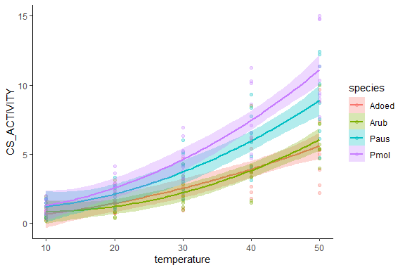<!-- -->

### CS v MASS [SPECIES]

``` r
ggplot(CS.data, aes(x =MASS, y= CS_ACTIVITY, colour = species, fill= species)) +   geom_point(alpha=0.3) + stat_smooth(method = "lm", se=TRUE, alpha=0.3) + theme_classic()
```

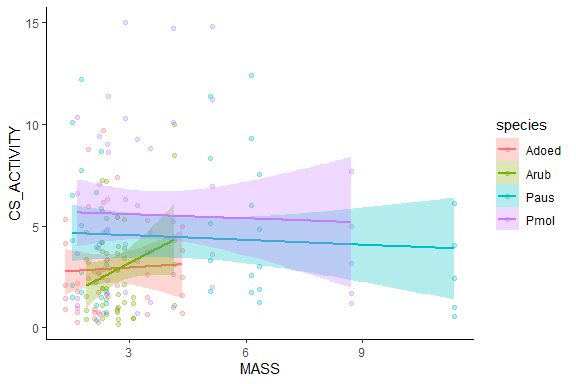<!-- -->

### {-} 

## Fit the model 

The model was fit using the **glm** and later **glmmTMB** package in R. A number of different models were tested to determine which hypothesis and associated variables best predicted resting oxygen consumption. Model fit was examined using AICc, BIC, and r-squared values. Additional model were examined via the validation diagnostics provided by the **performance** and **dHARMA** packages in R.

From out initial plots we can see that our data is heavily skewed to the right. From our initial plots we can all see that the relationship between enzyme activity and temperature is no linear, but rather may represent either a quadratic or cubic relationship. Let's start out model selection process by comparing different polynomial models.  

### polynomial models

``` r
#--- model 1 ---# 
cs.model.1 <- glm(CS_ACTIVITY ~ temperature * LATITUDE * LATIN_GENUS, 
               family = gaussian(),
               data = CS.data) 

cs.model.1.p2 <- glm(CS_ACTIVITY ~ poly(temperature, 2) * LATITUDE * LATIN_GENUS, 
               family = gaussian(),
               data = CS.data)  

cs.model.1.p3 <- glm(CS_ACTIVITY ~ poly(temperature, 3) * LATITUDE * LATIN_GENUS, 
               family = gaussian(),
               data = CS.data) 
```

#### model comparisons - polynomial models 

``` r
aic.c=AICc(cs.model.1, cs.model.1.p2, cs.model.1.p3, k=2) 
bic=BIC(cs.model.1, cs.model.1.p2, cs.model.1.p3)

model.fit.table <- as.data.frame(aic.c) %>% 
  tibble::rownames_to_column("model") %>%
  mutate(BIC = bic$BIC, 
         r2 = c(r.squaredLR(cs.model.1)[1], r.squaredLR(cs.model.1.p2)[1], r.squaredLR(cs.model.1.p3)[1]))
model.fit.table %>% knitr::kable(format = "html")  %>%
  kable_paper(full_width = TRUE) 
```

<table class=" lightable-paper" style='font-family: "Arial Narrow", arial, helvetica, sans-serif; margin-left: auto; margin-right: auto;'>
 <thead>
  <tr>
   <th style="text-align:left;"> model </th>
   <th style="text-align:right;"> df </th>
   <th style="text-align:right;"> AICc </th>
   <th style="text-align:right;"> BIC </th>
   <th style="text-align:right;"> r2 </th>
  </tr>
 </thead>
<tbody>
  <tr>
   <td style="text-align:left;"> cs.model.1 </td>
   <td style="text-align:right;"> 9 </td>
   <td style="text-align:right;"> 714.3911 </td>
   <td style="text-align:right;"> 742.1807 </td>
   <td style="text-align:right;"> 0.7464840 </td>
  </tr>
  <tr>
   <td style="text-align:left;"> cs.model.1.p2 </td>
   <td style="text-align:right;"> 13 </td>
   <td style="text-align:right;"> 703.7001 </td>
   <td style="text-align:right;"> 743.1855 </td>
   <td style="text-align:right;"> 0.7726310 </td>
  </tr>
  <tr>
   <td style="text-align:left;"> cs.model.1.p3 </td>
   <td style="text-align:right;"> 17 </td>
   <td style="text-align:right;"> 713.1551 </td>
   <td style="text-align:right;"> 763.8915 </td>
   <td style="text-align:right;"> 0.7727684 </td>
  </tr>
</tbody>
</table>

``` r
anova(cs.model.1, cs.model.1.p2, cs.model.1.p3, test = "Chisq")
```

<div data-pagedtable="false">
  <script data-pagedtable-source type="application/json">
{"columns":[{"label":[""],"name":["_rn_"],"type":[""],"align":["left"]},{"label":["Resid. Df"],"name":[1],"type":["dbl"],"align":["right"]},{"label":["Resid. Dev"],"name":[2],"type":["dbl"],"align":["right"]},{"label":["Df"],"name":[3],"type":["dbl"],"align":["right"]},{"label":["Deviance"],"name":[4],"type":["dbl"],"align":["right"]},{"label":["Pr(>Chi)"],"name":[5],"type":["dbl"],"align":["right"]}],"data":[{"1":"174","2":"486.2410","3":"NA","4":"NA","5":"NA","_rn_":"1"},{"1":"170","2":"436.0914","3":"4","4":"50.1495573","5":"0.0007507709","_rn_":"2"},{"1":"166","2":"435.8278","3":"4","4":"0.2636214","5":"0.9987811443","_rn_":"3"}],"options":{"columns":{"min":{},"max":[10]},"rows":{"min":[10],"max":[10]},"pages":{}}}
  </script>
</div>

Looks like the model where temperature is treated as a second order polynomial (quadratic model) is better than the and third order polynomial model. Lets see if adding the variable **tissue.mass** improves the model. 

### fixed factor comparisons

``` r
#--- model 1 ---# 
cs.model.1.p2 <- glm(CS_ACTIVITY ~ poly(temperature, 2) * LATITUDE * LATIN_GENUS, 
               family = gaussian(),
               data = CS.data)  

cs.model.1.p2b <- cs.model.1 %>% update(. ~ poly(temperature, 2) * LATITUDE * LATIN_GENUS + scale(tissue_mass))

cs.model.1.p2c <- cs.model.1 %>% update(. ~ poly(temperature, 2) * LATITUDE * LATIN_GENUS + scale(MASS))

cs.model.1.p2d <- cs.model.1 %>% update(. ~ poly(temperature, 2) * LATITUDE * LATIN_GENUS + scale(MASS)*scale(tissue_mass))
```

#### model comparisons - fixed factor comparisons 

``` r
aic.c=AICc(cs.model.1.p2, cs.model.1.p2b,cs.model.1.p2c, cs.model.1.p2d, k=3) 
bic=BIC(cs.model.1.p2, cs.model.1.p2b,cs.model.1.p2c, cs.model.1.p2d)

model.fit.table <- as.data.frame(aic.c) %>% 
  tibble::rownames_to_column("model") %>%
  mutate(BIC = bic$BIC, 
         r2 = c(r.squaredLR(cs.model.1.p2)[1], r.squaredLR(cs.model.1.p2b)[1],r.squaredLR(cs.model.1.p2c)[1], r.squaredLR(cs.model.1.p2d)[1]))
model.fit.table %>% knitr::kable(format = "html")  %>%
  kable_paper(full_width = TRUE) 
```

<table class=" lightable-paper" style='font-family: "Arial Narrow", arial, helvetica, sans-serif; margin-left: auto; margin-right: auto;'>
 <thead>
  <tr>
   <th style="text-align:left;"> model </th>
   <th style="text-align:right;"> df </th>
   <th style="text-align:right;"> AICc </th>
   <th style="text-align:right;"> BIC </th>
   <th style="text-align:right;"> r2 </th>
  </tr>
 </thead>
<tbody>
  <tr>
   <td style="text-align:left;"> cs.model.1.p2 </td>
   <td style="text-align:right;"> 13 </td>
   <td style="text-align:right;"> 717.7834 </td>
   <td style="text-align:right;"> 743.1855 </td>
   <td style="text-align:right;"> 0.7726310 </td>
  </tr>
  <tr>
   <td style="text-align:left;"> cs.model.1.p2b </td>
   <td style="text-align:right;"> 14 </td>
   <td style="text-align:right;"> 720.8812 </td>
   <td style="text-align:right;"> 747.9648 </td>
   <td style="text-align:right;"> 0.7731609 </td>
  </tr>
  <tr>
   <td style="text-align:left;"> cs.model.1.p2c </td>
   <td style="text-align:right;"> 14 </td>
   <td style="text-align:right;"> 721.1849 </td>
   <td style="text-align:right;"> 748.2685 </td>
   <td style="text-align:right;"> 0.7727821 </td>
  </tr>
  <tr>
   <td style="text-align:left;"> cs.model.1.p2d </td>
   <td style="text-align:right;"> 16 </td>
   <td style="text-align:right;"> 716.4543 </td>
   <td style="text-align:right;"> 746.7730 </td>
   <td style="text-align:right;"> 0.7871675 </td>
  </tr>
</tbody>
</table>

``` r
anova(cs.model.1.p2, cs.model.1.p2b,cs.model.1.p2, cs.model.1.p2b,cs.model.1.p2c, cs.model.1.p2d, test = "Chisq")
```

<div data-pagedtable="false">
  <script data-pagedtable-source type="application/json">
{"columns":[{"label":[""],"name":["_rn_"],"type":[""],"align":["left"]},{"label":["Resid. Df"],"name":[1],"type":["dbl"],"align":["right"]},{"label":["Resid. Dev"],"name":[2],"type":["dbl"],"align":["right"]},{"label":["Df"],"name":[3],"type":["dbl"],"align":["right"]},{"label":["Deviance"],"name":[4],"type":["dbl"],"align":["right"]},{"label":["Pr(>Chi)"],"name":[5],"type":["dbl"],"align":["right"]}],"data":[{"1":"170","2":"436.0914","3":"NA","4":"NA","5":"NA","_rn_":"1"},{"1":"169","2":"435.0749","3":"1","4":"1.0164670","5":"0.519020419","_rn_":"2"},{"1":"170","2":"436.0914","3":"-1","4":"-1.0164670","5":"0.519020419","_rn_":"3"},{"1":"169","2":"435.0749","3":"1","4":"1.0164670","5":"0.519020419","_rn_":"4"},{"1":"169","2":"435.8016","3":"0","4":"-0.7266286","5":"NA","_rn_":"5"},{"1":"167","2":"408.2104","3":"2","4":"27.5911329","5":"0.003539379","_rn_":"6"}],"options":{"columns":{"min":{},"max":[10]},"rows":{"min":[10],"max":[10]},"pages":{}}}
  </script>
</div>

The variable **TISSUE_MASS_CENTERED does not** improve the model nor is there any significant difference the models, therefore it will be left out of the model moving forward. 

Lastly, because tissue samples from the same fish were tested at multiple temperatures we need to include **fish_id** as a random factor. 

### Generalised linear mixed model (GLMM)

``` r
cs.model.1.p2 <- glmmTMB(CS_ACTIVITY ~ poly(temperature, 2) * LATITUDE * LATIN_GENUS + (1|fish_id), 
               family = gaussian(),
               REML = TRUE,
               data = CS.data) 
```

Great! Now lets check our model validations to see how the model is performing. 

## Model validation {.tabset}

### cs.model.1 [performance]


``` r
cs.model.1.p2 %>% check_model(detrend = FALSE)
```

<!-- -->

### cs.model.1 [DHARMa]


``` r
cs.model.1.p2 %>% simulateResiduals(plot=TRUE)
```

<!-- -->

```
Object of Class DHARMa with simulated residuals based on 250 simulations with refit = FALSE . See ?DHARMa::simulateResiduals for help. 
 
Scaled residual values: 0.504 0.488 0.42 0.588 0.428 0.372 0.3 0.144 0.068 0.004 0.348 0.344 0.344 0.192 0.124 0.708 0.628 0.872 0.952 0.392 ...
```

``` r
cs.model.1.p2 %>% DHARMa::testResiduals(plot=TRUE)
```

<!-- -->

```
$uniformity

	Asymptotic one-sample Kolmogorov-Smirnov test

data:  simulationOutput$scaledResiduals
D = 0.10075, p-value = 0.04971
alternative hypothesis: two-sided


$dispersion

	DHARMa nonparametric dispersion test via sd of residuals fitted vs.
	simulated

data:  simulationOutput
dispersion = 0.92835, p-value = 0.608
alternative hypothesis: two.sided


$outliers

	DHARMa outlier test based on exact binomial test with approximate
	expectations

data:  simulationOutput
outliers at both margin(s) = 0, observations = 182, p-value = 0.4114
alternative hypothesis: true probability of success is not equal to 0.007968127
95 percent confidence interval:
 0.00000000 0.02006454
sample estimates:
frequency of outliers (expected: 0.00796812749003984 ) 
                                                     0 
```

```
$uniformity

	Asymptotic one-sample Kolmogorov-Smirnov test

data:  simulationOutput$scaledResiduals
D = 0.10075, p-value = 0.04971
alternative hypothesis: two-sided


$dispersion

	DHARMa nonparametric dispersion test via sd of residuals fitted vs.
	simulated

data:  simulationOutput
dispersion = 0.92835, p-value = 0.608
alternative hypothesis: two.sided


$outliers

	DHARMa outlier test based on exact binomial test with approximate
	expectations

data:  simulationOutput
outliers at both margin(s) = 0, observations = 182, p-value = 0.4114
alternative hypothesis: true probability of success is not equal to 0.007968127
95 percent confidence interval:
 0.00000000 0.02006454
sample estimates:
frequency of outliers (expected: 0.00796812749003984 ) 
                                                     0 
```

### cs.model.1 [plot model]

``` r
par(mar=c(2,2,2,2))
cs.model.1.p2 %>% plot_model(type = "diag")
```

```
[[1]]
```

```

[[2]]
[[2]]$fish_id
```

```


[[3]]
```

```

[[4]]
```


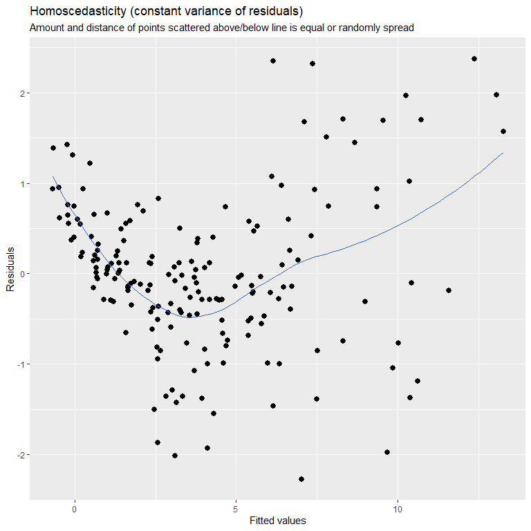

Issues that come up with the model are the KS test provided by the DHARMa checks and we also see some of the lower values drop off on the qq-plot provided by the 'check_model' function. Let's see if we can fix some of this issues by changing the link function within our distributions. 

### {-}

## Re-fitting model 

Turn **REML** off when comparing models

### re-fitting models [link functions]


``` r
cs.model.1.p2 <-  cs.model.1.p2 %>% update(REML = FALSE)
cs.model.1.p2.log <- cs.model.1.p2 %>% update(family=gaussian(link="log"), 
                                              REML=FALSE) 
cs.model.1.p2.sqrt <- cs.model.1.p2 %>% update(family=gaussian(link="sqrt"), 
                                               REML=FALSE) 
```

### re-fit model comparisons [link function]


``` r
aic.c=AICc(cs.model.1.p2, cs.model.1.p2.log, cs.model.1.p2.sqrt,  k=2) 
bic=BIC(cs.model.1.p2, cs.model.1.p2.log, cs.model.1.p2.sqrt)

model.fit.table <- as.data.frame(aic.c) %>% 
  tibble::rownames_to_column("model") %>%
  mutate(BIC = bic$BIC, 
         r2 = c(r.squaredGLMM(cs.model.1.p2)[1], r.squaredGLMM(cs.model.1.p2.log)[1], r.squaredGLMM(cs.model.1.p2.sqrt)[1]))
model.fit.table %>% knitr::kable(format = "html")  %>%
  kable_paper(full_width = TRUE) 
```

<table class=" lightable-paper" style='font-family: "Arial Narrow", arial, helvetica, sans-serif; margin-left: auto; margin-right: auto;'>
 <thead>
  <tr>
   <th style="text-align:left;"> model </th>
   <th style="text-align:right;"> df </th>
   <th style="text-align:right;"> AICc </th>
   <th style="text-align:right;"> BIC </th>
   <th style="text-align:right;"> r2 </th>
  </tr>
 </thead>
<tbody>
  <tr>
   <td style="text-align:left;"> cs.model.1.p2 </td>
   <td style="text-align:right;"> 14 </td>
   <td style="text-align:right;"> 607.6510 </td>
   <td style="text-align:right;"> 649.9922 </td>
   <td style="text-align:right;"> 0.7741510 </td>
  </tr>
  <tr>
   <td style="text-align:left;"> cs.model.1.p2.log </td>
   <td style="text-align:right;"> 14 </td>
   <td style="text-align:right;"> 389.0752 </td>
   <td style="text-align:right;"> 431.4163 </td>
   <td style="text-align:right;"> 0.6779776 </td>
  </tr>
  <tr>
   <td style="text-align:left;"> cs.model.1.p2.sqrt </td>
   <td style="text-align:right;"> 14 </td>
   <td style="text-align:right;"> 440.0186 </td>
   <td style="text-align:right;"> 482.3598 </td>
   <td style="text-align:right;"> 0.5844592 </td>
  </tr>
</tbody>
</table>

``` r
anova(cs.model.1.p2, cs.model.1.p2.log, cs.model.1.p2.sqrt, test = "Chisq")
```

<div data-pagedtable="false">
  <script data-pagedtable-source type="application/json">
{"columns":[{"label":[""],"name":["_rn_"],"type":[""],"align":["left"]},{"label":["Df"],"name":[1],"type":["dbl"],"align":["right"]},{"label":["AIC"],"name":[2],"type":["dbl"],"align":["right"]},{"label":["BIC"],"name":[3],"type":["dbl"],"align":["right"]},{"label":["logLik"],"name":[4],"type":["dbl"],"align":["right"]},{"label":["deviance"],"name":[5],"type":["dbl"],"align":["right"]},{"label":["Chisq"],"name":[6],"type":["dbl"],"align":["right"]},{"label":["Chi Df"],"name":[7],"type":["dbl"],"align":["right"]},{"label":["Pr(>Chisq)"],"name":[8],"type":["dbl"],"align":["right"]}],"data":[{"1":"14","2":"605.1361","3":"649.9922","4":"-288.5680","5":"577.1361","6":"NA","7":"NA","8":"NA","_rn_":"cs.model.1.p2"},{"1":"14","2":"386.5602","3":"431.4163","4":"-179.2801","5":"358.5602","6":"218.5758","7":"0","8":"0","_rn_":"cs.model.1.p2.log"},{"1":"14","2":"437.5037","3":"482.3598","4":"-204.7518","5":"409.5037","6":"0.0000","7":"0","8":"1","_rn_":"cs.model.1.p2.sqrt"}],"options":{"columns":{"min":{},"max":[10]},"rows":{"min":[10],"max":[10]},"pages":{}}}
  </script>
</div>

From this model comparison it looks like the model that uses the **log** link function helps improve our model. Lets see how the model validation looks. We will run the model one more time with **REML=TRUE** before looking at model validation outputs. 


``` r
cs.model.1.p2.log <- cs.model.1.p2.log %>% update(REML = TRUE)
```

## Model re-validation {.tabset}

### cs.model.1.p2.log [performance]


``` r
cs.model.1.p2.log %>% check_model(detrend=FALSE)
```

<!-- -->

### cs.model.1.p2.log [DHARMa]


``` r
cs.model.1.p2.log %>% simulateResiduals(plot=TRUE)
```

<!-- -->

```
## Object of Class DHARMa with simulated residuals based on 250 simulations with refit = FALSE . See ?DHARMa::simulateResiduals for help. 
##  
## Scaled residual values: 0.592 0.552 0.408 0.656 0.544 0.152 0.12 0.06 0.028 0.004 0.168 0.16 0.264 0.18 0.212 0.884 0.744 0.876 0.884 0.256 ...
```

``` r
cs.model.1.p2.log %>% DHARMa::testResiduals(plot=TRUE)
```

<!-- -->

```
## $uniformity
## 
## 	Asymptotic one-sample Kolmogorov-Smirnov test
## 
## data:  simulationOutput$scaledResiduals
## D = 0.036571, p-value = 0.968
## alternative hypothesis: two-sided
## 
## 
## $dispersion
## 
## 	DHARMa nonparametric dispersion test via sd of residuals fitted vs.
## 	simulated
## 
## data:  simulationOutput
## dispersion = 0.64366, p-value = 0.24
## alternative hypothesis: two.sided
## 
## 
## $outliers
## 
## 	DHARMa outlier test based on exact binomial test with approximate
## 	expectations
## 
## data:  simulationOutput
## outliers at both margin(s) = 0, observations = 182, p-value = 0.4114
## alternative hypothesis: true probability of success is not equal to 0.007968127
## 95 percent confidence interval:
##  0.00000000 0.02006454
## sample estimates:
## frequency of outliers (expected: 0.00796812749003984 ) 
##                                                      0
```

```
## $uniformity
## 
## 	Asymptotic one-sample Kolmogorov-Smirnov test
## 
## data:  simulationOutput$scaledResiduals
## D = 0.036571, p-value = 0.968
## alternative hypothesis: two-sided
## 
## 
## $dispersion
## 
## 	DHARMa nonparametric dispersion test via sd of residuals fitted vs.
## 	simulated
## 
## data:  simulationOutput
## dispersion = 0.64366, p-value = 0.24
## alternative hypothesis: two.sided
## 
## 
## $outliers
## 
## 	DHARMa outlier test based on exact binomial test with approximate
## 	expectations
## 
## data:  simulationOutput
## outliers at both margin(s) = 0, observations = 182, p-value = 0.4114
## alternative hypothesis: true probability of success is not equal to 0.007968127
## 95 percent confidence interval:
##  0.00000000 0.02006454
## sample estimates:
## frequency of outliers (expected: 0.00796812749003984 ) 
##                                                      0
```

### cs.model.1.p2.log [plot_model]

``` r
par(mar=c(2,2,2,2))
cs.model.1.p2.log %>% plot_model(type = "diag")
```

```
## [[1]]
```

```
## 
## [[2]]
## [[2]]$fish_id
```

```
## 
## 
## [[3]]
```

```
## 
## [[4]]
```


### {-}

Model looks much better, there are still some issues with qq plot output from the **plot_model** validations, but otherwise the model looks like it is performing really well. Considering how well the model is performing across most metrics, the current model is judged to be suitable.  

## Partial plots {.tabset} 

### ggemmeans {.tabset} 

#### TEMPERATURE V LATITUDE

<!-- -->

#### TEMPERATURE V GENUS

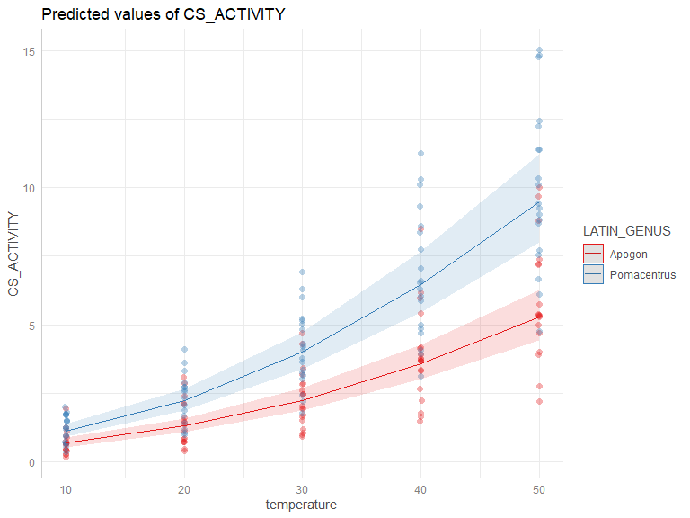<!-- -->

#### TEMPERATURE V GENUS V LATITUDE

<!-- -->

### plot_model 

<!-- -->

#### {-}

### {-}

## Model investigation {.tabset .tabset-pills}

### summary 
<table class=" lightable-paper" style='font-family: "Arial Narrow", arial, helvetica, sans-serif; margin-left: auto; margin-right: auto;'>
 <thead>
  <tr>
   <th style="text-align:left;">   </th>
   <th style="text-align:right;"> Estimate </th>
   <th style="text-align:right;"> StdError </th>
   <th style="text-align:right;"> Zvalue </th>
   <th style="text-align:right;"> Pvalue </th>
  </tr>
 </thead>
<tbody>
  <tr>
   <td style="text-align:left;"> (Intercept) </td>
   <td style="text-align:right;"> 0.7507362 </td>
   <td style="text-align:right;"> 0.1313872 </td>
   <td style="text-align:right;"> 5.7139242 </td>
   <td style="text-align:right;"> 0.0000000 </td>
  </tr>
  <tr>
   <td style="text-align:left;"> poly(temperature, 2)1 </td>
   <td style="text-align:right;"> 9.6046988 </td>
   <td style="text-align:right;"> 0.6535784 </td>
   <td style="text-align:right;"> 14.6955570 </td>
   <td style="text-align:right;"> 0.0000000 </td>
  </tr>
  <tr>
   <td style="text-align:left;"> poly(temperature, 2)2 </td>
   <td style="text-align:right;"> -1.0871289 </td>
   <td style="text-align:right;"> 0.4152698 </td>
   <td style="text-align:right;"> -2.6178855 </td>
   <td style="text-align:right;"> 0.0088476 </td>
  </tr>
  <tr>
   <td style="text-align:left;"> LATITUDEtropical </td>
   <td style="text-align:right;"> -0.0061190 </td>
   <td style="text-align:right;"> 0.1819203 </td>
   <td style="text-align:right;"> -0.0336357 </td>
   <td style="text-align:right;"> 0.9731677 </td>
  </tr>
  <tr>
   <td style="text-align:left;"> LATIN_GENUSPomacentrus </td>
   <td style="text-align:right;"> 0.4596453 </td>
   <td style="text-align:right;"> 0.1827212 </td>
   <td style="text-align:right;"> 2.5155550 </td>
   <td style="text-align:right;"> 0.0118845 </td>
  </tr>
  <tr>
   <td style="text-align:left;"> poly(temperature, 2)1:LATITUDEtropical </td>
   <td style="text-align:right;"> 0.1549469 </td>
   <td style="text-align:right;"> 0.9409852 </td>
   <td style="text-align:right;"> 0.1646645 </td>
   <td style="text-align:right;"> 0.8692081 </td>
  </tr>
  <tr>
   <td style="text-align:left;"> poly(temperature, 2)2:LATITUDEtropical </td>
   <td style="text-align:right;"> 0.3150039 </td>
   <td style="text-align:right;"> 0.5924501 </td>
   <td style="text-align:right;"> 0.5316969 </td>
   <td style="text-align:right;"> 0.5949359 </td>
  </tr>
  <tr>
   <td style="text-align:left;"> poly(temperature, 2)1:LATIN_GENUSPomacentrus </td>
   <td style="text-align:right;"> 0.0994462 </td>
   <td style="text-align:right;"> 0.7863904 </td>
   <td style="text-align:right;"> 0.1264591 </td>
   <td style="text-align:right;"> 0.8993685 </td>
  </tr>
  <tr>
   <td style="text-align:left;"> poly(temperature, 2)2:LATIN_GENUSPomacentrus </td>
   <td style="text-align:right;"> 0.1375369 </td>
   <td style="text-align:right;"> 0.5001330 </td>
   <td style="text-align:right;"> 0.2750007 </td>
   <td style="text-align:right;"> 0.7833157 </td>
  </tr>
  <tr>
   <td style="text-align:left;"> LATITUDEtropical:LATIN_GENUSPomacentrus </td>
   <td style="text-align:right;"> 0.1956962 </td>
   <td style="text-align:right;"> 0.2521914 </td>
   <td style="text-align:right;"> 0.7759830 </td>
   <td style="text-align:right;"> 0.4377590 </td>
  </tr>
  <tr>
   <td style="text-align:left;"> poly(temperature, 2)1:LATITUDEtropical:LATIN_GENUSPomacentrus </td>
   <td style="text-align:right;"> 0.7037262 </td>
   <td style="text-align:right;"> 1.1056236 </td>
   <td style="text-align:right;"> 0.6364971 </td>
   <td style="text-align:right;"> 0.5244525 </td>
  </tr>
  <tr>
   <td style="text-align:left;"> poly(temperature, 2)2:LATITUDEtropical:LATIN_GENUSPomacentrus </td>
   <td style="text-align:right;"> -0.6969364 </td>
   <td style="text-align:right;"> 0.6947175 </td>
   <td style="text-align:right;"> -1.0031940 </td>
   <td style="text-align:right;"> 0.3157673 </td>
  </tr>
</tbody>
</table>

### anova 
<table class=" lightable-paper" style='font-family: "Arial Narrow", arial, helvetica, sans-serif; margin-left: auto; margin-right: auto;'>
 <thead>
  <tr>
   <th style="text-align:left;">   </th>
   <th style="text-align:right;"> Chisq </th>
   <th style="text-align:right;"> Df </th>
   <th style="text-align:right;"> Pr(&gt;Chisq) </th>
  </tr>
 </thead>
<tbody>
  <tr>
   <td style="text-align:left;"> poly(temperature, 2) </td>
   <td style="text-align:right;"> 3725.6186697 </td>
   <td style="text-align:right;"> 2 </td>
   <td style="text-align:right;"> 0.0000000 </td>
  </tr>
  <tr>
   <td style="text-align:left;"> LATITUDE </td>
   <td style="text-align:right;"> 1.0911019 </td>
   <td style="text-align:right;"> 1 </td>
   <td style="text-align:right;"> 0.2962272 </td>
  </tr>
  <tr>
   <td style="text-align:left;"> LATIN_GENUS </td>
   <td style="text-align:right;"> 23.3299642 </td>
   <td style="text-align:right;"> 1 </td>
   <td style="text-align:right;"> 0.0000014 </td>
  </tr>
  <tr>
   <td style="text-align:left;"> poly(temperature, 2):LATITUDE </td>
   <td style="text-align:right;"> 2.4446914 </td>
   <td style="text-align:right;"> 2 </td>
   <td style="text-align:right;"> 0.2945385 </td>
  </tr>
  <tr>
   <td style="text-align:left;"> poly(temperature, 2):LATIN_GENUS </td>
   <td style="text-align:right;"> 0.6891154 </td>
   <td style="text-align:right;"> 2 </td>
   <td style="text-align:right;"> 0.7085337 </td>
  </tr>
  <tr>
   <td style="text-align:left;"> LATITUDE:LATIN_GENUS </td>
   <td style="text-align:right;"> 0.8533724 </td>
   <td style="text-align:right;"> 1 </td>
   <td style="text-align:right;"> 0.3556001 </td>
  </tr>
  <tr>
   <td style="text-align:left;"> poly(temperature, 2):LATITUDE:LATIN_GENUS </td>
   <td style="text-align:right;"> 1.0929122 </td>
   <td style="text-align:right;"> 2 </td>
   <td style="text-align:right;"> 0.5789981 </td>
  </tr>
</tbody>
</table>

### confint 
<table class=" lightable-paper" style='font-family: "Arial Narrow", arial, helvetica, sans-serif; margin-left: auto; margin-right: auto;'>
 <thead>
  <tr>
   <th style="text-align:left;">   </th>
   <th style="text-align:right;"> 2.5 % </th>
   <th style="text-align:right;"> 97.5 % </th>
   <th style="text-align:right;"> Estimate </th>
  </tr>
 </thead>
<tbody>
  <tr>
   <td style="text-align:left;"> (Intercept) </td>
   <td style="text-align:right;"> 0.4932222 </td>
   <td style="text-align:right;"> 1.0082503 </td>
   <td style="text-align:right;"> 0.7507362 </td>
  </tr>
  <tr>
   <td style="text-align:left;"> poly(temperature, 2)1 </td>
   <td style="text-align:right;"> 8.3237087 </td>
   <td style="text-align:right;"> 10.8856890 </td>
   <td style="text-align:right;"> 9.6046988 </td>
  </tr>
  <tr>
   <td style="text-align:left;"> poly(temperature, 2)2 </td>
   <td style="text-align:right;"> -1.9010428 </td>
   <td style="text-align:right;"> -0.2732150 </td>
   <td style="text-align:right;"> -1.0871289 </td>
  </tr>
  <tr>
   <td style="text-align:left;"> LATITUDEtropical </td>
   <td style="text-align:right;"> -0.3626762 </td>
   <td style="text-align:right;"> 0.3504382 </td>
   <td style="text-align:right;"> -0.0061190 </td>
  </tr>
  <tr>
   <td style="text-align:left;"> LATIN_GENUSPomacentrus </td>
   <td style="text-align:right;"> 0.1015183 </td>
   <td style="text-align:right;"> 0.8177723 </td>
   <td style="text-align:right;"> 0.4596453 </td>
  </tr>
  <tr>
   <td style="text-align:left;"> poly(temperature, 2)1:LATITUDEtropical </td>
   <td style="text-align:right;"> -1.6893503 </td>
   <td style="text-align:right;"> 1.9992440 </td>
   <td style="text-align:right;"> 0.1549469 </td>
  </tr>
  <tr>
   <td style="text-align:left;"> poly(temperature, 2)2:LATITUDEtropical </td>
   <td style="text-align:right;"> -0.8461769 </td>
   <td style="text-align:right;"> 1.4761847 </td>
   <td style="text-align:right;"> 0.3150039 </td>
  </tr>
  <tr>
   <td style="text-align:left;"> poly(temperature, 2)1:LATIN_GENUSPomacentrus </td>
   <td style="text-align:right;"> -1.4418507 </td>
   <td style="text-align:right;"> 1.6407432 </td>
   <td style="text-align:right;"> 0.0994462 </td>
  </tr>
  <tr>
   <td style="text-align:left;"> poly(temperature, 2)2:LATIN_GENUSPomacentrus </td>
   <td style="text-align:right;"> -0.8427057 </td>
   <td style="text-align:right;"> 1.1177796 </td>
   <td style="text-align:right;"> 0.1375369 </td>
  </tr>
  <tr>
   <td style="text-align:left;"> LATITUDEtropical:LATIN_GENUSPomacentrus </td>
   <td style="text-align:right;"> -0.2985898 </td>
   <td style="text-align:right;"> 0.6899823 </td>
   <td style="text-align:right;"> 0.1956962 </td>
  </tr>
  <tr>
   <td style="text-align:left;"> poly(temperature, 2)1:LATITUDEtropical:LATIN_GENUSPomacentrus </td>
   <td style="text-align:right;"> -1.4632562 </td>
   <td style="text-align:right;"> 2.8707086 </td>
   <td style="text-align:right;"> 0.7037262 </td>
  </tr>
  <tr>
   <td style="text-align:left;"> poly(temperature, 2)2:LATITUDEtropical:LATIN_GENUSPomacentrus </td>
   <td style="text-align:right;"> -2.0585576 </td>
   <td style="text-align:right;"> 0.6646848 </td>
   <td style="text-align:right;"> -0.6969364 </td>
  </tr>
  <tr>
   <td style="text-align:left;"> Std.Dev.(Intercept)|fish_id </td>
   <td style="text-align:right;"> 0.2888804 </td>
   <td style="text-align:right;"> 0.4769337 </td>
   <td style="text-align:right;"> 0.3711830 </td>
  </tr>
</tbody>
</table>

### r-squared
<table class=" lightable-paper" style='font-family: "Arial Narrow", arial, helvetica, sans-serif; margin-left: auto; margin-right: auto;'>
 <thead>
  <tr>
   <th style="text-align:right;"> R2_conditional </th>
   <th style="text-align:right;"> R2_marginal </th>
   <th style="text-align:left;"> optional </th>
  </tr>
 </thead>
<tbody>
  <tr>
   <td style="text-align:right;"> 0.8029761 </td>
   <td style="text-align:right;"> 0.6594422 </td>
   <td style="text-align:left;"> FALSE </td>
  </tr>
</tbody>
</table>

### {-} 

## Pairwise comparisons {.tabset .tabset-faded} 

### emtrends 


``` r
cs.model.1.p2.log %>% emtrends(var = "temperature", type = "response") %>% pairs(by = "temperature") %>% summary(by = NULL, adjust = "sidak", infer=TRUE)
```
SCROLL TO THE RIGHT -->

The numbers in the left most column in the table just mention that the slopes are assuming mean **MASS_CENTERED** and **RESTING_TIME_SEONDS** values when looking at differences between latitudinal slopes.

### emmeans 

``` r
cs.model.1.p2.log %>% emmeans(pairwise ~ temperature*LATITUDE*LATIN_GENUS, type = "response") %>% regrid() %>% pairs(by = "temperature") %>% summary(by = NULL, adjust = "sidak", infer=TRUE)
```

### temperature 

``` r
cs.model.1.p2.log %>% emmeans(~ temperature*LATITUDE*LATIN_GENUS, type = "response")  %>% summary(infer=TRUE)
```

<div data-pagedtable="false">
  <script data-pagedtable-source type="application/json">
{"columns":[{"label":[""],"name":["_rn_"],"type":[""],"align":["left"]},{"label":["temperature"],"name":[1],"type":["dbl"],"align":["right"]},{"label":["LATITUDE"],"name":[2],"type":["fct"],"align":["left"]},{"label":["LATIN_GENUS"],"name":[3],"type":["fct"],"align":["left"]},{"label":["response"],"name":[4],"type":["dbl"],"align":["right"]},{"label":["SE"],"name":[5],"type":["dbl"],"align":["right"]},{"label":["df"],"name":[6],"type":["dbl"],"align":["right"]},{"label":["lower.CL"],"name":[7],"type":["dbl"],"align":["right"]},{"label":["upper.CL"],"name":[8],"type":["dbl"],"align":["right"]},{"label":["null"],"name":[9],"type":["dbl"],"align":["right"]},{"label":["t.ratio"],"name":[10],"type":["dbl"],"align":["right"]},{"label":["p.value"],"name":[11],"type":["dbl"],"align":["right"]}],"data":[{"1":"30.38462","2":"sub-tropical","3":"Apogon","4":"2.330801","5":"0.3020859","6":"180","7":"1.804836","8":"3.010044","9":"1","10":"6.529112","11":"6.534293e-10","_rn_":"1"},{"1":"30.38462","2":"tropical","3":"Apogon","4":"2.253373","5":"0.2779806","6":"180","7":"1.766511","8":"2.874417","9":"1","10":"6.585725","11":"4.810514e-10","_rn_":"2"},{"1":"30.38462","2":"sub-tropical","3":"Pomacentrus","4":"3.646539","5":"0.4601571","6":"180","7":"2.842762","8":"4.677579","9":"1","10":"10.252614","11":"1.020826e-19","_rn_":"3"},{"1":"30.38462","2":"tropical","3":"Pomacentrus","4":"4.558066","5":"0.5420527","6":"180","7":"3.604700","8":"5.763577","9":"1","10":"12.755444","11":"5.820549e-27","_rn_":"4"}],"options":{"columns":{"min":{},"max":[10]},"rows":{"min":[10],"max":[10]},"pages":{}}}
  </script>
</div>

### temperture [combined]

``` r
cs.means.temp <- cs.model.1.p2.log %>% update(CS_ACTIVITY ~ factor(temperature) * LATITUDE * LATIN_GENUS + (1|fish_id)) %>% emmeans(pairwise ~ temperature, type = "response") %>% summary(infer=TRUE)
```

```
## NOTE: Results may be misleading due to involvement in interactions
```

``` r
cs.means.temp.df <- cs.means.temp$emmeans %>% as.data.frame() %>% 
  mutate("\u394 change"=response - lag(response, n=1, default = first(response)), 
         "\u394 %change" = response/lag(response, n=1, default = first(response))*100) 
cs.means.temp.df[1,11] = 0.0000 


cs.means.temp.df  
```

<div data-pagedtable="false">
  <script data-pagedtable-source type="application/json">
{"columns":[{"label":[""],"name":["_rn_"],"type":[""],"align":["left"]},{"label":["temperature"],"name":[1],"type":["dbl"],"align":["right"]},{"label":["response"],"name":[2],"type":["dbl"],"align":["right"]},{"label":["SE"],"name":[3],"type":["dbl"],"align":["right"]},{"label":["df"],"name":[4],"type":["dbl"],"align":["right"]},{"label":["lower.CL"],"name":[5],"type":["dbl"],"align":["right"]},{"label":["upper.CL"],"name":[6],"type":["dbl"],"align":["right"]},{"label":["null"],"name":[7],"type":["dbl"],"align":["right"]},{"label":["t.ratio"],"name":[8],"type":["dbl"],"align":["right"]},{"label":["p.value"],"name":[9],"type":["dbl"],"align":["right"]},{"label":[" change"],"name":[10],"type":["dbl"],"align":["right"]},{"label":[" %change"],"name":[11],"type":["dbl"],"align":["right"]}],"data":[{"1":"10","2":"0.8762697","3":"0.09132711","4":"180","5":"0.7133832","6":"1.076348","7":"1","8":"-1.267300","9":"2.066850e-01","10":"0.0000000","11":"0.0000","_rn_":"1"},{"1":"20","2":"1.7278548","3":"0.12623099","4":"180","5":"1.4958930","6":"1.995786","7":"1","8":"7.485724","9":"3.055433e-12","10":"0.8515851","11":"197.1830","_rn_":"2"},{"1":"30","2":"2.9283725","3":"0.19042896","4":"180","5":"2.5757215","6":"3.329306","7":"1","8":"16.522594","9":"6.428830e-38","10":"1.2005177","11":"169.4802","_rn_":"3"},{"1":"40","2":"4.8575145","3":"0.30265922","4":"180","5":"4.2955515","6":"5.492996","7":"1","8":"25.366590","9":"2.472356e-61","10":"1.9291420","11":"165.8776","_rn_":"4"},{"1":"50","2":"7.0527346","3":"0.43425538","4":"180","5":"6.2458574","6":"7.963849","7":"1","8":"31.725388","9":"1.257250e-75","10":"2.1952201","11":"145.1923","_rn_":"5"}],"options":{"columns":{"min":{},"max":[10]},"rows":{"min":[10],"max":[10]},"pages":{}}}
  </script>
</div>

### Genus values [combined]

``` r
cs.genus.df <- cs.model.1.p2.log %>% update(CS_ACTIVITY ~ factor(temperature) * LATITUDE * LATIN_GENUS + (1|fish_id)) %>% emmeans(pairwise ~ temperature*LATIN_GENUS, type = "response"); cs.genus.df$emmeans
```

```
## NOTE: Results may be misleading due to involvement in interactions
```

```
##  temperature LATIN_GENUS response    SE  df lower.CL upper.CL
##           10 Apogon         0.641 0.111 180    0.455    0.904
##           20 Apogon         1.382 0.151 180    1.114    1.714
##           30 Apogon         2.157 0.205 180    1.788    2.602
##           40 Apogon         3.629 0.325 180    3.041    4.329
##           50 Apogon         5.261 0.463 180    4.422    6.259
##           10 Pomacentrus    1.198 0.138 180    0.954    1.503
##           20 Pomacentrus    2.160 0.210 180    1.783    2.617
##           30 Pomacentrus    3.976 0.352 180    3.338    4.736
##           40 Pomacentrus    6.503 0.564 180    5.480    7.716
##           50 Pomacentrus    9.455 0.814 180    7.977   11.206
## 
## Results are averaged over the levels of: LATITUDE 
## Confidence level used: 0.95 
## Intervals are back-transformed from the log scale
```

### Genus ratios [combined]

``` r
cs.model.1.p2.log %>% update(CS_ACTIVITY ~ factor(temperature) * LATITUDE * LATIN_GENUS + (1|fish_id)) %>% emmeans(pairwise ~ temperature*LATIN_GENUS, type = "response") %>% pairs(by="temperature") %>% summary(infer=FALSE)
```

```
## NOTE: Results may be misleading due to involvement in interactions
```

<div data-pagedtable="false">
  <script data-pagedtable-source type="application/json">
{"columns":[{"label":[""],"name":["_rn_"],"type":[""],"align":["left"]},{"label":["contrast"],"name":[1],"type":["fct"],"align":["left"]},{"label":["temperature"],"name":[2],"type":["fct"],"align":["left"]},{"label":["ratio"],"name":[3],"type":["dbl"],"align":["right"]},{"label":["SE"],"name":[4],"type":["dbl"],"align":["right"]},{"label":["df"],"name":[5],"type":["dbl"],"align":["right"]}],"data":[{"1":"Apogon / Pomacentrus","2":"10","3":"0.5353836","4":"0.11158857","5":"180","_rn_":"1"},{"1":"Apogon / Pomacentrus","2":"20","3":"0.6397825","4":"0.09346465","5":"180","_rn_":"2"},{"1":"Apogon / Pomacentrus","2":"30","3":"0.5424471","4":"0.07053381","5":"180","_rn_":"3"},{"1":"Apogon / Pomacentrus","2":"40","3":"0.5580233","4":"0.06952101","5":"180","_rn_":"4"},{"1":"Apogon / Pomacentrus","2":"50","3":"0.5564266","4":"0.06850081","5":"180","_rn_":"5"}],"options":{"columns":{"min":{},"max":[10]},"rows":{"min":[10],"max":[10]},"pages":{}}}
  </script>
</div>

### Genus differences [combined]

``` r
cs.model.1.p2.log %>% update(CS_ACTIVITY ~ factor(temperature) * LATITUDE * LATIN_GENUS + (1|fish_id)) %>% emmeans(pairwise ~ temperature*LATIN_GENUS, type = "response") %>% regrid() %>% pairs(by="temperature") %>% summary(infer=FALSE)
```

```
## NOTE: Results may be misleading due to involvement in interactions
```

<div data-pagedtable="false">
  <script data-pagedtable-source type="application/json">
{"columns":[{"label":[""],"name":["_rn_"],"type":[""],"align":["left"]},{"label":["contrast"],"name":[1],"type":["fct"],"align":["left"]},{"label":["temperature"],"name":[2],"type":["dbl"],"align":["right"]},{"label":["estimate"],"name":[3],"type":["dbl"],"align":["right"]},{"label":["SE"],"name":[4],"type":["dbl"],"align":["right"]},{"label":["df"],"name":[5],"type":["dbl"],"align":["right"]}],"data":[{"1":"Apogon - Pomacentrus","2":"10","3":"-0.5564162","4":"0.1771732","5":"180","_rn_":"1"},{"1":"Apogon - Pomacentrus","2":"20","3":"-0.7781365","4":"0.2584167","5":"180","_rn_":"2"},{"1":"Apogon - Pomacentrus","2":"30","3":"-1.8192356","4":"0.4078255","5":"180","_rn_":"3"},{"1":"Apogon - Pomacentrus","2":"40","3":"-2.8740038","4":"0.6506699","5":"180","_rn_":"4"},{"1":"Apogon - Pomacentrus","2":"50","3":"-4.1939095","4":"0.9364957","5":"180","_rn_":"5"}],"options":{"columns":{"min":{},"max":[10]},"rows":{"min":[10],"max":[10]},"pages":{}}}
  </script>
</div>

### Means - f(temperature)

``` r
cs.means <- cs.model.1.p2.log %>% update(CS_ACTIVITY ~ factor(temperature) * LATITUDE * LATIN_GENUS + (1|fish_id)) %>% emmeans(pairwise ~ temperature*LATIN_GENUS*LATITUDE, type = "response"); cs.means$emmeans
```

### Abs. diff - f(temperature)

``` r
cs.model.1.p2.log %>% update(CS_ACTIVITY ~ factor(temperature) * LATITUDE * LATIN_GENUS + (1|fish_id)) %>% emmeans(pairwise ~ temperature*LATIN_GENUS*LATITUDE, type = "response") %>% regrid() %>% pairs(by =c("LATIN_GENUS","LATITUDE")) %>% summary(infer=FALSE, type = "response")
```

### Genus comparisons

``` r
cs.model.1.p2.log %>% update(CS_ACTIVITY ~ factor(temperature) * LATITUDE * LATIN_GENUS + (1|fish_id)) %>% emmeans(pairwise ~ temperature*LATIN_GENUS*LATITUDE, type = "response") %>% regrid() %>% pairs(by =c("LATIN_GENUS")) %>% summary(infer=TRUE, type = "response")
```

### effect size

``` r
cs.emm <- cs.model.1.p2.log %>% emmeans(~temperature*LATITUDE*LATIN_GENUS)
eff_size(cs.emm, sigma = sigma(cs.model.1.p2.log), edf=df.residual(cs.model.1.p2.log))
```

### {-}

## Summary figure 


``` r
cs.emm <- emmeans(cs.model.1.p2.log, ~temperature|LATITUDE|LATIN_GENUS, 
                   at = list(temperature = seq(from =10, to =50, by =.1)), 
                   type = "response") 

cs.emm.df <- cs.emm %>% as.data.frame() %>%
  unite("species", c("LATIN_GENUS","LATITUDE"), sep = "-", remove = FALSE) 

cs.obs <-  CS.data %>% 
  mutate(Pred=exp(predict(cs.model.1.p2.log, re.form=NA)),
         Resid = residuals(cs.model.1.p2.log,  type="response"),
         Fit = Pred + Resid) %>%
   unite("species", c("LATIN_GENUS","LATITUDE"), sep = "-", remove = FALSE) 


cs.plot <- ggplot(cs.emm.df, aes(y=response, x=temperature, linetype=species, color = species, fill=species))+
  geom_jitter(data=cs.obs, 
              aes(y=Fit, color = species), 
              width=0.05, 
              alpha = 0.3, 
              size = 2) +
  geom_line(linewidth =1) + 
  geom_ribbon(aes(x=temperature, 
              ymin= lower.CL, ymax= upper.CL),
              alpha = 0.2, 
              color=NA)+ 
  #scale_x_continuous(limits = c(9, 52), 
                     #breaks = seq(10, 52, by = 10))+ 
  #scale_y_continuous(limits = c(0,16), breaks = seq(0, 16, by = 2)) +
  theme_classic() + 
  ylab(expression("CS ACTIVITY (U mg "^{-1} * "tissue)")) + 
  xlab("")+
  scale_linetype_manual(values = c("solid", "dashed","solid", "dashed"), 
                        labels = c("Apogon doederlein","Apogon rubrimacula","Pomacentrus australis", "Pomacentrus moluccensis"))+
  scale_color_manual(values=c("#3F3525","#C65C1B",  "#07AFF2", "#EAAE00"), 
                        labels = c("Apogon doederlein","Apogon rubrimacula","Pomacentrus australis", "Pomacentrus moluccensis")) +
  scale_fill_manual(values=c("#3F3525","#C65C1B",  "#07AFF2", "#EAAE00"), 
                        labels = c("Apogon doederlein","Apogon rubrimacula","Pomacentrus australis", "Pomacentrus moluccensis")) +  
  theme(legend.position = "top", 
        legend.text = element_text(size = 10), 
        legend.title = element_blank(), 
        axis.title = element_text(size =12), 
        axis.text = element_text(size=10)); cs.plot
```

<!-- -->

## Q10 analysis 

Q10 analysis analysis the data using the following formula Q10 = (k2/k2)^10/(T2-T1). Because our temperature intervals are 10 C, therefore, there is no need apply ^1. 

``` r
cs.means.temp <- cs.model.1.p2.log %>% update(CS_ACTIVITY ~ factor(temperature) * LATITUDE * LATIN_GENUS + (1|fish_id)) %>% emmeans(pairwise ~ LATIN_GENUS*LATITUDE*temperature, type = "response")

cs.means.temp.df <- cs.means.temp$emmeans %>% as.data.frame() %>% 
  group_by(LATIN_GENUS,LATITUDE) %>%
  mutate("\u394 change"=response - lag(response, n=1, default = first(response)), 
         "\u394 %change" = response/lag(response, n=1, default = first(response))*100, 
         "Q10" =response/lag(response, n=1, default = first(response))) %>% 
  filter(temperature !="10") %>% 
  unite("species", c("LATIN_GENUS","LATITUDE"), remove=FALSE) %>% 
  ungroup()
cs.means.temp.df
```

<div data-pagedtable="false">
  <script data-pagedtable-source type="application/json">
{"columns":[{"label":["species"],"name":[1],"type":["chr"],"align":["left"]},{"label":["LATIN_GENUS"],"name":[2],"type":["fct"],"align":["left"]},{"label":["LATITUDE"],"name":[3],"type":["fct"],"align":["left"]},{"label":["temperature"],"name":[4],"type":["dbl"],"align":["right"]},{"label":["response"],"name":[5],"type":["dbl"],"align":["right"]},{"label":["SE"],"name":[6],"type":["dbl"],"align":["right"]},{"label":["df"],"name":[7],"type":["dbl"],"align":["right"]},{"label":["lower.CL"],"name":[8],"type":["dbl"],"align":["right"]},{"label":["upper.CL"],"name":[9],"type":["dbl"],"align":["right"]},{"label":[" change"],"name":[10],"type":["dbl"],"align":["right"]},{"label":[" %change"],"name":[11],"type":["dbl"],"align":["right"]},{"label":["Q10"],"name":[12],"type":["dbl"],"align":["right"]}],"data":[{"1":"Apogon_sub-tropical","2":"Apogon","3":"sub-tropical","4":"20","5":"1.458636","6":"0.2200739","7":"180","8":"1.0830565","9":"1.964457","10":"0.8947382","11":"258.6704","12":"2.586704"},{"1":"Pomacentrus_sub-tropical","2":"Pomacentrus","3":"sub-tropical","4":"20","5":"1.890698","6":"0.2726109","7":"180","8":"1.4225274","9":"2.512949","10":"0.6938362","11":"157.9713","12":"1.579713"},{"1":"Apogon_tropical","2":"Apogon","3":"tropical","4":"20","5":"1.309484","6":"0.2063784","7":"180","8":"0.9594894","9":"1.787146","10":"0.5804617","11":"179.6220","12":"1.796220"},{"1":"Pomacentrus_tropical","2":"Pomacentrus","3":"tropical","4":"20","5":"2.468084","6":"0.3215048","7":"180","8":"1.9086560","9":"3.191481","10":"1.2697813","11":"205.9650","12":"2.059650"},{"1":"Apogon_sub-tropical","2":"Apogon","3":"sub-tropical","4":"30","5":"2.216212","6":"0.3033301","7":"180","8":"1.6916863","9":"2.903372","10":"0.7575763","11":"151.9373","12":"1.519373"},{"1":"Pomacentrus_sub-tropical","2":"Pomacentrus","3":"sub-tropical","4":"30","5":"3.646159","6":"0.4713327","7":"180","8":"2.8252532","9":"4.705586","10":"1.7554606","11":"192.8472","12":"1.928472"},{"1":"Apogon_tropical","2":"Apogon","3":"tropical","4":"30","5":"2.098934","6":"0.2772493","7":"180","8":"1.6173426","9":"2.723927","10":"0.7894503","11":"160.2871","12":"1.602871"},{"1":"Pomacentrus_tropical","2":"Pomacentrus","3":"tropical","4":"30","5":"4.335705","6":"0.5261628","7":"180","8":"3.4124184","9":"5.508802","10":"1.8676208","11":"175.6709","12":"1.756709"},{"1":"Apogon_sub-tropical","2":"Apogon","3":"sub-tropical","4":"40","5":"3.615027","6":"0.4689156","7":"180","8":"2.7986744","9":"4.669504","10":"1.3988152","11":"163.1174","12":"1.631174"},{"1":"Pomacentrus_sub-tropical","2":"Pomacentrus","3":"sub-tropical","4":"40","5":"5.703150","6":"0.7202780","7":"180","8":"4.4451335","9":"7.317197","10":"2.0569913","11":"156.4153","12":"1.564153"},{"1":"Apogon_tropical","2":"Apogon","3":"tropical","4":"40","5":"3.642243","6":"0.4484243","7":"180","8":"2.8566807","9":"4.643829","10":"1.5433096","11":"173.5283","12":"1.735283"},{"1":"Pomacentrus_tropical","2":"Pomacentrus","3":"tropical","4":"40","5":"7.414145","6":"0.8816536","7":"180","8":"5.8634775","9":"9.374906","10":"3.0784407","11":"171.0021","12":"1.710021"},{"1":"Apogon_sub-tropical","2":"Apogon","3":"sub-tropical","4":"50","5":"5.176279","6":"0.6588927","7":"180","8":"4.0265596","9":"6.654282","10":"1.5612518","11":"143.1878","12":"1.431878"},{"1":"Pomacentrus_sub-tropical","2":"Pomacentrus","3":"sub-tropical","4":"50","5":"8.374256","6":"1.0484178","7":"180","8":"6.5412150","9":"10.720969","10":"2.6711061","11":"146.8356","12":"1.468356"},{"1":"Apogon_tropical","2":"Apogon","3":"tropical","4":"50","5":"5.346940","6":"0.6492455","7":"180","8":"4.2077471","9":"6.794555","10":"1.7046966","11":"146.8035","12":"1.468035"},{"1":"Pomacentrus_tropical","2":"Pomacentrus","3":"tropical","4":"50","5":"10.674830","6":"1.2625012","7":"180","8":"8.4529594","9":"13.480721","10":"3.2606841","11":"143.9792","12":"1.439792"}],"options":{"columns":{"min":{},"max":[10]},"rows":{"min":[10],"max":[10]},"pages":{}}}
  </script>
</div>

<!-- -->


``` r
cs.emm <- emmeans(cs.model.1.p2.log %>% update(CS_ACTIVITY ~ factor(temperature) * LATITUDE * LATIN_GENUS + (1|fish_id)),                        ~temperature|LATITUDE|LATIN_GENUS, 
                   at = list(temperature = seq(from =10, to =50, by =.1)), 
                   type = "response")  

cs.emm.df <- cs.emm %>% as.data.frame() %>%
  unite("species", c("LATIN_GENUS","LATITUDE"), sep = "-", remove = FALSE) %>% 
  group_by(species) %>%
  mutate("\u394 change"=response - lag(response, n=1, default = first(response)), 
         "\u394 %change" = response/lag(response, n=1, default = first(response))*100, 
         "Q10" =response/lag(response, n=1, default = first(response)), 
         test = as.numeric(temperature)*10) %>% 
  filter(temperature !="10") %>% 
  ungroup() 
cs.emm.df
```

<div data-pagedtable="false">
  <script data-pagedtable-source type="application/json">
{"columns":[{"label":["temperature"],"name":[1],"type":["fct"],"align":["left"]},{"label":["species"],"name":[2],"type":["chr"],"align":["left"]},{"label":["LATITUDE"],"name":[3],"type":["fct"],"align":["left"]},{"label":["LATIN_GENUS"],"name":[4],"type":["fct"],"align":["left"]},{"label":["response"],"name":[5],"type":["dbl"],"align":["right"]},{"label":["SE"],"name":[6],"type":["dbl"],"align":["right"]},{"label":["df"],"name":[7],"type":["dbl"],"align":["right"]},{"label":["lower.CL"],"name":[8],"type":["dbl"],"align":["right"]},{"label":["upper.CL"],"name":[9],"type":["dbl"],"align":["right"]},{"label":[" change"],"name":[10],"type":["dbl"],"align":["right"]},{"label":[" %change"],"name":[11],"type":["dbl"],"align":["right"]},{"label":["Q10"],"name":[12],"type":["dbl"],"align":["right"]},{"label":["test"],"name":[13],"type":["dbl"],"align":["right"]}],"data":[{"1":"20","2":"Apogon-sub-tropical","3":"sub-tropical","4":"Apogon","5":"1.458636","6":"0.2200739","7":"180","8":"1.0830565","9":"1.964457","10":"0.8947382","11":"258.6704","12":"2.586704","13":"20"},{"1":"30","2":"Apogon-sub-tropical","3":"sub-tropical","4":"Apogon","5":"2.216212","6":"0.3033301","7":"180","8":"1.6916863","9":"2.903372","10":"0.7575763","11":"151.9373","12":"1.519373","13":"30"},{"1":"40","2":"Apogon-sub-tropical","3":"sub-tropical","4":"Apogon","5":"3.615027","6":"0.4689156","7":"180","8":"2.7986744","9":"4.669504","10":"1.3988152","11":"163.1174","12":"1.631174","13":"40"},{"1":"50","2":"Apogon-sub-tropical","3":"sub-tropical","4":"Apogon","5":"5.176279","6":"0.6588927","7":"180","8":"4.0265596","9":"6.654282","10":"1.5612518","11":"143.1878","12":"1.431878","13":"50"},{"1":"20","2":"Apogon-tropical","3":"tropical","4":"Apogon","5":"1.309484","6":"0.2063784","7":"180","8":"0.9594894","9":"1.787146","10":"0.5804617","11":"179.6220","12":"1.796220","13":"20"},{"1":"30","2":"Apogon-tropical","3":"tropical","4":"Apogon","5":"2.098934","6":"0.2772493","7":"180","8":"1.6173426","9":"2.723927","10":"0.7894503","11":"160.2871","12":"1.602871","13":"30"},{"1":"40","2":"Apogon-tropical","3":"tropical","4":"Apogon","5":"3.642243","6":"0.4484243","7":"180","8":"2.8566807","9":"4.643829","10":"1.5433096","11":"173.5283","12":"1.735283","13":"40"},{"1":"50","2":"Apogon-tropical","3":"tropical","4":"Apogon","5":"5.346940","6":"0.6492455","7":"180","8":"4.2077471","9":"6.794555","10":"1.7046966","11":"146.8035","12":"1.468035","13":"50"},{"1":"20","2":"Pomacentrus-sub-tropical","3":"sub-tropical","4":"Pomacentrus","5":"1.890698","6":"0.2726109","7":"180","8":"1.4225274","9":"2.512949","10":"0.6938362","11":"157.9713","12":"1.579713","13":"20"},{"1":"30","2":"Pomacentrus-sub-tropical","3":"sub-tropical","4":"Pomacentrus","5":"3.646159","6":"0.4713327","7":"180","8":"2.8252532","9":"4.705586","10":"1.7554606","11":"192.8472","12":"1.928472","13":"30"},{"1":"40","2":"Pomacentrus-sub-tropical","3":"sub-tropical","4":"Pomacentrus","5":"5.703150","6":"0.7202780","7":"180","8":"4.4451335","9":"7.317197","10":"2.0569913","11":"156.4153","12":"1.564153","13":"40"},{"1":"50","2":"Pomacentrus-sub-tropical","3":"sub-tropical","4":"Pomacentrus","5":"8.374256","6":"1.0484178","7":"180","8":"6.5412150","9":"10.720969","10":"2.6711061","11":"146.8356","12":"1.468356","13":"50"},{"1":"20","2":"Pomacentrus-tropical","3":"tropical","4":"Pomacentrus","5":"2.468084","6":"0.3215048","7":"180","8":"1.9086560","9":"3.191481","10":"1.2697813","11":"205.9650","12":"2.059650","13":"20"},{"1":"30","2":"Pomacentrus-tropical","3":"tropical","4":"Pomacentrus","5":"4.335705","6":"0.5261628","7":"180","8":"3.4124184","9":"5.508802","10":"1.8676208","11":"175.6709","12":"1.756709","13":"30"},{"1":"40","2":"Pomacentrus-tropical","3":"tropical","4":"Pomacentrus","5":"7.414145","6":"0.8816536","7":"180","8":"5.8634775","9":"9.374906","10":"3.0784407","11":"171.0021","12":"1.710021","13":"40"},{"1":"50","2":"Pomacentrus-tropical","3":"tropical","4":"Pomacentrus","5":"10.674830","6":"1.2625012","7":"180","8":"8.4529594","9":"13.480721","10":"3.2606841","11":"143.9792","12":"1.439792","13":"50"}],"options":{"columns":{"min":{},"max":[10]},"rows":{"min":[10],"max":[10]},"pages":{}}}
  </script>
</div>

``` r
cs.obs <-  CS.data %>% 
  mutate(Pred=predict(cs.model.1.p2.log, re.form=NA, type="response"),
         Resid = residuals(cs.model.1.p2.log),
         Fit = Pred + Resid) %>%
   unite("species", c("LATIN_GENUS","LATITUDE"), sep = "-", remove = FALSE) %>% 
  group_by(fish_id) %>%
  mutate("\u394 change"=Fit - lag(Fit, n=1, default = first(Fit)), 
         "\u394 %change" = Fit/lag(Fit, n=1, default = first(Fit))*100, 
         "Q10" =Fit/lag(Fit, n=1, default = first(Fit))) %>% 
  filter(temperature !="10") %>% 
  ungroup() 

ggplot(cs.emm.df, aes(y=Q10, x=temperature, linetype=species, color = species, fill=species))+
  geom_jitter(data=cs.obs, 
              aes(y=Q10, color = species), 
              width=0.05, 
              alpha = 0.2, 
              size = 2) +
  stat_smooth(data=cs.obs, 
              aes(y=Q10,x=temperature, color=species), 
              method="lm")+
  scale_x_continuous(limits = c(19, 52), 
                     breaks = seq(20, 52, by = 10))+ 
  scale_y_continuous(limits = c(0,5), breaks = seq(0, 5, by = 0.5)) +
  theme_classic() + 
  ylab(expression("Q10 values")) + 
  xlab("Temperature")+
  scale_linetype_manual(values = c("solid", "dashed","solid", "dashed"), 
                        labels = c("Apogon doederlein","Apogon rubrimacula","Pomacentrus australis", "Pomacentrus moluccensis"))+
  scale_color_manual(values=c("#3F3525","#C65C1B",  "#07AFF2", "#EAAE00"), 
                        labels = c("Apogon doederlein","Apogon rubrimacula","Pomacentrus australis", "Pomacentrus moluccensis")) +
  scale_fill_manual(values=c("#3F3525","#C65C1B",  "#07AFF2", "#EAAE00"), 
                        labels = c("Apogon doederlein","Apogon rubrimacula","Pomacentrus australis", "Pomacentrus moluccensis")) + 
  theme(legend.position = "bottom", 
        legend.text = element_text(size = 10), 
        legend.title = element_blank(), 
        axis.title = element_text(size =12), 
        axis.text = element_text(size=10))
```

```
## `geom_smooth()` using formula = 'y ~ x'
```

```
## Warning: Removed 1 row containing non-finite outside the scale range
## (`stat_smooth()`).
```

```
## Warning: Removed 1 row containing missing values or values outside the scale range
## (`geom_point()`).
```

<!-- -->

## Arrhenius plot 

``` r
cs.arrhenius.plot <- ggplot(cs.emm.df, aes(y=log(response), x=1/(temperature+273.15), linetype=species, color = species, fill=species))+
  geom_jitter(data=cs.obs, 
              aes(y=log(Fit), color = species), 
              #width=0.005, 
              alpha = 0.3, 
              size = 2) +
  stat_poly_line(method="lm", se = TRUE) + 
  stat_poly_eq(use_label(c("eq", "R2")), hjust = -1.6)+
  #geom_ribbon(aes(x=1/(temperature+273.15), 
              #ymin= log(asymp.LCL), ymax= log(asymp.UCL)),
              #alpha = 0.2, 
              #color=NA)+ 
  #scale_x_continuous(limits = c(9, 52), 
                     #breaks = seq(10, 52, by = 10))+ 
  #scale_y_continuous(limits = c(0,120), breaks = seq(0, 120, by = 20)) +
  theme_classic() + 
  ylab(expression("log(CS (U mg "^{-1} * "tissue))")) + 
  xlab("")+
  scale_linetype_manual(values = c("solid", "dashed","solid", "dashed"), 
                        labels = c("Apogon doederlein","Apogon rubrimacula","Pomacentrus australis", "Pomacentrus moluccensis"))+
  scale_color_manual(values=c("#3F3525","#C65C1B",  "#07AFF2", "#EAAE00"), 
                        labels = c("Apogon doederlein","Apogon rubrimacula","Pomacentrus australis", "Pomacentrus moluccensis")) +
  scale_fill_manual(values=c("#3F3525","#C65C1B",  "#07AFF2", "#EAAE00"), 
                        labels = c("Apogon doederlein","Apogon rubrimacula","Pomacentrus australis", "Pomacentrus moluccensis")) +  
  theme(legend.position = "top", 
        legend.text = element_text(size = 10), 
        legend.title = element_blank(), 
        axis.title = element_text(size =12), 
        axis.text = element_text(size=10)); cs.arrhenius.plot
```

```
## Warning in Ops.factor(temperature, 273.15): '+' not meaningful for factors
## Warning in Ops.factor(temperature, 273.15): '+' not meaningful for factors
```

```
## Warning: Removed 16 rows containing non-finite outside the scale range
## (`stat_poly_line()`).
```

```
## Warning: Removed 16 rows containing non-finite outside the scale range
## (`stat_poly_eq()`).
```

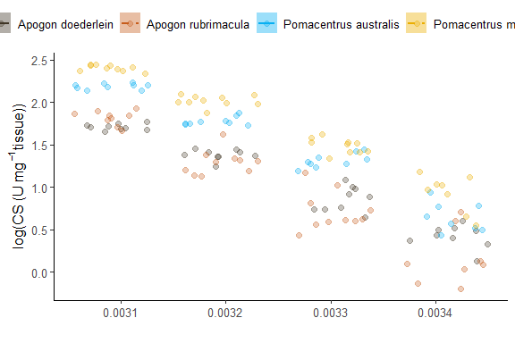<!-- -->
 
# CS:LDH ratio 

## Merge dataframes 

To start we will merge the lactate dehydrogenase (LDH) and citrate synthase (CS) dataframes


``` r
lc.data <- CS.data |> 
  left_join(select(ldh.data, c("UNIQUE_SAMPLE_ID","LDH_ACTIVITY")), by = "UNIQUE_SAMPLE_ID") |> 
  mutate(LDHCS = LDH_ACTIVITY/CS_ACTIVITY) |> 
  drop_na(LDHCS)
```

## Initial plot {.tabset}

### LDH:CS v TEMPERATURE [SPECIES]


``` r
ggplot(lc.data, aes(x =temperature, y= LDHCS, color = species)) + 
  geom_point() + 
  stat_smooth(method = "lm", se=FALSE) + 
  theme_classic() 
```

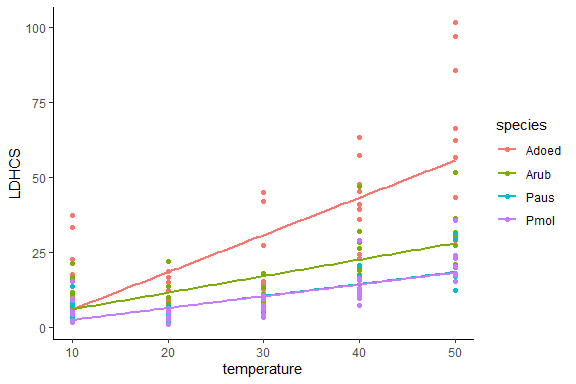<!-- -->

### LDH:CS [distribution]

``` r
ggplot(lc.data, aes(x = LDHCS, fill = temperature, color = temperature)) + 
  geom_density(alpha =0.5, position = "identity") 
```

<!-- -->

``` r
ggplot(lc.data, aes(x=LDHCS)) + geom_histogram()
```

<!-- -->

### LDH:CS v TEMPERATURE [LATITUDE]

``` r
ggplot(lc.data, aes(x =temperature, y= LDHCS, colour = LATITUDE, fill=LATITUDE)) +   geom_point(alpha=0.3) + stat_smooth(method = "lm", se=TRUE,  formula=y ~ poly(x, 2, raw=TRUE), alpha=0.3) + facet_grid(~LATIN_GENUS) + theme_classic()
```

<!-- -->

### LDH:CS v TEMPERATURE [GENUS]

``` r
ggplot(lc.data, aes(x =temperature, y= LDHCS, colour = LATIN_GENUS, fill=LATIN_GENUS)) +   geom_point(alpha=0.3) + stat_smooth(method = "lm", se=TRUE,  formula=y ~ poly(x, 2, raw=TRUE), alpha=0.3) + facet_grid(~LATITUDE) + theme_classic()
```

<!-- -->

### LDH:CS v TEMPERATURE [SPECIES]

``` r
ggplot(lc.data, aes(x =temperature, y= LDHCS, colour = species, fill= species)) +   geom_point(alpha=0.3) + stat_smooth(method = "lm", se=TRUE,  formula=y ~ poly(x, 2, raw=TRUE), alpha=0.3) + theme_classic()
```

<!-- -->

### {-} 

## Fit the model 

The model was fit using the **glm** and later **glmmTMB** packages in R. A number of different models were tested to determine which hypothesis and associated variables best predicted enzyme activity when measured as a ratio between lactate dehygronease and citrate synthase. Model fit was examined using AICc, BIC, and r-squared values. Additional model were examined via the validation diagnostics provided by the **performance**,**dHARMA**, and **plot_model** packages in R.

From out initial plots we can see that our data is heavily skewed to the right. From our initial plots we can all see that the relationship between enzyme activity (LDH:CS) and temperature is not linear, but rather may represent either a quadratic or cubic relationship. Let's start out model selection process by comparing different polynomial models.  

### polynomial models

``` r
#--- model 1 ---# 
lc.model.1 <- glm(LDHCS ~ temperature * LATITUDE * LATIN_GENUS, 
               family = gaussian(),
               data = lc.data) 

lc.model.1.p2 <- glm(LDHCS ~ poly(temperature, 2) * LATITUDE * LATIN_GENUS, 
               family = gaussian(),
               data = lc.data)  

lc.model.1.p3 <- glm(LDHCS ~ poly(temperature, 3) * LATITUDE * LATIN_GENUS, 
               family = gaussian(),
               data = lc.data) 
```

#### model comparisons - polynomial models 

``` r
aic.c=AICc(lc.model.1, lc.model.1.p2, lc.model.1.p3, k=2) 
bic=BIC(lc.model.1, lc.model.1.p2, lc.model.1.p3)

model.fit.table <- as.data.frame(aic.c) %>% 
  tibble::rownames_to_column("model") %>%
  mutate(BIC = bic$BIC, 
         r2 = c(r.squaredLR(lc.model.1)[1], r.squaredLR(lc.model.1.p2)[1], r.squaredLR(lc.model.1.p3)[1]))
model.fit.table %>% knitr::kable(format = "html")  %>%
  kable_paper(full_width = TRUE) 
```

<table class=" lightable-paper" style='font-family: "Arial Narrow", arial, helvetica, sans-serif; margin-left: auto; margin-right: auto;'>
 <thead>
  <tr>
   <th style="text-align:left;"> model </th>
   <th style="text-align:right;"> df </th>
   <th style="text-align:right;"> AICc </th>
   <th style="text-align:right;"> BIC </th>
   <th style="text-align:right;"> r2 </th>
  </tr>
 </thead>
<tbody>
  <tr>
   <td style="text-align:left;"> lc.model.1 </td>
   <td style="text-align:right;"> 9 </td>
   <td style="text-align:right;"> 1315.558 </td>
   <td style="text-align:right;"> 1342.774 </td>
   <td style="text-align:right;"> 0.6208308 </td>
  </tr>
  <tr>
   <td style="text-align:left;"> lc.model.1.p2 </td>
   <td style="text-align:right;"> 13 </td>
   <td style="text-align:right;"> 1275.022 </td>
   <td style="text-align:right;"> 1313.635 </td>
   <td style="text-align:right;"> 0.7160325 </td>
  </tr>
  <tr>
   <td style="text-align:left;"> lc.model.1.p3 </td>
   <td style="text-align:right;"> 17 </td>
   <td style="text-align:right;"> 1279.743 </td>
   <td style="text-align:right;"> 1329.276 </td>
   <td style="text-align:right;"> 0.7240871 </td>
  </tr>
</tbody>
</table>

``` r
anova(lc.model.1, lc.model.1.p2, lc.model.1.p3, test = "Chisq")
```

<div data-pagedtable="false">
  <script data-pagedtable-source type="application/json">
{"columns":[{"label":[""],"name":["_rn_"],"type":[""],"align":["left"]},{"label":["Resid. Df"],"name":[1],"type":["dbl"],"align":["right"]},{"label":["Resid. Dev"],"name":[2],"type":["dbl"],"align":["right"]},{"label":["Df"],"name":[3],"type":["dbl"],"align":["right"]},{"label":["Deviance"],"name":[4],"type":["dbl"],"align":["right"]},{"label":["Pr(>Chi)"],"name":[5],"type":["dbl"],"align":["right"]}],"data":[{"1":"164","2":"18903.45","3":"NA","4":"NA","5":"NA","_rn_":"1"},{"1":"160","2":"14157.18","3":"4","4":"4746.2757","5":"5.721378e-11","_rn_":"2"},{"1":"156","2":"13755.62","3":"4","4":"401.5587","5":"3.361918e-01","_rn_":"3"}],"options":{"columns":{"min":{},"max":[10]},"rows":{"min":[10],"max":[10]},"pages":{}}}
  </script>
</div>

Looks like the model where temperature is treated as a second order polynomial (quadratic model) is better than the first and third order polynomial models. **Tissue mass** did not improve the model when looking at either lactate dehydrogenase or citrate synthase, therefore we will not be including it in the LDH:CS ratio analysis.

Because tissue samples from the same fish were tested at multiple temperatures we need to include **fish_id** as a random factor. 

### Generalised linear mixed model (GLMM)

``` r
lc.model.1.p2 <- glmmTMB(LDHCS ~ poly(temperature, 2) * LATITUDE * LATIN_GENUS + (1|fish_id), 
               family = gaussian(),
               REML = TRUE,
               data = lc.data) 
```

Great! Now lets check our model validations to see how the model is performing. 

## Model validation {.tabset}

### lc.model.1 [performance]


``` r
lc.model.1.p2 %>% check_model(detrend = FALSE)
```

<!-- -->

### lc.model.1 [DHARMa]


``` r
lc.model.1.p2 %>% simulateResiduals(plot=TRUE)
```

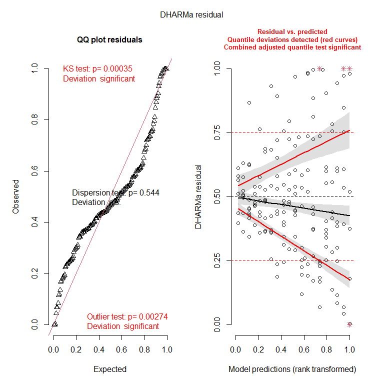<!-- -->

```
Object of Class DHARMa with simulated residuals based on 250 simulations with refit = FALSE . See ?DHARMa::simulateResiduals for help. 
 
Scaled residual values: 0.26 0.732 0.996 0.752 0.376 0.984 0.536 0.736 0.848 1 0.736 0.252 0.184 0.972 0.98 0.12 0.24 0.044 0 0.98 ...
```

``` r
lc.model.1.p2 %>% DHARMa::testResiduals(plot=TRUE)
```

<!-- -->

```
$uniformity

	Asymptotic one-sample Kolmogorov-Smirnov test

data:  simulationOutput$scaledResiduals
D = 0.1587, p-value = 0.0003455
alternative hypothesis: two-sided


$dispersion

	DHARMa nonparametric dispersion test via sd of residuals fitted vs.
	simulated

data:  simulationOutput
dispersion = 0.91928, p-value = 0.544
alternative hypothesis: two.sided


$outliers

	DHARMa outlier test based on exact binomial test with approximate
	expectations

data:  simulationOutput
outliers at both margin(s) = 6, observations = 172, p-value = 0.002741
alternative hypothesis: true probability of success is not equal to 0.007968127
95 percent confidence interval:
 0.01290737 0.07437791
sample estimates:
frequency of outliers (expected: 0.00796812749003984 ) 
                                            0.03488372 
```

```
$uniformity

	Asymptotic one-sample Kolmogorov-Smirnov test

data:  simulationOutput$scaledResiduals
D = 0.1587, p-value = 0.0003455
alternative hypothesis: two-sided


$dispersion

	DHARMa nonparametric dispersion test via sd of residuals fitted vs.
	simulated

data:  simulationOutput
dispersion = 0.91928, p-value = 0.544
alternative hypothesis: two.sided


$outliers

	DHARMa outlier test based on exact binomial test with approximate
	expectations

data:  simulationOutput
outliers at both margin(s) = 6, observations = 172, p-value = 0.002741
alternative hypothesis: true probability of success is not equal to 0.007968127
95 percent confidence interval:
 0.01290737 0.07437791
sample estimates:
frequency of outliers (expected: 0.00796812749003984 ) 
                                            0.03488372 
```

### lc.model.1 [plot model]

``` r
par(mar=c(2,2,2,2))
lc.model.1.p2 %>% plot_model(type = "diag")
```

```
[[1]]
```

```

[[2]]
[[2]]$fish_id
```

```


[[3]]
```

```

[[4]]
```


Our initial model (gaussian distribution) does not seem to function well. The predictive model does not fit the observed data, and the qq-plot also does not do a good job of ensuring that sample quantiles fit within the expectations of a gaussian distribution. Unexpectedly there are a number of issues also brought up with the DHARMa checks, KS-test is significant, and so is the deviation of the model quantiles from thier expectations. Similar trends can found in the plot_model output as well. 

Lets start by changing the link distribution used within the model to see if this helps the model out.

### {-}

## Re-fitting model 

Turn **REML** off when comparing models

### re-fitting models [link functions]


``` r
lc.model.1.p2 <-  lc.model.1.p2 %>% update(REML = FALSE)
lc.model.1.p2.log <- lc.model.1.p2 %>% update(family=gaussian(link="log"), 
                                              REML=FALSE) 
lc.model.1.p2.sqrt <- lc.model.1.p2 %>% update(family=gaussian(link="sqrt"), 
                                               REML=FALSE) 
```

### re-fit model comparisons [link function]


``` r
aic.c=AICc(lc.model.1.p2, lc.model.1.p2.log, lc.model.1.p2.sqrt,  k=2) 
bic=BIC(lc.model.1.p2, lc.model.1.p2.log, lc.model.1.p2.sqrt)

model.fit.table <- as.data.frame(aic.c) %>% 
  tibble::rownames_to_column("model") %>%
  mutate(BIC = bic$BIC, 
         r2 = c(r.squaredGLMM(lc.model.1.p2)[1], r.squaredGLMM(lc.model.1.p2.log)[1], r.squaredGLMM(lc.model.1.p2.sqrt)[1]))
model.fit.table %>% knitr::kable(format = "html")  %>%
  kable_paper(full_width = TRUE) 
```

<table class=" lightable-paper" style='font-family: "Arial Narrow", arial, helvetica, sans-serif; margin-left: auto; margin-right: auto;'>
 <thead>
  <tr>
   <th style="text-align:left;"> model </th>
   <th style="text-align:right;"> df </th>
   <th style="text-align:right;"> AICc </th>
   <th style="text-align:right;"> BIC </th>
   <th style="text-align:right;"> r2 </th>
  </tr>
 </thead>
<tbody>
  <tr>
   <td style="text-align:left;"> lc.model.1.p2 </td>
   <td style="text-align:right;"> 14 </td>
   <td style="text-align:right;"> 1235.729 </td>
   <td style="text-align:right;"> 1277.118 </td>
   <td style="text-align:right;"> 0.7178228 </td>
  </tr>
  <tr>
   <td style="text-align:left;"> lc.model.1.p2.log </td>
   <td style="text-align:right;"> 14 </td>
   <td style="text-align:right;"> 1180.598 </td>
   <td style="text-align:right;"> 1221.988 </td>
   <td style="text-align:right;"> 0.0141227 </td>
  </tr>
  <tr>
   <td style="text-align:left;"> lc.model.1.p2.sqrt </td>
   <td style="text-align:right;"> 14 </td>
   <td style="text-align:right;"> 1193.619 </td>
   <td style="text-align:right;"> 1235.009 </td>
   <td style="text-align:right;"> 0.0587170 </td>
  </tr>
</tbody>
</table>

``` r
anova(lc.model.1.p2, lc.model.1.p2.log, lc.model.1.p2.sqrt, test = "Chisq")
```

<div data-pagedtable="false">
  <script data-pagedtable-source type="application/json">
{"columns":[{"label":[""],"name":["_rn_"],"type":[""],"align":["left"]},{"label":["Df"],"name":[1],"type":["dbl"],"align":["right"]},{"label":["AIC"],"name":[2],"type":["dbl"],"align":["right"]},{"label":["BIC"],"name":[3],"type":["dbl"],"align":["right"]},{"label":["logLik"],"name":[4],"type":["dbl"],"align":["right"]},{"label":["deviance"],"name":[5],"type":["dbl"],"align":["right"]},{"label":["Chisq"],"name":[6],"type":["dbl"],"align":["right"]},{"label":["Chi Df"],"name":[7],"type":["dbl"],"align":["right"]},{"label":["Pr(>Chisq)"],"name":[8],"type":["dbl"],"align":["right"]}],"data":[{"1":"14","2":"1233.054","3":"1277.118","4":"-602.5268","5":"1205.054","6":"NA","7":"NA","8":"NA","_rn_":"lc.model.1.p2"},{"1":"14","2":"1177.923","3":"1221.988","4":"-574.9613","5":"1149.923","6":"55.13098","7":"0","8":"0","_rn_":"lc.model.1.p2.log"},{"1":"14","2":"1190.944","3":"1235.009","4":"-581.4722","5":"1162.944","6":"0.00000","7":"0","8":"1","_rn_":"lc.model.1.p2.sqrt"}],"options":{"columns":{"min":{},"max":[10]},"rows":{"min":[10],"max":[10]},"pages":{}}}
  </script>
</div>

From our model outputs it looks like transforming the data via a log-link function seems to help. However, we will have to explore that data further as the r-squared value drops drastically

## Model re-validation {.tabset}


``` r
lc.model.1.p2.log <- lc.model.1.p2.log %>% update(REML=TRUE)
```

### lc.model.1.p2.log [performance]


``` r
lc.model.1.p2.log %>% check_model(detrend=FALSE)
```

<!-- -->

### lc.model.1.p2.log [DHARMa]


``` r
lc.model.1.p2.log %>% simulateResiduals(plot=TRUE)
```

<!-- -->

```
## Object of Class DHARMa with simulated residuals based on 250 simulations with refit = FALSE . See ?DHARMa::simulateResiduals for help. 
##  
## Scaled residual values: 0.304 0.616 0.988 0.804 0.528 0.992 0.392 0.704 0.848 0.936 0.852 0.112 0.104 0.928 0.836 0.02 0.172 0.112 0.02 1 ...
```

``` r
lc.model.1.p2.log %>% DHARMa::testResiduals(plot=TRUE)
```

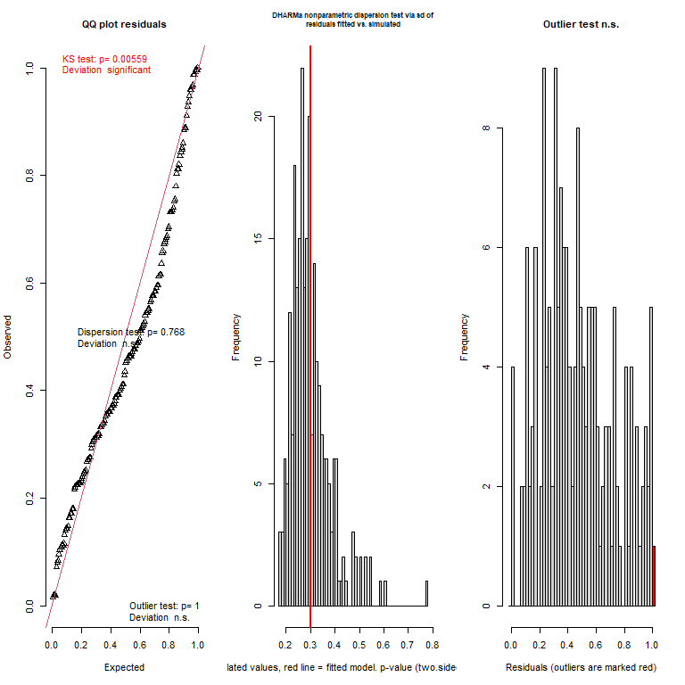<!-- -->

```
## $uniformity
## 
## 	Asymptotic one-sample Kolmogorov-Smirnov test
## 
## data:  simulationOutput$scaledResiduals
## D = 0.13074, p-value = 0.005588
## alternative hypothesis: two-sided
## 
## 
## $dispersion
## 
## 	DHARMa nonparametric dispersion test via sd of residuals fitted vs.
## 	simulated
## 
## data:  simulationOutput
## dispersion = 1.0016, p-value = 0.768
## alternative hypothesis: two.sided
## 
## 
## $outliers
## 
## 	DHARMa outlier test based on exact binomial test with approximate
## 	expectations
## 
## data:  simulationOutput
## outliers at both margin(s) = 1, observations = 172, p-value = 1
## alternative hypothesis: true probability of success is not equal to 0.007968127
## 95 percent confidence interval:
##  0.0001471857 0.0319660413
## sample estimates:
## frequency of outliers (expected: 0.00796812749003984 ) 
##                                            0.005813953
```

```
## $uniformity
## 
## 	Asymptotic one-sample Kolmogorov-Smirnov test
## 
## data:  simulationOutput$scaledResiduals
## D = 0.13074, p-value = 0.005588
## alternative hypothesis: two-sided
## 
## 
## $dispersion
## 
## 	DHARMa nonparametric dispersion test via sd of residuals fitted vs.
## 	simulated
## 
## data:  simulationOutput
## dispersion = 1.0016, p-value = 0.768
## alternative hypothesis: two.sided
## 
## 
## $outliers
## 
## 	DHARMa outlier test based on exact binomial test with approximate
## 	expectations
## 
## data:  simulationOutput
## outliers at both margin(s) = 1, observations = 172, p-value = 1
## alternative hypothesis: true probability of success is not equal to 0.007968127
## 95 percent confidence interval:
##  0.0001471857 0.0319660413
## sample estimates:
## frequency of outliers (expected: 0.00796812749003984 ) 
##                                            0.005813953
```

### lc.model.1.p2.log [plot_model]

``` r
par(mar=c(2,2,2,2))
lc.model.1.p2.log %>% plot_model(type = "diag")
```

```
## [[1]]
```

```
## 
## [[2]]
## [[2]]$fish_id
```

```
## 
## 
## [[3]]
```

```
## 
## [[4]]
```


### {-}

The log-link version of the model still has a number of issues, including a significant results for KS-test and quantile distributions, which shows that predicted data does not match the expected quantiles of a gaussian distribution and therefore violates assumptions within the gaussian distribution. 

Because out data is continuous and all positive we can try to see if a Gamma distribution does a better job at modelling the data. We can also try fitting a Gamma distribution with a log-link function as well (the default for gamma is 'inverse').

## Re-re-fitting model 

Turn **REML** off when comparing models

### re-fitting models [link functions]


``` r
lc.model.1.p2 <-  lc.model.1.p2 %>% update(REML = FALSE)
lc.model.1.p2.log <-  lc.model.1.p2.log %>% update(REML = FALSE)
lc.model.1.p2.gamma <- lc.model.1.p2 %>% update(family=Gamma(), 
                                              REML=FALSE) 
lc.model.1.p2.gamma.log <- lc.model.1.p2 %>% update(family=Gamma(link="log"), 
                                              REML=FALSE)
```


``` r
aic.c=AICc(lc.model.1.p2, lc.model.1.p2.log, lc.model.1.p2.gamma, lc.model.1.p2.gamma.log,   k=2) 
bic=BIC(lc.model.1.p2, lc.model.1.p2.log, lc.model.1.p2.gamma, lc.model.1.p2.gamma.log )

model.fit.table <- as.data.frame(aic.c) %>% 
  tibble::rownames_to_column("model") %>%
  mutate(BIC = bic$BIC, 
         r2 = c(r.squaredGLMM(lc.model.1.p2)[1], r.squaredGLMM(lc.model.1.p2.log)[1], r.squaredGLMM(lc.model.1.p2.gamma)[1], r.squaredGLMM(lc.model.1.p2.gamma.log)[1]))
model.fit.table %>% knitr::kable(format = "html")  %>%
  kable_paper(full_width = TRUE) 
```

<table class=" lightable-paper" style='font-family: "Arial Narrow", arial, helvetica, sans-serif; margin-left: auto; margin-right: auto;'>
 <thead>
  <tr>
   <th style="text-align:left;"> model </th>
   <th style="text-align:right;"> df </th>
   <th style="text-align:right;"> AICc </th>
   <th style="text-align:right;"> BIC </th>
   <th style="text-align:right;"> r2 </th>
  </tr>
 </thead>
<tbody>
  <tr>
   <td style="text-align:left;"> lc.model.1.p2 </td>
   <td style="text-align:right;"> 14 </td>
   <td style="text-align:right;"> 1235.729 </td>
   <td style="text-align:right;"> 1277.118 </td>
   <td style="text-align:right;"> 0.7178228 </td>
  </tr>
  <tr>
   <td style="text-align:left;"> lc.model.1.p2.log </td>
   <td style="text-align:right;"> 14 </td>
   <td style="text-align:right;"> 1180.598 </td>
   <td style="text-align:right;"> 1221.988 </td>
   <td style="text-align:right;"> 0.0141227 </td>
  </tr>
  <tr>
   <td style="text-align:left;"> lc.model.1.p2.gamma </td>
   <td style="text-align:right;"> 14 </td>
   <td style="text-align:right;"> NA </td>
   <td style="text-align:right;"> NA </td>
   <td style="text-align:right;"> 0.1049479 </td>
  </tr>
  <tr>
   <td style="text-align:left;"> lc.model.1.p2.gamma.log </td>
   <td style="text-align:right;"> 14 </td>
   <td style="text-align:right;"> 1110.860 </td>
   <td style="text-align:right;"> 1152.250 </td>
   <td style="text-align:right;"> 0.6952649 </td>
  </tr>
</tbody>
</table>

``` r
anova(lc.model.1.p2, lc.model.1.p2.log, lc.model.1.p2.gamma, lc.model.1.p2.gamma.log,  test = "Chisq")
```

<div data-pagedtable="false">
  <script data-pagedtable-source type="application/json">
{"columns":[{"label":[""],"name":["_rn_"],"type":[""],"align":["left"]},{"label":["Df"],"name":[1],"type":["dbl"],"align":["right"]},{"label":["AIC"],"name":[2],"type":["dbl"],"align":["right"]},{"label":["BIC"],"name":[3],"type":["dbl"],"align":["right"]},{"label":["logLik"],"name":[4],"type":["dbl"],"align":["right"]},{"label":["deviance"],"name":[5],"type":["dbl"],"align":["right"]},{"label":["Chisq"],"name":[6],"type":["dbl"],"align":["right"]},{"label":["Chi Df"],"name":[7],"type":["dbl"],"align":["right"]},{"label":["Pr(>Chisq)"],"name":[8],"type":["dbl"],"align":["right"]}],"data":[{"1":"14","2":"1233.054","3":"1277.118","4":"-602.5268","5":"1205.054","6":"NA","7":"NA","8":"NA","_rn_":"lc.model.1.p2"},{"1":"14","2":"1177.923","3":"1221.988","4":"-574.9613","5":"1149.923","6":"55.13098","7":"0","8":"0","_rn_":"lc.model.1.p2.log"},{"1":"14","2":"NA","3":"NA","4":"NA","5":"NA","6":"NA","7":"0","8":"NA","_rn_":"lc.model.1.p2.gamma"},{"1":"14","2":"1108.185","3":"1152.250","4":"-540.0924","5":"1080.185","6":"NA","7":"0","8":"NA","_rn_":"lc.model.1.p2.gamma.log"}],"options":{"columns":{"min":{},"max":[10]},"rows":{"min":[10],"max":[10]},"pages":{}}}
  </script>
</div>

The gamma model seems to help when using a log. Lets look at the model validation to see if it is an appropriate model to use. 

## Model re-re-validation {.tabset}

Turn REML on 


``` r
lc.model.1.p2.gamma.log <- lc.model.1.p2.gamma.log %>% update(REML=TRUE) 
```

### [performance] 

#### lc.model.1.p2.gamma.log


### [DHARMa] 

#### lc.model.1.p2.gamma.log

``` r
lc.model.1.p2.gamma.log %>% simulateResiduals(plot=TRUE)
```

<!-- -->

```
## Object of Class DHARMa with simulated residuals based on 250 simulations with refit = FALSE . See ?DHARMa::simulateResiduals for help. 
##  
## Scaled residual values: 0.312 0.736 0.98 0.828 0.464 0.984 0.644 0.864 0.844 0.824 0.864 0.224 0.304 0.912 0.728 0.004 0.296 0.296 0.068 0.98 ...
```

``` r
lc.model.1.p2.gamma.log %>% DHARMa::testResiduals(plot=TRUE)
```

<!-- -->

```
## $uniformity
## 
## 	Asymptotic one-sample Kolmogorov-Smirnov test
## 
## data:  simulationOutput$scaledResiduals
## D = 0.060512, p-value = 0.5546
## alternative hypothesis: two-sided
## 
## 
## $dispersion
## 
## 	DHARMa nonparametric dispersion test via sd of residuals fitted vs.
## 	simulated
## 
## data:  simulationOutput
## dispersion = 0.62898, p-value = 0.24
## alternative hypothesis: two.sided
## 
## 
## $outliers
## 
## 	DHARMa outlier test based on exact binomial test with approximate
## 	expectations
## 
## data:  simulationOutput
## outliers at both margin(s) = 1, observations = 172, p-value = 1
## alternative hypothesis: true probability of success is not equal to 0.007968127
## 95 percent confidence interval:
##  0.0001471857 0.0319660413
## sample estimates:
## frequency of outliers (expected: 0.00796812749003984 ) 
##                                            0.005813953
```

```
## $uniformity
## 
## 	Asymptotic one-sample Kolmogorov-Smirnov test
## 
## data:  simulationOutput$scaledResiduals
## D = 0.060512, p-value = 0.5546
## alternative hypothesis: two-sided
## 
## 
## $dispersion
## 
## 	DHARMa nonparametric dispersion test via sd of residuals fitted vs.
## 	simulated
## 
## data:  simulationOutput
## dispersion = 0.62898, p-value = 0.24
## alternative hypothesis: two.sided
## 
## 
## $outliers
## 
## 	DHARMa outlier test based on exact binomial test with approximate
## 	expectations
## 
## data:  simulationOutput
## outliers at both margin(s) = 1, observations = 172, p-value = 1
## alternative hypothesis: true probability of success is not equal to 0.007968127
## 95 percent confidence interval:
##  0.0001471857 0.0319660413
## sample estimates:
## frequency of outliers (expected: 0.00796812749003984 ) 
##                                            0.005813953
```

### {-} 

This model does not violate any assumptions and therefore we can start to look at the results.  

## Partial plots {.tabset} 

### ggemmeans {.tabset} 

#### TEMPERATURE V LATITUDE

<!-- -->

#### TEMPERATURE V GENUS

<!-- -->

#### TEMPERATURE V GENUS V LATITUDE

<!-- -->

### plot_model 

<!-- -->

#### {-}

### {-}

## Model investigation {.tabset .tabset-pills}

### summary 
<table class=" lightable-paper" style='font-family: "Arial Narrow", arial, helvetica, sans-serif; margin-left: auto; margin-right: auto;'>
 <thead>
  <tr>
   <th style="text-align:left;">   </th>
   <th style="text-align:right;"> Estimate </th>
   <th style="text-align:right;"> StdError </th>
   <th style="text-align:right;"> Zvalue </th>
   <th style="text-align:right;"> Pvalue </th>
  </tr>
 </thead>
<tbody>
  <tr>
   <td style="text-align:left;"> (Intercept) </td>
   <td style="text-align:right;"> 3.1963596 </td>
   <td style="text-align:right;"> 0.1115473 </td>
   <td style="text-align:right;"> 28.6547340 </td>
   <td style="text-align:right;"> 0.0000000 </td>
  </tr>
  <tr>
   <td style="text-align:left;"> poly(temperature, 2)1 </td>
   <td style="text-align:right;"> 7.4158831 </td>
   <td style="text-align:right;"> 0.8388030 </td>
   <td style="text-align:right;"> 8.8410307 </td>
   <td style="text-align:right;"> 0.0000000 </td>
  </tr>
  <tr>
   <td style="text-align:left;"> poly(temperature, 2)2 </td>
   <td style="text-align:right;"> 2.9996232 </td>
   <td style="text-align:right;"> 0.8355437 </td>
   <td style="text-align:right;"> 3.5900257 </td>
   <td style="text-align:right;"> 0.0003306 </td>
  </tr>
  <tr>
   <td style="text-align:left;"> LATITUDEtropical </td>
   <td style="text-align:right;"> -0.4914032 </td>
   <td style="text-align:right;"> 0.1543032 </td>
   <td style="text-align:right;"> -3.1846605 </td>
   <td style="text-align:right;"> 0.0014492 </td>
  </tr>
  <tr>
   <td style="text-align:left;"> LATIN_GENUSPomacentrus </td>
   <td style="text-align:right;"> -1.0354039 </td>
   <td style="text-align:right;"> 0.1682929 </td>
   <td style="text-align:right;"> -6.1523920 </td>
   <td style="text-align:right;"> 0.0000000 </td>
  </tr>
  <tr>
   <td style="text-align:left;"> poly(temperature, 2)1:LATITUDEtropical </td>
   <td style="text-align:right;"> -1.3961642 </td>
   <td style="text-align:right;"> 1.1819713 </td>
   <td style="text-align:right;"> -1.1812166 </td>
   <td style="text-align:right;"> 0.2375167 </td>
  </tr>
  <tr>
   <td style="text-align:left;"> poly(temperature, 2)2:LATITUDEtropical </td>
   <td style="text-align:right;"> 0.2709490 </td>
   <td style="text-align:right;"> 1.1764244 </td>
   <td style="text-align:right;"> 0.2303157 </td>
   <td style="text-align:right;"> 0.8178465 </td>
  </tr>
  <tr>
   <td style="text-align:left;"> poly(temperature, 2)1:LATIN_GENUSPomacentrus </td>
   <td style="text-align:right;"> -0.8368884 </td>
   <td style="text-align:right;"> 1.2525328 </td>
   <td style="text-align:right;"> -0.6681569 </td>
   <td style="text-align:right;"> 0.5040335 </td>
  </tr>
  <tr>
   <td style="text-align:left;"> poly(temperature, 2)2:LATIN_GENUSPomacentrus </td>
   <td style="text-align:right;"> 0.7312268 </td>
   <td style="text-align:right;"> 1.2657837 </td>
   <td style="text-align:right;"> 0.5776870 </td>
   <td style="text-align:right;"> 0.5634754 </td>
  </tr>
  <tr>
   <td style="text-align:left;"> LATITUDEtropical:LATIN_GENUSPomacentrus </td>
   <td style="text-align:right;"> 0.4808443 </td>
   <td style="text-align:right;"> 0.2256007 </td>
   <td style="text-align:right;"> 2.1313952 </td>
   <td style="text-align:right;"> 0.0330566 </td>
  </tr>
  <tr>
   <td style="text-align:left;"> poly(temperature, 2)1:LATITUDEtropical:LATIN_GENUSPomacentrus </td>
   <td style="text-align:right;"> 1.7208113 </td>
   <td style="text-align:right;"> 1.7000808 </td>
   <td style="text-align:right;"> 1.0121938 </td>
   <td style="text-align:right;"> 0.3114454 </td>
  </tr>
  <tr>
   <td style="text-align:left;"> poly(temperature, 2)2:LATITUDEtropical:LATIN_GENUSPomacentrus </td>
   <td style="text-align:right;"> -0.8592824 </td>
   <td style="text-align:right;"> 1.7042553 </td>
   <td style="text-align:right;"> -0.5041982 </td>
   <td style="text-align:right;"> 0.6141221 </td>
  </tr>
</tbody>
</table>

### anova 
<table class=" lightable-paper" style='font-family: "Arial Narrow", arial, helvetica, sans-serif; margin-left: auto; margin-right: auto;'>
 <thead>
  <tr>
   <th style="text-align:left;">   </th>
   <th style="text-align:right;"> Chisq </th>
   <th style="text-align:right;"> Df </th>
   <th style="text-align:right;"> Pr(&gt;Chisq) </th>
  </tr>
 </thead>
<tbody>
  <tr>
   <td style="text-align:left;"> poly(temperature, 2) </td>
   <td style="text-align:right;"> 289.0739842 </td>
   <td style="text-align:right;"> 2 </td>
   <td style="text-align:right;"> 0.0000000 </td>
  </tr>
  <tr>
   <td style="text-align:left;"> LATITUDE </td>
   <td style="text-align:right;"> 5.6979239 </td>
   <td style="text-align:right;"> 1 </td>
   <td style="text-align:right;"> 0.0169850 </td>
  </tr>
  <tr>
   <td style="text-align:left;"> LATIN_GENUS </td>
   <td style="text-align:right;"> 46.8708048 </td>
   <td style="text-align:right;"> 1 </td>
   <td style="text-align:right;"> 0.0000000 </td>
  </tr>
  <tr>
   <td style="text-align:left;"> poly(temperature, 2):LATITUDE </td>
   <td style="text-align:right;"> 0.4477613 </td>
   <td style="text-align:right;"> 2 </td>
   <td style="text-align:right;"> 0.7994105 </td>
  </tr>
  <tr>
   <td style="text-align:left;"> poly(temperature, 2):LATIN_GENUS </td>
   <td style="text-align:right;"> 0.0973310 </td>
   <td style="text-align:right;"> 2 </td>
   <td style="text-align:right;"> 0.9524997 </td>
  </tr>
  <tr>
   <td style="text-align:left;"> LATITUDE:LATIN_GENUS </td>
   <td style="text-align:right;"> 4.5805827 </td>
   <td style="text-align:right;"> 1 </td>
   <td style="text-align:right;"> 0.0323362 </td>
  </tr>
  <tr>
   <td style="text-align:left;"> poly(temperature, 2):LATITUDE:LATIN_GENUS </td>
   <td style="text-align:right;"> 1.4091631 </td>
   <td style="text-align:right;"> 2 </td>
   <td style="text-align:right;"> 0.4943154 </td>
  </tr>
</tbody>
</table>

### confint 
<table class=" lightable-paper" style='font-family: "Arial Narrow", arial, helvetica, sans-serif; margin-left: auto; margin-right: auto;'>
 <thead>
  <tr>
   <th style="text-align:left;">   </th>
   <th style="text-align:right;"> 2.5 % </th>
   <th style="text-align:right;"> 97.5 % </th>
   <th style="text-align:right;"> Estimate </th>
  </tr>
 </thead>
<tbody>
  <tr>
   <td style="text-align:left;"> (Intercept) </td>
   <td style="text-align:right;"> 2.9777308 </td>
   <td style="text-align:right;"> 3.4149884 </td>
   <td style="text-align:right;"> 3.1963596 </td>
  </tr>
  <tr>
   <td style="text-align:left;"> poly(temperature, 2)1 </td>
   <td style="text-align:right;"> 5.7718594 </td>
   <td style="text-align:right;"> 9.0599068 </td>
   <td style="text-align:right;"> 7.4158831 </td>
  </tr>
  <tr>
   <td style="text-align:left;"> poly(temperature, 2)2 </td>
   <td style="text-align:right;"> 1.3619877 </td>
   <td style="text-align:right;"> 4.6372587 </td>
   <td style="text-align:right;"> 2.9996232 </td>
  </tr>
  <tr>
   <td style="text-align:left;"> LATITUDEtropical </td>
   <td style="text-align:right;"> -0.7938319 </td>
   <td style="text-align:right;"> -0.1889746 </td>
   <td style="text-align:right;"> -0.4914032 </td>
  </tr>
  <tr>
   <td style="text-align:left;"> LATIN_GENUSPomacentrus </td>
   <td style="text-align:right;"> -1.3652519 </td>
   <td style="text-align:right;"> -0.7055559 </td>
   <td style="text-align:right;"> -1.0354039 </td>
  </tr>
  <tr>
   <td style="text-align:left;"> poly(temperature, 2)1:LATITUDEtropical </td>
   <td style="text-align:right;"> -3.7127854 </td>
   <td style="text-align:right;"> 0.9204571 </td>
   <td style="text-align:right;"> -1.3961642 </td>
  </tr>
  <tr>
   <td style="text-align:left;"> poly(temperature, 2)2:LATITUDEtropical </td>
   <td style="text-align:right;"> -2.0348004 </td>
   <td style="text-align:right;"> 2.5766984 </td>
   <td style="text-align:right;"> 0.2709490 </td>
  </tr>
  <tr>
   <td style="text-align:left;"> poly(temperature, 2)1:LATIN_GENUSPomacentrus </td>
   <td style="text-align:right;"> -3.2918077 </td>
   <td style="text-align:right;"> 1.6180308 </td>
   <td style="text-align:right;"> -0.8368884 </td>
  </tr>
  <tr>
   <td style="text-align:left;"> poly(temperature, 2)2:LATIN_GENUSPomacentrus </td>
   <td style="text-align:right;"> -1.7496637 </td>
   <td style="text-align:right;"> 3.2121174 </td>
   <td style="text-align:right;"> 0.7312268 </td>
  </tr>
  <tr>
   <td style="text-align:left;"> LATITUDEtropical:LATIN_GENUSPomacentrus </td>
   <td style="text-align:right;"> 0.0386750 </td>
   <td style="text-align:right;"> 0.9230136 </td>
   <td style="text-align:right;"> 0.4808443 </td>
  </tr>
  <tr>
   <td style="text-align:left;"> poly(temperature, 2)1:LATITUDEtropical:LATIN_GENUSPomacentrus </td>
   <td style="text-align:right;"> -1.6112859 </td>
   <td style="text-align:right;"> 5.0529085 </td>
   <td style="text-align:right;"> 1.7208113 </td>
  </tr>
  <tr>
   <td style="text-align:left;"> poly(temperature, 2)2:LATITUDEtropical:LATIN_GENUSPomacentrus </td>
   <td style="text-align:right;"> -4.1995615 </td>
   <td style="text-align:right;"> 2.4809966 </td>
   <td style="text-align:right;"> -0.8592824 </td>
  </tr>
  <tr>
   <td style="text-align:left;"> Std.Dev.(Intercept)|fish_id </td>
   <td style="text-align:right;"> 0.1919573 </td>
   <td style="text-align:right;"> 0.3974339 </td>
   <td style="text-align:right;"> 0.2762071 </td>
  </tr>
</tbody>
</table>

### r-squared
<table class=" lightable-paper" style='font-family: "Arial Narrow", arial, helvetica, sans-serif; margin-left: auto; margin-right: auto;'>
 <thead>
  <tr>
   <th style="text-align:right;"> R2_conditional </th>
   <th style="text-align:right;"> R2_marginal </th>
   <th style="text-align:left;"> optional </th>
  </tr>
 </thead>
<tbody>
  <tr>
   <td style="text-align:right;"> 0.790922 </td>
   <td style="text-align:right;"> 0.688775 </td>
   <td style="text-align:left;"> FALSE </td>
  </tr>
</tbody>
</table>

## Pairwise comparisons {.tabset .tabset-faded} 

### emtrends 


``` r
lc.model.1.p2.gamma.log %>% emtrends(var = "temperature", type = "response") %>% pairs(by = "temperature") %>% summary(by = NULL, adjust = "sidak", infer=TRUE)
```
SCROLL TO THE RIGHT -->

The numbers in the left most column in the table just mention that the slopes are assuming mean **MASS_CENTERED** and **RESTING_TIME_SEONDS** values when looking at differences between latitudinal slopes.

### emmeans 

``` r
lc.model.1.p2.gamma.log %>% emmeans(pairwise ~ temperature*LATITUDE*LATIN_GENUS, type = "response") %>% regrid() %>% pairs(by = "temperature") %>% summary(by = NULL, adjust = "sidak", infer=TRUE)
```

<div data-pagedtable="false">
  <script data-pagedtable-source type="application/json">
{"columns":[{"label":[""],"name":["_rn_"],"type":[""],"align":["left"]},{"label":["contrast"],"name":[1],"type":["fct"],"align":["left"]},{"label":["temperature"],"name":[2],"type":["dbl"],"align":["right"]},{"label":["estimate"],"name":[3],"type":["dbl"],"align":["right"]},{"label":["SE"],"name":[4],"type":["dbl"],"align":["right"]},{"label":["df"],"name":[5],"type":["dbl"],"align":["right"]},{"label":["asymp.LCL"],"name":[6],"type":["dbl"],"align":["right"]},{"label":["asymp.UCL"],"name":[7],"type":["dbl"],"align":["right"]},{"label":["z.ratio"],"name":[8],"type":["dbl"],"align":["right"]},{"label":["p.value"],"name":[9],"type":["dbl"],"align":["right"]}],"data":[{"1":"(sub-tropical Apogon) - tropical Apogon","2":"30.40698","3":"7.5138311","4":"2.874135","5":"Inf","6":"-0.04812848","7":"15.075791","8":"2.6142929","9":"5.246242e-02","_rn_":"1"},{"1":"(sub-tropical Apogon) - (sub-tropical Pomacentrus)","2":"30.40698","3":"12.4467569","4":"2.663977","5":"Inf","6":"5.43773193","7":"19.455782","8":"4.6722467","9":"1.787523e-05","_rn_":"2"},{"1":"(sub-tropical Apogon) - tropical Pomacentrus","2":"30.40698","3":"12.1772972","4":"2.623266","5":"Inf","6":"5.27538383","7":"19.079211","8":"4.6420367","9":"2.069932e-05","_rn_":"3"},{"1":"tropical Apogon - (sub-tropical Pomacentrus)","2":"30.40698","3":"4.9329258","4":"1.726638","5":"Inf","6":"0.39007458","7":"9.475777","8":"2.8569539","9":"2.539081e-02","_rn_":"4"},{"1":"tropical Apogon - tropical Pomacentrus","2":"30.40698","3":"4.6634662","4":"1.663335","5":"Inf","6":"0.28716784","7":"9.039765","8":"2.8036841","9":"2.993312e-02","_rn_":"5"},{"1":"(sub-tropical Pomacentrus) - tropical Pomacentrus","2":"30.40698","3":"-0.2694597","4":"1.261630","5":"Inf","6":"-3.58885584","7":"3.049937","8":"-0.2135806","9":"9.999766e-01","_rn_":"6"}],"options":{"columns":{"min":{},"max":[10]},"rows":{"min":[10],"max":[10]},"pages":{}}}
  </script>
</div>

### emmeans [ratios]

``` r
lc.model.1.p2.gamma.log %>% emmeans(pairwise ~ temperature*LATITUDE*LATIN_GENUS, type = "response") %>% regrid(transform="log") %>% pairs(by = "temperature") %>% summary(by = NULL, adjust = "sidak", infer=FALSE)
```

<div data-pagedtable="false">
  <script data-pagedtable-source type="application/json">
{"columns":[{"label":[""],"name":["_rn_"],"type":[""],"align":["left"]},{"label":["contrast"],"name":[1],"type":["fct"],"align":["left"]},{"label":["temperature"],"name":[2],"type":["fct"],"align":["left"]},{"label":["ratio"],"name":[3],"type":["dbl"],"align":["right"]},{"label":["SE"],"name":[4],"type":["dbl"],"align":["right"]},{"label":["df"],"name":[5],"type":["dbl"],"align":["right"]}],"data":[{"1":"(sub-tropical Apogon) / tropical Apogon","2":"30.406976744186","3":"1.6750909","4":"0.3113207","5":"Inf","_rn_":"1"},{"1":"(sub-tropical Apogon) / (sub-tropical Pomacentrus)","2":"30.406976744186","3":"3.0084561","4":"0.6114880","5":"Inf","_rn_":"2"},{"1":"(sub-tropical Apogon) / tropical Pomacentrus","2":"30.406976744186","3":"2.8830961","4":"0.5339200","5":"Inf","_rn_":"3"},{"1":"tropical Apogon / (sub-tropical Pomacentrus)","2":"30.406976744186","3":"1.7959957","4":"0.3604347","5":"Inf","_rn_":"4"},{"1":"tropical Apogon / tropical Pomacentrus","2":"30.406976744186","3":"1.7211580","4":"0.3138465","5":"Inf","_rn_":"5"},{"1":"(sub-tropical Pomacentrus) / tropical Pomacentrus","2":"30.406976744186","3":"0.9583308","4":"0.1916180","5":"Inf","_rn_":"6"}],"options":{"columns":{"min":{},"max":[10]},"rows":{"min":[10],"max":[10]},"pages":{}}}
  </script>
</div>

### temperature 

``` r
lc.model.1.p2.gamma.log %>% emmeans(~ temperature*LATITUDE*LATIN_GENUS, type = "response")  %>% summary(infer=TRUE)
```

<div data-pagedtable="false">
  <script data-pagedtable-source type="application/json">
{"columns":[{"label":[""],"name":["_rn_"],"type":[""],"align":["left"]},{"label":["temperature"],"name":[1],"type":["dbl"],"align":["right"]},{"label":["LATITUDE"],"name":[2],"type":["fct"],"align":["left"]},{"label":["LATIN_GENUS"],"name":[3],"type":["fct"],"align":["left"]},{"label":["response"],"name":[4],"type":["dbl"],"align":["right"]},{"label":["SE"],"name":[5],"type":["dbl"],"align":["right"]},{"label":["df"],"name":[6],"type":["dbl"],"align":["right"]},{"label":["asymp.LCL"],"name":[7],"type":["dbl"],"align":["right"]},{"label":["asymp.UCL"],"name":[8],"type":["dbl"],"align":["right"]},{"label":["null"],"name":[9],"type":["dbl"],"align":["right"]},{"label":["z.ratio"],"name":[10],"type":["dbl"],"align":["right"]},{"label":["p.value"],"name":[11],"type":["dbl"],"align":["right"]}],"data":[{"1":"30.40698","2":"sub-tropical","3":"Apogon","4":"18.643933","5":"2.4887168","6":"Inf","7":"14.352035","8":"24.219301","9":"1","10":"21.91620","11":"1.820328e-106","_rn_":"1"},{"1":"30.40698","2":"tropical","3":"Apogon","4":"11.130102","5":"1.4416892","6":"Inf","7":"8.634605","8":"14.346826","9":"1","10":"18.60296","11":"3.040374e-77","_rn_":"2"},{"1":"30.40698","2":"sub-tropical","3":"Pomacentrus","4":"6.197177","5":"0.9496995","6":"Inf","7":"4.589334","8":"8.368316","9":"1","10":"11.90296","11":"1.142277e-32","_rn_":"3"},{"1":"30.40698","2":"tropical","3":"Pomacentrus","4":"6.466636","5":"0.8304460","6":"Inf","7":"5.027673","8":"8.317443","9":"1","10":"14.53554","11":"7.213730e-48","_rn_":"4"}],"options":{"columns":{"min":{},"max":[10]},"rows":{"min":[10],"max":[10]},"pages":{}}}
  </script>
</div>

### temperture [combined]

``` r
lc.means.temp <- lc.model.1.p2.gamma.log %>% update(LDHCS ~ factor(temperature) * LATITUDE * LATIN_GENUS + (1|fish_id)) %>% emmeans(pairwise ~ temperature, type = "response")
```

```
## NOTE: Results may be misleading due to involvement in interactions
```

``` r
lc.means.temp.df <- lc.means.temp$emmeans %>% as.data.frame() %>% 
  mutate("\u394 change"=response - lag(response, n=1, default = first(response)), 
         "\u394 %change" = response/lag(response, n=1, default = first(response))*100) 
lc.means.temp.df[1,8] = 0.0000 

lc.means.temp.df  
```

<div data-pagedtable="false">
  <script data-pagedtable-source type="application/json">
{"columns":[{"label":[""],"name":["_rn_"],"type":[""],"align":["left"]},{"label":["temperature"],"name":[1],"type":["dbl"],"align":["right"]},{"label":["response"],"name":[2],"type":["dbl"],"align":["right"]},{"label":["SE"],"name":[3],"type":["dbl"],"align":["right"]},{"label":["df"],"name":[4],"type":["dbl"],"align":["right"]},{"label":["asymp.LCL"],"name":[5],"type":["dbl"],"align":["right"]},{"label":["asymp.UCL"],"name":[6],"type":["dbl"],"align":["right"]},{"label":[" change"],"name":[7],"type":["dbl"],"align":["right"]},{"label":[" %change"],"name":[8],"type":["dbl"],"align":["right"]}],"data":[{"1":"10","2":"9.125869","3":"0.7401706","4":"Inf","5":"7.784594","6":"10.698245","7":"0.000000","8":"0.00000","_rn_":"1"},{"1":"20","2":"5.868437","3":"0.4927253","4":"Inf","5":"4.977989","6":"6.918166","7":"-3.257432","8":"64.30552","_rn_":"2"},{"1":"30","2":"8.816878","3":"0.6966762","4":"Inf","5":"7.551898","6":"10.293748","7":"2.948440","8":"150.24234","_rn_":"3"},{"1":"40","2":"19.899944","3":"1.5696120","4":"Inf","5":"17.049560","6":"23.226862","7":"11.083067","8":"225.70285","_rn_":"4"},{"1":"50","2":"30.885870","3":"2.4577157","4":"Inf","5":"26.425684","6":"36.098857","7":"10.985926","8":"155.20581","_rn_":"5"}],"options":{"columns":{"min":{},"max":[10]},"rows":{"min":[10],"max":[10]},"pages":{}}}
  </script>
</div>

### Genus [combined]

``` r
lc.means.genus <- lc.model.1.p2.gamma.log %>% update(LDHCS ~ factor(temperature) * LATITUDE * LATIN_GENUS + (1|fish_id)) %>% emmeans(pairwise ~ LATIN_GENUS, type = "response") %>% summary(infer=TRUE); lc.means.genus
```

```
## NOTE: Results may be misleading due to involvement in interactions
```

```
## $emmeans
##  LATIN_GENUS response    SE  df asymp.LCL asymp.UCL null z.ratio p.value
##  Apogon         18.41 1.423 Inf     15.82     21.42    1  37.668  <.0001
##  Pomacentrus     8.32 0.687 Inf      7.08      9.78    1  25.670  <.0001
## 
## Results are averaged over the levels of: temperature, LATITUDE 
## Confidence level used: 0.95 
## Intervals are back-transformed from the log scale 
## Tests are performed on the log scale 
## 
## $contrasts
##  contrast             ratio   SE  df asymp.LCL asymp.UCL null z.ratio p.value
##  Apogon / Pomacentrus  2.21 0.25 Inf      1.77      2.76    1   7.021  <.0001
## 
## Results are averaged over the levels of: temperature, LATITUDE 
## Confidence level used: 0.95 
## Intervals are back-transformed from the log scale 
## Tests are performed on the log scale
```

### Means - f(temperature)

``` r
lc.means <- lc.model.1.p2.gamma.log %>% update(LDHCS ~ factor(temperature) * LATITUDE * LATIN_GENUS + (1|fish_id)) %>% emmeans(pairwise ~ temperature*LATIN_GENUS*LATITUDE, type = "response") 

lc.means.df <- lc.means$emmeans %>% as.data.frame() %>% 
  mutate("change"=response - lag(response, n=1, default = first(response)), 
         "%change" = response/lag(response, n=1, default = first(response))*100) %>% 
  mutate("%change" = case_when(temperature == 10 ~ 0, 
                                     TRUE ~ `%change`), 
         "change" = case_when(temperature == 10 ~ 0, 
                                     TRUE ~ `change`)) %>% 
  rename("\u394 %change" = "%change", 
         "\u394 change" = "change")

lc.means.df %>% knitr::kable(format = "html")  %>%
  kable_paper(full_width = TRUE) 
```

<table class=" lightable-paper" style='font-family: "Arial Narrow", arial, helvetica, sans-serif; margin-left: auto; margin-right: auto;'>
 <thead>
  <tr>
   <th style="text-align:right;"> temperature </th>
   <th style="text-align:left;"> LATIN_GENUS </th>
   <th style="text-align:left;"> LATITUDE </th>
   <th style="text-align:right;"> response </th>
   <th style="text-align:right;"> SE </th>
   <th style="text-align:right;"> df </th>
   <th style="text-align:right;"> asymp.LCL </th>
   <th style="text-align:right;"> asymp.UCL </th>
   <th style="text-align:right;">  change </th>
   <th style="text-align:right;">  %change </th>
  </tr>
 </thead>
<tbody>
  <tr>
   <td style="text-align:right;"> 10 </td>
   <td style="text-align:left;"> Apogon </td>
   <td style="text-align:left;"> sub-tropical </td>
   <td style="text-align:right;"> 16.728165 </td>
   <td style="text-align:right;"> 2.7490185 </td>
   <td style="text-align:right;"> Inf </td>
   <td style="text-align:right;"> 12.121778 </td>
   <td style="text-align:right;"> 23.085021 </td>
   <td style="text-align:right;"> 0.0000000 </td>
   <td style="text-align:right;"> 0.00000 </td>
  </tr>
  <tr>
   <td style="text-align:right;"> 20 </td>
   <td style="text-align:left;"> Apogon </td>
   <td style="text-align:left;"> sub-tropical </td>
   <td style="text-align:right;"> 9.164621 </td>
   <td style="text-align:right;"> 1.4375513 </td>
   <td style="text-align:right;"> Inf </td>
   <td style="text-align:right;"> 6.739010 </td>
   <td style="text-align:right;"> 12.463297 </td>
   <td style="text-align:right;"> -7.5635437 </td>
   <td style="text-align:right;"> 54.78558 </td>
  </tr>
  <tr>
   <td style="text-align:right;"> 30 </td>
   <td style="text-align:left;"> Apogon </td>
   <td style="text-align:left;"> sub-tropical </td>
   <td style="text-align:right;"> 18.887016 </td>
   <td style="text-align:right;"> 2.9615117 </td>
   <td style="text-align:right;"> Inf </td>
   <td style="text-align:right;"> 13.889726 </td>
   <td style="text-align:right;"> 25.682245 </td>
   <td style="text-align:right;"> 9.7223941 </td>
   <td style="text-align:right;"> 206.08615 </td>
  </tr>
  <tr>
   <td style="text-align:right;"> 40 </td>
   <td style="text-align:left;"> Apogon </td>
   <td style="text-align:left;"> sub-tropical </td>
   <td style="text-align:right;"> 40.405985 </td>
   <td style="text-align:right;"> 6.3021783 </td>
   <td style="text-align:right;"> Inf </td>
   <td style="text-align:right;"> 29.763404 </td>
   <td style="text-align:right;"> 54.854063 </td>
   <td style="text-align:right;"> 21.5189700 </td>
   <td style="text-align:right;"> 213.93526 </td>
  </tr>
  <tr>
   <td style="text-align:right;"> 50 </td>
   <td style="text-align:left;"> Apogon </td>
   <td style="text-align:left;"> sub-tropical </td>
   <td style="text-align:right;"> 59.713655 </td>
   <td style="text-align:right;"> 9.3261005 </td>
   <td style="text-align:right;"> Inf </td>
   <td style="text-align:right;"> 43.967592 </td>
   <td style="text-align:right;"> 81.098836 </td>
   <td style="text-align:right;"> 19.3076693 </td>
   <td style="text-align:right;"> 147.78418 </td>
  </tr>
  <tr>
   <td style="text-align:right;"> 10 </td>
   <td style="text-align:left;"> Pomacentrus </td>
   <td style="text-align:left;"> sub-tropical </td>
   <td style="text-align:right;"> 6.339058 </td>
   <td style="text-align:right;"> 1.1261059 </td>
   <td style="text-align:right;"> Inf </td>
   <td style="text-align:right;"> 4.475200 </td>
   <td style="text-align:right;"> 8.979186 </td>
   <td style="text-align:right;"> 0.0000000 </td>
   <td style="text-align:right;"> 0.00000 </td>
  </tr>
  <tr>
   <td style="text-align:right;"> 20 </td>
   <td style="text-align:left;"> Pomacentrus </td>
   <td style="text-align:left;"> sub-tropical </td>
   <td style="text-align:right;"> 4.406048 </td>
   <td style="text-align:right;"> 0.8283303 </td>
   <td style="text-align:right;"> Inf </td>
   <td style="text-align:right;"> 3.048068 </td>
   <td style="text-align:right;"> 6.369038 </td>
   <td style="text-align:right;"> -1.9330095 </td>
   <td style="text-align:right;"> 69.50636 </td>
  </tr>
  <tr>
   <td style="text-align:right;"> 30 </td>
   <td style="text-align:left;"> Pomacentrus </td>
   <td style="text-align:left;"> sub-tropical </td>
   <td style="text-align:right;"> 5.304029 </td>
   <td style="text-align:right;"> 0.9396471 </td>
   <td style="text-align:right;"> Inf </td>
   <td style="text-align:right;"> 3.748084 </td>
   <td style="text-align:right;"> 7.505893 </td>
   <td style="text-align:right;"> 0.8979803 </td>
   <td style="text-align:right;"> 120.38063 </td>
  </tr>
  <tr>
   <td style="text-align:right;"> 40 </td>
   <td style="text-align:left;"> Pomacentrus </td>
   <td style="text-align:left;"> sub-tropical </td>
   <td style="text-align:right;"> 13.260660 </td>
   <td style="text-align:right;"> 2.3453060 </td>
   <td style="text-align:right;"> Inf </td>
   <td style="text-align:right;"> 9.376052 </td>
   <td style="text-align:right;"> 18.754707 </td>
   <td style="text-align:right;"> 7.9566315 </td>
   <td style="text-align:right;"> 250.01110 </td>
  </tr>
  <tr>
   <td style="text-align:right;"> 50 </td>
   <td style="text-align:left;"> Pomacentrus </td>
   <td style="text-align:left;"> sub-tropical </td>
   <td style="text-align:right;"> 21.514663 </td>
   <td style="text-align:right;"> 3.8059903 </td>
   <td style="text-align:right;"> Inf </td>
   <td style="text-align:right;"> 15.210908 </td>
   <td style="text-align:right;"> 30.430840 </td>
   <td style="text-align:right;"> 8.2540026 </td>
   <td style="text-align:right;"> 162.24428 </td>
  </tr>
  <tr>
   <td style="text-align:right;"> 10 </td>
   <td style="text-align:left;"> Apogon </td>
   <td style="text-align:left;"> tropical </td>
   <td style="text-align:right;"> 11.149677 </td>
   <td style="text-align:right;"> 1.7349548 </td>
   <td style="text-align:right;"> Inf </td>
   <td style="text-align:right;"> 8.218837 </td>
   <td style="text-align:right;"> 15.125656 </td>
   <td style="text-align:right;"> 0.0000000 </td>
   <td style="text-align:right;"> 0.00000 </td>
  </tr>
  <tr>
   <td style="text-align:right;"> 20 </td>
   <td style="text-align:left;"> Apogon </td>
   <td style="text-align:left;"> tropical </td>
   <td style="text-align:right;"> 7.875597 </td>
   <td style="text-align:right;"> 1.2831216 </td>
   <td style="text-align:right;"> Inf </td>
   <td style="text-align:right;"> 5.722721 </td>
   <td style="text-align:right;"> 10.838381 </td>
   <td style="text-align:right;"> -3.2740800 </td>
   <td style="text-align:right;"> 70.63520 </td>
  </tr>
  <tr>
   <td style="text-align:right;"> 30 </td>
   <td style="text-align:left;"> Apogon </td>
   <td style="text-align:left;"> tropical </td>
   <td style="text-align:right;"> 9.791045 </td>
   <td style="text-align:right;"> 1.4520452 </td>
   <td style="text-align:right;"> Inf </td>
   <td style="text-align:right;"> 7.321380 </td>
   <td style="text-align:right;"> 13.093782 </td>
   <td style="text-align:right;"> 1.9154476 </td>
   <td style="text-align:right;"> 124.32130 </td>
  </tr>
  <tr>
   <td style="text-align:right;"> 40 </td>
   <td style="text-align:left;"> Apogon </td>
   <td style="text-align:left;"> tropical </td>
   <td style="text-align:right;"> 22.058030 </td>
   <td style="text-align:right;"> 3.2690439 </td>
   <td style="text-align:right;"> Inf </td>
   <td style="text-align:right;"> 16.497456 </td>
   <td style="text-align:right;"> 29.492832 </td>
   <td style="text-align:right;"> 12.2669853 </td>
   <td style="text-align:right;"> 225.28781 </td>
  </tr>
  <tr>
   <td style="text-align:right;"> 50 </td>
   <td style="text-align:left;"> Apogon </td>
   <td style="text-align:left;"> tropical </td>
   <td style="text-align:right;"> 33.669973 </td>
   <td style="text-align:right;"> 5.1886356 </td>
   <td style="text-align:right;"> Inf </td>
   <td style="text-align:right;"> 24.892600 </td>
   <td style="text-align:right;"> 45.542333 </td>
   <td style="text-align:right;"> 11.6119428 </td>
   <td style="text-align:right;"> 152.64270 </td>
  </tr>
  <tr>
   <td style="text-align:right;"> 10 </td>
   <td style="text-align:left;"> Pomacentrus </td>
   <td style="text-align:left;"> tropical </td>
   <td style="text-align:right;"> 5.866265 </td>
   <td style="text-align:right;"> 0.8753156 </td>
   <td style="text-align:right;"> Inf </td>
   <td style="text-align:right;"> 4.378773 </td>
   <td style="text-align:right;"> 7.859066 </td>
   <td style="text-align:right;"> 0.0000000 </td>
   <td style="text-align:right;"> 0.00000 </td>
  </tr>
  <tr>
   <td style="text-align:right;"> 20 </td>
   <td style="text-align:left;"> Pomacentrus </td>
   <td style="text-align:left;"> tropical </td>
   <td style="text-align:right;"> 3.729431 </td>
   <td style="text-align:right;"> 0.6017288 </td>
   <td style="text-align:right;"> Inf </td>
   <td style="text-align:right;"> 2.718346 </td>
   <td style="text-align:right;"> 5.116589 </td>
   <td style="text-align:right;"> -2.1368339 </td>
   <td style="text-align:right;"> 63.57420 </td>
  </tr>
  <tr>
   <td style="text-align:right;"> 30 </td>
   <td style="text-align:left;"> Pomacentrus </td>
   <td style="text-align:left;"> tropical </td>
   <td style="text-align:right;"> 6.161139 </td>
   <td style="text-align:right;"> 0.9129111 </td>
   <td style="text-align:right;"> Inf </td>
   <td style="text-align:right;"> 4.608254 </td>
   <td style="text-align:right;"> 8.237315 </td>
   <td style="text-align:right;"> 2.4317082 </td>
   <td style="text-align:right;"> 165.20319 </td>
  </tr>
  <tr>
   <td style="text-align:right;"> 40 </td>
   <td style="text-align:left;"> Pomacentrus </td>
   <td style="text-align:left;"> tropical </td>
   <td style="text-align:right;"> 13.268746 </td>
   <td style="text-align:right;"> 1.9665380 </td>
   <td style="text-align:right;"> Inf </td>
   <td style="text-align:right;"> 9.923726 </td>
   <td style="text-align:right;"> 17.741281 </td>
   <td style="text-align:right;"> 7.1076061 </td>
   <td style="text-align:right;"> 215.36188 </td>
  </tr>
  <tr>
   <td style="text-align:right;"> 50 </td>
   <td style="text-align:left;"> Pomacentrus </td>
   <td style="text-align:left;"> tropical </td>
   <td style="text-align:right;"> 21.037222 </td>
   <td style="text-align:right;"> 3.1135606 </td>
   <td style="text-align:right;"> Inf </td>
   <td style="text-align:right;"> 15.740136 </td>
   <td style="text-align:right;"> 28.116957 </td>
   <td style="text-align:right;"> 7.7684766 </td>
   <td style="text-align:right;"> 158.54718 </td>
  </tr>
</tbody>
</table>

### Abs. diff - f(temperature)

``` r
lc.model.1.p2.gamma.log %>% update(LDHCS ~ factor(temperature) * LATITUDE * LATIN_GENUS + (1|fish_id)) %>% emmeans(pairwise ~ temperature*LATIN_GENUS*LATITUDE, type = "response") %>% regrid() %>% pairs(by =c("LATIN_GENUS","LATITUDE")) %>% summary(infer=TRUE, type = "response")
```

<div data-pagedtable="false">
  <script data-pagedtable-source type="application/json">
{"columns":[{"label":[""],"name":["_rn_"],"type":[""],"align":["left"]},{"label":["contrast"],"name":[1],"type":["fct"],"align":["left"]},{"label":["LATIN_GENUS"],"name":[2],"type":["fct"],"align":["left"]},{"label":["LATITUDE"],"name":[3],"type":["fct"],"align":["left"]},{"label":["estimate"],"name":[4],"type":["dbl"],"align":["right"]},{"label":["SE"],"name":[5],"type":["dbl"],"align":["right"]},{"label":["df"],"name":[6],"type":["dbl"],"align":["right"]},{"label":["asymp.LCL"],"name":[7],"type":["dbl"],"align":["right"]},{"label":["asymp.UCL"],"name":[8],"type":["dbl"],"align":["right"]},{"label":["z.ratio"],"name":[9],"type":["dbl"],"align":["right"]},{"label":["p.value"],"name":[10],"type":["dbl"],"align":["right"]}],"data":[{"1":"temperature10 - temperature20","2":"Apogon","3":"sub-tropical","4":"7.5635437","5":"2.5941783","6":"Inf","7":"0.4872106","8":"14.6398767","9":"2.9155836","10":"2.923291e-02","_rn_":"1"},{"1":"temperature10 - temperature30","2":"Apogon","3":"sub-tropical","4":"-2.1588504","5":"3.2378518","6":"Inf","7":"-10.9909797","8":"6.6732789","9":"-0.6667539","10":"9.634896e-01","_rn_":"2"},{"1":"temperature10 - temperature40","2":"Apogon","3":"sub-tropical","4":"-23.6778204","5":"5.8885853","6":"Inf","7":"-39.7405524","8":"-7.6150883","9":"-4.0209693","10":"5.551098e-04","_rn_":"3"},{"1":"temperature10 - temperature50","2":"Apogon","3":"sub-tropical","4":"-42.9854897","5":"8.7025867","6":"Inf","7":"-66.7241827","8":"-19.2467967","9":"-4.9393923","10":"7.762949e-06","_rn_":"4"},{"1":"temperature20 - temperature30","2":"Apogon","3":"sub-tropical","4":"-9.7223941","5":"2.7479604","6":"Inf","7":"-17.2182101","8":"-2.2265780","9":"-3.5380401","10":"3.696155e-03","_rn_":"5"},{"1":"temperature20 - temperature40","2":"Apogon","3":"sub-tropical","4":"-31.2413640","5":"5.9064093","6":"Inf","7":"-47.3527159","8":"-15.1300121","9":"-5.2894005","10":"1.221130e-06","_rn_":"6"},{"1":"temperature20 - temperature50","2":"Apogon","3":"sub-tropical","4":"-50.5490334","5":"8.8770597","6":"Inf","7":"-74.7636493","8":"-26.3344174","9":"-5.6943442","10":"1.235720e-07","_rn_":"7"},{"1":"temperature30 - temperature40","2":"Apogon","3":"sub-tropical","4":"-21.5189700","5":"5.8651896","6":"Inf","7":"-37.5178839","8":"-5.5200560","9":"-3.6689300","10":"2.265885e-03","_rn_":"8"},{"1":"temperature30 - temperature50","2":"Apogon","3":"sub-tropical","4":"-40.8266393","5":"8.6556878","6":"Inf","7":"-64.4374029","8":"-17.2158757","9":"-4.7167412","10":"2.363241e-05","_rn_":"9"},{"1":"temperature40 - temperature50","2":"Apogon","3":"sub-tropical","4":"-19.3076693","5":"9.0157109","6":"Inf","7":"-43.9004946","8":"5.2851559","9":"-2.1415582","10":"2.024998e-01","_rn_":"10"},{"1":"temperature10 - temperature20","2":"Pomacentrus","3":"sub-tropical","4":"1.9330095","5":"1.1335218","6":"Inf","7":"-1.1589823","8":"5.0250013","9":"1.7053130","10":"4.305815e-01","_rn_":"11"},{"1":"temperature10 - temperature30","2":"Pomacentrus","3":"sub-tropical","4":"1.0350292","5":"1.1635161","6":"Inf","7":"-2.1387804","8":"4.2088387","9":"0.8895701","10":"9.008759e-01","_rn_":"12"},{"1":"temperature10 - temperature40","2":"Pomacentrus","3":"sub-tropical","4":"-6.9216024","5":"2.1798064","6":"Inf","7":"-12.8676225","8":"-0.9755822","9":"-3.1753289","10":"1.300520e-02","_rn_":"13"},{"1":"temperature10 - temperature50","2":"Pomacentrus","3":"sub-tropical","4":"-15.1756050","5":"3.5347459","6":"Inf","7":"-24.8175943","8":"-5.5336157","9":"-4.2932662","10":"1.711583e-04","_rn_":"14"},{"1":"temperature20 - temperature30","2":"Pomacentrus","3":"sub-tropical","4":"-0.8979803","5":"1.0076903","6":"Inf","7":"-3.6467321","8":"1.8507715","9":"-0.8911273","10":"9.003016e-01","_rn_":"15"},{"1":"temperature20 - temperature40","2":"Pomacentrus","3":"sub-tropical","4":"-8.8546119","5":"2.1920338","6":"Inf","7":"-14.8339855","8":"-2.8752382","9":"-4.0394504","10":"5.137481e-04","_rn_":"16"},{"1":"temperature20 - temperature50","2":"Pomacentrus","3":"sub-tropical","4":"-17.1086145","5":"3.5923168","6":"Inf","7":"-26.9076441","8":"-7.3095849","9":"-4.7625573","10":"1.887016e-05","_rn_":"17"},{"1":"temperature30 - temperature40","2":"Pomacentrus","3":"sub-tropical","4":"-7.9566315","5":"2.1672462","6":"Inf","7":"-13.8683902","8":"-2.0448729","9":"-3.6713095","10":"2.245435e-03","_rn_":"18"},{"1":"temperature30 - temperature50","2":"Pomacentrus","3":"sub-tropical","4":"-16.2106342","5":"3.5555819","6":"Inf","7":"-25.9094593","8":"-6.5118091","9":"-4.5592071","10":"5.041676e-05","_rn_":"19"},{"1":"temperature40 - temperature50","2":"Pomacentrus","3":"sub-tropical","4":"-8.2540026","5":"3.6205285","6":"Inf","7":"-18.1299876","8":"1.6219823","9":"-2.2797784","10":"1.513799e-01","_rn_":"20"},{"1":"temperature10 - temperature20","2":"Apogon","3":"tropical","4":"3.2740800","5":"1.7508747","6":"Inf","7":"-1.5019113","8":"8.0500712","9":"1.8699681","10":"3.336309e-01","_rn_":"21"},{"1":"temperature10 - temperature30","2":"Apogon","3":"tropical","4":"1.3586323","5":"1.8179508","6":"Inf","7":"-3.6003272","8":"6.3175919","9":"0.7473428","10":"9.452496e-01","_rn_":"22"},{"1":"temperature10 - temperature40","2":"Apogon","3":"tropical","4":"-10.9083530","5":"3.1044167","6":"Inf","7":"-19.3765013","8":"-2.4402046","9":"-3.5138173","10":"4.038278e-03","_rn_":"23"},{"1":"temperature10 - temperature50","2":"Apogon","3":"tropical","4":"-22.5202958","5":"4.8739335","6":"Inf","7":"-35.8152867","8":"-9.2253048","9":"-4.6205587","10":"3.764500e-05","_rn_":"24"},{"1":"temperature20 - temperature30","2":"Apogon","3":"tropical","4":"-1.9154476","5":"1.5763568","6":"Inf","7":"-6.2153933","8":"2.3844980","9":"-1.2151105","10":"7.426111e-01","_rn_":"25"},{"1":"temperature20 - temperature40","2":"Apogon","3":"tropical","4":"-14.1824330","5":"3.0607848","6":"Inf","7":"-22.5315632","8":"-5.8333027","9":"-4.6335937","10":"3.536232e-05","_rn_":"26"},{"1":"temperature20 - temperature50","2":"Apogon","3":"tropical","4":"-25.7943758","5":"4.9432384","6":"Inf","7":"-39.2784147","8":"-12.3103368","9":"-5.2181129","10":"1.797357e-06","_rn_":"27"},{"1":"temperature30 - temperature40","2":"Apogon","3":"tropical","4":"-12.2669853","5":"3.0258285","6":"Inf","7":"-20.5207629","8":"-4.0132078","9":"-4.0540914","10":"4.830587e-04","_rn_":"28"},{"1":"temperature30 - temperature50","2":"Apogon","3":"tropical","4":"-23.8789281","5":"4.8425230","6":"Inf","7":"-37.0882384","8":"-10.6696179","9":"-4.9310923","10":"8.099065e-06","_rn_":"29"},{"1":"temperature40 - temperature50","2":"Apogon","3":"tropical","4":"-11.6119428","5":"5.0262500","6":"Inf","7":"-25.3224189","8":"2.0985333","9":"-2.3102597","10":"1.415064e-01","_rn_":"30"},{"1":"temperature10 - temperature20","2":"Pomacentrus","3":"tropical","4":"2.1368339","5":"0.8663483","6":"Inf","7":"-0.2263689","8":"4.5000367","9":"2.4664836","10":"9.832541e-02","_rn_":"31"},{"1":"temperature10 - temperature30","2":"Pomacentrus","3":"tropical","4":"-0.2948742","5":"0.9980398","6":"Inf","7":"-3.0173016","8":"2.4275531","9":"-0.2954534","10":"9.983423e-01","_rn_":"32"},{"1":"temperature10 - temperature40","2":"Pomacentrus","3":"tropical","4":"-7.4024803","5":"1.8310259","6":"Inf","7":"-12.3971058","8":"-2.4078549","9":"-4.0428049","10":"5.065587e-04","_rn_":"33"},{"1":"temperature10 - temperature50","2":"Pomacentrus","3":"tropical","4":"-15.1709570","5":"2.9029522","6":"Inf","7":"-23.0895557","8":"-7.2523582","9":"-5.2260443","10":"1.722125e-06","_rn_":"34"},{"1":"temperature20 - temperature30","2":"Pomacentrus","3":"tropical","4":"-2.4317082","5":"0.8994428","6":"Inf","7":"-4.8851853","8":"0.0217689","9":"-2.7035717","10":"5.341770e-02","_rn_":"35"},{"1":"temperature20 - temperature40","2":"Pomacentrus","3":"tropical","4":"-9.5393143","5":"1.8471242","6":"Inf","7":"-14.5778523","8":"-4.5007763","9":"-5.1644142","10":"2.396889e-06","_rn_":"36"},{"1":"temperature20 - temperature50","2":"Pomacentrus","3":"tropical","4":"-17.3077909","5":"2.9596530","6":"Inf","7":"-25.3810564","8":"-9.2345253","9":"-5.8479123","10":"4.969754e-08","_rn_":"37"},{"1":"temperature30 - temperature40","2":"Pomacentrus","3":"tropical","4":"-7.1076061","5":"1.8238238","6":"Inf","7":"-12.0825860","8":"-2.1326262","9":"-3.8970903","10":"9.242676e-04","_rn_":"38"},{"1":"temperature30 - temperature50","2":"Pomacentrus","3":"tropical","4":"-14.8760827","5":"2.8882557","6":"Inf","7":"-22.7545927","8":"-6.9975727","9":"-5.1505421","10":"2.580724e-06","_rn_":"39"},{"1":"temperature40 - temperature50","2":"Pomacentrus","3":"tropical","4":"-7.7684766","5":"2.9710733","6":"Inf","7":"-15.8728941","8":"0.3359409","9":"-2.6147038","10":"6.768531e-02","_rn_":"40"}],"options":{"columns":{"min":{},"max":[10]},"rows":{"min":[10],"max":[10]},"pages":{}}}
  </script>
</div>

### effect size

``` r
lc.emm <- lc.model.1.p2.gamma.log %>% emmeans(~temperature*LATITUDE*LATIN_GENUS)
eff_size(lc.emm, sigma = sigma(lc.model.1.p2.gamma.log), edf=df.residual(lc.model.1.p2.gamma.log))
```

```
##  contrast                                                                                                
##  (temperature30.406976744186 sub-tropical Apogon) - temperature30.406976744186 tropical Apogon           
##  (temperature30.406976744186 sub-tropical Apogon) - (temperature30.406976744186 sub-tropical Pomacentrus)
##  (temperature30.406976744186 sub-tropical Apogon) - temperature30.406976744186 tropical Pomacentrus      
##  temperature30.406976744186 tropical Apogon - (temperature30.406976744186 sub-tropical Pomacentrus)      
##  temperature30.406976744186 tropical Apogon - temperature30.406976744186 tropical Pomacentrus            
##  (temperature30.406976744186 sub-tropical Pomacentrus) - temperature30.406976744186 tropical Pomacentrus 
##  effect.size    SE  df asymp.LCL asymp.UCL
##        1.255 0.457 Inf     0.359      2.15
##        2.679 0.515 Inf     1.669      3.69
##        2.576 0.472 Inf     1.651      3.50
##        1.424 0.494 Inf     0.456      2.39
##        1.321 0.449 Inf     0.440      2.20
##       -0.104 0.486 Inf    -1.057      0.85
## 
## sigma used for effect sizes: 0.4111 
## Confidence level used: 0.95
```

### {-}

## Summary figure


``` r
lc.emm <- emmeans(lc.model.1.p2.gamma.log, ~temperature|LATITUDE|LATIN_GENUS, 
                   at = list(temperature = seq(from =10, to =50, by =.1)), 
                   type = "response") 

lc.emm.df <- lc.emm %>% as.data.frame() %>%
  unite("species", c("LATIN_GENUS","LATITUDE"), sep = "-", remove = FALSE) 

lc.obs <-  lc.data %>% 
  mutate(Pred=exp(predict(lc.model.1.p2.gamma.log, re.form=NA)),
         Resid = residuals(lc.model.1.p2.gamma.log, type="response"),
         Fit = Pred + Resid) %>%
   unite("species", c("LATIN_GENUS","LATITUDE"), sep = "-", remove = FALSE) 


lc.plot <- ggplot(lc.emm.df, aes(y=response, x=temperature, linetype=species, color = species, fill=species))+
  geom_jitter(data=lc.obs, 
              aes(y=Fit, color = species), 
              width=0.05, 
              alpha = 0.3, 
              size = 2) +
  geom_line(linewidth =1) + 
  geom_ribbon(aes(x=temperature, 
              ymin= asymp.LCL, ymax= asymp.UCL),
              alpha = 0.2, 
              color=NA)+ 
  #scale_x_continuous(limits = c(9, 52), 
                     #breaks = seq(10, 52, by = 10))+ 
  #scale_y_continuous(limits = c(0,120), breaks = seq(0, 120, by = 20)) +
  theme_classic() + 
  ylab("LDH:CS") + 
  xlab("")+
  scale_linetype_manual(values = c("solid", "dashed","solid", "dashed"), 
                        labels = c("Apogon doederlein","Apogon rubrimacula","Pomacentrus australis", "Pomacentrus moluccensis")) +
  scale_color_manual(values=c("#3F3525","#C65C1B",  "#07AFF2", "#EAAE00"), 
                        labels = c("Apogon doederlein","Apogon rubrimacula","Pomacentrus australis", "Pomacentrus moluccensis")) +
  scale_fill_manual(values=c("#3F3525","#C65C1B",  "#07AFF2", "#EAAE00"), 
                        labels = c("Apogon doederlein","Apogon rubrimacula","Pomacentrus australis", "Pomacentrus moluccensis")) +  
  theme(legend.position = "top", 
        legend.text = element_text(size = 10), 
        legend.title = element_blank(), 
        axis.title = element_text(size =12), 
        axis.text = element_text(size=10)); lc.plot
```

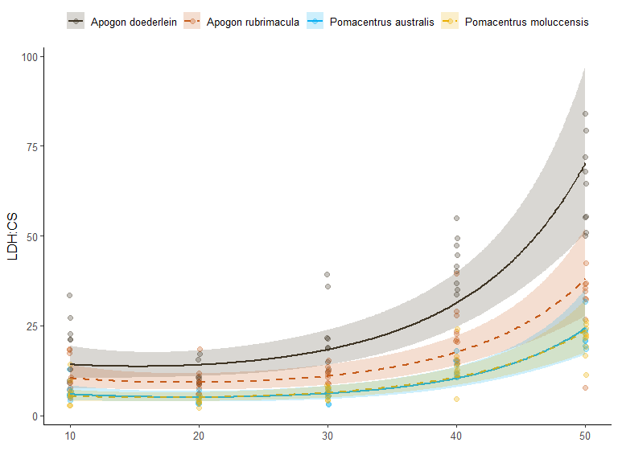<!-- -->

## Q10

``` r
ldhcs.emm <- emmeans(lc.model.1.p2.gamma.log %>% update(LDHCS ~ factor(temperature) * LATITUDE * LATIN_GENUS + (1|fish_id)),                        
                     ~temperature|LATITUDE|LATIN_GENUS, 
                   at = list(temperature = seq(from =10, to =50, by =.1)), 
                   type = "response")  

ldhcs.emm.df <- ldhcs.emm %>% as.data.frame() %>%
  unite("species", c("LATIN_GENUS","LATITUDE"), sep = "-", remove = FALSE) %>% 
  group_by(species) %>%
  mutate("\u394 change"=response - lag(response, n=1, default = first(response)), 
         "\u394 %change" = response/lag(response, n=1, default = first(response))*100, 
         "Q10" =response/lag(response, n=1, default = first(response)), 
         test = as.numeric(temperature)*10) %>% 
  filter(temperature !="10") %>% 
  ungroup() 
ldhcs.emm.df
```

<div data-pagedtable="false">
  <script data-pagedtable-source type="application/json">
{"columns":[{"label":["temperature"],"name":[1],"type":["fct"],"align":["left"]},{"label":["species"],"name":[2],"type":["chr"],"align":["left"]},{"label":["LATITUDE"],"name":[3],"type":["fct"],"align":["left"]},{"label":["LATIN_GENUS"],"name":[4],"type":["fct"],"align":["left"]},{"label":["response"],"name":[5],"type":["dbl"],"align":["right"]},{"label":["SE"],"name":[6],"type":["dbl"],"align":["right"]},{"label":["df"],"name":[7],"type":["dbl"],"align":["right"]},{"label":["asymp.LCL"],"name":[8],"type":["dbl"],"align":["right"]},{"label":["asymp.UCL"],"name":[9],"type":["dbl"],"align":["right"]},{"label":[" change"],"name":[10],"type":["dbl"],"align":["right"]},{"label":[" %change"],"name":[11],"type":["dbl"],"align":["right"]},{"label":["Q10"],"name":[12],"type":["dbl"],"align":["right"]},{"label":["test"],"name":[13],"type":["dbl"],"align":["right"]}],"data":[{"1":"20","2":"Apogon-sub-tropical","3":"sub-tropical","4":"Apogon","5":"9.164621","6":"1.4375513","7":"Inf","8":"6.739010","9":"12.463297","10":"-7.5635437","11":"54.78558","12":"0.5478558","13":"20"},{"1":"30","2":"Apogon-sub-tropical","3":"sub-tropical","4":"Apogon","5":"18.887015","6":"2.9615117","7":"Inf","8":"13.889726","9":"25.682245","10":"9.7223941","11":"206.08615","12":"2.0608615","13":"30"},{"1":"40","2":"Apogon-sub-tropical","3":"sub-tropical","4":"Apogon","5":"40.405985","6":"6.3021783","7":"Inf","8":"29.763404","9":"54.854063","10":"21.5189700","11":"213.93526","12":"2.1393526","13":"40"},{"1":"50","2":"Apogon-sub-tropical","3":"sub-tropical","4":"Apogon","5":"59.713655","6":"9.3261005","7":"Inf","8":"43.967592","9":"81.098836","10":"19.3076693","11":"147.78418","12":"1.4778418","13":"50"},{"1":"20","2":"Apogon-tropical","3":"tropical","4":"Apogon","5":"7.875597","6":"1.2831216","7":"Inf","8":"5.722721","9":"10.838381","10":"-3.2740800","11":"70.63520","12":"0.7063520","13":"20"},{"1":"30","2":"Apogon-tropical","3":"tropical","4":"Apogon","5":"9.791045","6":"1.4520452","7":"Inf","8":"7.321380","9":"13.093782","10":"1.9154476","11":"124.32130","12":"1.2432130","13":"30"},{"1":"40","2":"Apogon-tropical","3":"tropical","4":"Apogon","5":"22.058030","6":"3.2690439","7":"Inf","8":"16.497456","9":"29.492833","10":"12.2669853","11":"225.28781","12":"2.2528781","13":"40"},{"1":"50","2":"Apogon-tropical","3":"tropical","4":"Apogon","5":"33.669973","6":"5.1886356","7":"Inf","8":"24.892600","9":"45.542333","10":"11.6119428","11":"152.64270","12":"1.5264270","13":"50"},{"1":"20","2":"Pomacentrus-sub-tropical","3":"sub-tropical","4":"Pomacentrus","5":"4.406048","6":"0.8283303","7":"Inf","8":"3.048068","9":"6.369038","10":"-1.9330095","11":"69.50636","12":"0.6950636","13":"20"},{"1":"30","2":"Pomacentrus-sub-tropical","3":"sub-tropical","4":"Pomacentrus","5":"5.304029","6":"0.9396471","7":"Inf","8":"3.748084","9":"7.505893","10":"0.8979803","11":"120.38063","12":"1.2038063","13":"30"},{"1":"40","2":"Pomacentrus-sub-tropical","3":"sub-tropical","4":"Pomacentrus","5":"13.260660","6":"2.3453060","7":"Inf","8":"9.376052","9":"18.754707","10":"7.9566315","11":"250.01110","12":"2.5001110","13":"40"},{"1":"50","2":"Pomacentrus-sub-tropical","3":"sub-tropical","4":"Pomacentrus","5":"21.514663","6":"3.8059903","7":"Inf","8":"15.210908","9":"30.430840","10":"8.2540026","11":"162.24428","12":"1.6224428","13":"50"},{"1":"20","2":"Pomacentrus-tropical","3":"tropical","4":"Pomacentrus","5":"3.729431","6":"0.6017288","7":"Inf","8":"2.718346","9":"5.116589","10":"-2.1368339","11":"63.57420","12":"0.6357420","13":"20"},{"1":"30","2":"Pomacentrus-tropical","3":"tropical","4":"Pomacentrus","5":"6.161139","6":"0.9129111","7":"Inf","8":"4.608254","9":"8.237315","10":"2.4317082","11":"165.20319","12":"1.6520319","13":"30"},{"1":"40","2":"Pomacentrus-tropical","3":"tropical","4":"Pomacentrus","5":"13.268746","6":"1.9665380","7":"Inf","8":"9.923726","9":"17.741281","10":"7.1076061","11":"215.36188","12":"2.1536188","13":"40"},{"1":"50","2":"Pomacentrus-tropical","3":"tropical","4":"Pomacentrus","5":"21.037222","6":"3.1135606","7":"Inf","8":"15.740136","9":"28.116957","10":"7.7684766","11":"158.54718","12":"1.5854718","13":"50"}],"options":{"columns":{"min":{},"max":[10]},"rows":{"min":[10],"max":[10]},"pages":{}}}
  </script>
</div>

``` r
ldhcs.obs <-  lc.data %>% 
  mutate(Pred=predict(lc.model.1.p2.gamma.log, re.form=NA, type="response"),
         Resid = residuals(lc.model.1.p2.gamma.log),
         Fit = Pred + Resid) %>%
   unite("species", c("LATIN_GENUS","LATITUDE"), sep = "-", remove = FALSE) %>% 
  group_by(fish_id) %>%
  mutate("\u394 change"=Fit - lag(Fit, n=1, default = first(Fit)), 
         "\u394 %change" = Fit/lag(Fit, n=1, default = first(Fit))*100, 
         "Q10" =Fit/lag(Fit, n=1, default = first(Fit))) %>% 
  filter(temperature !="10") %>% 
  ungroup() 

ggplot(ldhcs.emm.df, aes(y=Q10, x=temperature, linetype=species, color = species, fill=species))+
  geom_jitter(data=ldhcs.obs, 
              aes(y=Q10, color = species), 
              width=0.05, 
              alpha = 0.2, 
              size = 2) +
  stat_smooth(data=ldhcs.obs, 
              aes(y=Q10,x=temperature, color=species), 
              method="lm", 
              formula = y ~ poly(x,2))+
  scale_x_continuous(limits = c(19, 52), 
                     breaks = seq(20, 52, by = 10))+ 
  scale_y_continuous(limits = c(0,5), breaks = seq(0, 5, by = 0.5)) +
  theme_classic() + 
  ylab(expression("Q10 values")) + 
  xlab("Temperature")+
  scale_linetype_manual(values = c("solid", "dashed","solid", "dashed"), 
                        labels = c("Apogon doederlein","Apogon rubrimacula","Pomacentrus australis", "Pomacentrus moluccensis"))+
  scale_color_manual(values=c("#3F3525","#C65C1B",  "#07AFF2", "#EAAE00"), 
                        labels = c("Apogon doederlein","Apogon rubrimacula","Pomacentrus australis", "Pomacentrus moluccensis")) +
  scale_fill_manual(values=c("#3F3525","#C65C1B",  "#07AFF2", "#EAAE00"), 
                        labels = c("Apogon doederlein","Apogon rubrimacula","Pomacentrus australis", "Pomacentrus moluccensis")) + 
  theme(legend.position = "bottom", 
        legend.text = element_text(size = 10), 
        legend.title = element_blank(), 
        axis.title = element_text(size =12), 
        axis.text = element_text(size=10))
```

```
## Warning: Removed 2 rows containing non-finite outside the scale range
## (`stat_smooth()`).
```

```
## Warning: Removed 2 rows containing missing values or values outside the scale range
## (`geom_point()`).
```

<!-- -->

# Descriptive statistics 


``` r
lc.data2 <- CS.data |> 
  full_join(select(ldh.data, c("UNIQUE_SAMPLE_ID","LDH_ACTIVITY")), by = "UNIQUE_SAMPLE_ID") |> 
  mutate(LDHCS = LDH_ACTIVITY/CS_ACTIVITY) %>% 
  separate(UNIQUE_SAMPLE_ID, into=c("LATIN_NAME_ABBREV","rep","temp"), sep="_", remove=FALSE) |>
  mutate(LATIN_NAME= case_when(LATIN_NAME_ABBREV =="Adoed"~ "Apogon doederlein", 
                               LATIN_NAME_ABBREV =="Arub"~ "Apogon rubrimacula",
                               LATIN_NAME_ABBREV =="Pmol"~ "Pomacentrus moluccensis",
                               LATIN_NAME_ABBREV =="Paus"~ "Pomacentrus australis",
                               TRUE ~ LATIN_NAME
                   )) %>% select(c("LATIN_NAME", "temp", "CS_ACTIVITY", "LDH_ACTIVITY", "LDHCS")) %>% 
  pivot_longer(!c(LATIN_NAME,temp), names_to = "enzyme") %>% 
  drop_na(value)
  
 
lc.data.table <- table(lc.data2$LATIN_NAME,lc.data2$temp, lc.data2$enzyme) %>% as.data.frame() 
table(lc.data2$LATIN_NAME,lc.data2$temp, lc.data2$enzyme)%>% 
  knitr::kable(format = "html")  %>%
  kable_paper(full_width = TRUE)
```

<table class=" lightable-paper" style='font-family: "Arial Narrow", arial, helvetica, sans-serif; margin-left: auto; margin-right: auto;'>
 <thead>
  <tr>
   <th style="text-align:left;"> Var1 </th>
   <th style="text-align:left;"> Var2 </th>
   <th style="text-align:left;"> Var3 </th>
   <th style="text-align:right;"> Freq </th>
  </tr>
 </thead>
<tbody>
  <tr>
   <td style="text-align:left;"> Apogon doederlein </td>
   <td style="text-align:left;"> 10 </td>
   <td style="text-align:left;"> CS_ACTIVITY </td>
   <td style="text-align:right;"> 8 </td>
  </tr>
  <tr>
   <td style="text-align:left;"> Apogon rubrimacula </td>
   <td style="text-align:left;"> 10 </td>
   <td style="text-align:left;"> CS_ACTIVITY </td>
   <td style="text-align:right;"> 9 </td>
  </tr>
  <tr>
   <td style="text-align:left;"> Pomacentrus australis </td>
   <td style="text-align:left;"> 10 </td>
   <td style="text-align:left;"> CS_ACTIVITY </td>
   <td style="text-align:right;"> 9 </td>
  </tr>
  <tr>
   <td style="text-align:left;"> Pomacentrus moluccensis </td>
   <td style="text-align:left;"> 10 </td>
   <td style="text-align:left;"> CS_ACTIVITY </td>
   <td style="text-align:right;"> 10 </td>
  </tr>
  <tr>
   <td style="text-align:left;"> Apogon doederlein </td>
   <td style="text-align:left;"> 20 </td>
   <td style="text-align:left;"> CS_ACTIVITY </td>
   <td style="text-align:right;"> 9 </td>
  </tr>
  <tr>
   <td style="text-align:left;"> Apogon rubrimacula </td>
   <td style="text-align:left;"> 20 </td>
   <td style="text-align:left;"> CS_ACTIVITY </td>
   <td style="text-align:right;"> 8 </td>
  </tr>
  <tr>
   <td style="text-align:left;"> Pomacentrus australis </td>
   <td style="text-align:left;"> 20 </td>
   <td style="text-align:left;"> CS_ACTIVITY </td>
   <td style="text-align:right;"> 8 </td>
  </tr>
  <tr>
   <td style="text-align:left;"> Pomacentrus moluccensis </td>
   <td style="text-align:left;"> 20 </td>
   <td style="text-align:left;"> CS_ACTIVITY </td>
   <td style="text-align:right;"> 8 </td>
  </tr>
  <tr>
   <td style="text-align:left;"> Apogon doederlein </td>
   <td style="text-align:left;"> 30 </td>
   <td style="text-align:left;"> CS_ACTIVITY </td>
   <td style="text-align:right;"> 9 </td>
  </tr>
  <tr>
   <td style="text-align:left;"> Apogon rubrimacula </td>
   <td style="text-align:left;"> 30 </td>
   <td style="text-align:left;"> CS_ACTIVITY </td>
   <td style="text-align:right;"> 10 </td>
  </tr>
  <tr>
   <td style="text-align:left;"> Pomacentrus australis </td>
   <td style="text-align:left;"> 30 </td>
   <td style="text-align:left;"> CS_ACTIVITY </td>
   <td style="text-align:right;"> 9 </td>
  </tr>
  <tr>
   <td style="text-align:left;"> Pomacentrus moluccensis </td>
   <td style="text-align:left;"> 30 </td>
   <td style="text-align:left;"> CS_ACTIVITY </td>
   <td style="text-align:right;"> 10 </td>
  </tr>
  <tr>
   <td style="text-align:left;"> Apogon doederlein </td>
   <td style="text-align:left;"> 40 </td>
   <td style="text-align:left;"> CS_ACTIVITY </td>
   <td style="text-align:right;"> 9 </td>
  </tr>
  <tr>
   <td style="text-align:left;"> Apogon rubrimacula </td>
   <td style="text-align:left;"> 40 </td>
   <td style="text-align:left;"> CS_ACTIVITY </td>
   <td style="text-align:right;"> 10 </td>
  </tr>
  <tr>
   <td style="text-align:left;"> Pomacentrus australis </td>
   <td style="text-align:left;"> 40 </td>
   <td style="text-align:left;"> CS_ACTIVITY </td>
   <td style="text-align:right;"> 9 </td>
  </tr>
  <tr>
   <td style="text-align:left;"> Pomacentrus moluccensis </td>
   <td style="text-align:left;"> 40 </td>
   <td style="text-align:left;"> CS_ACTIVITY </td>
   <td style="text-align:right;"> 10 </td>
  </tr>
  <tr>
   <td style="text-align:left;"> Apogon doederlein </td>
   <td style="text-align:left;"> 50 </td>
   <td style="text-align:left;"> CS_ACTIVITY </td>
   <td style="text-align:right;"> 9 </td>
  </tr>
  <tr>
   <td style="text-align:left;"> Apogon rubrimacula </td>
   <td style="text-align:left;"> 50 </td>
   <td style="text-align:left;"> CS_ACTIVITY </td>
   <td style="text-align:right;"> 9 </td>
  </tr>
  <tr>
   <td style="text-align:left;"> Pomacentrus australis </td>
   <td style="text-align:left;"> 50 </td>
   <td style="text-align:left;"> CS_ACTIVITY </td>
   <td style="text-align:right;"> 9 </td>
  </tr>
  <tr>
   <td style="text-align:left;"> Pomacentrus moluccensis </td>
   <td style="text-align:left;"> 50 </td>
   <td style="text-align:left;"> CS_ACTIVITY </td>
   <td style="text-align:right;"> 10 </td>
  </tr>
  <tr>
   <td style="text-align:left;"> Apogon doederlein </td>
   <td style="text-align:left;"> 10 </td>
   <td style="text-align:left;"> LDH_ACTIVITY </td>
   <td style="text-align:right;"> 9 </td>
  </tr>
  <tr>
   <td style="text-align:left;"> Apogon rubrimacula </td>
   <td style="text-align:left;"> 10 </td>
   <td style="text-align:left;"> LDH_ACTIVITY </td>
   <td style="text-align:right;"> 10 </td>
  </tr>
  <tr>
   <td style="text-align:left;"> Pomacentrus australis </td>
   <td style="text-align:left;"> 10 </td>
   <td style="text-align:left;"> LDH_ACTIVITY </td>
   <td style="text-align:right;"> 8 </td>
  </tr>
  <tr>
   <td style="text-align:left;"> Pomacentrus moluccensis </td>
   <td style="text-align:left;"> 10 </td>
   <td style="text-align:left;"> LDH_ACTIVITY </td>
   <td style="text-align:right;"> 10 </td>
  </tr>
  <tr>
   <td style="text-align:left;"> Apogon doederlein </td>
   <td style="text-align:left;"> 20 </td>
   <td style="text-align:left;"> LDH_ACTIVITY </td>
   <td style="text-align:right;"> 9 </td>
  </tr>
  <tr>
   <td style="text-align:left;"> Apogon rubrimacula </td>
   <td style="text-align:left;"> 20 </td>
   <td style="text-align:left;"> LDH_ACTIVITY </td>
   <td style="text-align:right;"> 10 </td>
  </tr>
  <tr>
   <td style="text-align:left;"> Pomacentrus australis </td>
   <td style="text-align:left;"> 20 </td>
   <td style="text-align:left;"> LDH_ACTIVITY </td>
   <td style="text-align:right;"> 7 </td>
  </tr>
  <tr>
   <td style="text-align:left;"> Pomacentrus moluccensis </td>
   <td style="text-align:left;"> 20 </td>
   <td style="text-align:left;"> LDH_ACTIVITY </td>
   <td style="text-align:right;"> 10 </td>
  </tr>
  <tr>
   <td style="text-align:left;"> Apogon doederlein </td>
   <td style="text-align:left;"> 30 </td>
   <td style="text-align:left;"> LDH_ACTIVITY </td>
   <td style="text-align:right;"> 9 </td>
  </tr>
  <tr>
   <td style="text-align:left;"> Apogon rubrimacula </td>
   <td style="text-align:left;"> 30 </td>
   <td style="text-align:left;"> LDH_ACTIVITY </td>
   <td style="text-align:right;"> 10 </td>
  </tr>
  <tr>
   <td style="text-align:left;"> Pomacentrus australis </td>
   <td style="text-align:left;"> 30 </td>
   <td style="text-align:left;"> LDH_ACTIVITY </td>
   <td style="text-align:right;"> 8 </td>
  </tr>
  <tr>
   <td style="text-align:left;"> Pomacentrus moluccensis </td>
   <td style="text-align:left;"> 30 </td>
   <td style="text-align:left;"> LDH_ACTIVITY </td>
   <td style="text-align:right;"> 10 </td>
  </tr>
  <tr>
   <td style="text-align:left;"> Apogon doederlein </td>
   <td style="text-align:left;"> 40 </td>
   <td style="text-align:left;"> LDH_ACTIVITY </td>
   <td style="text-align:right;"> 9 </td>
  </tr>
  <tr>
   <td style="text-align:left;"> Apogon rubrimacula </td>
   <td style="text-align:left;"> 40 </td>
   <td style="text-align:left;"> LDH_ACTIVITY </td>
   <td style="text-align:right;"> 10 </td>
  </tr>
  <tr>
   <td style="text-align:left;"> Pomacentrus australis </td>
   <td style="text-align:left;"> 40 </td>
   <td style="text-align:left;"> LDH_ACTIVITY </td>
   <td style="text-align:right;"> 8 </td>
  </tr>
  <tr>
   <td style="text-align:left;"> Pomacentrus moluccensis </td>
   <td style="text-align:left;"> 40 </td>
   <td style="text-align:left;"> LDH_ACTIVITY </td>
   <td style="text-align:right;"> 10 </td>
  </tr>
  <tr>
   <td style="text-align:left;"> Apogon doederlein </td>
   <td style="text-align:left;"> 50 </td>
   <td style="text-align:left;"> LDH_ACTIVITY </td>
   <td style="text-align:right;"> 9 </td>
  </tr>
  <tr>
   <td style="text-align:left;"> Apogon rubrimacula </td>
   <td style="text-align:left;"> 50 </td>
   <td style="text-align:left;"> LDH_ACTIVITY </td>
   <td style="text-align:right;"> 10 </td>
  </tr>
  <tr>
   <td style="text-align:left;"> Pomacentrus australis </td>
   <td style="text-align:left;"> 50 </td>
   <td style="text-align:left;"> LDH_ACTIVITY </td>
   <td style="text-align:right;"> 8 </td>
  </tr>
  <tr>
   <td style="text-align:left;"> Pomacentrus moluccensis </td>
   <td style="text-align:left;"> 50 </td>
   <td style="text-align:left;"> LDH_ACTIVITY </td>
   <td style="text-align:right;"> 10 </td>
  </tr>
  <tr>
   <td style="text-align:left;"> Apogon doederlein </td>
   <td style="text-align:left;"> 10 </td>
   <td style="text-align:left;"> LDHCS </td>
   <td style="text-align:right;"> 8 </td>
  </tr>
  <tr>
   <td style="text-align:left;"> Apogon rubrimacula </td>
   <td style="text-align:left;"> 10 </td>
   <td style="text-align:left;"> LDHCS </td>
   <td style="text-align:right;"> 9 </td>
  </tr>
  <tr>
   <td style="text-align:left;"> Pomacentrus australis </td>
   <td style="text-align:left;"> 10 </td>
   <td style="text-align:left;"> LDHCS </td>
   <td style="text-align:right;"> 7 </td>
  </tr>
  <tr>
   <td style="text-align:left;"> Pomacentrus moluccensis </td>
   <td style="text-align:left;"> 10 </td>
   <td style="text-align:left;"> LDHCS </td>
   <td style="text-align:right;"> 10 </td>
  </tr>
  <tr>
   <td style="text-align:left;"> Apogon doederlein </td>
   <td style="text-align:left;"> 20 </td>
   <td style="text-align:left;"> LDHCS </td>
   <td style="text-align:right;"> 9 </td>
  </tr>
  <tr>
   <td style="text-align:left;"> Apogon rubrimacula </td>
   <td style="text-align:left;"> 20 </td>
   <td style="text-align:left;"> LDHCS </td>
   <td style="text-align:right;"> 8 </td>
  </tr>
  <tr>
   <td style="text-align:left;"> Pomacentrus australis </td>
   <td style="text-align:left;"> 20 </td>
   <td style="text-align:left;"> LDHCS </td>
   <td style="text-align:right;"> 6 </td>
  </tr>
  <tr>
   <td style="text-align:left;"> Pomacentrus moluccensis </td>
   <td style="text-align:left;"> 20 </td>
   <td style="text-align:left;"> LDHCS </td>
   <td style="text-align:right;"> 8 </td>
  </tr>
  <tr>
   <td style="text-align:left;"> Apogon doederlein </td>
   <td style="text-align:left;"> 30 </td>
   <td style="text-align:left;"> LDHCS </td>
   <td style="text-align:right;"> 9 </td>
  </tr>
  <tr>
   <td style="text-align:left;"> Apogon rubrimacula </td>
   <td style="text-align:left;"> 30 </td>
   <td style="text-align:left;"> LDHCS </td>
   <td style="text-align:right;"> 10 </td>
  </tr>
  <tr>
   <td style="text-align:left;"> Pomacentrus australis </td>
   <td style="text-align:left;"> 30 </td>
   <td style="text-align:left;"> LDHCS </td>
   <td style="text-align:right;"> 7 </td>
  </tr>
  <tr>
   <td style="text-align:left;"> Pomacentrus moluccensis </td>
   <td style="text-align:left;"> 30 </td>
   <td style="text-align:left;"> LDHCS </td>
   <td style="text-align:right;"> 10 </td>
  </tr>
  <tr>
   <td style="text-align:left;"> Apogon doederlein </td>
   <td style="text-align:left;"> 40 </td>
   <td style="text-align:left;"> LDHCS </td>
   <td style="text-align:right;"> 9 </td>
  </tr>
  <tr>
   <td style="text-align:left;"> Apogon rubrimacula </td>
   <td style="text-align:left;"> 40 </td>
   <td style="text-align:left;"> LDHCS </td>
   <td style="text-align:right;"> 10 </td>
  </tr>
  <tr>
   <td style="text-align:left;"> Pomacentrus australis </td>
   <td style="text-align:left;"> 40 </td>
   <td style="text-align:left;"> LDHCS </td>
   <td style="text-align:right;"> 7 </td>
  </tr>
  <tr>
   <td style="text-align:left;"> Pomacentrus moluccensis </td>
   <td style="text-align:left;"> 40 </td>
   <td style="text-align:left;"> LDHCS </td>
   <td style="text-align:right;"> 10 </td>
  </tr>
  <tr>
   <td style="text-align:left;"> Apogon doederlein </td>
   <td style="text-align:left;"> 50 </td>
   <td style="text-align:left;"> LDHCS </td>
   <td style="text-align:right;"> 9 </td>
  </tr>
  <tr>
   <td style="text-align:left;"> Apogon rubrimacula </td>
   <td style="text-align:left;"> 50 </td>
   <td style="text-align:left;"> LDHCS </td>
   <td style="text-align:right;"> 9 </td>
  </tr>
  <tr>
   <td style="text-align:left;"> Pomacentrus australis </td>
   <td style="text-align:left;"> 50 </td>
   <td style="text-align:left;"> LDHCS </td>
   <td style="text-align:right;"> 7 </td>
  </tr>
  <tr>
   <td style="text-align:left;"> Pomacentrus moluccensis </td>
   <td style="text-align:left;"> 50 </td>
   <td style="text-align:left;"> LDHCS </td>
   <td style="text-align:right;"> 10 </td>
  </tr>
</tbody>
</table>

# Figure {.tabset .tabset-faded}  

## Figure 1


``` r
cs.genus.emm <- emmeans(cs.model.1.p2.log, ~temperature|LATIN_GENUS, 
                   at = list(temperature = seq(from =10, to =50, by =.1)), 
                   type = "response") %>% as.data.frame()

cs.genus.obs <-  CS.data %>% 
  mutate(Pred=exp(predict(cs.model.1.p2.log, re.form=NA)),
         Resid = residuals(cs.model.1.p2.log, type="response"),
         Fit = Pred + Resid)  


cs.genus.plot <- ggplot(cs.genus.emm, aes(y=response, x=temperature, linetype=LATIN_GENUS, color = LATIN_GENUS, fill=LATIN_GENUS))+
  geom_line(linewidth =1) + 
  geom_ribbon(aes(x=temperature, 
              ymin= lower.CL, ymax= upper.CL),
              alpha = 0.4, 
              color=NA)+ 
  geom_jitter(data=cs.genus.obs , 
              aes(y=Fit, color = LATIN_GENUS), 
              width=0.05, 
              alpha = 0.3, 
              size = 2) +
  #scale_x_continuous(limits = c(9, 52), 
                     #breaks = seq(10, 52, by = 10))+ 
  #scale_y_continuous(limits = c(0,120), breaks = seq(0, 120, by = 20)) +
  theme_classic() + 
  ylab(expression("CS ACTIVITY (U mg "^{-1} * " tissue)")) + 
  xlab("Temperature (C)") + 
  scale_linetype_manual(values = c("solid", "dashed"), 
                        labels = c("Ostorhinchus","Pomacentrus")) +
  scale_color_manual(values=c("black","gray60"), 
                        labels = c("Ostorhinchus","Pomacentrus")) +
  scale_fill_manual(values=c("black","gray60"), 
                        labels = c("Ostorhinchus","Pomacentrus")) + 
   theme(legend.position = c(0.2,0.85), 
        legend.text = element_text(size = 14, face = "italic"), 
        legend.title = element_blank(), 
        axis.title = element_text(size =16), 
        axis.text = element_text(size=14))


ggsave(file="./02.Figures/Figure1/Figure1_cs_genus_plot.svg",  plot=cs.genus.plot, width=15.5, height=8.5, units = "in", dpi=300) 
ggsave(file="./02.Figures/Figure1/Figure1_cs_genus_plot2.svg", plot=cs.genus.plot, width=12, height=7, units = "in", dpi=300)
ggsave(file="./02.Figures/Figure1/Figure1_cs_genus_plot3.svg", plot=cs.genus.plot, width=8, height=5, units = "in", dpi=300)
ggsave(file="./02.Figures/Figure1/Figure1_cs_genus_plot.pdf",  plot=cs.genus.plot, width=15.5, height=8.5, units = "in", dpi=300)
ggsave(file="./02.Figures/Figure1/Figure1_cs_genus_plot2.pdf", plot=cs.genus.plot, width=12, height=7, units = "in", dpi=300)
ggsave(file="./02.Figures/Figure1/Figure1_cs_genus_plot3.pdf", plot=cs.genus.plot, width=8, height=5, units = "in", dpi=300)
```
## Figure 2

``` r
#--- LDH plot ---# 
ldh.emm <- emmeans(ldh.sqrt.model.1.p2, ~temperature|LATITUDE|LATIN_GENUS, 
                   at = list(temperature = seq(from =10, to =50, by =.1)), 
                   type = "response") 

ldh.emm.df <- ldh.emm %>% as.data.frame() %>%
  unite("species", c("LATIN_GENUS","LATITUDE"), sep = "-", remove = FALSE) 

ldh.obs <-  ldh.data %>% 
  mutate(Pred=predict(ldh.sqrt.model.1.p2, re.form=NA, type="response"),
         Resid = residuals(ldh.sqrt.model.1.p2),
         Fit = Pred + Resid) %>%
   unite("species", c("LATIN_GENUS","LATITUDE"), sep = "-", remove = FALSE) 


ldh.plot <- ggplot(ldh.emm.df, aes(y=response, x=temperature, linetype=species, color = species, fill=species))+
  geom_line(linewidth =1) + 
  geom_ribbon(aes(x=temperature, 
              ymin= lower.CL, ymax= upper.CL),
              alpha = 0.2, 
              color=NA)+ 
  geom_jitter(data=ldh.obs, 
              aes(y=Fit^2, color = species), 
              width=0.05, 
              alpha = 0.3, 
              size = 2) +
  scale_x_continuous(limits = c(9, 52), 
                     breaks = seq(10, 52, by = 10))+ 
  scale_y_continuous(limits = c(0,350), breaks = seq(0, 350, by = 50)) +
  theme_classic() + 
  ylab(expression("LDH ACTIVITY (U mg "^{-1} * "tissue)")) + 
  xlab("")+
  scale_linetype_manual(values = c("solid", "dashed","solid", "dashed"), 
                        labels = c("Ostorhinchus doederlein \n (sub-tropical)","Ostorhinchus rubrimacula \n (tropical)","Pomacentrus australis \n (sub-tropical)", "Pomacentrus moluccensis \n (tropical)"))+
  scale_color_manual(values=c("#3F3525","#C65C1B",  "#07AFF2", "#EAAE00"), 
                        labels = c("Ostorhinchus doederlein \n (sub-tropical)","Ostorhinchus rubrimacula \n (tropical)","Pomacentrus australis \n (sub-tropical)", "Pomacentrus moluccensis \n (tropical)")) +
  scale_fill_manual(values=c("#3F3525","#C65C1B",  "#07AFF2", "#EAAE00"), 
                        labels = c("Ostorhinchus doederlein \n (sub-tropical)","Ostorhinchus rubrimacula \n (tropical)","Pomacentrus australis \n (sub-tropical)", "Pomacentrus moluccensis \n (tropical)")) + 
  theme(legend.position = "none", 
        legend.text = element_text(size = 12, face = "italic"), 
        legend.title = element_blank(), 
        axis.title = element_text(size =14), 
        axis.text = element_text(size=12), 
        axis.text.x = element_blank())

#--- citrate synthase plot ---#
cs.emm <- emmeans(cs.model.1.p2.log, ~temperature|LATITUDE|LATIN_GENUS, 
                   at = list(temperature = seq(from =10, to =50, by =.1)), 
                   type = "response") 

cs.emm.df <- cs.emm %>% as.data.frame() %>%
  unite("species", c("LATIN_GENUS","LATITUDE"), sep = "-", remove = FALSE) 

cs.obs <-  CS.data %>% 
  mutate(Pred=exp(predict(cs.model.1.p2.log, re.form=NA)),
         Resid = residuals(cs.model.1.p2.log,  type="response"),
         Fit = Pred + Resid) %>%
   unite("species", c("LATIN_GENUS","LATITUDE"), sep = "-", remove = FALSE) 


cs.plot <- ggplot(cs.emm.df, aes(y=response, x=temperature, linetype=species, color = species, fill=species))+
  geom_line(linewidth =1) + 
  geom_ribbon(aes(x=temperature, 
              ymin= lower.CL, ymax= upper.CL),
              alpha = 0.2, 
              color=NA)+ 
  geom_jitter(data=cs.obs, 
              aes(y=Fit, color = species), 
              width=0.05, 
              alpha = 0.3, 
              size = 2) +
  scale_x_continuous(limits = c(9, 52), 
                     breaks = seq(10, 52, by = 10))+ 
  scale_y_continuous(limits = c(0,16), breaks = seq(0, 16, by = 2)) +
  theme_classic() + 
  ylab(expression("CS ACTIVITY (U mg "^{-1} * "tissue)")) + 
  xlab("")+
  scale_linetype_manual(values = c("solid", "dashed","solid", "dashed"), 
                        labels = c("Ostorhinchus doederlein (sub-tropical)","Ostorhinchus rubrimacula (tropical)","Pomacentrus australis(sub-tropical)", "Pomacentrus moluccensis (tropical)"))+
  scale_color_manual(values=c("#3F3525","#C65C1B",  "#07AFF2", "#EAAE00"), 
                        labels = c("Ostorhinchus doederlein (sub-tropical)","Ostorhinchus rubrimacula (tropical)","Pomacentrus australis(sub-tropical)", "Pomacentrus moluccensis (tropical)")) +
  scale_fill_manual(values=c("#3F3525","#C65C1B",  "#07AFF2", "#EAAE00"), 
                        labels = c("Ostorhinchus doederlein (sub-tropical)","Ostorhinchus rubrimacula (tropical)","Pomacentrus australis(sub-tropical)", "Pomacentrus moluccensis (tropical)")) +  
  theme(legend.position = c(0.3,0.8), 
        legend.text = element_text(size = 12, face = "italic"), 
        legend.title = element_blank(), 
        axis.title = element_text(size =14), 
        axis.text = element_text(size=12), 
        axis.text.x = element_blank()) 

#--- LDH:CS plot ---# 
lc.emm <- emmeans(lc.model.1.p2.gamma.log, ~temperature|LATITUDE|LATIN_GENUS, 
                   at = list(temperature = seq(from =10, to =50, by =.1)), 
                   type = "response") 

lc.emm.df <- lc.emm %>% as.data.frame() %>%
  unite("species", c("LATIN_GENUS","LATITUDE"), sep = "-", remove = FALSE) 

lc.obs <-  lc.data %>% 
  mutate(Pred=exp(predict(lc.model.1.p2.gamma.log, re.form=NA)),
         Resid = residuals(lc.model.1.p2.gamma.log, type="response"),
         Fit = Pred + Resid) %>%
   unite("species", c("LATIN_GENUS","LATITUDE"), sep = "-", remove = FALSE) 


lc.plot <- ggplot(lc.emm.df, aes(y=response, x=temperature, linetype=species, color = species, fill=species))+
  geom_line(linewidth =1) + 
  geom_ribbon(aes(x=temperature, 
              ymin= asymp.LCL, ymax= asymp.UCL),
              alpha = 0.2, 
              color=NA)+ 
  geom_jitter(data=lc.obs, 
              aes(y=Fit, color = species), 
              width=0.05, 
              alpha = 0.3, 
              size = 2) +
  scale_x_continuous(limits = c(9, 52), 
                     breaks = seq(10, 52, by = 10))+ 
  scale_y_continuous(limits = c(0,120), breaks = seq(0, 120, by = 20)) +
  theme_classic() + 
  ylab("LDH:CS ratio") + 
  xlab("Temperature (C)")+
  scale_linetype_manual(values = c("solid", "dashed","solid", "dashed"), 
                        labels = c("Ostorhinchus doederlein \n (sub-tropical)","Ostorhinchus rubrimacula \n (tropical)","Pomacentrus australis \n (sub-tropical)", "Pomacentrus moluccensis \n (tropical)")) +
  scale_color_manual(values=c("#3F3525","#C65C1B",  "#07AFF2", "#EAAE00"), 
                        labels = c("Ostorhinchus doederlein \n (sub-tropical)","Ostorhinchus rubrimacula \n (tropical)","Pomacentrus australis \n (sub-tropical)", "Pomacentrus moluccensis \n (tropical)")) +
  scale_fill_manual(values=c("#3F3525","#C65C1B",  "#07AFF2", "#EAAE00"), 
                        labels = c("Ostorhinchus doederlein \n (sub-tropical)","Ostorhinchus rubrimacula \n (tropical)","Pomacentrus australis \n (sub-tropical)", "Pomacentrus moluccensis \n (tropical)")) +  
  theme(legend.position = "none", 
        legend.text = element_text(size = 12, face = "italic"), 
        legend.title = element_blank(), 
        axis.title = element_text(size =14), 
        axis.text = element_text(size=12)) + 
  guides(color = guide_legend(nrow=2))

species.plot <- ggarrange(cs.plot, ldh.plot, lc.plot, 
         nrow = 3, 
         ncol= 1, 
         align = "hv", 
         labels = c("A","B","C"), 
         common.legend = FALSE); species.plot

ggsave(file="./02.Figures/Figure2/Figure2_species_plot.svg",  plot=species.plot, width=8.5, height=15.5, units = "in", dpi=300) 
ggsave(file="./02.Figures/Figure2/Figure2_species_plot2.svg", plot=species.plot, width=7, height=12, units = "in", dpi=300)
#ggsave(file="./02.Figures/Figure2/Figure2_species_plot3.svg", plot=species.plot, width=8, height=5, units = "in", dpi=300)
ggsave(file="./02.Figures/Figure2/Figure2_species_plot.pdf",  plot=species.plot, width=8.5, height=15.5, units = "in", dpi=300)
ggsave(file="./02.Figures/Figure2/Figure2_species_plot2.pdf", plot=species.plot, width=7, height=12, units = "in", dpi=300)
#ggsave(file="./02.Figures/Figure2/Figure2_species_plot3.pdf", plot=species.plot, width=5, height=8, units = "in", dpi=300)
```

## Supplemental Figure 1


``` r
#--- LDH plot ---#
ldh.temp.emm <- emmeans(ldh.sqrt.model.1.p2, ~temperature, 
                   at = list(temperature = seq(from =10, to =50, by =.1)), 
                   type = "response") %>% as.data.frame()

ldh.temp.obs <- ldh.data %>% 
  mutate(Pred=predict(ldh.sqrt.model.1.p2, re.form=NA, type="response"),
         Resid = residuals(ldh.sqrt.model.1.p2),
         Fit = Pred + Resid)  


ldh.temp.plot <- ggplot(ldh.temp.emm, aes(y=response, x=temperature))+
  geom_line(linewidth =1) + 
  geom_ribbon(aes(x=temperature, 
              ymin= lower.CL, ymax= upper.CL),
              alpha = 0.4, 
              color=NA)+ 
  geom_jitter(data=ldh.temp.obs , 
              aes(y=Fit^2, fill = "black"), 
              width=0.05, 
              alpha = 0.3, 
              size = 2)+ 
  scale_x_continuous(limits = c(9, 52), 
                     breaks = seq(10, 52, by = 10))+ 
  scale_y_continuous(limits = c(0,350), breaks = seq(0, 350, by = 50)) +
  theme_classic() + 
  ylab(expression("LDH ACTIVITY (U mg "^{-1} * "tissue)")) + 
  xlab("TEMPERATURE (C)")+
  theme(legend.position = "none",
        axis.title = element_text(size =12), 
        axis.text = element_text(size=10)); ldh.temp.plot  

#--- CS plot ---#
cs.temp.emm <- emmeans(cs.model.1.p2.log, ~temperature, 
                   at = list(temperature = seq(from =10, to =50, by =.1)), 
                   type = "response") 

cs.temp.df <- cs.temp.emm %>% as.data.frame() 

cs.temp.obs <-  CS.data %>% 
  mutate(Pred=exp(predict(cs.model.1.p2.log, re.form=NA)),
         Resid = residuals(cs.model.1.p2.log,  type="response"),
         Fit = Pred + Resid) 


cs.temp.plot <- ggplot(cs.temp.df, aes(y=response, x=temperature))+
  geom_jitter(data=cs.temp.obs, 
              aes(y=Fit, fill="black"), 
              width=0.05, 
              alpha = 0.3, 
              size = 2) +
  geom_line(linewidth =1) + 
  geom_ribbon(aes(x=temperature, 
              ymin= lower.CL, ymax= upper.CL),
              alpha = 0.2, 
              color=NA)+ 
  scale_x_continuous(limits = c(9, 52), 
                     breaks = seq(10, 52, by = 10))+ 
  scale_y_continuous(limits = c(0,12), breaks = seq(0, 12, by = 2)) +
  theme_classic() + 
  ylab(expression("CS ACTIVITY (U mg "^{-1} * "tissue)")) + 
  xlab(" ")+
  theme(legend.position = "none", 
        axis.title = element_text(size =12), 
        axis.text = element_text(size=10)); cs.temp.plot

temp.plot <- ggarrange(cs.temp.plot, ldh.temp.plot,
         nrow = 2, 
         ncol= 1, 
          align = "hv", 
         labels = c("A","B"), 
         common.legend = FALSE); temp.plot 


ggsave(file="./02.Figures/SFigure1/SFigure1_temp_plot.svg",  plot=temp.plot, width=15.5, height=8.5, units = "in", dpi=300) 
ggsave(file="./02.Figures/SFigure1/SFigure1_temp_plot2.svg", plot=temp.plot, width=12, height=7, units = "in", dpi=300)
#ggsave(file="./02.Figures/SFigure1/SFigure1_temp_plot3.svg", plot=temp.plot, width=8, height=5, units = "in", dpi=300)
ggsave(file="./02.Figures/SFigure1/SFigure1_temp_plot.pdf",  plot=temp.plot, width=15.5, height=8.5, units = "in", dpi=300)
ggsave(file="./02.Figures/SFigure1/SFigure1_temp_plot2.pdf", plot=temp.plot, width=12, height=7, units = "in", dpi=300)
#ggsave(file="./02.Figures/SFigure1/SFigure1_temp_plot3.pdf", plot=cs.genus.plot, width=8, height=5, units = "in", dpi=300)
```

## Supplemental Figure 2


``` r
ldh.dperc.plot <- ggplot(ldh.means.temp.df, aes(x=temperature, y=` %change`)) + 
  geom_line(size=2) + 
  geom_point(shape = 15, color="red", size = 3) +
  xlab("") + ylab(expression("\u394 % CHANGE IN LDH ACTIVITY (U mg "^{-1} * "tissue)"))+
  scale_x_continuous(limits = c(9, 52), 
                     breaks = seq(10, 52, by = 10))+ 
  scale_y_continuous(limits = c(0,400), breaks = seq(0, 400, by = 50)) +
  theme_classic() + 
  theme(axis.title = element_text(size =13), 
        axis.text = element_text(size=12))

cs.dperc.plot <- ggplot(cs.means.temp.df, aes(x=temperature, y=` %change`)) + 
  geom_line(size=2) + 
  geom_point(shape = 15, color="red", size = 3) +
  xlab("") + ylab(expression("\u394 % CHANGE IN CS ACTIVITY (U mg "^{-1} * "tissue)"))+
  scale_x_continuous(limits = c(9, 52), 
                     breaks = seq(10, 52, by = 10))+ 
  scale_y_continuous(limits = c(0,250), breaks = seq(0, 250, by = 50)) +
  theme_classic()  + 
  theme(axis.title = element_text(size =13), 
        axis.text = element_text(size=12))  

lc.dperc.plot <- ggplot(lc.means.temp.df, aes(x=temperature, y=` %change`)) + 
  geom_line(size=2) + 
  geom_point(shape = 15, color="red", size = 3) +
  xlab("TEMPERATURE") + ylab(expression("\u394 % CHANGE IN LDH:CS RATIO"))+
  scale_x_continuous(limits = c(9, 52), 
                     breaks = seq(10, 52, by = 10))+ 
  #scale_y_continuous(limits = c(0,250), breaks = seq(0, 250, by = 50)) +
  theme_classic()  + 
  theme(axis.title = element_text(size =13), 
        axis.text = element_text(size=12))

dchange.plot <- ggarrange(cs.dperc.plot, ldh.dperc.plot, lc.dperc.plot,
         nrow = 3, 
         ncol= 1, 
          align = "hv", 
         labels = c("A","B","C"), 
         common.legend = FALSE); dchange.plot 

ggsave(file="./02.Figures/SFigure2/SFigure2_dchange_plot.svg",  plot=dchange.plot, width=8.5, height=15.5, units = "in", dpi=300) 
#ggsave(file="./02.Figures/SFigure2/SFigure2_dchange_plot2.svg", plot=dchange.plot, width=7, height=12, units = "in", dpi=300)
#ggsave(file="./02.Figures/SFigure2/SFigure2_dchange_plot3.svg", plot=dchange.plot, width=5, height=8, units = "in", dpi=300)
ggsave(file="./02.Figures/SFigure2/SFigure2_dchange_plot.pdf",  plot=dchange.plot, width=8.5, height=15.5, units = "in", dpi=300)
#ggsave(file="./02.Figures/SFigure2/SFigure2_dchange_plot2.pdf", plot=dchange.plot, width=7, height=12, units = "in", dpi=300)
#ggsave(file="./02.Figures/SFigure2/SFigure2_dchange_plot3.pdf", plot=dchange.plot, width=5, height=8, units = "in", dpi=300)
```
## {-}
